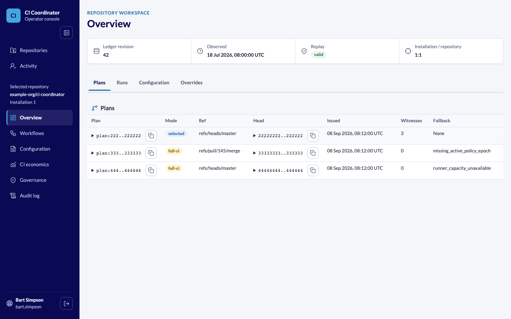
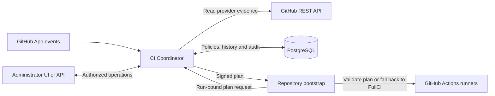

# CI Coordinator

**Observe GitHub Actions, understand CI costs, and control validation with
deterministic, FullCI-safe plans.**

[](https://github.com/research-engineering/ci-coordinator/actions/workflows/python-persistence.yml)
[](https://github.com/research-engineering/ci-coordinator/actions/workflows/release-artifact.yml)

[Get started](#get-started) | [How it works](#how-it-works) |
[Documentation](docs/INDEX.md) | [API](docs/reference/http-surface.md) |
[Roadmap](ROADMAP.md)

One self-hosted service connects GitHub App installations across organizations
to an administrator workbench and API. Inspect workflows and run history,
compare CI measurements, and manage repository policies without moving
execution out of GitHub Actions.

## See It in Action



*The operator UI with synthetic example data. The
[browser scenario](frontend/tests/browser/visualSystem.spec.ts) owns the example;
this is not live inventory or production qualification.*

## What You Can Do

| Task                         | What the coordinator provides                                                                                                                           |
|------------------------------|---------------------------------------------------------------------------------------------------------------------------------------------------------|
| Connect repositories         | Discover GitHub App installations and repositories, with explicit administrator and repository access boundaries.                                       |
| Understand workflows         | Inspect exact-commit workflow evidence and review configuration proposals before activation.                                                            |
| Observe CI                   | Enable repository observation, import available Actions history, inspect attempts and jobs, and see recorded coverage gaps.                             |
| Analyze cost and performance | Filter retained statistics by workflow or job, inspect runner time and duration trends, and use forecasts when the required measurements are available. |
| Manage policies              | Register, activate and roll back immutable configuration epochs through the UI or API without restarting the service.                                   |
| Control validation           | Derive deterministic plans, preserve FullCI fallback, and use scoped emergency controls to disable omission or force FullCI.                            |
| Investigate operations       | Inspect administrator activity, replay audit evidence, and monitor reconciliation, readiness and metrics.                                               |

Observation is separate from selective execution. Importing history does not
require adding coordinator steps to a repository workflow; consuming a signed
CI plan requires a repository-owned bootstrap and an independent FullCI path.
GitHub must grant the App the corresponding repository access and permissions.

Runner-minutes are not CPU time or realized financial savings. Missing provider
history and insufficient measurements remain explicit, not silently converted
into complete coverage or a forecast. See
[measurement and comparison](docs/how-to/measure-and-compare-ci.md).

> [!IMPORTANT]
> Start in `non_enforcing` mode. Reducing required CI checks needs explicit,
> scope-bound production admission and an independently working FullCI fallback.
> A running service or a green build alone does not authorize omission.

## Get Started

### Use an Existing Deployment

1. Open your deployment's `/workbench` and sign in with its configured
   administrator identity.
2. Select an organization and repository. The catalog reflects GitHub App
   access; workbench operations also require the deployment's authorization.
3. Discover workflows or enable observation under **CI economics**.

Follow [installation discovery](docs/how-to/discover-installed-organizations.md)
for access setup and [repository observation](docs/how-to/observe-repository-runs.md)
for history collection. The [HTTP reference](docs/reference/http-surface.md)
provides the API path for automation without the UI.

### Deploy Your Own Service

Use the [container deployment guide](docs/how-to/deploy-container.md). It covers
the digest-addressed image, PostgreSQL migration and runtime roles, GitHub App,
Keycloak administrator authentication, mounted secrets and health checks.
Start non-enforcing; follow the
[repository adoption playbook](docs/target-repository-migration.md) before
connecting a consumer workflow to planning.

[`.env.example`](.env.example) is the configuration inventory, not a ready-to-run
credential file. Do not put secrets in the repository or browser configuration.

### Run for Development

Prerequisites: a supported Linux or Apple Silicon macOS host, Docker with
Compose, and `mise`. See the [local guide](docs/how-to/evaluate-locally.md) for
exact versions and WSL2 support. From the repository root:

```sh
mise trust
mise run install:backend
mise run dev:up
```

Open the printed UI endpoint at `/workbench`. Each worktree gets isolated
credentials, volumes and Docker-assigned loopback ports. Use `dev:watch` for
source synchronization and `dev:down` to stop while retaining data.

> [!NOTE]
> Local startup does not configure Keycloak administrator authentication or
> real GitHub App access. The static UI is available, but protected operations
> reject anonymous requests. Complete the connected setup in the
> [local guide](docs/how-to/evaluate-locally.md) before using live repositories.

## How It Works



The backend is a modular Python/FastAPI service with PostgreSQL persistence;
the React/TypeScript workbench is served from the same origin. Webhook
notifications and bounded reconciliation drive provider observation. Planning
uses admitted evidence, immutable policy epochs and deterministic impact rules.
GitHub Actions remains the execution owner.

For trust boundaries, internal contexts, dataflow and state machines, see the
[visual architecture overview](docs/architecture/ARCHITECTURE.md).

## Safety and Control

- **Proof before omission.** Required validation can be reduced only when all
  applicable safety predicates are proved for the exact subject and scope.
- **Conservative uncertainty.** Missing, stale or contradictory evidence leads
  to FullCI or explicit failure, never an unexplained successful skip.
- **Scheduling is not coverage.** Runner capacity may shape shards, but cannot
  remove required tests, credentials, fixtures or coverage obligations.
- **Advice cannot weaken validation.** Agent advice may only add checks or
  depth. The coordinator does not grant an agent authority to omit checks.

### Runtime Modes

| Runtime mode    | Execution authority                                                                                            |
|-----------------|----------------------------------------------------------------------------------------------------------------|
| `disabled`      | Health and diagnostic surface only; not ready for connected operations.                                        |
| `non_enforcing` | Observe, configure and evaluate candidate plans; issued execution plans remain FullCI.                         |
| `enforcing`     | Selected plans only after external receipt admission and transactional scope, epoch, expiry and safety checks. |

The [meta-specification](docs/architecture/01-meta-specification.md) owns these
laws. [Production admission](docs/architecture/cross-cutting/production-admission.md)
defines the deployment, provider, shadow and rollback evidence required before
enforcement. Implemented capabilities and unfinished qualification remain
separate in the [roadmap](ROADMAP.md).

## Documentation

| I want to...                               | Start here                                                                                                                                                                                      |
|--------------------------------------------|-------------------------------------------------------------------------------------------------------------------------------------------------------------------------------------------------|
| Use the workbench and connect repositories | [Installation discovery](docs/how-to/discover-installed-organizations.md), [workflow discovery](docs/how-to/discover-repository-workflows.md)                                                   |
| Collect history and compare CI runs        | [Repository observation](docs/how-to/observe-repository-runs.md), [measurement guide](docs/how-to/measure-and-compare-ci.md)                                                                    |
| Configure policies without the UI          | [Policy lifecycle](docs/how-to/manage-repository-policy.md), [HTTP reference](docs/reference/http-surface.md)                                                                                   |
| Deploy and operate the service             | [Container deployment](docs/how-to/deploy-container.md), [observability](docs/how-to/operate-production-observability.md), [capacity qualification](docs/how-to/qualify-production-capacity.md) |
| Understand the architecture and contracts  | [Architecture overview](docs/architecture/ARCHITECTURE.md), [specification index](docs/architecture/INDEX.md)                                                                                   |
| Develop and verify changes                 | [Developer workflows](docs/how-to/development-workflows.md), [testing and Proofkit](docs/architecture/cross-cutting/testing-and-proofkit.md)                                                    |
| Investigate security or audit evidence     | [Security boundaries](docs/architecture/cross-cutting/security-and-oidc.md), [audit replay](docs/how-to/replay-audit-evidence.md)                                                               |

Browse the [complete documentation index](docs/INDEX.md) or the
[product roadmap](ROADMAP.md). Exact dependency versions are owned by the
[Python manifest](backend/pyproject.toml), [frontend manifest](frontend/package.json)
and their lockfiles; the README does not maintain a second version inventory.

Publication requirements are recorded in the
[public export boundary](docs/features/open-source-portability.md).

## License

CI Coordinator is licensed under [Apache License 2.0](./LICENSE).
See [NOTICE](./NOTICE) for retained attribution.
Third-party components retain their own licenses and attribution notices,
including the [Lato font license](frontend/src/assets/fonts/OFL.txt) and the
[vendored Dev Container schema license](tooling/quality/schemas/devcontainers/LICENSE-CODE).
