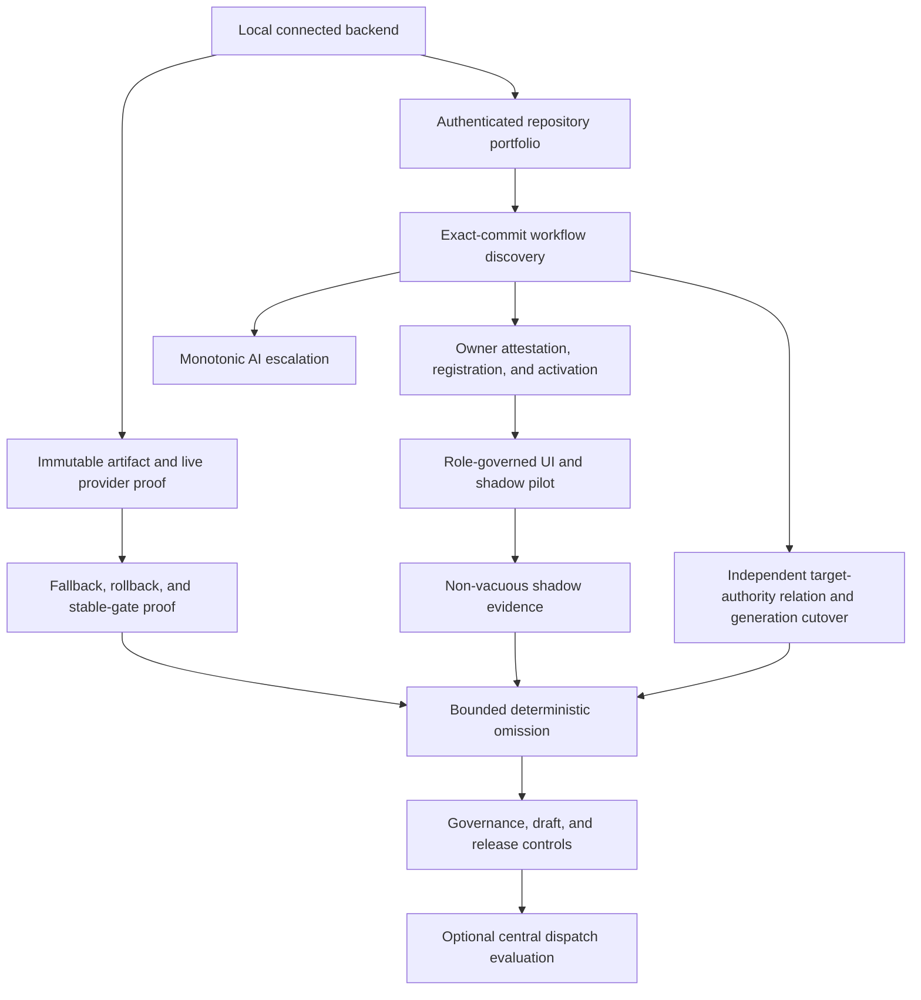

# CI Coordinator Roadmap

> Public-export boundary: historical source, PR, run, provider and rollout
> observations retained below are design context only, not acceptance evidence
> for `research-engineering/ci-coordinator`. Former private receipts are revoked.
> Synthetic pilot archetypes are proposed examples, not renamed executions.
> Requalify applicable requirements and open tasks against the new exact source.

Status: product and engineering roadmap

Last validated: 2026-09-07

## 1. Product Law Projection

Planning refinement: 2026-09-23. The
[operator capability completion plan](docs/features/ci-operator-capability-completion-plan.md)
retains O1-O6 refinements within the existing delivery sequence. This update
does not requalify historical provider, release or production claims. The
repository is temporarily private; after implementation and qualification,
prepare a new clean-history export before any public publication. Do not
transfer current Git history, provider runs, caches or private recovery notes.

CI Coordinator is a GitHub App control plane for truthful CI governance. The
canonical authority is MS-1 through MS-3 in
[`01-meta-specification.md`](docs/architecture/01-meta-specification.md); this
roadmap projects those laws only to explain delivery order:

```text
Deterministic proof may reduce work.
Agent advice may only increase validation.
Uncertainty runs FullCI or produces an explicit failure.
```

This law is necessary but not sufficient. Identity, freshness, credentials,
availability, replay, rollback, and provider semantics are independent
conjuncts of production admission.

## 2. Current Boundary

The Python/FastAPI implementation is the sole backend. The local connected
runtime can authenticate, plan, sign and replay envelopes, hot-activate policy
epochs, apply monotonic controls, shape shards, reconcile provider observations,
collect shadow evidence, and expose an authorization-first organization and
repository catalog. It can also acquire one authorized repository's workflows
at an exact commit, produce a closed provenance and unknown ledger, and emit an
admitted observe-only proposal when the provider signal is unambiguous. Its
backend can also authorize an affirmative review, reproduce the proposal at the
current default-branch head, and atomically register its immutable epoch, audit,
and review records without activation. Its enforcing path can authenticate an
externally signed receipt, durably register exact production authority, and
issue selected plans for admitted scopes.

When explicitly enabled, the browser plane authenticates organization
administrators through an opaque token-free Keycloak-backed session. Exact
Keycloak roles govern control-plane capabilities, while the organization-owned
GitHub App provides repository inventory and provider reads within the admitted
installation scope. A proposal-bound GitHub reviewer token exists only during
one repository-owner attestation callback, is reduced to immutable reviewer and
permission evidence, and is discarded before durable commit. Activation is a
separate administrator operation that rechecks the retained reviewer through
the GitHub App and revalidates the complete active baseline under lock.

The repository cannot make the receipt's external evidence true, centrally
dispatch runner work, publish omitted-check success, or claim a live production
rollout. Until external admission succeeds, deployments remain non-enforcing.

```text
LocalImplementationComplete
and not ExternalProductionAdmission
=> DeploymentMode in {disabled, non_enforcing}
and FullCIFallbackRequired
```

## 3. Capability Map

| Capability                            | Deterministic core                                                                                                                                                                 | Agent extension                                            | Combined result                                                                                                 | State                                                                                                                                                                                                                                                                                         |
|---------------------------------------|------------------------------------------------------------------------------------------------------------------------------------------------------------------------------------|------------------------------------------------------------|-----------------------------------------------------------------------------------------------------------------|-----------------------------------------------------------------------------------------------------------------------------------------------------------------------------------------------------------------------------------------------------------------------------------------------|
| Trust substrate                       | Hash chain, replay, identity binding                                                                                                                                               | Explanation and anomaly triage                             | Replayable proof with bounded diagnosis                                                                         | implemented                                                                                                                                                                                                                                                                                   |
| Dynamic CI planning                   | Impact closure, omission proof, FullCI fallback                                                                                                                                    | Additional risk and depth                                  | Lower cost without agent downgrade authority                                                                    | implemented locally                                                                                                                                                                                                                                                                           |
| Runner capacity                       | Exact static selector binding, bounded self-hosted-runner observation, and shared-pool shard allocation                                                                            | Queue-pressure hypothesis                                  | Faster selected execution without coverage change                                                               | implemented locally; live GitHub App permission and target pilot remain external evidence                                                                                                                                                                                                     |
| Hot configuration                     | Immutable epochs, CAS activation, rollback                                                                                                                                         | Policy proposal                                            | No-restart policy control with deterministic admission                                                          | implemented                                                                                                                                                                                                                                                                                   |
| Shadow rollout                        | Candidate/baseline comparison                                                                                                                                                      | Failure clustering                                         | Non-enforcing safety evidence                                                                                   | implemented locally                                                                                                                                                                                                                                                                           |
| Production authority consumption      | Canonical receipt, packaged build binding, durable registration, transactional guard                                                                                               | Evidence explanation only                                  | Scope-bound selected-plan issuance without ambient enable flags                                                 | v1 implemented locally; independent target-authority relation and external signer evidence remain mandatory before production omission                                                                                                                                                        |
| Target authority relation             | Finite Phase-0 conservation, exact full-row equality, total raw-domain projection, strict Git source binding, independently enumerated producers, and replayable retained evidence | None; authority transition is deterministic                | Reviewable unactivated closure that cannot mint omission authority                                              | relation, producers, retained evidence, successor persistence and generation-fenced cutover implemented with native proof; live drain, activation and pilot remain pending                                                                                                                    |
| Immutable release artifact            | Exact master/Full Check binding, registry digest, provenance, SBOM, signer verification                                                                                            | None; publication authority is deterministic               | One attestable production-eligible OCI artifact                                                                 | source capability; public exact-source release and deployment qualification pending                                                                                                                                                   |
| FastAPI Production assurance          | Exact sealed profile identity and three-valued conformance                                                                                                                         | Evidence explanation only                                  | Release-bound project conformance without acronym ambiguity                                                     | profile selected; project status `NOT_DETERMINED` pending context and external receipts                                                                                                                                                                                                       |
| Provider inventory                    | Keycloak read role intersected with deployment scope and exact GitHub App installation evidence, credential-plane separation, bounded decoding                                     | None; provider identity is deterministic                   | Discoverable organization/repository portfolio without widening command authority                               | implemented locally                                                                                                                                                                                                                                                                           |
| Governance and drift                  | Effective default-branch rules observation; owner-approved durable baseline; exact comparison                                                                                      | Suspicious-change interpretation                           | Truthful provider evidence and explicit expected state now; continuous control-plane review later               | observation, baseline, and comparison implemented locally                                                                                                                                                                                                                                     |
| Draft PR orchestration                | Revision-bound lifecycle and stage gates                                                                                                                                           | Risk explanation and stricter-stage proposal               | Richer lifecycle than the provider draft flag                                                                   | planned                                                                                                                                                                                                                                                                                       |
| Secrets prevention                    | Credential profiles and fork restrictions                                                                                                                                          | Risk classification                                        | Least-privilege validation                                                                                      | designed                                                                                                                                                                                                                                                                                      |
| Release evidence                      | Immutable build and gate provenance                                                                                                                                                | Failure clustering and release summary                     | Explainable deploy admission                                                                                    | designed                                                                                                                                                                                                                                                                                      |
| Proof workbench UI                    | Runtime-decoded identity, provider catalog, scoped snapshot, discovery, attestation, and activation state                                                                          | Natural-language summary                                   | Repository inspection, one-use owner attestation, and separately authorized activation                          | implemented locally                                                                                                                                                                                                                                                                           |
| Operator experience and visual system | Task-centered information architecture, explicit evidence hierarchy, responsive layout, keyboard and screen-reader semantics, deterministic visual regression                      | Contextual explanation only                                | A distinctive, efficient administration surface without hiding authority or uncertainty                         | navigation and console implemented; [evidence presentation repair](docs/features/operator-evidence-presentation.md) and [visual system implementation](docs/features/operator-visual-system-implementation-plan.md) in progress; analytics and task-level usability qualification remain open |
| Workflow discovery                    | Exact-commit inventory, provenance, closed predicate ledger, and stable terminal-signal topology                                                                                   | Future explanation only; no authority                      | Reviewable current-default-head observe-only proposals without repository-specific assumptions                  | implemented; three frozen topology replays validated                                                                                                                                                                                                                                          |
| Proposal review registration          | Exact replay, current-head reproduction, ABA-resistant baseline, bounded semantic diff, and atomic epoch + audit + review commit                                                   | None; affirmative mutation authority remains deterministic | Durable non-activating review through a proposal-bound one-use GitHub reviewer handoff                          | implemented locally                                                                                                                                                                                                                                                                           |
| API-first repository administration   | Versioned request contracts, dry-run admission, immutable epochs, idempotent commands, audit replay                                                                                | Configuration explanation and draft generation only        | Every UI operation has the same complete API capability; UI is never required for automation                    | configuration lifecycle API implemented locally; complete journey parity and workflow-adaptation recommendations remain pending                                                                                                                                                               |
| External review escalation            | Authenticated block registry, revision binding, idempotency, credential profiles, monotonic admission                                                                              | A review bot selects additional blocks and depth           | Any admitted block may be added without granting omission or credential-broadening authority                    | deterministic admission exists; command channel planned                                                                                                                                                                                                                                       |
| CI economics and regression telemetry | Per-job timing, runner identity, planned route, exact attempt evidence, finite retention                                                                                           | Regression explanation and clustering                      | Replayable CI evidence without influencing planning                                                             | v1 implemented locally; actual CPU utilization, saved-compute comparison, regression alerting, and production capacity evidence remain pending                                                                                                                                                |
| Configuration assistant               | Schema-constrained read model, evidence citations, proposal validation                                                                                                             | Interactive UI chat produces explanations and drafts       | Optional guided configuration without direct model mutation authority                                           | last priority, after all other product, repair, pilot and deployment-qualification work                                                                                                                                                                                                       |
| Consumer contract laboratory          | Real application planning path and exact target validators, lab-only signing, synthetic-result labels, independent route scenarios, and content-addressed source epochs            | Failure explanation only                                   | Provider-independent proof of coordinator-to-target control flow without pretending to emulate GitHub           | reusable profile laboratory source present; public fallback and selected-canary qualification pending                                                                                                                                                   |
| Thin target consumer control          | One content-addressed generated bundle with a closed three-command dispatcher and exact target-registry binding                                                                    | None; target execution authority is deterministic          | Four generated target artifacts instead of nine while preserving local fallback and decomposed source ownership | source implemented; fresh public CI, fallback/selected pilot and savings evidence remain pending                                                                                                                                                             |

Telemetry is admitted by one bounded law rather than by an unbounded promise to
collect every observable:

```text
Measure(x) := DecisionUseful(x)
              and DefinitionVersioned(x)
              and SubjectEpochBound(x)
              and ProvenanceComplete(x)
              and AccuracyOrUncertaintyAdmitted(x)
              and BoundedCardinality(x)
              and PrivacyAdmitted(x)
              and CollectionCostWithinBudget(x)
              and DataClassRetentionPolicyOwned(x)

Compare(x, y) := Measure(x)
                 and Measure(y)
                 and ComparisonRelationAdmitted(x, y)
                 and InputProvenanceRetained(x, y)

Persisted(x, t) => RetentionAllows(x, t)
```

This includes queue, setup, wall-clock and estimated CPU time; runner, shard and
cache utilization; selected, omitted and fallback reasons; retries, flakiness,
FullCI counterfactuals, saved compute, and SLO regressions. It excludes secrets,
unbounded labels, and data without an explicit purpose-bound retention policy.
For the proposed historical archive, compact statistics have no automatic
expiry; optional job/step detail has its own configurable lifetime. This target
does not extend the current 90-day CI-evidence contract. `RetentionAllows`
evaluates the admitted data-class policy, not an absent deadline interpreted
as permission to retain. Finite storage and collection budgets still apply.
Every
record binds its repository, revision, run attempt, runner profile, units, and
measurement-definition version. Derived estimates additionally bind their
estimator version and admitted uncertainty, so unlike epochs are not compared
as equivalent observations. A comparison is admitted only when both definition
epochs are identical or an owner-approved normalization relates them, and the
derived result retains both source identities. Retention conformance requires
preserving permanent statistical facts and deleting finite-lived detail when
due, not merely recording that a policy exists.

## 4. Delivery Sequence

Product delivery and production admission are related partial orders, not one
false linear sequence:



### Stage A: Local Backend And Authority Consumer

State: implemented.

Exit proof: repository quality, container smoke, PostgreSQL integration,
mutation witnesses, non-enforcing and enforcing runtime composition, signed
fallback, receipt admission, durable authority registration, transactional
selected-issuance guards, and shadow evidence pass without claiming external
rollout truth.

### Stage B: Authenticated Repository Portfolio

State: implemented locally.

The operator UI authenticates one Keycloak human session, intersects the
operation-specific role with deployment scope and exact GitHub App installation
evidence, distinguishes provider visibility from exact action authority, and
opens the bounded proof snapshot. The deployment-owned break-glass credential
is a disjoint emergency plane restricted to safety-increasing controls.

### Stage B.1: Organization Identity And API-First Administration

State: target contract, machine profile, runtime cutover, repository
attestation, and activation implemented locally; external provider receipts and
complete API-first administration remain pending.

The
[organization control-plane contract](docs/architecture/cross-cutting/organization-control-plane.md)
and [machine profile](docs/specs/ci-coordinator-control-plane/control-plane-profile.v1.json)
freeze eight separate credential planes, exact fine-grained administrator
roles, current read-only GitHub App permissions, deferred write profiles,
session bounds, attribution, and pre-release cutover semantics. The local
runtime now implements the Keycloak human and machine paths, exact App-backed
repository reads, one-use GitHub reviewer attestation, and separately
authorized activation. It cannot claim live Keycloak, GitHub callback, secret
custody, or deployment conformance until external receipts close those facts.

All repository onboarding, workflow discovery, policy proposal, validation,
activation, rollback, and status operations must be available through a
versioned API. The UI calls those same application capabilities and owns no
separate business behavior.

### Stage B.2: Operator Experience And Visual System

State: planned immediately after API-first capability parity.

The first screen is the working repository portfolio, not a marketing surface.
The experience groups actions by operator task, exposes authority, freshness,
uncertainty, and next action without collapsing them into one status, and uses
progressive disclosure for raw evidence. The design batch must define reusable
layout and state primitives, guided repository onboarding, dense comparison and
operations views, responsive behavior, keyboard and assistive-technology
semantics, reduced motion, empty/loading/error/stale states, and deterministic
Playwright screenshots at desktop and mobile viewports. Visual polish cannot
invent success, hide fallback, or duplicate backend policy.

### Stage C: Workflow Discovery And Proposal

State: implemented as a synchronous discovery slice; frozen target revisions
validated through the same proposal predicate.

The service acquires workflows at one exact provider commit, derives a bounded
provenance graph and closed unknown ledger, and produces deterministic
secret-free observe-only proposals through existing policy admission. The UI exposes
the exact evidence and blockers; an independently authenticated and authorized
command may hand a complete current-head proposal to review registration.

### Stage C.1: Proposal Review Registration

State: non-activating review registration and separately authorized activation
implemented locally.

An authorized command resolves exact replay before provider work, binds the
client-observed active epoch and revision, reproduces the current-head manifest,
computes a bounded semantic diff, then commits the epoch, review, and pair-owned
audit event atomically under the repository-scope lock. A one-use GitHub
reviewer callback adds current `maintain` or `admin` evidence without retaining
its token. A distinct Keycloak `activate` command rechecks that reviewer through
the App, reproduces the current proposal, and rejects changed or ABA baselines
before the activation compare-and-set.

### Stage C.2: Dormant Target Authority Relation

State: pure transition, strict workflow-source binding, independently
enumerated producers, and replayable dormant evidence implemented locally.

The kernel derives the expected adapted relation only from the exact Phase-0
baseline and owner-approved delta, binds registration to that expected domain,
binds observation to its total raw candidate domain, and emits only an
unactivated closure. The exact workflow Git tree and current source binding are
separate, registration and observation use asymmetric independently enumerated
domains, and one canonical bundle can replay their exact retained Stage C
evidence. The successor persistence and generation-fenced implementation has
separate D3 native evidence. Complete live provider authority, old-authority
drain and production activation remain pending and cannot be inferred from
this dormant stage.

### Stage D: External Production Admission

State: platform-owned and not locally provable.

Required conjunction:

- one immutable artifact identity across every witness;
- a provider-independent consumer contract laboratory covering request,
  planner, signature, validator, fallback, and gate behavior with lab-only
  authority; the reusable exact-source profile laboratory is implemented
  locally; public exact-target fallback and selected canaries, and their
  independently admitted target profiles, remain pending;
- externally migrated and attested PostgreSQL schema;
- live GitHub App, OIDC, JWKS, and bootstrap behavior;
- exact-revision, content-addressed target adapter admission for every
  path-scoped workflow identity;
- bounded coordinator outage with automatic FullCI fallback;
- rollback using the same declared artifact and schema compatibility facts;
- stable required-check identity, including merge queue behavior;
- non-vacuous shadow observations over admitted repositories and risk classes.
- one complete release-bound FastAPI Production context and conformance record
  against the exact selected profile epoch.

### Stage E: Bounded Deterministic Omission

State: future production decision.

Enable only explicitly admitted surfaces. Unknown paths, stale graphs,
incomplete diffs, provider uncertainty, and invalid policy always run FullCI.

### Stage F: Governance, Draft Lifecycle, And Release Evidence

State: effective-governance observation, owner-approved durable baseline, and
exact deterministic comparison implemented locally; drift policy, draft
lifecycle, and release evidence planned.

Observe bounded active default-branch rules without claiming a baseline or
compliance. Then add owner-approved baselines, exact comparison, drift detection,
revision-bound draft stages, dependency ordering for related pull requests,
and immutable release evidence. Coordinator stages do not override provider
draft state, branch protection, or required checks.

### Stage G: AI Escalation

State: pure admission and monotonic verifier implemented; external review-bot
command transport, model execution, independent evaluation orchestration, and
durable advice evidence deferred.

Agent output may add checks, increase depth, request fixtures, or propose policy.
It may not omit checks, weaken depth, broaden credentials, or disable fallback.
The external review-bot channel precedes the embedded assistant because it
delivers operational value without coupling product configuration to a chat UI.
It is optional: absence or timeout of the bot cannot delay or alter the normal
deterministic route. A separately scoped read-only API exposes bounded
repository statistics and evidence to the bot; direct database access is not a
supported integration boundary.
The optional assistant may explain configuration and submit deterministically
validated drafts, but cannot directly activate or execute them.

### Stage H: Optional Central Dispatch

State: uncommitted option.

Adopt only if central dispatch produces measurable value beyond the static
bootstrap. Coordinator unavailability must remain bounded by FullCI fallback.

## 5. Authority Map

One fact has one owner:

| Fact                                              | Authority                                                                              |
|---------------------------------------------------|----------------------------------------------------------------------------------------|
| Product order and future capability state         | this file                                                                              |
| Architecture laws and boundaries                  | `docs/architecture/01-meta-specification.md` and `docs/architecture/02-context-map.md` |
| Derived architecture diagrams                     | `docs/architecture/ARCHITECTURE.md`                                                    |
| Specification routing                             | `docs/architecture/INDEX.md`                                                           |
| Dataflow and state machines                       | `docs/architecture/03-dataflow-and-state-machines.md`                                  |
| Module behavior                                   | `docs/architecture/modules/`                                                           |
| Cross-cutting invariants                          | `docs/architecture/cross-cutting/`                                                     |
| Production admission gate                         | `docs/architecture/cross-cutting/production-admission.md`                              |
| Machine product requirements                      | `docs/specs/**/requirements.v1.json`                                                   |
| Architecture traceability closure                 | `docs/specs/ci-coordinator-core/architecture-traceability-profile.v1.json`             |
| Requirement-to-witness graph                      | `proofkit/requirement-bindings.json`                                                   |
| Proof environment and commands                    | `proofkit/witness-plan-input.json`                                                     |
| Repository proof policy                           | `proofkit/repo-profile.json`                                                           |
| Runtime interpreter set                           | `docs/specs/ci-coordinator-runtime/python-runtime-profile.v1.json`                     |
| Contract regression vectors                       | `fixtures/conformance/v1/product-contract-vectors.v1.json`                             |
| Target-repository adoption and rollback procedure | `docs/target-repository-migration.md`                                                  |

Feature detail:

- [Dynamic CI enforcement](docs/features/dynamic-ci-enforcement.md)
- [Governance and release evidence](docs/features/governance-drift-release-evidence.md)
- [Secrets and incident prevention](docs/features/secrets-incident-prevention.md)
- [Agent risk advice](docs/architecture/modules/agent-risk-advice.md)
- [Proof workbench UI](docs/features/proof-workbench-ui.md)
- [Repository adoption experience](docs/features/repository-adoption-ux.md)
- [Workflow discovery UI](docs/features/workflow-discovery-ui.md)
- [Control-plane identity authority cutover](docs/features/control-plane-identity-authority-cutover.md)

## 6. Production Invariants

- No green state without a deterministic owner and fresh evidence.
- Coordinator failure maps to FullCI or explicit failure, never silent success.
- Input, policy, graph, diff, plan, verifier, and observation identities replay.
- Untrusted events and fork contexts cannot receive privileged credentials.
- Required-check and merge-queue semantics are modeled explicitly.
- Metrics, alerting, rollback, and replay precede enforcement.
- Agent output is monotonic with respect to validation coverage.
- Coordinator lifecycle stages cannot override provider facts or branch policy.

## 7. Risk Register

| Risk                              | Failure mode                                                                      | Required control                                                                                                 |
|-----------------------------------|-----------------------------------------------------------------------------------|------------------------------------------------------------------------------------------------------------------|
| Required-check ambiguity          | Unrelated or skipped work appears successful                                      | Stable required gate and coordinator-owned proof                                                                 |
| Stale graph                       | A dependent surface is missed                                                     | FullCI unless freshness is proved                                                                                |
| Diff truncation                   | Changed files are absent                                                          | FullCI on incomplete evidence                                                                                    |
| Agent trust inversion             | Advice removes validation                                                         | Monotonic verifier                                                                                               |
| Store corruption                  | Decisions cannot be reconstructed                                                 | Hash chain, attestation, replay                                                                                  |
| Credential amplification          | Dynamic work receives excessive privilege                                         | Explicit credential profiles and fork policy                                                                     |
| Dispatch outage                   | CI never starts                                                                   | Static bootstrap and bounded FullCI timeout                                                                      |
| Documentation drift               | Agents consume obsolete authority                                                 | Single-owner document graph and Proofkit routing                                                                 |
| Draft-state confusion             | Coordinator stage is mistaken for merge readiness                                 | Provider facts and policy stages remain separate                                                                 |
| Executable-language blind spot    | A CommonJS artifact is counted physically but its dependency surface is unknown   | Conservative CommonJS signal extraction with unknown-to-review behavior                                          |
| Proof-surface growth              | Proof maintenance costs more than the residual risk it removes                    | Measure precision and authoring cost; migrate to parity-proven compact routes; remove only dominated projections |
| Runtime-version drift             | Repeated patch identities disagree or intentional caps outlive their evidence     | One machine runtime profile, validated projections, freshness SLA, and expiring compatibility exceptions         |
| Premature observability expansion | Tracing adds cost and sensitive data without closing a critical journey           | Add telemetry only with an owned journey, collector, sampling, retention, and data-classification contract       |
| Stale temporal authority          | A pre-lock clock sample admits a write after lease expiry                         | Database-owned admission instant, exact generation/token fencing, and lock/expiry race witnesses                 |
| Incomplete schema admission       | A declared capability lacks its runtime schema check                              | Complete capability-to-attestor dispatch and independent schema/ACL tamper witnesses                             |
| Recovery-free overload            | Bounded rejection loses webhook or logout delivery without an owned recovery path | Bounded ingress, durable acknowledgement rules, provider recovery and revocation guarantees                      |
| History-dependent admission cost  | A normal operation rechecks an ever-growing audit history                         | Measured query cost and maintained integrity proof without weakening drift detection                             |

## 8. Next Work

### Current audit and completed work

The [September 23 audit hardening](docs/features/assurance-audit-hardening.md)
and [implementation plan](docs/features/assurance-audit-hardening-plan.md)
adjudicate the revised September 21 report against exact base `065a4d9c`.
This B7 batch strengthens runtime typing, non-vacuous timeout and generated API
witnesses, build-linked diagnostics, locale consistency and qualification routes.
It does not turn discovery-only mutation or incomplete coverage into a product
defect. The complete grouped disposition and remaining evidence are in that
design; source changes do not imply native/runtime qualification.

Publication targets a new public repository, `research-engineering/ci-coordinator`,
with clean initial history. Former runner-policy observations are not evidence
about that target. Qualify an admitted execution environment and bind App scope,
OIDC/attestation trust, registry ownership and required checks independently.
No former receipt, local behavioral fallback, reduced threshold or unapproved
runner provisioning is implied.

Retain in B7: delivered-userspace pytest qualification; exact-head runtime
performance and repair-policy renewal; analyzer/database and cost-hint
provenance; database text semantics, provisioner hardening and restore drill;
remaining SARIF/clause dispositions and risk-based coverage expansion. These
items are not closed by the narrow repairs or by static gate success.

The September 2026 master integration adds complete documentation-diagram
qualification (PR194), explicit rather than automatic postmerge release
qualification (PR195), bounded schema-driven API campaigns (PR198/200), a
digest-bound final-image vulnerability gate (PR202), and typed Promise analysis
(PR204). These advance D9/own-CI proof; they do not establish live release or
production readiness. PR201 implements bounded historical step import/read and
runtime detail expiry under [History Review Convergence](docs/features/history-review-convergence.md).
Its destructive administration and operational packages remain open.
[History Detail Boundary Closure](docs/features/history-detail-boundary-closure.md)
addresses provider job ordering and the nonempty recheck/replay/HTTP oracles
without changing statistics, retention or authority. The existing 18-direction
delivery inventory still requires live pilot target acceptance and E1-E3 evidence.

The 2026-09-14 PostgreSQL catalog audit covered an inventory of 225 scenarios
against frozen source `25a4090f`. Its three confirmed mechanisms are scheduled
as follows; inventory coverage is not workload or production conformance:

1. [Coherent database observations](docs/features/database-observation-snapshots.md)
   and its [plan](docs/features/database-observation-snapshots-plan.md) repair
   readiness head/maximum drift and the pre-fence Workbench snapshot. Native
   controlled interleavings and all-family projection checks precede acceptance.
2. [Total collection-state admission](docs/features/total-collection-state-admission.md)
   and its [plan](docs/features/total-collection-state-admission-plan.md) close
   nullable collection CHECK predicates through a fenced contract/expand pair.
   Preserve published migrations and valid states; reject invalid retained rows.
   Native qualification and the maintenance rollout are separate acceptance steps.
3. Unknown workload, query-plan, maintenance, memory and failure-capacity evidence
   remains D9/E1 work. Do not infer tuning or index changes from catalog membership.

The [2026-09-13 snapshot-review validation](docs/adoption/snapshot-review-validation-2026-09-13.md)
rebinds the supplied 20 claims and all clarified rejections from `7e4ef975` to
master `36b6c286`. PR #162 closes its three confirmed source defects through
[control-plane audit closure](docs/features/control-plane-audit-closure.md):
private domain imports from two scanning services, missing `no-store` on ordinary
operator-override responses, and matched HTTP templates incorrectly labelled
`unmatched`. It also closes TEST-05 with an exact empty four-lane turn witness.
New-run history recovery and its real-PostgreSQL bridge are already delivered;
do not recreate them or conflate them with old-run rerun coverage.

PR #161 delivers [automatic mutation discovery](docs/features/automatic-mutation-testing.md)
beside the curated witnesses. The [narrow dependency override](pnpm-workspace.yaml)
selects patched `qs` only on its development-tool parent edge. The development
toolchain also moves to Playwright 1.63.0 and retains browser failure traces
separately from mandatory screenshots; product imports remain unchanged. Native
qualification, not the SDK version, determines browser compatibility. Passing the configured
dependency-audit severity threshold does not establish absence of advisories;
lower-severity findings still require explicit triage.

Retain the existing 18-workstream program. This intake schedules repairs and
proof work; it does not authorize deployment, waive rejected topics forever,
or require a new error framework.

The [2026-09-06 temporal and oracle adjudication](docs/adoption/temporal-and-oracle-audit-2026-09-06.md)
revalidates the later supplied report without treating its score as authority.
Its T1-T16 register adds response-age/URI repair, causal DB/mutation/Node
oracles, FIFO admission, documentation drift and explicit recovery/retention
decisions to the existing B2/B3/B5 phases. No mass refactor or additional
service is inferred from an unmeasured risk. The earlier planning estimate of
approximately 70% is historical, not a refreshed effort-weighted acceptance or
production percentage.

The [2026-09-05 independent adjudication](docs/adoption/independent-sota-adjudication-2026-09-05.md)
binds the two supplied reports to `master` at
`e791fad2ed9e68ccc73a130ded6f517f0109310e`. It dispositions all 71 numbered
reassessment findings and all 33 original compound bullets. Neither the external
score nor its suggested architecture becomes authority by inclusion here.

Retained source capabilities, not scheduled for blind reimplementation, include
CommonJS ownership signals, the singleton Python 3.13.15 profile, compact
Proofkit v2 routes, identity runtime, configuration lifecycle APIs, CI economics
v1 and thin four-artifact target control. Exact-head public CI and independently
admitted fallback/selected canaries remain required. No former private canary,
publication, five-minute completion or CPU-saving receipt is carried forward.

The 2026-09-05 adjudication identified stale pre-lock lease time, missing
economics runtime schema attestation, history-dependent override admission,
probe/ingress/revocation recovery, bounded failure diagnostics and UI recovery.
B1 below records the implemented lease-time and attestation repair. Current
remaining work is scoped by the batch and phase rows, rather than replaying
that historical finding list as a new implementation queue.
CodeQL absence and GitHub PKCE non-support are refuted. Port counts, large
files, library names and historical versions do not prove architectural defects.
Keep the modular monolith and same-store CQRS unless measured constraints
justify a stronger boundary.

### Immediate repair batches

The [evidence-led closure plan](docs/features/evidence-led-operational-closure-implementation-plan.md)
owns changed files, protected behavior, alternatives and acceptance witnesses:

| Batch            | Objective                                                                         | Completion boundary                                                                                                               |
|------------------|-----------------------------------------------------------------------------------|-----------------------------------------------------------------------------------------------------------------------------------|
| B1 (implemented) | Restore exact lease-time authority and complete runtime capability attestation    | PR #125 merged after exact-head PostgreSQL race/tamper witnesses and Full Check; no new omission authority or live rollout claim. |
| B2               | Recoverable bounded ingress, liveness, revocation and diagnostics                 | Code-level overload/crash/cancellation proofs; live Swarm/provider validation remains E1.                                         |
| B3               | Measure and reduce database, duplicate-test, mutation and toolchain cost          | Comparable before/after measurements with complete oracle, canonical-byte and drift-detection preservation.                       |
| B4               | Rendering recovery, accessibility, API-first operator journeys and visual quality | Risk-based component/browser witnesses and usable UI/API/CLI documentation.                                                       |
| B5               | Current documentation/profile routing, security intelligence and maintenance      | Incremental touched-scope closure; preserve historical designs and zero-approval sole-maintainer policy.                          |

B1 precedes hot-path optimization. B2 and B3 precede broad pilot expansion.
B5 accompanies touched batches instead of creating a separate endless cleanup
chain. B4 shares delivery with D5-D7 below. A finding marked risk or improvement
requires validation before implementation; it is not a mandatory new mechanism.

The [response-owned freshness slice](docs/features/refresh-result-freshness.md)
and its [plan](docs/features/refresh-result-freshness-implementation-plan.md)
own T1/T7: a cancelled waiter cannot renew old discovery/key evidence, and
post-refresh Keycloak admission retains the cache-hit current-URI rule.
PRs #131-133 close the bounded FIFO/retention liveness, causal DB-lock and
mutation/Node oracle, and failed-refresh retry-budget slices with native proof.
PR #134 adds the [webhook recovery contract](docs/features/webhook-recovery-boundaries.md),
bounded delivery warning and operator procedure; its exact candidate and
post-merge Full Checks passed. These slices do not close B2's pending
late-login/logout decision or live provider-delivery qualification,
nor B3's measured database/sharding/toolchain cost work.
The multi-repository pilot must also qualify overlapping webhook bursts,
including eight simultaneous developers across two repositories. Current
process admission permits one CPU-bound preparation and rejects overlap; async
background workers do not prove ingress capacity. Preserve bounded memory and
durable acknowledgement while evaluating bounded buffering/admission,
cross-repository fairness and explicit failed-delivery recovery. GitHub does
not automatically redeliver failed webhooks. Measure acceptance, recovery,
queue age and latency before claiming loss-free or efficient burst handling;
do not widen process concurrency without its payload-memory budget.
The [asynchronous processing workstream](#webhook-concurrency-and-asynchronous-processing)
owns this design and its performance qualification.
T6's stale version copy is replaced by a link to the exact dependency owner;
T12's DB cost and T16's shared-input completeness still require their existing
B3/E1 and D2/E2 evidence.

The [target-local requester slice](docs/features/target-local-plan-requester.md)
and [plan](docs/features/target-local-plan-requester-implementation-plan.md)
address D2's independent external-repository resolution dependency without
granting target code OIDC authority. Exact caller/callee identity and packaged
requester bytes remain required; target-owned FullCI is conditional on the own
workflow graph, runner admission and absence of cancellation. This slice does
not close pre-CI plan preparation, reuse, deploy-input closure or live pilots.

PR #135 delivered that requester slice; exact-head and post-merge Full Checks
passed. The next [pre-CI context preparation](docs/features/pre-ci-context-preparation.md)
and [plan](docs/features/pre-ci-context-preparation-implementation-plan.md)
use webhook lead time for bounded speculative acquisition. Cache loss and
misses preserve request-time acquisition; no cache entry authorizes omission.
This remains distinct from complete pre-CI plans, input closure, reuse and
measured savings. Shared durable preparation needs measured replica/retention
benefit before adding storage and lifecycle cost.

The [recoverable service boundaries slice](docs/features/recoverable-service-boundaries.md)
implements B2 liveness, private diagnostics, missing-telemetry alerts and local
provisioning secret custody. Its [plan](docs/features/recoverable-service-boundaries-implementation-plan.md)
does not close B2 webhook recovery, revocation, edge-policy or live drain work.

The [covered persistence single pass](docs/features/covered-persistence-single-pass.md)
removes duplicated PostgreSQL execution from the GitHub job while retaining the
complete coverage run and distinct aggregate command environments. Its
[plan](docs/features/covered-persistence-single-pass-implementation-plan.md)
keeps native oracle parity and measured elapsed time separate from CPU savings;
it does not close the remaining B3 database, sharding or toolchain work.

The [cleanup fixture preparation](docs/features/cleanup-fixture-preparation.md)
and its [plan](docs/features/cleanup-fixture-preparation-plan.md) reduce repeated
test-only transaction admission while retaining the maximum cleanup population
and its runtime-principal oracle. Native equivalence and separately measured
preparation/cleanup cost remain required before claiming acceleration. This
shares operational-validation delivery with history alerts, not their semantics.

The [coverage cost attribution](docs/features/coverage-cost-attribution.md)
and its [plan](docs/features/coverage-cost-attribution-implementation-plan.md)
continue B3 with complete native test-phase timings before selecting a causal
optimization. The first complete report selects equivalent native byte counting,
isolated copies of one expensive test seed and bounded overflow-case names.
Native before/after validation remains required; neither reporting nor a
source-level equivalence argument proves measured speedup or CPU savings.

The [immutable evidence fixture lifetime](docs/features/immutable-evidence-fixture-lifetime.md)
and its [plan](docs/features/immutable-evidence-fixture-lifetime-implementation-plan.md)
extend that measured B3 work to four production-evidence test cohorts. Module
seeds retain per-case isolated copies and real admission calls. Exact native
phase comparison and complete oracle preservation remain acceptance gates;
this does not change product behavior or establish CPU savings.

The [HTTP import-startup repair](docs/features/http-import-startup.md) and its
[plan](docs/features/http-import-startup-implementation-plan.md) remove eager
application imports from the transport namespace after repeated HA01 baseline
watchdog failures. Preserve all native and mutation oracles and their budgets;
isolated import-closure proof and exact native timing qualify the change, not a
successful retry alone. Remaining pytest, router, setup and teardown costs stay
open if measured failures continue.

The [operator recovery slice](docs/features/operator-recovery-and-feedback.md)
implements B4 render recovery, field-specific scope errors and accessible full
identifiers. Its [plan](docs/features/operator-recovery-and-feedback-implementation-plan.md)
does not close the remaining API-first journeys, product UI or documentation.

### Remaining product sequence

The user's live UI feedback advances the bounded D7/B4
[task-navigation repair](docs/features/operator-navigation.md) and its
[implementation plan](docs/features/operator-navigation-implementation-plan.md):
replace the all-capability feed with catalog and repository task views, related
evidence tabs, readable sidebar/mobile navigation and preserved draft/retry
state. This source-only UI batch is independent of D4 economics storage work;
neither batch is complete until its own native evidence closes. The UI chat
remains the final optional item.

The [successor authority design](docs/features/generation-fenced-production-authority.md)
and [implementation plan](docs/features/generation-fenced-production-authority-implementation-plan.md)
define D3's atomic authority transition, separate registration from activation
and retain independent FullCI. The source includes receipts, bounded staging,
persistence, local drain, current-provider binding, generation fencing and API
contracts. Former private merge, CI, release and deployment receipts are removed.
The public source still needs exact-target qualification; operational activation,
external drain and measured capacity remain separately admitted obligations.

The economics and session-recovery source owners retain their implementation
requirements and remaining work. Former private merge, run, migration, login,
release and rollout receipts are removed; public qualification is pending.
Preserve independent source registration, scoped command CPU reports, exact-ID
reads, explicit pair comparison, budgets, safe session recovery and non-replay
of mutations. Capacity, consumer savings, durable alerting/subscriptions,
cohort browsing and queue/cache/shard/retry statistics remain open D4/D7 work.

Source routes: [deployment entrypoint repair](docs/features/deployment-entrypoint-admission.md), [plan](docs/features/deployment-entrypoint-admission-implementation-plan.md), [measured comparisons](docs/features/ci-economics-measured-comparisons.md), [ordered implementation plan](docs/features/ci-economics-measured-comparisons-implementation-plan.md), [economics operator console](docs/features/economics-operator-console.md), [plan](docs/features/economics-operator-console-implementation-plan.md), [console layout repair](docs/features/operator-console-layout.md), [plan](docs/features/operator-console-layout-implementation-plan.md), [bounded recovery design](docs/features/browser-session-recovery.md), [plan](docs/features/browser-session-recovery-implementation-plan.md).

The successor [workspace session continuity](docs/features/workspace-session-continuity.md)
and [plan](docs/features/workspace-session-continuity-plan.md) preserve finite
Economics/Activity tab coordinates through renewal and use UTC Activity labels.
Old authority, commands and drafts remain invalidated; this does not lengthen
sessions or restore arbitrary form state. Native and live qualification remain
separate from source delivery.

The [isolated Node admission slice](docs/features/isolated-node-executable-admission.md)
addresses B3's context-sensitive shim defect before target execution; its
[plan](docs/features/isolated-node-executable-admission-implementation-plan.md)
preserves consumer authority and does not close database or sharding work.

| Phase                             | Remaining work                                                                                                                                                                                                                                                                                                          | Exit condition                                                                                                                                                                                                        |
|-----------------------------------|-------------------------------------------------------------------------------------------------------------------------------------------------------------------------------------------------------------------------------------------------------------------------------------------------------------------------|-----------------------------------------------------------------------------------------------------------------------------------------------------------------------------------------------------------------------|
| D1: Current foundation            | Preserve implemented B1 and complete remaining B2 work, synchronize `deployment-admitted CI Coordinator` App/profile routes, validate dependency-bot updates and residual audit status.                                                                                                                                                 | Correctness witnesses close; current projections agree; no deployment claims from code alone.                                                                                                                         |
| D2: Effective dynamic execution   | Pre-CI planning; independent timeout-bound FullCI even when a remote reusable component cannot resolve; deploy/Compose input closure; sound reuse; exact target inventory and eligible-runner adaptive shards.                                                                                                          | Unknown inputs run FullCI or explicitly fail; selected union covers every required target; local laboratory distinguishes synthetic from executed lanes.                                                              |
| D3: Successor authority           | Source delivery complete through PR #137 and exact post-merge proof for `REQ-CI-RUNTIME-030`; preserve its contracts during later changes.                                                                                                                                                                              | E3 still requires live old-authority, execution and replica drain before activation; code delivery does not discharge these obligations.                                                                              |
| D4: Economics and regressions     | B3 plus actual CPU or explicitly labelled estimates, paired saved-compute evidence, queue/cache/shard/retry statistics, budgets and regression alerts; D4-H1 historical import and source availability; D4/D7-V1 dashboards and pipeline views; D4/D7-F1 decision-useful forecasts and degradation attribution below.   | Every metric has provenance, finite cost/cardinality, privacy and uncertainty; telemetry cannot weaken planning.                                                                                                      |
| D5: API-first adoption            | Complete operation parity, deterministic workflow-adaptation recommendations, files/dry-run/diff/registration/hot activation/rollback/export and bounded scoped reads.                                                                                                                                                  | Repositories can be configured without UI; ambiguous workflows produce explicit unknowns, not invented safe plans.                                                                                                    |
| D6: Optional external bot         | Authenticated monotonic commands for any admitted block/depth, bounded repository/economics read API, truthful PR evidence reports and optional outbound requests for informational assistance from an external review bot/agent.                                                                                       | Bot absence changes nothing; stale/replayed commands cannot reduce validation or broaden credentials. Remote writes receive uncertainty recovery and generation fencing. Advisory responses cannot authorize effects. |
| D7: Operator product              | B4: practical attractive responsive UI, accessible errors/navigation, clear evidence hierarchy, D4/D7-V1 dashboard and pipeline visualization, glossary, Diataxis tutorial/how-to/reference and current visual architecture.                                                                                            | Complete journeys share backend policy and work without hidden manual steps; supported browser/accessibility scope is tested.                                                                                         |
| D8: Remaining capability coverage | Draft lifecycle/stages and related-PR ordering; continuous governance drift; credential/incident-risk profiles; release evidence; environment bindings; bounded `dev:list`/`dev:prune`.                                                                                                                                 | Each admitted capability has native contracts/oracles; resource cleanup requires full identity/label ownership, dry-run and explicit destructive approval.                                                            |
| D9: Release qualification closure | B5 and residual port/abstraction/test/specification review; D9-C1 pilot target contract/testing architecture comparison; TypeScript signal precision; library compatibility; product SLOs; FastAPI Production context/conformance; tenancy, privacy/deletion, licensing, platform, language, browser and data-residency scope. | No unresolved release-blocking defect in the admitted scope; unknown external receipts remain explicit, never converted to readiness by a score.                                                                      |

Complete independent code work while external access is blocked. Do not add
another whole-repository rewrite to close an unmeasured optimization candidate.
When touching a proven co-ownership defect, include a safe owner-scoped
decomposition; otherwise retain the boundary until an alternative is proved
preferable. Coverage, route count, LOC and review-agent count are not progress
or production-readiness measures.

### Cohesive Delivery Batches

This grouping conserves the eighteen agreed directions. B1-B8 here are delivery
batches, not the earlier repair IDs, mandatory separate PRs or new services.
The [operator completion plan](docs/features/ci-operator-capability-completion-plan.md)
refines their acceptance without introducing a second backlog.

| Batch | Remaining outcome | Original directions |
| --- | --- | --- |
| B1 | Own-CI pilot, independent fallback, comparable baseline and measured critical-path/cost reduction; release/deployment authority stays separate. | 13; parts of 7, 8, 15, 16 |
| B2 | Durable history, incremental/rescan and old reruns; gaps, retention/erasure and permanent statistics; actor audit, sessions, fairness and drain. | 1, 2, 3, 5; part of 15 |
| B3 | API-first whole-workflow adoption; reusable dependency passport O2, diagnostics O1, dry-run/diff/import/export/register/activate/rollback, progress, accessibility and Diataxis. | 6, 9, 11; relevant 4, 14 |
| B4 | Economics portfolio O3, qualified test reliability O4, actionable notifications O5, external analysis/advice O6; filters, CPU/queue/cache/retry, forecasts/regressions, bot commands and PR evidence. | 7, 10; relevant 11 |
| B5 | Precomputed dynamic CI, deploy/Compose closure, sound reuse and eligible-runner shards; own-CI first, then separately authorized consumers and bounded omission. | 8, 16, 17; relevant 6, 13 |
| B6 | Draft stages, related PRs, governance drift, credential/incident profiles, release/environment bindings and safe worktree-aware lifecycle. | 12 |
| B7 | Remaining audits, blueprint/contract comparison, FastAPI/PostgreSQL qualification, dependencies/privacy/licensing, simplification, docs and restore/rotation/load/rollback; final clean public export. | 4, 14, 15; residual acceptance of 1-17 |
| B8 | Optional UI chat last; reuse external advice first. DSL/central dispatch needs demonstrated demand and separate admission. | 18 |

B1 is the next operational outcome, pulling forward only needed safety and
qualification work. Its own-workflow graph needs the admitted `$/` local-call
grammar; activating a custom registered policy also needs the exact-epoch
review journey from B3. These are confirmed source gaps in the
[adoption and assurance plan](docs/features/recovered-work-admission.md), not a
reason to complete all B3 before read-only baseline or shadow measurement.
B3/B4/B6 may proceed while external evidence is blocked.
Each batch closes one usable scenario with contracts, UI/API and falsifiers,
not one layer at a time. Restoring this plan does not implement its features.
The source-only PR #1 squash merge is complete; its CI was not fully green.
Private-plan provider checks and independent runtime qualification remain open.

### Snapshot Audit Follow-Up

The [adoption and assurance plan](docs/features/recovered-work-admission.md) retains
unfinished registered-epoch review, decision-provenance and critical-mutation
candidates in B1/B3/B5/B7 rather than treating local-worktree retirement as
feature completion. Current contracts and focused native witnesses decide
whether each draft is adapted or rejected; archived code is not merge authority.
The 2026-09-23 companion intake also routes unsigned candidate preparation to
B5, completion-bound economics to B4/B1, native consumed-input and Proofkit
feedback validation to B7, and conditional authority-transfer work to existing
contract/effect owners. Already implemented source repairs require current
qualification, not repeated implementation. The private artifact catalog is
retirement traceability, not a required archive. Preserve an external original
only for a named unresolved dependency or a specifically requested recoverable
source point, with an explicit retirement condition. This ROADMAP remains the
only priority/status owner; module contracts and linked feature plans own their
respective behavior and acceptance without a second external backlog.

| Existing phase               | Next scoped work                                                                                                                                                                                                                                                                          | Acceptance boundary                                                                                                                                                                                                                      |
|------------------------------|-------------------------------------------------------------------------------------------------------------------------------------------------------------------------------------------------------------------------------------------------------------------------------------------|------------------------------------------------------------------------------------------------------------------------------------------------------------------------------------------------------------------------------------------|
| D1/D9 (delivered in PR #162) | Retain public worker-identity admission and private-import enforcement, personalized override cache policy and actual registered-template labels.                                                                                                                                         | Constructor rejection, authentication, HTTP bodies and public-asset caching are preserved. Native witnesses compare an independent mounted public catalog with exported labels and reject a missing capture without admitting raw paths. |
| D1/D4                        | TEST-05 empty callable-lane oracle is delivered in PR #162. Complete named temporal budgets with explicit clock origins, cooperative abort/read/write boundaries and drain stop reasons.                                                                                                  | No 16-claim empty spin; no false theorem from `20 < 45 < 55 < 60`; SQL-time fencing remains mandatory. Normal bounded-turn completion is not provider success or backlog completion.                                                     |
| D4-H1/D9                     | Existing detail/read/erasure and old-rerun recovery; precise inbox/source versus detail/attempt race tests; evaluate physical lease/FK strengthening.                                                                                                                                     | Do not couple ephemeral-source deletion to permanent details, assume raw DDL implies application misdelivery, or add wide indexes without an owner need/cost comparison. Use forward migrations after merged revision `0011`.            |
| D7/API                       | Non-default unequal-scope happy paths and field-specific timestamp oracles; explicit provenance before any independently composed status fragments.                                                                                                                                       | Existing coherent server status does not require duplicated epoch fields merely for appearance of independent validation. No change to status semantics without a new consumer/trust/lifecycle requirement.                              |
| D4/E1                        | [History operational warnings and alert fixtures](docs/features/history-operational-alerts.md) supply source for five warnings, the seven missing named alert oracles and target drilldown. Native qualification, threshold calibration and actual notification delivery remain separate. | Existing rules and fixtures are retained. Service-level paging is unchanged; sampled observations do not prove exact backlog or loss, and exporter labels remain distinct from target labels.                                            |
| D9/E1                        | Portable claim/evidence references, exact final-image advisory policy and combined workload/failure qualification.                                                                                                                                                                        | Missing provenance or measurements stays explicit; SBOM, source gates and bounded local loops do not prove production capacity or complete security.                                                                                     |

Runtime-cycle review must distinguish TYPE_CHECKING edges from executable
imports while retaining real source/type coupling. Revalidate conditional rows
when owners, readers/writers, representations, clocks, alert routing or resource
budgets change; do not promote this intake into a broad suppression register.

### Webhook Concurrency And Asynchronous Processing

Required design and qualification, researched against authoritative Python,
FastAPI, AnyIO, PostgreSQL and GitHub contracts current on2026-09-12. Complete
the active archive batch first; settle this architecture before claiming that
the multi-repository pilot has reliable burst capacity. This extends B2/E1,
not the number of unrelated product phases.

The [runtime admission cost design](docs/features/runtime-admission-cost.md)
and [plan](docs/features/runtime-admission-cost-plan.md) address a measured
expected-row cross-products in the database authority query. Grant-map lookups
stay inside one statement; fresh ACL/schema admission and transaction fencing are
unchanged. Native plan evidence and post-deployment throughput measurements are
separate obligations, not a claim that burst capacity is already qualified.

1. Measure the complete arrival population: webhook deliveries per run/job,
   bursts across installations/repositories, payload distributions, retries,
   backfill, foreground API requests and provider limits. Derive explicit
   throughput, admission latency, queue-age, drain/recovery and memory budgets
   plus a justified safety margin; eight developers across two repositories
   is a minimum scenario, not a capacity ceiling or load-proof substitute.
2. Separate authenticated ingress, durable acceptance and processing as
   responsibilities. Compare an existing PostgreSQL-backed bounded inbox and
   worker pool against a separately operated queue/worker deployment; adopt
   an external broker only when its durability, ordering, throughput and
   operational costs are superior under measured requirements. Splitting
   responsibilities does not itself require more microservices.
3. Preserve signature/body/identity binding and exact duplicate semantics.
   A successful acceptance response requires durable admitted work, not a
   process-local background task. Model crash cuts before/after commit and
   acknowledgement, ambiguous commit, retry/poison recovery, stale workers,
   generation fencing, payload retention and guarded replay. Failed GitHub
   deliveries require an explicit recovery owner, not assumed redelivery.
4. Use structured concurrency, bounded task populations and appropriate
   process/thread isolation for measured CPU work. Bound queue bytes, decoded
   payload memory, connections, deadlines, cancellation and shutdown. Keep
   provider I/O outside database transactions; model all-replica limits and
   credential refresh as shared resources rather than independent infinities.
5. Design fair repository/installation scheduling, independent recent versus
   historical work, bounded retries with jitter, provider rate-limit handling
   and adaptive concurrency only where feedback is stable and measurable.
   A slow or abusive repository must not starve other repositories or UI/API.
6. Qualify normal and oversized bursts, duplicate/late/out-of-order events,
   unavailable PostgreSQL/GitHub, worker death, full queue, rolling deployment
   and recovery. Record accepted/rejected/recovered deliveries, durable gaps,
   per-scope queue age, latency distributions, CPU/RSS, database contention,
   provider cost and sustained drain capacity without weakening correctness.
7. Before implementation, freeze a design, alternatives, falsifiers and
   implementation plan with the current independent-review policy. Reuse
   admitted libraries and simple existing mechanisms where sufficient;
   reject both unearned infrastructure and unjustified simplicity. Separate
   native CI proof from authorized Swarm load/operation evidence.

### D4-H1: Historical Import And Source Availability

The [recorded gap recovery design](docs/features/history-gap-recovery.md) and
[plan](docs/features/history-gap-recovery-plan.md) add explicit bounded retries
for recoverable historical gaps, preserving original observations and current
generation. UI/API admission, immutable-source replay and current retained-header
projection belong to the same delivery batch. Native transactional/browser
qualification and targeted live pilot target recovery remain acceptance work; this
does not close complete upstream history or the wider capacity/pilot program.

The [partial history design](docs/features/partial-history-capture.md) and
[plan](docs/features/partial-history-capture-plan.md) preserve stable completed
attempts with nonterminal children as honest partial statistics. Seen identity
and retained terminal facts are separate, so skipped jobs cannot hide duplicate
IDs or break pagination. Existing refinement preserves import clocks and quota;
active CI evidence and omission authority remain unchanged. Native qualification
and original-generation live recovery remain required.

The [history worker design](docs/features/history-worker-progress.md) and
[plan](docs/features/history-worker-progress-plan.md) replace cumulative archive
drains with independent work-conserving lanes, preserving initial reconciliation
and all-owner shutdown. This advances D1/D4/E1 throughput qualification without
changing durable queues, leases, access or retention. Native lifecycle proof and
same-generation deployed measurements remain required; the wider burst/fault,
complete-history and production-capacity obligations above remain open.

The [concurrent archive read design](docs/features/concurrent-archive-reads.md)
and [plan](docs/features/concurrent-archive-reads-plan.md) address the live
import/analytics availability counterexample and the report Refresh action.
REQ-CI-RUNTIME-052 now binds a coherent statement snapshot rather than requiring
no concurrent dataset writes. Historical designs retain their original bytes.
This does not change metric meaning, access, retention or omission authority;
native and deployed qualification remain separate acceptance steps.

A synthetic pagination counterexample uses a numeric repository alias in the
next-page Link for a named repository request. The bounded
[pagination identity correction](docs/features/github-pagination-identity.md)
and [plan](docs/features/github-pagination-identity-plan.md) preserve exact
resource/query binding while admitting only the independently verified alias.
A future admitted pilot must preserve its cursor and quotas during recovery.
No former live pilot or executed synthetic run is claimed.

The [analytics purpose settings increment](docs/features/analytics-purpose-configuration.md)
adds durable, generation-fenced category configuration through API and UI, so
explicit lint/test/build categories can participate in descriptive analytics
without a process restart. Its [qualification plan](docs/features/analytics-purpose-configuration-plan.md)
retains exact-name admission and unknown/mixed populations. Source integration
is not deployment or native acceptance; automatic classification, complete
workflow provenance and measured savings remain separate open work.

Planned design and adjudication, followed by justified implementation, after the
current bounded observation journey and before claiming a complete historical
analytics product. D4 owns retained facts and reconciliation; D5/D7 own API/UI
operation parity. This does not expand the current seven-day source-admission
window, 90-day evidence lifetime or collection quota without a new contract.

Retention successor: [design](docs/features/actions-history-retention.md) and
[implementation plan](docs/features/actions-history-retention-implementation-plan.md).
These define the requested policy, not a delivered archive or runtime setting.

Current implementation follows [population](docs/features/actions-history-population.md),
[storage](docs/features/actions-history-storage.md) and the
[delivery sequence](docs/features/actions-history-population-implementation-plan.md).
Traversal, permanent statistics, guarded storage, independent collection lanes,
bounded detail expiry and atomic incremental delivery are implemented for
qualification. The [administration boundary](docs/features/actions-history-administration.md)
adds authenticated configuration/status APIs and the History view with explicit
range, workflow selection, pause/rescan, retention inheritance/override, quotas
and recorded progress. Fresh native and live qualification remain separate.
D4-H1 stays open for automatic all-available population discovery, recent
missed-event recovery, archive record/analytics queries, global defaults,
retroactive-policy preview and guarded erasure controls. Source implementation
does not authorize live activation or claim complete upstream history.

1. Distinguish workflow definition, workflow run, run attempt, job and logs or
   artifacts. Their deletion and availability are independent; removing a YAML
   file does not establish deletion of historical runs. Preserve exact numeric
   identities and separate the historical display name/path from current state.
2. Support an explicit **all available Actions history** initial import, as
   well as narrower repository/workflow/date selections, then incremental
   ingestion with bounded reconciliation. This is an accepted product goal,
   not an optional seven-day-only interpretation. Define whether older
   attempts and job details are obtainable, which facts merit storage, and
   class-specific retention, cost, privacy and schema policy. Compact attempt
   and job statistics, including supported cohort/category provenance, must
   remain permanent by default. Richer detail defaults to 365 days from its first
   successful import, with explicit service defaults and repository overrides.
   Design policy changes through API/UI, shortening previews, immutable import
   anchors, expiry without lost statistics, capacity pauses and deletion guards.
   Repeated scans must neither renew detail lifetime nor double-count attempts
   or jobs. Job-statistic collection remains independent of optional detail.
   Historical inventory must
   not silently become currently admissible CI evidence or extend its lifetime.
3. Do not assume one traversal is an atomic or complete historical snapshot.
   Check pagination/search caps, overlap, checkpoints, missing ranges, changing
   pages, nonterminal runs, webhook loss and new attempts of old runs. A
   creation-time watermark alone cannot discover every later rerun. Avoid
   repeatedly scanning unchanged history without an identified recovery need.
4. Evaluate lazy source-availability checks when an operator opens or refreshes
   retained evidence, plus a separately budgeted reconciliation policy. Record
   observed time and reason; distinguish unavailable, access-denied/unknown and
   positively confirmed deletion. `404` or absence from one page is not a
   deletion proof. Require exact authorized scope and sufficient provider
   evidence before showing a definitive deleted label. Recheck whether the
   label provides operator value before implementing it.
5. Provide a full-rescan proposal with scope/date selection, cost bounds,
   durable progress, cancellation, resumability and idempotent updates. It
   reconciles accessible data rather than clearing the local archive. Cache or
   conditional requests are used only where provider semantics preserve these
   properties; a rescan cannot retrieve data no longer available upstream.
6. Keep saved statistics and provenance readable under current authorization
   and local retention even when the source link is unavailable. Do not replace
   missing measurements with zero, invent deletion times or silently purge
   history because access changed. Show collection coverage and unresolved gaps.
7. Design workflow-version provenance for historical comparisons and diagnosis.
   Preserve provider workflow identity/path, exact run/attempt and executed
   source bindings where they can be established; never substitute today's
   default-branch YAML or assume the workload SHA proves every called workflow's
   version. Evaluate a content-addressed definition plus exact reusable-call
   bindings rather than duplicating full YAML for every run. Distinguish
   observed, reconstructed and unknown provenance. Compare storage/privacy cost
   with the benefit of version cohorts, before/after regressions and explanation
   of changed job topology. This metadata alone cannot authorize result reuse.

Acceptance includes replay without duplicate counts, late completion and old-run
reruns, disappearance versus lost permission, interrupted/resumed import, capped
searches, rescan without destructive reset and local-retention expiry. Choose the
smallest storage extension supported by these cases, not a speculative mirror
of all GitHub objects. Missing deletion evidence remains unknown, not an error.
GitHub documents [search limits and separate run/attempt operations](https://docs.github.com/en/rest/actions/workflow-runs)
and [authentication-related 404 responses](https://docs.github.com/en/rest/using-the-rest-api/troubleshooting-the-rest-api#404-not-found-for-an-existing-resource).

### D4/D7-S1: Scanning Progress

Design and implement a polished scan animation for repository discovery and
Actions-history import. Its state must follow retained or current operation
evidence: queued, scanning, paused, retrying, interrupted, completed with gaps
or completed within the admitted scope. Show useful counters, active scope and
freshness; show a percentage only when a stable denominator is established.
Unknown totals require indeterminate motion, not an invented ETA or completion.
The view must support cancellation/resume where the owning operation does,
reduced motion, screen-reader status and bounded rendering. Add richer progress
after the current observation journey; D4-H1 must expose import checkpoints
before the UI can claim all-history progress. Animation is presentation, never
an independent lifecycle authority.

### D4/D7-V1: Dashboard And Pipeline Views

The [analytics exploration increment](docs/features/analytics-exploration.md)
and [delivery plan](docs/features/analytics-exploration-plan.md) group visible
sparse measurements, selectable usage/queue/outcome graphs and source-run
inspection into one UI batch. Existing forecasts and metric meanings are
reused, not reimplemented. Refresh the README screenshot with the synthetic
name Bart Simpson through its native browser fixture, without changing real
administrator identities. Native and deployed qualification remain separate.

Planned design and adjudication, followed by justified implementation. Extend
the existing analytics and workflow-navigation work rather than adding a second
metrics subsystem. This is not a prerequisite for the current observation batch.

1. Bind each view to an administrator decision: which repositories need
   attention, where execution or queue time is spent, what regressed, and why
   a particular pipeline was selected or executed. Evaluate an overview page
   with repository drill-down, filters and linked tabs instead of another long
   page. Choose charts only where they improve comparison over a table.
2. Define each metric's owner, source, unit, cohort, denominator, aggregation,
   retention and freshness before drawing it. Candidates include run/attempt
   counts, failures and cancellations, queue and elapsed distributions, runner
   occupancy, retries, collection gaps, budgets and regression signals. Actual
   CPU and paired savings require their own measurements; neither is inferred
   from elapsed time. Expose sample size and incomplete coverage; missing data
   is not zero. Comparison windows must use compatible populations.
3. Separate three possible pipeline views: declared dependencies at an exact
   source revision, the coordinator's selected plan, and an observed run/attempt
   timeline. A YAML call graph is not a runtime trace or proof of an execution
   critical path. Show unknown/dynamic edges explicitly. Expand reusable
   workflows and matrix jobs on demand while preserving their identities;
   shared components and retries must not duplicate totals. Link visible nodes
   to the relevant source, planning reason or retained run evidence.
4. Compare semantic HTML with focused inline SVG, an admitted graph/layout
   library and canvas using representative small and large pipelines. Add a
   separate renderer only if measured interaction/layout needs justify it;
   an editable workflow designer is not implied by a read-only visualization.
   Bound node/edge counts and rendering cost, disclose collapsed/truncated
   content, support keyboard navigation and a textual/table equivalent, and
   respect reduced motion. Do not render provider-controlled raw SVG or HTML.
5. Deliver in dependency order: metric/query contracts and bounded API reads,
   useful summary/drill-down views on available evidence, then a read-only graph
   or timeline where it answers a demonstrated question. D4-H1 can later widen
   supported historical coverage; it must not delay a truthful bounded overview
   or be silently implied by one. Keep charts and graph presentation outside
   planning and execution authority.

Before implementation, record the chosen operator questions, visual hierarchy,
data and interaction contracts, alternatives, cost and falsifiers in a focused
design and plan. Acceptance covers empty/partial/stale/denied states, exact
scope and revision changes, reruns without double counting, responsive layout,
accessible keyboard/table journeys and bounded large-graph behavior. Reconsider
the renderer or chart when a simpler representation answers the same question
with lower operational and accessibility cost. No global UI optimum is claimed.

### D4/D7-F1: Forecasts And Degradation Attribution

Planned design and validation before justified implementation. Extend D4's
measurement and budget owners and D7's analytics views; do not create a second
forecasting or alert subsystem. The decision is whether an administrator can
use the result to budget capacity, prioritize an optimization or investigate a
regression, not whether another attractive chart can be drawn.

Support period, workflow, logical-job and purpose-category selections, including
the requested linter trend. Retain compact job statistics before adding these
views: attempt totals cannot reconstruct them after detail expiry. Categories
such as lint, typecheck, test, build and deploy use bounded, versioned
repository mappings with provenance; unknown and mixed jobs remain visible.
Preserve exact execution identities separately from cross-run cohorts and
display names. Category overlap cannot double-count a job or turn a mixed
job's duration into lint-only time. Show definition/matrix/runner changes and
the applied classification rather than silently mixing incomparable series.

1. Evaluate per-repository forecasts with configurable lookback and future
   horizon, such as the next month. Separate observed runner-minutes, forecast
   runner-minutes, monetary estimates under an explicit versioned tariff, and
   counterfactual savings under an admitted comparable baseline. Runner
   occupancy is not CPU utilization or necessarily billable usage; saved
   minutes do not necessarily reduce fixed self-hosted costs. Display currency,
   pricing assumptions, known discounts/quotas and excluded costs where relevant.
2. Compare the simplest historical-rate or seasonal baseline before admitting
   a more complex model. Use rolling time-ordered backtests, minimum usable
   sample/coverage criteria, prediction intervals and calibration/error measures.
   Handle release bursts, workload mix, censored or partial runs, new workflows,
   incomplete imports and structural changes. Suppress an unsupported estimate
   rather than present a precise number or extrapolate missing values as zero.
3. Assess gradual and abrupt job-duration degradation separately from queue,
   setup and service-overhead time. Compare stable job/workflow and measurement
   cohorts; include source/input changes, test count, shards, cache state,
   runner class/image, dependencies, concurrency and external services where
   observable. Keep a minimum effect size, sample support, persistence window,
   configurable thresholds, hysteresis, deduplication and recovery semantics.
4. Treat code regression and runner degradation as competing hypotheses.
   Unchanged application code alone does not fix all other inputs. Use matched
   workload/source cohorts and independent runner observations or control jobs
   when available. Label the result observed slowdown, suspected contributor or
   unclassified unless evidence supports stronger attribution. Never identify a
   specific root cause solely from correlated charts.
5. Design actual-versus-forecast views with a clear cutoff, uncertainty band,
   baseline/scenario comparison and a link to contributing runs. Separate
   calendar-period billing, cumulative consumption and duration distributions.
   Support a compact table, accessible colors, responsive layouts and drill-down.
   Highlight actionable budget risk or sustained regression rather than every
   fluctuation; estimates remain informational and cannot authorize CI omission.
6. Order delivery after trustworthy metric definitions, archive coverage and
   query budgets: baseline evaluation, bounded API/model output, useful charts,
   then calibrated alerts. Record model/definition/tariff versions and exact
   input window in every result. Revisit or retire a model/view if it performs
   no better than the simple baseline, miscalibrates uncertainty, produces
   excessive false alerts or does not change an administrator decision.

Acceptance requires time-ordered out-of-sample evaluation, missing/sparse data,
changing workflow/runner cohorts, known regressions and non-regression controls,
threshold-boundary/recovery cases, bounded query/compute cost and a browser
journey from signal to evidence. Do not claim reliable forecasts, measured
savings, or causal runner diagnosis before these obligations are discharged.

### Administrator Activity And Authentication Audit

The 2026-09-09 source check found durable actor/time evidence for selected
business mutations in the existing PostgreSQL audit ledger, but no complete
administrator activity history. Browser login writes token-free session state;
logout/expiry delete that state. It is not a retained login/logout journal.
Structured application logs go to the process stream; their deployment-level
collection/retention and Keycloak realm-event persistence are not yet qualified.

Add this work to B2/D1 security lifecycle and B4/D7 operator journeys, before
E1 qualification and wider pilot use. Reuse the existing audit mechanism where
its semantics fit; do not equate a request log with a committed business action.

- Inventory every security-relevant login, logout, expiry/revocation, role
  denial and administrator mutation across UI/API/CLI. Define which reads and
  exports need audit by sensitivity; do not record every page render blindly.
- Bind verified actor/issuer/subject, action, exact repository/organization,
  operation/correlation identity, outcome, trusted time and relevant revisions.
  Failed unauthenticated attempts have unknown actor, never a caller-asserted
  identity. Distinguish attempted, committed, rejected and uncertain operations.
- Keep mutation evidence atomic with its state change, and make retry/replay
  behavior explicit. Decide fail-closed requirements by event class; bounded
  failed-login telemetry must not become a storage-amplification attack.
- Provide an administrator Activity view and equivalent bounded, filtered,
  paginated read/export APIs. Define retention, access, integrity verification,
  deletion/privacy, cardinality and cost. Preserve existing replay contracts.
- Exclude passwords, OAuth codes/state, bearer tokens, cookies and raw sensitive
  request bodies. Treat IP/device fields as a separately justified privacy
  decision, not a mandatory collection default.
- Qualify actual Swarm log export/rotation and Keycloak login/admin-event
  configuration; bind IdP events to application sessions without assuming that
  IdP login implies successful Coordinator session admission. Prove success,
  failure, expiry, replay, cancellation and persistence-unavailable paths.

This is planned coverage expansion, not a claim that all existing operations
are unaudited or that deployment log retention has been inspected.

The [Activity product](docs/features/administrator-activity-product.md) and
[operator workspace](docs/features/administrator-activity-workspace.md) implement
the bounded source slice: atomic session/security records, selected business
references, schema/ACL admission, scheduled cleanup, issuer/repository APIs,
source tabs, filters, pagination and explicit page export. Native integrated
qualification and immutable deployment remain acceptance gates. The finite
hook inventory explicitly retains external machine/CLI/IdP diagnostics and
Swarm log retention; this slice does not close the whole security workstream.

### External Advisory Assistance

After the D6 scoped command/read contracts, design the reverse direction:
Coordinator can request help from an operator-configured external review
bot/agent through a protected internal API and receive an informational
recommendation. Prefer reusing that agent over embedding a second agent
runtime. Internal network placement is not authentication or authorization.

Require explicit per-repository opt-in, independently scoped service identity,
an operator-owned destination allowlist, TLS, restricted egress, no arbitrary
URL or redirect following, and minimum authorized context with secret
redaction. Bind request and response to repository, exact subject/revision,
question and correlation identity; bound request size, concurrency, time,
response size, retention and audit cost. A result is untrusted advice, displayed
as inert content with provenance and staleness, never executable instructions
or evidence that CI passed. Failed, unavailable or absent assistance leaves
deterministic planning and FullCI fallback unchanged. Any suggested execution
still enters the separately authorized command path. Prevent recursive
Coordinator/bot invocation and duplicate retry effects.

The integration design must decide user-triggered versus explicitly governed
automatic requests, approved context fields, synchronous versus asynchronous
delivery and retention based on actual agent API contracts. Do not invent
compatibility before studying that endpoint. This optional integration can
supply a future UI assistance surface; embedded UI chat stays last and may be
unnecessary if the external service satisfies its requirements.

### D9-C1: Contract And Testing Architecture Comparison

Study candidate contract and testing improvements against Coordinator-owned
invariants. This extends D9/B5 and informs D2 contract/effect work, D5 API
boundaries and D7 browser proof. Preserve the current observation work and do
not block a bounded non-enforcing pilot on unrelated unproven enhancements.

The implementation target is CI Coordinator. Each adopted improvement needs
local design, code, contracts and native verification. A foreign proposal is
candidate methodology, never approval or a prerequisite to independently
justified local work. No consumer-repository modification is implied.

Use the current local architecture, contract and browser-proof owners as
comparison entrypoints. Former private ADR references are not exported.


Former private source-routing and PR-state observations are revoked for this
export. Before a new comparison, freeze current local base/head, the admitted
external candidate (if authorized), owner evidence and acceptance predicates.

1. Build a bounded comparison ledger: candidate invariant, protected behavior,
   current Coordinator semantic owner, existing enforcement/native witness,
   concrete counterexample or unresolved question, cheaper alternative,
   implementation/proof cost and disposition. Use `already covered`, `adopt`,
   `bounded pilot`, `defer`, `not applicable` or `unresolved`, with evidence and
   revision triggers. A foreign ADR or framework's availability is not proof
   that a new registry, layer or dependency is needed.
2. Compare boundary-specific ownership across Pydantic/FastAPI, generated
   OpenAPI, frontend validation, durable payloads, compatibility capabilities,
   audit records and provider effects. Distinguish authored semantic authority,
   generated projections and observed behavior. Check stable identity versus
   semantic revision, runtime use and authority epoch against current exact
   source/configuration/lease bindings; reuse sufficient existing machinery.
3. Evaluate transfer safeguards only where the operation exists: per-copy
   preservation for live data, WAL, backups, quarantine and key bindings during
   durable-authority transfer; reserved/uncertain/reconciled-or-reissued effects
   with generation fencing for remote mutations; independent registration and
   observation inventories comparing full relation rows during owner transfer.
   Do not add dormant protocols to read-only ingestion, or treat these three
   candidates as a complete proof of transfer safety.
4. Compare candidate testing guidance with current native/browser/visual/accessibility/security
   witnesses, fixture ownership, exact-artifact binding, test isolation, flake
   diagnosis and CI cost. Separate deterministic acceptance from agents that
   propose tests or evaluate advisory behavior. Reuse admitted libraries and
   Proofkit routes where they preserve the actual oracle; generated tests or
   agent approval alone cannot prove correctness or replace a native gate.
5. Record each adopted behavioral delta explicitly for the user, with a scoped
   design/implementation plan, independent causal counterexamples, migration
   and rollback constraints, and exact-head qualification. Route business
   choices through the existing review-decision register, with falsifiers and
   revalidation triggers, never a permanent reviewer exemption.

Acceptance is a source-bound comparison and disposition of every admitted
candidate, followed by proof of adopted changes. Share the own-CI evidence
inventory below instead of duplicating its audit. Neither retaining the
current architecture nor adopting external proposals proves global SOTA;
currentness claims require relevant stable-component/source evidence and an
explicit comparison scope. Preserve unresolved and deployment-only obligations.

### Own-CI Coverage And Measured Self-Optimization

The current external blueprint is frozen at
`a5c4d775207a6de30ab392bbd7ed9c70c427f596a5d5c849889dd6e83d05556f`.
Its CF01/CF03 gaps are implemented by the bounded
[input-coverage design](docs/features/own-ci-input-coverage.md) and
[plan](docs/features/own-ci-input-coverage-plan.md): standalone ShellCheck and
explicit consumer workflow syntax coverage reuse the existing pinned image
and command. Further security scanners, connected-boundary properties,
profile mapping, shadow measurement and operational omission remain open;
this slice is not completion of the blueprint or self-optimization.

Before D9/B5 closes own-CI validation, re-read and freeze the current external
`dynamic-ci-review-architecture-blueprint.md`. Its historical location is not a
checkout requirement; the private companion catalog records the input path and
digest. Keep accepted predicates in repository-owned plans without publishing
private historical payloads. Treat it as candidate methodology, not canonical
project authority.
Compare its applicable validation classes with current requirements, source
risks and native CI witnesses. Record each class as covered, a confirmed gap,
not applicable with rationale, or unresolved; include proof limits and cost.
Implement justified gaps using existing admitted tools where sufficient.
Neither a large check inventory nor green CI proves universal correctness.

The [synthetic page closure correction](docs/features/synthetic-page-closure.md)
and [plan](docs/features/synthetic-page-closure-plan.md) close an observed
browser-harness acknowledgment-without-effect gap using bounded confirmation
and owned-context containment. Native browser qualification remains required;
this development-only repair does not establish production confinement.

After that independent baseline and the D2/D4/E1 prerequisites, include this
repository in E2 as a consumer of its own deployed coordinator. First use
shadow planning and paired full/selected runs, measure CPU or explicitly
labelled estimates, elapsed time and coordination overhead, then consider
bounded omission only through E3 admission. Preserve an independently runnable
Full Check/fallback and trusted base/head policy: a proposed coordinator or
workflow change cannot approve its own weakened validation. Unknown coverage,
authority, unavailable planning or contradictory evidence must not produce a
green result by omission. This work precedes the final optional UI chat.

### Administrator and deployment gates

Former private ingress, signed deliveries, login sessions, App installations,
allowlists, database observations and deployment receipts are not exported.
None qualifies the new public source or authorizes a synthetic pilot.

E1 must obtain fresh administrator-owned ingress, exact App/installation and
repository bindings, signing/secret custody, recoverable login and an admitted
immutable release. E2 must then bind independent native FullCI and measured
non-enforcing observation to an explicitly consenting target.

Retain the [runner-reference boundary correction](docs/features/github-runner-observation.md)
and its [plan](docs/features/github-runner-observation-implementation-plan.md)
as source obligations. Requalify capture, duplicate registration, source
retention and recovery without fabricating live success. Job elapsed time is
not CPU usage or saved compute. Pilot UX follow-ups remain: workflow names and
status, and validated view recovery after session renewal.

The next E2 step is a bounded non-enforcing observation pilot, not omission
activation and not a prerequisite to finishing every optional roadmap item.
Require exact App/repository admission, live webhook and workflow reads,
recoverable operator authentication, repository-isolated persisted observations
and unchanged independently runnable FullCI. Exercise inventory, discovery,
actual run observation, durable reread, duplicate deliveries and failure states.
Use observed integration and usability gaps to prioritize further work.
Selective execution and savings claims additionally require D2 coverage and
fallback closure, paired measurements and the relevant E3 authority gates.
Optional assistance and unrelated UI polish cannot substitute for these
prerequisites and need not delay the observation pilot.

PR194 repairs the reported Mermaid source failures and adds semantic/rendering
qualification for the complete documentation inventory. Preserve graph semantics;
the pinned renderer's native success is separate from actual GitHub rendering
and architectural truth. Retain the latter observations in D7 acceptance.

| Stage                                  | Required external result                                                                                                                                                                                                                                                                                            |
|----------------------------------------|---------------------------------------------------------------------------------------------------------------------------------------------------------------------------------------------------------------------------------------------------------------------------------------------------------------------|
| E1: Qualified non-enforcing deployment | Administrator-provided webhook/ingress and App installations/permissions; exact immutable Swarm artifact; PostgreSQL 18.6 with migrations, ACLs, TLS/primary policy and restore; Keycloak admin access; signing/secret custody and rotation; aggregate admission, alerts, capacity, shutdown and rollback receipts. |
| E2: Measured repository pilots         | pilot target signed FullCI, representative shadow and paired selected/full runs with source/runner/cache/attempt identities; native gate retained; failure and rollback cases. Extend to extension-pilot and reporting-pilot with authorization.                                                                          |
| E3: Controlled enforcement             | Non-vacuous matched evidence, successor production admission and generation cutover, drained old authority/executions/replicas, explicit activation, limited omission scope and kill switch.                                                                                                                        |

One deployed control plane may share a database across replicas and client
environments. An independent test coordinator needs separate data, credentials
and authority: an environment label alone is not isolation. Durable-copy
conservation and independently enumerated full-row inventories apply on actual
authority transfer, not speculatively to every ordinary configuration edit.

### Active Delivery: Automatic Inventory And CI Efficiency

The [inventory design](docs/features/automatic-app-inventory.md) and its
[plan](docs/features/automatic-app-inventory-implementation-plan.md) define
App-wide read discovery, bounded organization pages and deny-all command
bootstrap. They do not register repositories or widen command grants.
Public-repository rollout and second-installation qualification remain open;
former private deployment receipts are not carried forward.

The [CI efficiency design](docs/features/proof-preserving-ci-efficiency.md) and
its [plan](docs/features/proof-preserving-ci-efficiency-implementation-plan.md)
cover native collection, file-cohesive scheduling, preserved coverage/outcome
admission, isolated preparation and independent mutation cohorts. Requalify
these owners at the exact public source. Do not inherit private-run timing or
CPU-saving claims. Preserve database cleanup and temporal oracles; cheaper
execution requires its own equivalence proof. Remaining product, pilot,
release, deployment and optional-chat work stays open.

### Conditional extensions

Current D4/D7 source work is [persistent per-report budgets](docs/features/economics-budget-policies.md)
and its [plan](docs/features/economics-budget-policies-implementation-plan.md):
repository policies, atomic report signals, bounded APIs and separate UI tabs.
Public-source CI, immutable release, deployment and login qualification must
be established afresh. Do not create live policies merely to manufacture a
receipt. Continuous observation/backfill, cohort analytics, paired savings,
notifications, remaining queue/cache/shard/retry metrics and capacity remain open.

The prerequisite [administrator repository access](docs/features/administrator-repository-access.md)
and its [plan](docs/features/administrator-repository-access-implementation-plan.md)
require exact-source checks followed by separately authorized release and
App-scope deployment qualification. Preserve restricted defaults, emergency
scope, workload roles and omission admission. Recheck catalog-to-repository
access without changing neighboring databases. Access qualification does not
activate observation or carry forward a former private deployment.

Next is [continuous repository observation](docs/features/repository-observation.md)
and its [implementation plan](docs/features/repository-observation-implementation-plan.md):
durable enable/pause/workflow selection, bounded scanning/backfill, existing
collection reuse, finite capacity, persisted progress/gaps and API/UI parity.
Backend storage, scanning, API and the focused UI journey were delivered through
PR #156, with subsequent session recovery in PR #157. Their source, native and
bounded development observations do not close the remaining live lifecycle or
capacity qualification. All-history population, workflow-version provenance
and richer scan presentation remain D4-H1/D4-D7-S1 work rather than implied
completeness of recent observation. PR #160 adds archive administration as
described above. D7 still requires fresh deployed login, expiry/recovery,
return-view and logout verification; earlier successful login is not that proof.

D7 workflow navigation must present a pipeline as an entrypoint and its reusable
call graph, rather than a flat list of YAML files. Reuse discovery's exact-revision
`callEdges` and trigger evidence: a leading underscore is not semantic identity.
Show shared and dual-role workflows, keep unresolved calls and unreferenced
components discoverable, and preserve a complete source inventory separately.
Observation selectors address run-owning provider workflow IDs; cost aggregation
must not count the same attempt/job again through its parent and reusable call.
The graph presentation follows D4/D7-V1 above and remains planned, not an
implemented part of D4 storage.

### Failure Recovery Qualification

The additional2026-09-13 reliability review targets fefdeb38. Its unbounded
overload/timeout response finding duplicates D04, repaired in PR160 with an
absolute application deadline and permit release before failure sending.
Native predecessor evidence does not prove transport socket closure, scheduler
availability, deployment load or the correctness of later source changes.

Retain these distinct D1/D7/D8/E1 obligations:

- Evaluate bounded private diagnostic fingerprints containing admitted source
  coordinates and build identity, with correlation IDs. The current observer
  intentionally emits only exception type and stage. Preserve absence of
  messages, arguments, locals, credentials and raw provider payloads; prevent
  log storms and metric-label cardinality growth. A useful improvement needs
  both distinguishability and redaction witnesses, not unrestricted traceback
  logging or a new generic error framework.
- Close a composed failure matrix: before/after durable writes and COMMIT,
  response loss after successful COMMIT, worker cancellation/crash, duplicate
  retry, lease expiry/reclaim, dependent-service failure and saturated pools.
  Assert state from an independent connection and retry the same operation;
  no lost acknowledged work, double contribution or recovered stale authority.
- Measure critical-request progress and recovery under concurrent background
  load and explicit dependency outages, with owner-defined time/resource
  budgets. Isolated rollback, exception handling and finite-pool tests are
  necessary scoped evidence, not proof of combined liveness or production
  reliability. Record external assumptions and untested cuts explicitly.

The acceptance criterion is preserved state plus bounded, observable recovery
under an admitted fault model, not the number of catch blocks or architectural
layers. Security redaction and reliable settlement remain higher priority than
diagnostic convenience.

### Cross-Repository Reusable Workflows And Model Limits

The [O2 dependency passport](docs/features/ci-operator-capability-completion-plan.md#o2-reusable-dependency-passport)
projects exact caller/callee/action identities and authorized reverse-consumer
references. It does not create a second parser or omission authority.

The proposed organization-wide CI library belongs to B3/B5, after the current
portability repairs. Extract portable check implementations, typed inputs and
versioned result contracts, not this repository's complete matrix as a mandatory
organizational policy. Consumer-owned manifests retain applicable checks, native
test roots, required outcomes, budgets and coverage/security thresholds. Keep
the catalog flat for selection and the execution DAG dependency-aware.

Before repository extraction, qualify one shared block against two different
synthetic consumer profiles with immutable caller/callee commits, minimal
permissions, no inherited deployment secrets, native evidence artifacts and
explicit missing/failed/cancelled/not-applicable outcomes. Test inaccessible
library, changed library with unchanged application, fork PRs and final-gate
identity. Bootstrap the coordinator first; create no external repository or
consumer workflow changes merely from this planning entry. Reconsider extraction
if the second consumer needs broad special cases or duplicates local policy.

The2026-09-13 review intake is validated against the unchanged planning owners
at fefdeb38 and the current archive repair. Its six observations are not six
established production failures. Preserve this work in D2/D4/D5/D7 and E1-E3,
without treating the archive PR as delivery of the following capabilities.

| Concern                 | Validated disposition                                                                                                                         | Scheduled acceptance                                                                                                                                                                                                               |
|-------------------------|-----------------------------------------------------------------------------------------------------------------------------------------------|------------------------------------------------------------------------------------------------------------------------------------------------------------------------------------------------------------------------------------|
| Runner time versus CPU  | The optimizer's `cpu` term sums predicted shard durations, not measured CPU consumption.                                                      | D2/D4: distinguish runner-seconds, CPU-seconds, wall time and billing; migrate any public cost vocabulary explicitly and retain measurement provenance.                                                                            |
| Scheduling optimality   | LPT is a bounded heuristic: with two workers and durations3,3,2,2,2 it gives7+5 instead of feasible6+6.                                       | D2: compare small instances against an exact oracle, include cross-profile slot allocation, setup and planner cost; retain the simpler heuristic unless measured benefit justifies a bounded solver. Never claim a global optimum. |
| Adapter applicability   | Fixed adapter coordinates are a protocol, not proof of arbitrary unmodified workflow support; current selected profiles require one workflow. | D5: declare support profiles and extend exact execution topology for caller/callee graphs. Unsupported semantics remain explicit full-only or rejected.                                                                            |
| Installation lifecycle  | Installation plus repository is an authorization scope; reinstall/transfer may change that scope without changing the historical workload.    | D4/E1: design repository lineage and explicit authorized archival continuity separately from current access. Never inherit old authority automatically or erase history because access changed.                                    |
| Shared resources        | Isolated exceptions do not isolate database occupancy or latency.                                                                             | D1/E1: measure combined ingress/planning/archive pool waits, throughput and fairness; introduce priorities or resource separation only against demonstrated budgets.                                                               |
| Dependency completeness | Hashes bind the graph but do not prove every relevant edge exists.                                                                            | D2/E3: independent graph-admission evidence, including a removed real edge between two known paths; unknown edges, scripts, generated inputs and external implementation revisions cannot authorize omission.                      |

For reusable adoption, the project retains its triggers, code/configuration,
run/attempt identity and required-check policy. The service repository owns
versioned execution blocks; Coordinator owns policy, planning and explanation.
Centralizing those definitions does not require central `workflow_dispatch`.

Implement in this order before claiming selective reusable-workflow support:

1. Freeze a supported provider/profile contract and resolve a bounded, exact
   cross-repository call graph. Bind caller commit, configuration, each callee
   commit/blob, non-secret inputs and relevant action/tool/data/environment
   identities. Unknowns remain visible and cannot prove omission.
2. Verify caller repository/run/attempt and trusted requester/callee identities,
   then refine execution and final-gate topology across that graph. OIDC leaf
   claims alone do not prove the whole transitive graph or script behavior.
   Distinguish App read access from Actions reusable-library access; preserve
   token privilege reduction and explicitly bound secrets/environments.
3. Package shared scripts/actions intentionally: checking out a project is not
   fetching implementation files from the service repository. Keep trusted CI
   implementation separate from untrusted PR code and pin both independently.
4. Use predefined reusable calls and admitted conditions/matrices for dynamic
   selection; do not promise arbitrary runtime-generated `uses` targets.
   Separate Coordinator-unavailable FullCI from definition-resolution failure;
   the latter requires an independent FullCI path or fail-closed merge policy.
5. Record two analytical axes: project/run/attempt/job and block/version/profile.
   Distinguish execution occurrences from repeated/carry-forward observations;
   never double-count parent/callee views or treat rerun snapshots as measured
   new CPU consumption. Present one expandable project pipeline in the UI.
6. Qualify changed-library/unchanged-code, nested calls, partial reruns, inaccessible
   libraries, missing graph edges, input/permission drift, environment protection,
   concurrency-group collisions and provider limits. Then propose a thin-client
   pilot; no source-repository migration or pilot target workflow change is authorized
   merely by this planning entry.

Platform premises: [caller context, permissions, runners and reruns](https://docs.github.com/en/actions/reference/workflows-and-actions/reusing-workflow-configurations),
[literal reusable references and matrices](https://docs.github.com/en/actions/how-tos/reuse-automations/reuse-workflows),
and [caller/reusable OIDC claims](https://docs.github.com/en/actions/reference/security/oidc).
Provider documentation is version-sensitive; revalidate it at implementation.

A bounded model executor/evaluator and durable advice evidence remain optional
behind monotonic admission. A reusable library is a supported thin-client
adoption target to design and qualify, not evidence that thin clients failed.
A typed DSL or central dispatch is a separate optional architectural decision
requiring demonstrated demand and its own failure model. Neither delays D6's
external bot APIs or moves UI chat ahead of its final priority.

### Final Optional Item: UI Configuration Chat

By the user's 2026-09-07 priority decision, implement the UI chat assistant only
after all other agreed product, repair, quality, pilot and deployment work.
It is not a prerequisite for D5 API-first administration, D6 external review-bot
commands, D7 operator UI or E1-E3 qualification. Retain schema-constrained draft
generation, explicit confirmation and deterministic admission when this final
optional item is undertaken; it grants no model-owned mutation authority.
