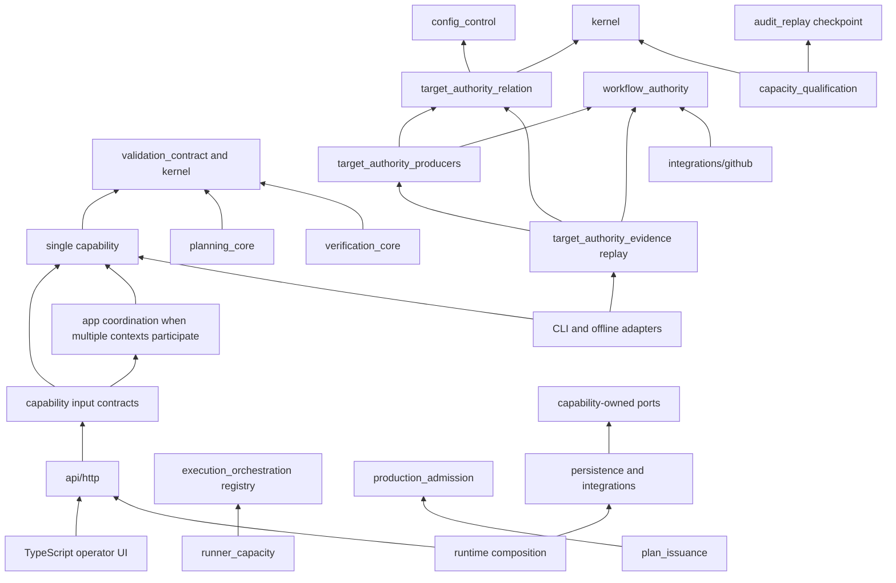

# Context Map

Status: current architecture boundary authority

Last verified: 2026-09-02

## 1. Purpose And Scope

This document owns the current semantic-to-physical boundary projection for the
Python backend. It applies the premises and system laws to the accepted modular
monolith; it does not claim that one package layout is universally necessary.

```text
Premises + Laws + CurrentForces + EnforcementCapabilities
  -> SelectedBoundaryProjection

SelectedBoundaryProjection -/-> UniversalArchitecture
```

The backend has one deployment owner and one authoritative PostgreSQL store.
Package boundaries therefore enforce semantic, trust, lifecycle, and provider
directions inside one process. They do not imply independent deployment.

## 2. Current Physical Projection

Every first-party top-level Python package is classified below:

```text
ci_coordinator/
  api/http/                    # transport adapter
  app/                         # cross-context application coordination
  agent_risk_advice/           # monotonic advisory capability
  audit_replay/                # evidence-ledger capability
  control_plane_identity/      # Keycloak identity and reviewer binding
  capacity_qualification/      # external capacity evidence admission
  ci_economics/                # retained CI evidence and exact measurement
  config_control/              # pure policy admission
  config_epochs/               # immutable policy lifecycle
  consumer_contract_lab/       # offline conformance adapter
  database_access_cli/         # offline database administration adapter
  execution_orchestration/     # target execution projection
  github_ingestion/            # trusted-event normalization
  governance_baseline/         # expected-governance authority
  governance_comparison/       # exact baseline relation
  governance_observation/      # provider governance evidence
  identity_admission/          # webhook and Actions identity trust
  integrations/                # provider anti-corruption adapters
    github/
    keycloak/
    oidc_jwks.py
  kernel/                      # minimal shared primitives
  observability/               # operational projection
  operator_controls/           # monotonic operator controls
  persistence/                 # PostgreSQL adapters and transactions
  plan_issuance/               # signed target plan issuance
  planning_core/               # deterministic validation selection
  production_admission/        # external evidence to opaque authority
  proposal_review/             # attested proposal receipt and activation authority
  provider_inventory/          # read-only provider catalog
  reconciliation/              # durable provider convergence
  replay_cli/                  # offline audit replay adapter
  repo_context/                # diff and dependency evidence
  runner_capacity/             # post-selection scheduling optimization
  runtime/                     # composition and process lifecycle
  runtime_settings/            # process-setting admission
  shadow_mode/                 # candidate-versus-baseline evidence
  target_artifacts/            # offline target-contract compiler
  target_authority_evidence/   # replayable dormant evidence and offline publication
  target_authority_producers/  # pure independent authority projections
  target_authority_relation/   # pure authority-transition relation
  validation_contract/         # closed obligation and depth algebra
  verification_core/           # independent plan verification
  workbench_read_models/       # bounded operator projections
  workflow_discovery/          # exact-snapshot workflow evidence
  workflow_authority/          # pure Git-object manifest and source binding
```

The TypeScript frontend is a presentation adapter compiled into the same
runtime artifact. Source-language and build separation do not grant it runtime
authority or an independent deployment contract.

## 3. Dependency Shape



Arrows mean admitted source dependency, not semantic equivalence. A remote
provider call retains latency, partial-failure, credential, rate-limit, and
consistency semantics even when accessed through a local protocol.

## 4. Hard Dependency And Authority Rules

- `planning_core`, `verification_core`, and `runner_capacity` remain pure
  Python and do not read clocks, process state, providers, or persistence.
- `target_authority_relation` owns only finite row, transition, total-domain,
  and exact-comparison semantics. It cannot import policy selection, provider,
  persistence, HTTP, runtime, environment, or clock mechanisms, and its
  successful outcome is explicitly unactivated.
- `workflow_authority` owns only exact Git-object identity, a stable complete
  workflow manifest, and exact source-binding evidence. GitHub transport
  depends inward on it; the pure package cannot depend on provider code.
- `target_authority_producers` may combine owner capabilities into attributed
  registration and observation projections, but cannot read providers,
  persistence, clocks, environment, HTTP, or runtime mechanisms. Observation
  enumeration accepts no baseline, transition, expected, or registration keys.
- `target_authority_evidence` replays the exact owner codecs, transition,
  producer outputs, source binding, and relation closure without production
  authority. Only its `file.py` and `cli.py` adapter edge may use filesystem
  mechanics; model, codec, and replay remain free of provider, persistence,
  HTTP, runtime, environment, clock, process, and filesystem authority.
- `validation_contract` depends only on the shared kernel and cannot import a
  decision, optimization, adapter, or transport context.
- `runner_capacity` may consume the static target registry owned by
  `execution_orchestration`; the reverse dependency is forbidden.
- `api/http/routers/*` contain transport policy only. Domain admission errors
  are produced by their semantic owner and translated by the router.
- `api/http` may define transport-shaped ports. A behavioral input port belongs
  to its single capability, or to `app` only when multiple contexts are
  orchestrated. Policy-free application pass-throughs are forbidden.
- `app` cannot import provider integrations, persistence implementations, or
  runtime composition and cannot duplicate capability-owned contracts.
- Domain packages cannot import FastAPI, SQLAlchemy, provider adapters,
  environment values, or runtime composition.
- SQLAlchemy models do not cross the persistence boundary. Pydantic HTTP
  representations are not domain models merely because they validate data.
- GitHub clients do not import planner, verifier, or success semantics.
- Agent risk advice cannot omit work, mutate providers, obtain credentials, or
  disable fallback.
- `production_admission` may consume pure subject projections but cannot import
  persistence, HTTP, provider, or runtime composition code.
- `capacity_qualification` admits externally signed capacity and audit-storage
  evidence without importing production authority, persistence, provider,
  HTTP, settings, or runtime composition. Its verified prerequisite is not a
  destructive retention capability.
- `plan_issuance` consumes only public opaque production authority and public
  reconciliation identity; authority never depends on issuance.
- Read models and provider inventories cannot mutate correctness state or
  create repository action authority.
- Governance observation, baseline, and comparison remain distinct authorities:
  observation reads current evidence, baseline owns approved expected state,
  and comparison owns exact relation evidence. None authorizes remediation or
  omission.
- Workflow discovery owns exact-snapshot evidence and conservative proposals.
  Proposal review owns one-use repository attestation and an immutable receipt;
  activation additionally requires a fresh GitHub App permission recheck and
  optimistic config concurrency.
- Control-plane identity proves Keycloak human or workload authority. GitHub
  reviewer evidence proves only the exact repository-bound attestation step;
  neither identity plane implies the other.
- `runtime_settings` admits values; only the composition root instantiates
  infrastructure.
- Offline CLIs and target compilers invoke admitted capabilities and cannot
  become parallel product-policy owners.

Mechanically decidable rules are enforced by the repository import-boundary and
ownership gates. Semantic rules retain requirement-bound native falsifiers.

The purity projection for `planning_core`, `verification_core`, and
`runner_capacity` admits a closed set of external data/type and calculation
imports in `scripts/python_import_boundary_policy.py`. It preserves
`datetime.datetime` and `datetime.timedelta` as data, but rejects explicit
clock-read methods and `kernel.clock`, `kernel.SystemClock`, and
`kernel.SystemMonotonicClock` authority. Qualified first-party references,
including import aliases and literal `getattr`, reach the same layer rules
as direct imports. Exact OS-capability file exceptions do not imply process
environment access: byte environment APIs and platform OS aliases retain
separate checks. Owners that prohibit dynamic loading also reject known
`__dict__`, `__globals__`, `__subclasses__`, and nested `sys.modules` paths.
The protected `httpx2` Import Linter contract remains part of the same gate;
legacy `httpx` denials remain valid source restrictions.

This is a bounded, flow-insensitive source-policy projection, not an execution
sandbox or a proof of arbitrary Python purity. It does not establish general
assignment-alias propagation, computed reflection, transitive re-export
provenance, callback effects, or the absence of effects inside admitted
dependencies. These remain semantic review and native-test obligations.

## 5. Ownership Projection

Not every package is a DDD bounded context. `Kind` states why a boundary exists;
`Law` names its minimum meta-specification constraint.

| Package or surface                                                          | Kind                                        | Canonical responsibility                                                                                                                                        | Law                     |
|-----------------------------------------------------------------------------|---------------------------------------------|-----------------------------------------------------------------------------------------------------------------------------------------------------------------|-------------------------|
| `api/http`                                                                  | transport adapter                           | Admit HTTP identity and bytes, invoke one input contract, project typed responses.                                                                              | MS-7, MS-10, MS-11      |
| `app`                                                                       | application coordination                    | Sequence only operations that span semantic owners or one transaction boundary.                                                                                 | MS-8, MS-10             |
| `kernel`                                                                    | shared kernel                               | Own minimal deterministic identity, canonicalization, ordering, clock, and result primitives.                                                                   | MS-8, MS-11             |
| `validation_contract`                                                       | shared domain contract                      | Own the closed obligation, depth, witness, and execution-profile algebras.                                                                                      | MS-1, MS-2, MS-3, MS-6  |
| `identity_admission`                                                        | trust context                               | Convert untrusted webhook or Actions identity evidence into bounded trusted values.                                                                             | MS-5, MS-10, MS-11      |
| `control_plane_identity`                                                    | trust context                               | Convert exact Keycloak evidence into role-bounded human or workload principals, opaque sessions, logout effects, and proposal-bound reviewer bindings.          | MS-7, MS-10, MS-11      |
| `capacity_qualification`                                                    | external evidence context                   | Admit one exact signed capacity epoch and verify audit-storage retention prerequisites without deployment or deletion authority.                                | MS-3, MS-8, MS-11       |
| `ci_economics`                                                              | evidence and measurement capability         | Collect bounded terminal attempt evidence, derive exact CI durations, and own finite retention without influencing omission safety.                             | MS-3, MS-8, MS-11       |
| `config_control`                                                            | pure policy context                         | Convert bounded source bytes into a deterministic admitted policy draft or typed diagnostic.                                                                    | MS-9, MS-11             |
| `config_epochs`                                                             | lifecycle context                           | Register, activate, and roll back immutable policy revisions.                                                                                                   | MS-8, MS-9, MS-11       |
| `github_ingestion`                                                          | ingestion context                           | Normalize trusted provider events with immutable provenance.                                                                                                    | MS-8, MS-11             |
| `repo_context`                                                              | evidence context                            | Produce complete diff and fresh graph evidence or an explicit incomplete result.                                                                                | MS-1, MS-3              |
| `planning_core`                                                             | pure decision capability                    | Select validation and create typed deterministic omission proofs.                                                                                               | MS-1, MS-3              |
| `target_authority_relation`                                                 | pure relation capability                    | Conserve pre-adoption target authority through an owner-approved transition and compare independently attributed complete row sets without activating omission. | MS-1, MS-3, MS-8, MS-11 |
| `workflow_authority`                                                        | pure evidence capability                    | Reconstruct a stable complete workflow-tree manifest and bind it separately to one exact source commit.                                                         | MS-3, MS-8, MS-11       |
| `target_authority_producers`                                                | pure projection capability                  | Derive owner registration from expected intent and independently enumerate observed authority without expected keys.                                            | MS-1, MS-3, MS-8, MS-11 |
| `target_authority_evidence`                                                 | evidence and offline-publication capability | Retain and replay one exact unactivated Stage C closure, then publish it atomically without minting runtime authority.                                          | MS-3, MS-8, MS-11       |
| `verification_core`                                                         | pure verification capability                | Independently validate proof coordinates and monotonic coverage.                                                                                                | MS-1, MS-2, MS-3, MS-4  |
| `agent_risk_advice`                                                         | advisory capability                         | Add risk or validation without acquiring omission authority.                                                                                                    | MS-2                    |
| `production_admission`                                                      | trust and capability context                | Admit exact external evidence into an opaque release-and-scope authority.                                                                                       | MS-3, MS-12             |
| `plan_issuance`                                                             | issuance context                            | Issue a signed run-bound plan or conservative fallback.                                                                                                         | MS-5, MS-8, MS-12       |
| `runner_capacity`                                                           | pure optimization capability                | Allocate already-selected work under admitted resource bounds.                                                                                                  | MS-6                    |
| `execution_orchestration`                                                   | execution-contract context                  | Derive target matrices, signals, and fallback contracts from verified plans.                                                                                    | MS-5, MS-12             |
| `reconciliation`                                                            | convergence context                         | Reconcile exact persisted intent with provider observations without inventing success.                                                                          | MS-4, MS-5, MS-8        |
| `shadow_mode`                                                               | evidence context                            | Compare candidate selection with full-validation outcomes without authority promotion.                                                                          | MS-1, MS-3, MS-8        |
| `audit_replay`                                                              | evidence-ledger context                     | Verify and replay an append-only bounded evidence stream.                                                                                                       | MS-8, MS-11             |
| `operator_controls`                                                         | control context                             | Force FullCI or monotonically disable and governedly restore omission.                                                                                          | MS-3, MS-7, MS-9        |
| `workbench_read_models`                                                     | query capability                            | Return authorized, bounded, stable, redacted evidence projections.                                                                                              | MS-7, MS-8              |
| `provider_inventory`                                                        | provider query capability                   | Return authorized installation and repository visibility without action authority.                                                                              | MS-7, MS-10             |
| `governance_observation`                                                    | provider evidence capability                | Observe bounded active governance without baseline or policy classification.                                                                                    | MS-7, MS-8              |
| `governance_baseline`                                                       | expected-state authority                    | Append an explicitly approved expected governance state.                                                                                                        | MS-7, MS-8, MS-11       |
| `governance_comparison`                                                     | pure relation capability                    | Compare one stable baseline with one fresh observation exactly.                                                                                                 | MS-7, MS-8              |
| `workflow_discovery`                                                        | provider evidence capability                | Build a closed exact-commit workflow ledger and conservative proposal.                                                                                          | MS-3, MS-7, MS-12       |
| `proposal_review`                                                           | control capability                          | Consume one repository-bound reviewer transaction, retain one exact proposal receipt, and bind a fresh permission recheck to config activation.                 | MS-7, MS-8, MS-9        |
| `observability`                                                             | operational projection                      | Expose bounded redacted health, readiness, metrics, and diagnostics.                                                                                            | MS-3, MS-10             |
| `runtime_settings`                                                          | composition support                         | Admit process configuration and lifecycle bounds without constructing adapters.                                                                                 | MS-10, MS-11            |
| `persistence`                                                               | infrastructure adapter                      | Enforce transactions, uniqueness, compare-and-swap, and schema compatibility.                                                                                   | MS-8, MS-9, MS-11       |
| `integrations/github`, `integrations/keycloak`, `integrations/oidc_jwks.py` | provider adapters                           | Translate bounded remote protocols into typed results and unavailable states.                                                                                   | MS-3, MS-5, MS-10       |
| `runtime`                                                                   | composition and lifecycle                   | Wire admitted implementations and enforce fail-closed startup and shutdown.                                                                                     | MS-3, MS-10             |
| `target_artifacts`                                                          | offline compiler adapter                    | Deterministically render target-owned artifacts from one admitted source.                                                                                       | MS-5, MS-11, MS-12      |
| `consumer_contract_lab`                                                     | offline verifier adapter                    | Verify a consumer against one immutable coordinator source image without runtime authority.                                                                     | MS-10, MS-12            |
| `database_access_cli`                                                       | operations adapter                          | Install and attest bounded database access without becoming runtime policy.                                                                                     | MS-8, MS-10, MS-11      |
| `replay_cli`                                                                | offline query adapter                       | Stream admitted replay results without acquiring ledger authority.                                                                                              | MS-8, MS-10             |
| TypeScript operator UI                                                      | presentation adapter                        | Admit and display scoped evidence and request governed commands.                                                                                                | MS-7, MS-10, MS-11      |

## 6. Why Planning And Capacity Are Separate Today

Applicable invariant: capacity cannot change validation coverage (`MS-6`).
The following bounded alternative set covers the currently credible source,
process, and service boundary strengths; it is not a claim over every future
implementation technique:

| Alternative                                                    | Correctness                                                                                                                     | Enforcement                                            | Complexity                                                                 |
|----------------------------------------------------------------|---------------------------------------------------------------------------------------------------------------------------------|--------------------------------------------------------|----------------------------------------------------------------------------|
| One module with private functions                              | Behaviorally possible, but a source-level dependency gate cannot prevent later capacity-to-coverage coupling inside the module. | Review and tests only.                                 | Lowest file count, weaker current enforcement.                             |
| One package with private submodules and a directional AST rule | Can enforce the same import direction if re-exports and indirect imports are also closed.                                       | A bespoke path-sensitive rule plus behavior witnesses. | Similar file count, plus a technical parent with no shared semantic owner. |
| Separate packages in one process                               | Preserves one deployment while the import gate forbids the reverse edge.                                                        | Existing static gate plus native behavior witnesses.   | Small package-boundary cost.                                               |
| Separate services                                              | Can isolate failure and scaling, but introduces a remote protocol, partial failure, deployment, and observability obligations.  | Strongest boundary.                                    | Unjustified under PA-8.                                                    |

No considered alternative strictly dominates separate packages under the
current ownership and enforcement mechanisms. A private-submodule rule can be
equally strong, but it requires a bespoke exception and introduces a parent
package without shared semantics; it therefore does not reduce the stable
responsibility or enforcement set. Separate packages retain the already
enforced owner boundary without a remote protocol. This is a context-relative
selection, not a global optimality proof. Revisit it if a lower-cost boundary
demonstrates equal enforcement, or if independent deployment, scaling,
availability, ownership, or data authority is adopted.

## 7. Non-Claims And Revision

This map does not claim that:

- source independence proves semantic or operational independence;
- a `Protocol`, repository class, DTO, or use-case class is mandatory;
- every package is a bounded context or aggregate;
- local calls are equivalent to provider calls; or
- current boundaries are optimal after material ownership or deployment change.

Revise this map after adding or removing a top-level production package,
changing an authority owner, reversing an admitted first-party dependency, or
adopting a different deployment or data-authority boundary.
