# Dataflow And State Machines

Status: runtime flow specification

Last verified: 2026-08-31

## 1. Purpose

This document owns CI Coordinator's high-level dataflow and critical state
machines. Module internals are owned by `modules/*.md`.

## 2. Plan Request Dataflow

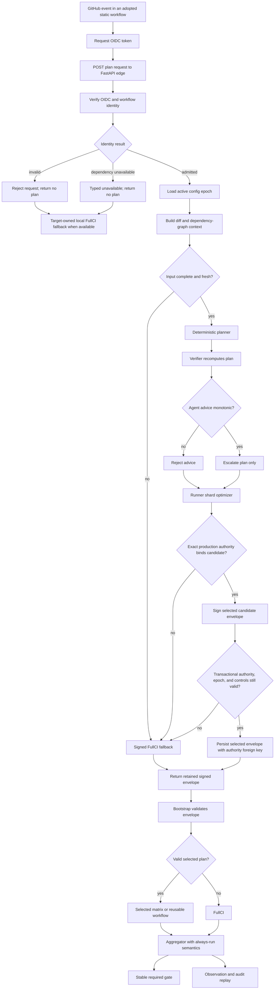

The local fallback after an invalid credential or unavailable identity provider
is owned by the adopted target workflow. It is not a server-signed plan. A
server-signed FullCI envelope exists only after request identity is admitted.

## 3. Config Admission And Epoch State

Admission is a pure terminating flow. Failed input creates no durable candidate:

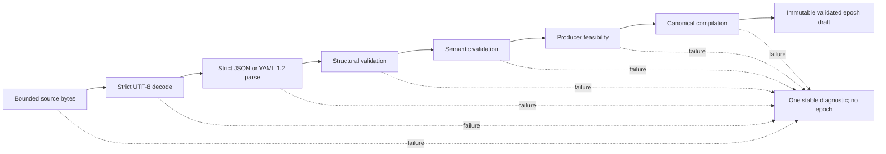

Epoch lifecycle is owned by the implemented config-epoch, persistence, and
operator-control specifications rather than policy admission:

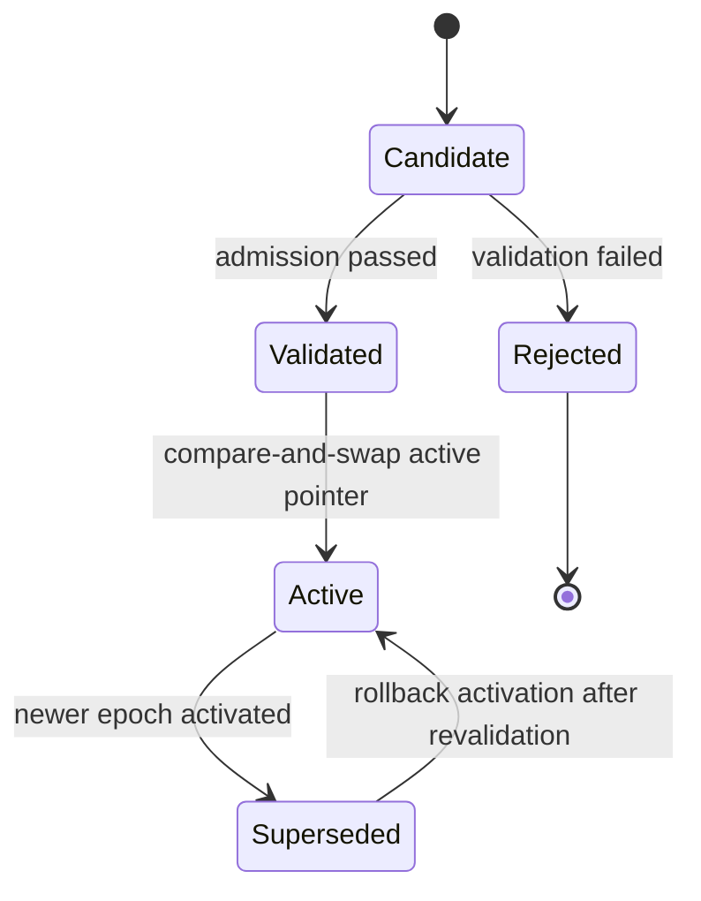

Rules:

```text
Candidate is a transient admission state, not a durable entity.
Policy admission creates only an immutable validated draft and no durable candidate.
Existing epoch is immutable.
Active pointer changes only transactionally.
Rollback activates an epoch through a new audited transition.
Every plan uses exactly one config epoch snapshot.
```

## 4. Plan State Machine

```mermaid
stateDiagram-v2
  [*] --> Requested
  Requested --> Admitted: identity verified
  Requested --> Rejected: invalid request or identity; no plan
  Requested --> Unavailable: identity dependency unavailable; no plan
  Admitted --> ContextBuilt: diff, graph, catalog, config resolved
  Admitted --> SignedFallback: context stale, unknown, incomplete, or invalid
  ContextBuilt --> Planned: deterministic plan computed
  Planned --> Verified: verifier accepts recomputed plan
  Planned --> SignedFallback: verifier rejects
  Verified --> SignedSelected: enforcement gate allows selected execution
  Verified --> SignedFallback: enforcement disabled or rollout gate blocks
  SignedSelected --> Observed
  SignedFallback --> Observed
  Observed --> Replayed
  Rejected --> [*]
  Unavailable --> [*]
```

## 5. Production Admission And Issuance

Startup authority flow:

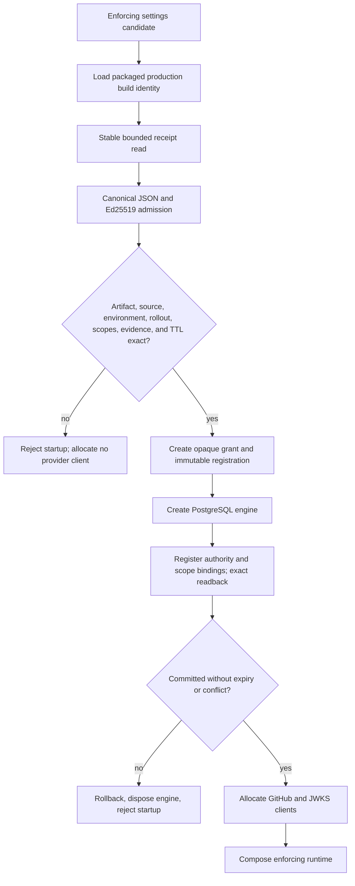

Request-time selected issuance flow:

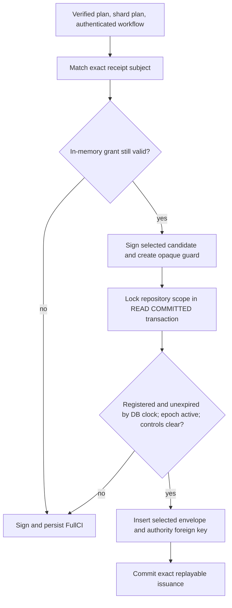

The first flow authenticates one process-lifetime capability. The second
linearizes every durable selected effect against current database-owned facts.
Neither flow implies that the external signer followed its evidence procedure.

### 5.1 Dormant Target-Authority Evidence Retention

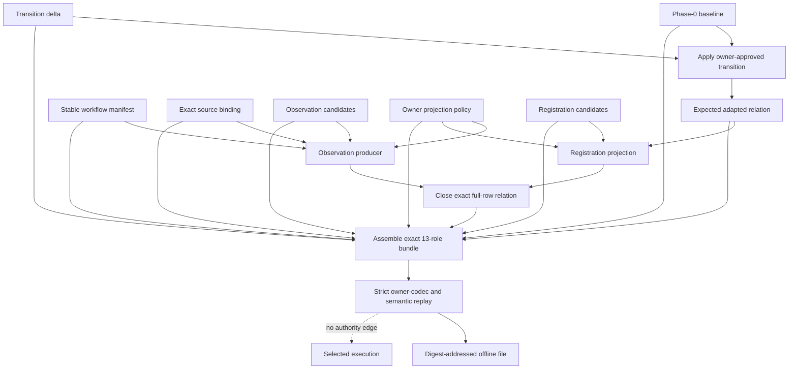

Publication is a separate mechanism state machine:

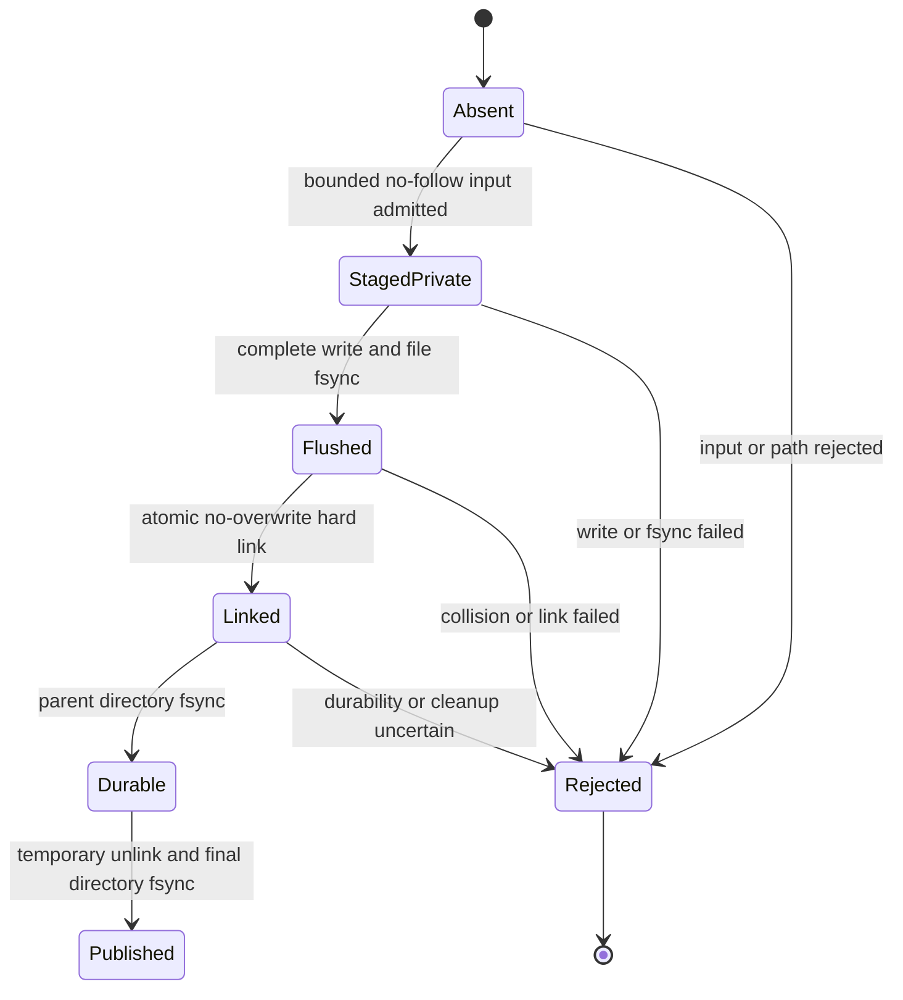

Only `Published` returns an affirmative offline receipt. A complete final file
left by a crash remains inert evidence and is never interpreted as production
authority.

## 6. Database Compatibility State Machine

Schema history and deployment lifecycle are orthogonal. A database revision
transition changes the declared capability state; a deployment event changes
which binaries execute. Neither event is silently projected onto the other.

Revision-chain machine:

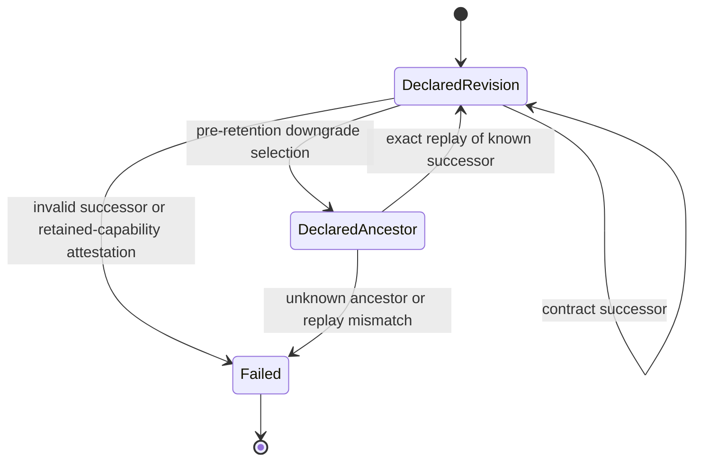

Deployment-lifecycle machine:

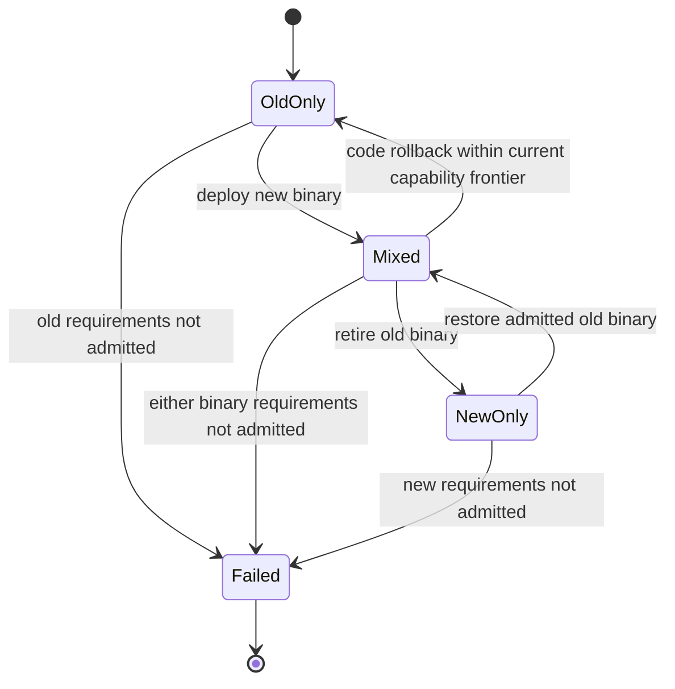

The valid system state is the product of these machines subject to the profile
admission predicate. A schema transition does not imply deployment progress,
and code rollback does not create a schema transition.

Application transaction flow:

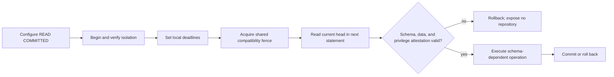

Bounded workbench snapshot flow:

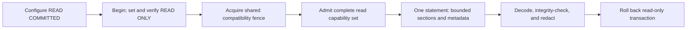

Online migration flow acquires the same key in exclusive mode at the Alembic
environment boundary before head inspection or `run_migrations()`, then commits
DDL, one forward declaration, and Alembic-head movement atomically. Downgrade
selects an existing ancestor without appending. Startup readiness projects the
same admission predicate but never replaces the per-transaction check.

## 7. Provider Inventory Dataflow

```mermaid
flowchart LR
  ADMIN["Keycloak administrator with read role"] --> SESSION["Unexpired opaque server session"]
  SESSION --> APP["GitHub App installation inventory"]
  APP --> DECODE["Strict bounded decoder"]
  DECODE --> CATALOG["Complete or explicit partial installation catalog"]
  CATALOG --> SELECT["Selected active organization installation"]
  SELECT --> PAGE["Bounded user-visible repository page"]
  PAGE --> UI["Exact visible repository shown without mutation authority"]
```

Invariant:

```text
CatalogVisible(actor, repository)
does not imply WorkbenchAuthorized(actor, repository)
does not imply Configured(repository)
does not imply Enforcing(repository)
```

Each provider page is one observation, not snapshot isolation. Contradictory
totals, malformed next-page evidence, installation mismatch, ineligible
repositories, and provider failures remain typed non-success outcomes. A
Keycloak read role and GitHub App installation visibility are both required;
neither supplies repository-review or config-activation authority.

### 7.1 Exact-Commit Workflow Discovery

```mermaid
flowchart LR
  SELECT["Authorized repository selection"] --> AUTH["Exact scope authorization"]
  AUTH --> COMMIT["Resolve or admit exact commit"]
  COMMIT --> TREES["Non-recursive Git tree chain"]
  TREES --> BLOBS["Content-addressed workflow blobs"]
  BLOBS --> PARSE["Bounded non-executing YAML projection"]
  PARSE --> LEDGER["Assertion or unknown for every predicate"]
  LEDGER --> GRAPH["Same-snapshot local call graph"]
  GRAPH --> PROPOSAL["Observe-only admitted proposal or blockers"]
  PROPOSAL --> UI["Discovery progressive disclosure"]
```

Invariant:

```text
AuthorizedExactSnapshot
and ClosedPredicateLedger
and UniqueStaticProviderSignal
and ExistingPolicyAdmission
  => ReviewableObserveOnlyProposal

otherwise => ExplicitUnknownOrBlocker
```

The response is request-scoped and stateless. Review, registration,
activation, provider mutation, and omission authority are absent from this
state machine.

### 7.2 Repository Attestation And Proposal Review

```mermaid
flowchart LR
  CMD["Scope, operation, manifest, and active baseline"] --> SESSION["Keycloak configure role + Origin + CSRF"]
  SESSION --> SCAN0["Re-run current-head discovery"]
  SCAN0 --> BIND["Bind one-use transaction to session + exact proposal"]
  BIND --> OAUTH["GitHub OAuth code + PKCE reviewer step-up"]
  OAUTH --> GRANT["Fresh maintain-or-admin evidence"]
  GRANT --> REPLAY{"Exact operation retained?"}
  REPLAY -- "yes" --> DUP["Return retained acceptance"]
  REPLAY -- "no" --> BASE["Read active epoch and revision"]
  BASE --> SCAN["Reproduce current-head proposal"]
  SCAN --> MATCH{"Manifest reproduced?"}
  MATCH -- "no" --> STOP["Blocked or stale; no write"]
  MATCH -- "yes" --> DIFF["Bounded normalized-policy diff"]
  DIFF --> TX["Scope-locked PostgreSQL transaction"]
  TX --> CHECK{"Pending transaction and active baseline still exact?"}
  CHECK -- "no" --> STOP
  CHECK -- "yes" --> COMMIT["Consume transaction + register epoch + receipt + audit"]
```

Invariant:

```text
KeycloakConfigureAuthority
and OneUseRepositoryReviewerAttestation
and ExactOperationOrFreshCurrentProposal
and ABAResistantActiveBaseline
and BoundedSemanticDiff
  => DuplicateOrAtomicNonActivatingRegistration

otherwise => NoAttemptedDurableEffect
```

The provider observation and database transaction cannot be globally atomic.
The retained record therefore names the exact reviewed revision, transaction,
reviewer, permission, issue time, observation time, and expiry. Activation is a
separate command requiring the Keycloak `activate` role, unchanged proposal
identity, optimistic config concurrency, and a fresh GitHub App recheck of the
retained reviewer's current permission.

### 7.3 Exact Governance Comparison

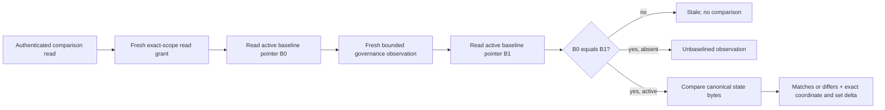

Invariant:

```text
FreshReadAuthority
and StableExactBaselinePointer
and FreshBestEffortObservation
and SameRepositoryScope
  => UnbaselinedOrExactByteRelation

otherwise => TypedNonSuccess
```

The comparison excludes observation time and uses complete canonical rule bytes
as set members. It does not pair two unequal rules as one semantic
modification. `matches` is byte equality against one approved expected state,
not compliance, provider snapshot truth, enforcement, release readiness, or
omission authority.

### 7.4 Dormant Target-Authority Producers

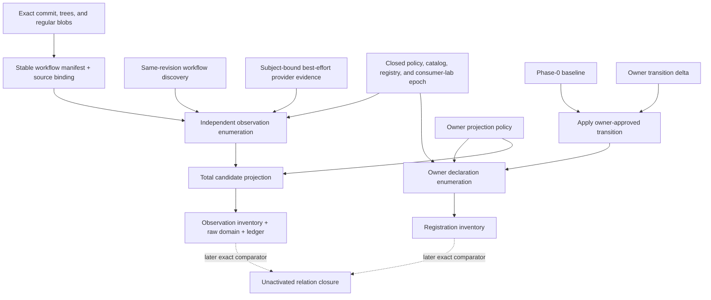

```text
RegistrationKeys derive from U.
ObservationKeys derive from Git, discovery, target artifacts, and provider evidence.
ObservationEnumeration does not consume B, D, U, R, or their keys.
Any unknown or mismatch prevents later relation closure.
```

The current flow is pure and dormant. It does not capture a production
baseline, persist evidence, sign a receipt, fence a cutover generation, or
activate omission.

## 8. Runner Shard Dataflow

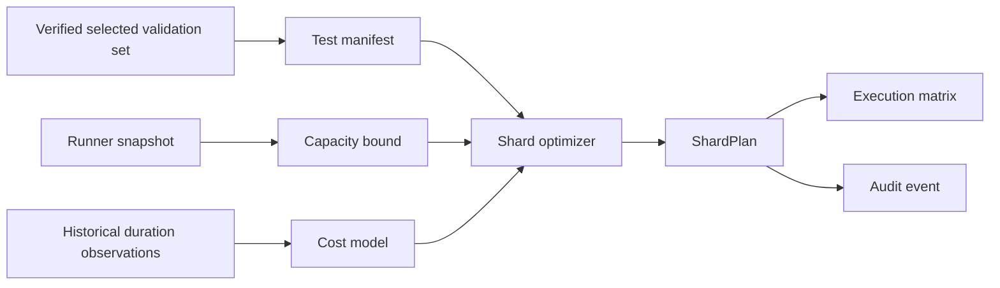

Invariant:

```text
Runner capacity can alter shard count and max parallelism.
Runner capacity cannot alter the selected validation set.
```

## 9. Audit Replay Flow

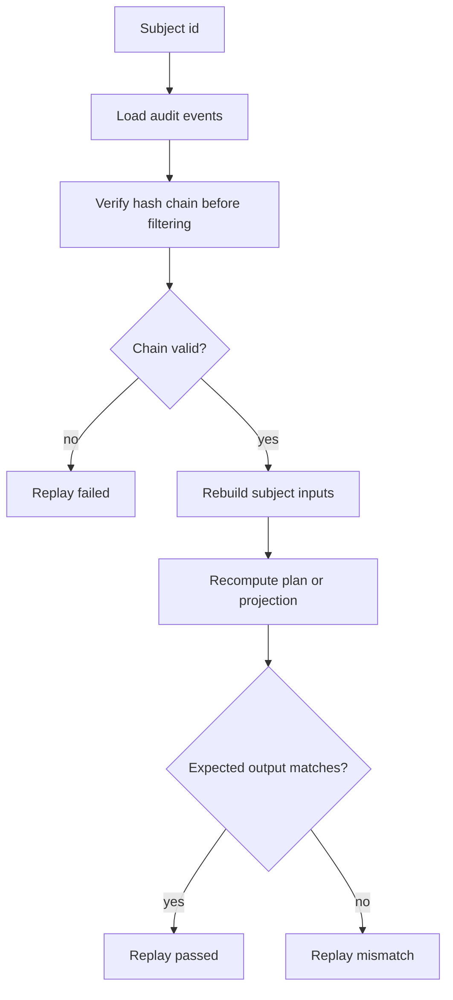

Hash-chain verification must happen before subject filtering. Otherwise a
corrupted event outside the filtered view could be hidden from replay.
