# Architecture Overview

Status: derived visual projection

Last verified: 2026-08-30

## 1. Purpose and Authority

This document is the progressive-disclosure entry point for CI Coordinator's
architecture. It owns no durable product invariant. Each diagram projects facts
owned by the specification named below it. If a projection conflicts with an
owner, the owner is authoritative and this overview is defective.

That rule prevents a visual guide from becoming a second, drifting
specification:

```text
OneFact -> OneOwner
OverviewFact -> Reference(OwnerFact)
Conflict(OverviewFact, OwnerFact) -> Reject(OverviewFact)
```

The proof graph starts with [premises](00-system-axioms.md), adopted
[system laws](01-meta-specification.md), and the current
[context map](02-context-map.md). Dataflow, module contracts, and cross-cutting
contracts then contribute explicit acyclic edges into machine requirements and
executable witnesses; they are not a universal total order. The authoritative
graph is routed by the [specification index](INDEX.md).

## 2. System Context

CI Coordinator is a control plane between GitHub evidence and repository-owned
CI. It may select or shape work only from admitted evidence. A missing,
ambiguous, stale, or contradictory input maps to FullCI.

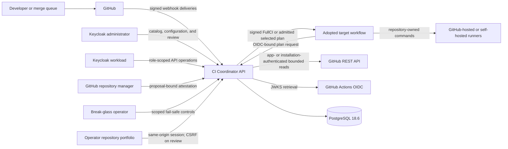

Current boundary: the service is runnable in disabled, non-enforcing, or
receipt-gated enforcing mode. It never centrally dispatches runner work or
publishes coordinator success; the target workflow remains the execution owner.
Enforcing mode may issue a selected matrix only for the exact durably registered
production authority and request-time transactional guard. The current control
plane uses Keycloak human and workload identity, GitHub App provider reads, and
one-use GitHub reviewer attestation for proposal review and explicit activation.
It also provides repository proof projection, exact-commit workflow discovery,
expected-governance baseline approval, and read-only governance comparison.
Review, activation, baseline approval, and comparison remain separate
capabilities; none mutates the provider, centrally dispatches work, proves
current compliance, or independently grants omission authority.

Owners: [system laws](01-meta-specification.md),
[GitHub Actions semantics](cross-cutting/github-actions-semantics.md), and
[runtime composition](modules/runtime-composition.md). The admitted architecture
style and future same-store UI CQRS are owned by the
[backend architecture decision](../decisions/backend-architecture-style.md).

## 3. Trust Boundaries

Every external byte is untrusted until its owning admission function succeeds.
Secrets are consumed only by the composition root and are absent from domain
contracts, error projections, and logs.

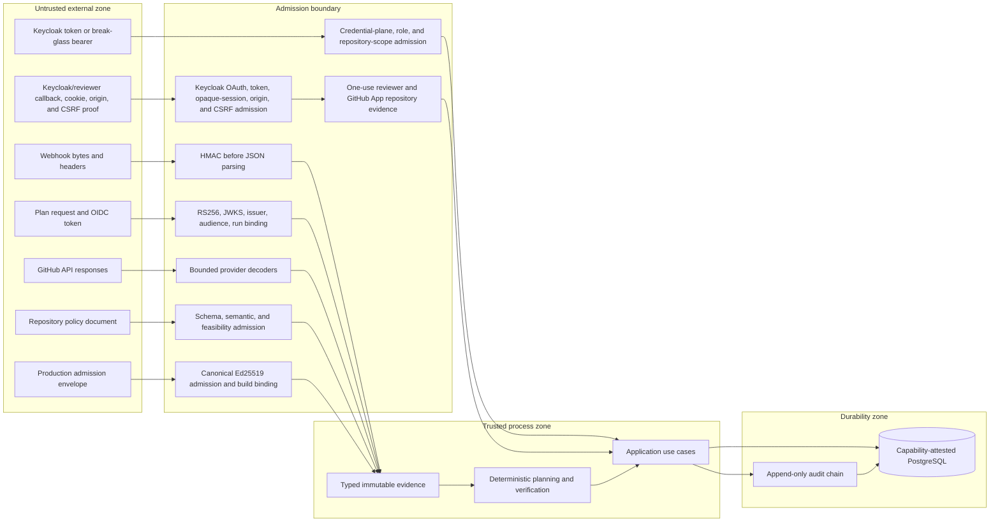

Owners: [security and OIDC](cross-cutting/security-and-oidc.md),
[identity admission](modules/identity-admission.md),
[config control](modules/config-control.md),
[GitHub integration](modules/github-integration.md), and
[persistence](modules/persistence.md).

## 4. Internal Component Topology

The backend is a contract-first modular monolith. Dependency direction follows
policy ownership, not request flow: infrastructure implements ports owned by
application or domain contexts; domain code never imports transport or
infrastructure.

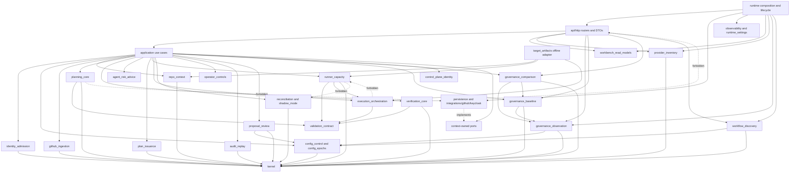

The planner answers what validation is required. The capacity optimizer answers
how already selected validation should be distributed. Their current package
boundary and reverse-import prohibition mechanically prevent one source-level
capacity-to-coverage dependency; requirement-owned behavior witnesses are still
needed to prove that runner scarcity cannot reduce coverage at runtime.

Owners: [context map](02-context-map.md) and the corresponding
[module specifications](INDEX.md#5-module-specifications).

## 5. Dynamic Plan Dataflow

The current runtime has two connected authority paths. Non-enforcing mode
always issues FullCI and retains candidate omissions as shadow evidence.
Enforcing mode may issue selected execution only after startup receipt
admission and durable registration plus a request-time transactional recheck.

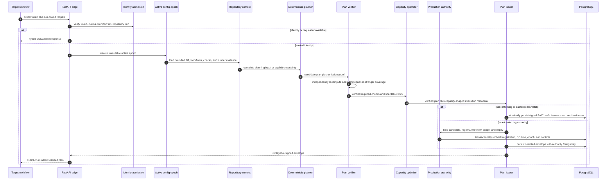

The safety implication is:

```text
IncompleteEvidence or InvalidIdentity or FailedDependency or DisabledEnforcement
  -> FullCI or TypedUnavailable
  -> not ReducedCoverage
```

Owners: [dataflow and state machines](03-dataflow-and-state-machines.md),
[planning core](modules/planning-core.md),
[runner capacity](modules/runner-capacity.md), and
[plan issuance](modules/plan-issuance.md).

### 5.0 Organization Control Plane

The following is the as-built authority topology. Identity proves a principal
and roles; capability owners retain business admission; provider credentials
perform only exact provider operations.

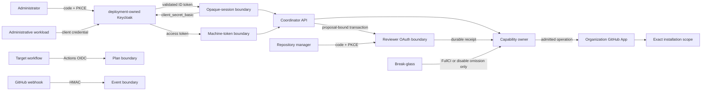

Owner: [organization control plane](cross-cutting/organization-control-plane.md).

### 5.1 Provider Inventory Dataflow

The catalog admits a Keycloak human session or workload token with the `read`
role, then uses only deployment-owned GitHub App and installation credentials
for provider reads. No GitHub user token is retained. Catalog visibility remains
independent from repository attestation and action authority.

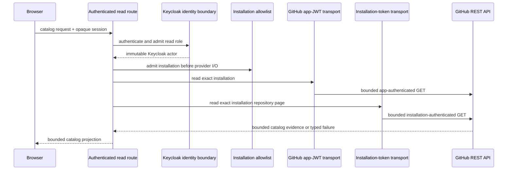

Owner: [provider inventory](modules/provider-inventory.md).

### 5.2 Workflow Discovery Dataflow

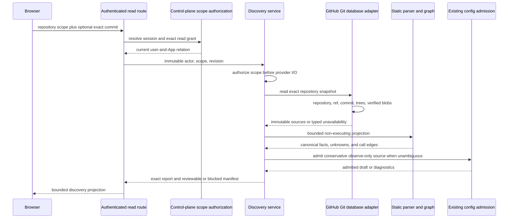

No arrow in this flow reaches epoch registration, activation, workflow
dispatch, provider mutation, or omission authority. Owner:
[workflow discovery](modules/workflow-discovery.md).

#### 5.2.1 Dormant Target-Authority Evidence

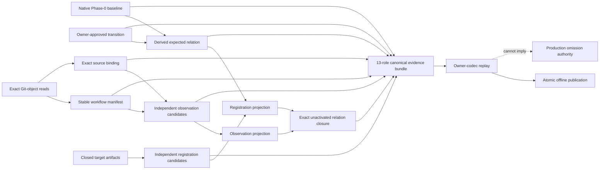

The observation key domain is derived without baseline, transition, expected,
or registration keys. Registration intentionally derives owner intent from the
expected relation and separately enumerated target declarations. The two
outputs close by canonical full-row bytes. The retained bundle replays that
closure and may be published only as an offline content-addressed artifact;
neither replay nor publication provides persistence, signer, runtime, or
production authority.

Owners: [workflow authority](modules/workflow-authority.md),
[target-authority producers](modules/target-authority-producers.md), and
[target-authority relation](modules/target-authority-relation.md). Retention
and offline publication are owned by
[target-authority evidence](modules/target-authority-evidence.md).

### 5.3 Governance Observation Dataflow

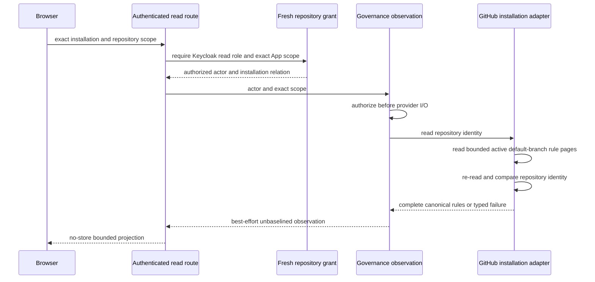

No arrow persists a baseline, classifies compliance or drift, or reaches a
provider mutation. Owner:
[governance observation](modules/governance-observation.md).

### 5.4 Governance Baseline Approval Dataflow

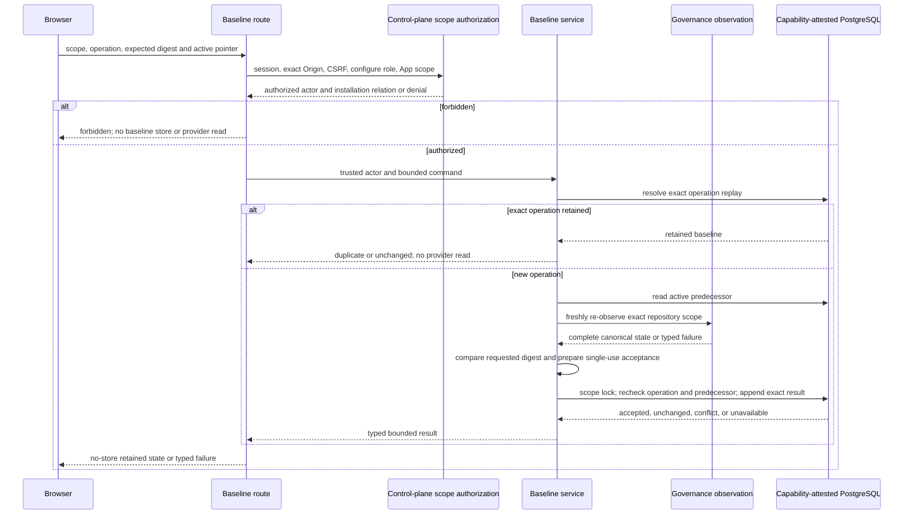

The provider read and database transaction are not one snapshot. The command
therefore binds the exact observed state digest, while the transaction
independently revalidates the complete predecessor pointer. The resulting
artifact is expected state, not evidence of current compliance. Owner:
[governance baseline](modules/governance-baseline.md).

### 5.5 Proposal Review Registration Dataflow

A Keycloak session establishes control-plane identity. A separate one-use
GitHub step-up establishes repository-manager authority for one exact
proposal; neither identity substitutes for the other.

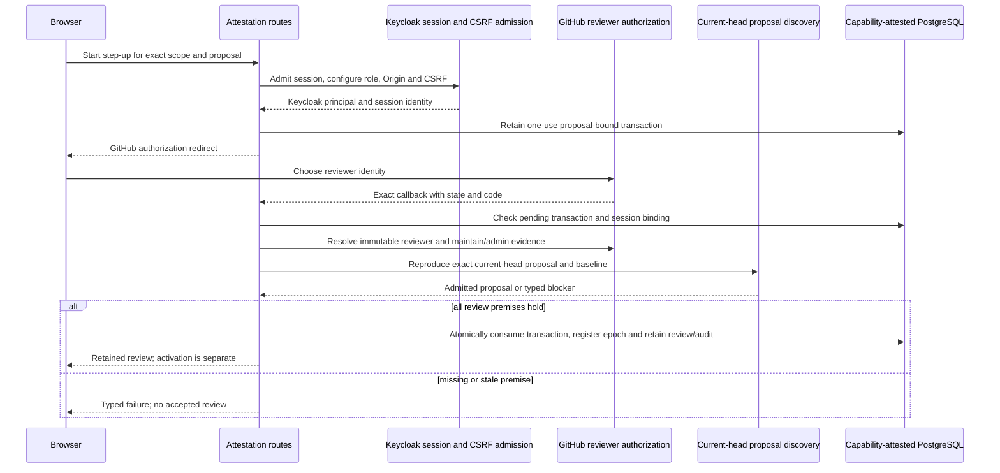

The GitHub user token is discarded after its bounded operation; it does not
become a durable browser session. Provider observation and PostgreSQL commit
are not globally atomic. Later activation rechecks proposal identity, active
baseline and fresh reviewer permission. Owners:
[control-plane identity and repository attestation](modules/control-plane-identity-and-repository-attestation.md)
and [proposal review registration](modules/proposal-review-registration.md).

## 6. State and Transaction Ownership

The boxes below are logical ownership surfaces inside one PostgreSQL boundary,
not separate databases. A use case owns a transaction; repositories do not
commit independently.

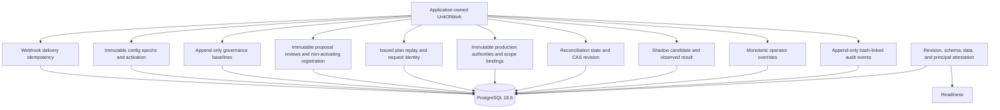

Owners: [persistence](modules/persistence.md),
[database compatibility](cross-cutting/database-compatibility.md),
[audit replay](modules/audit-replay.md), and
[operator controls](modules/operator-controls.md).

## 7. Process Lifecycle and Failure Containment

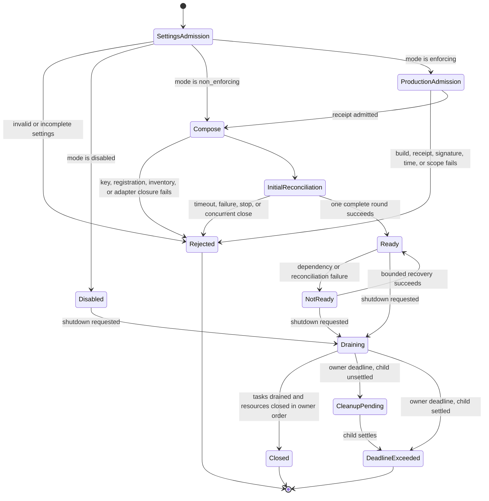

Disabled mode is live but intentionally not ready. Both connected modes become
ready only after dependency probes and initial reconciliation succeed;
enforcing composition additionally requires exact durable authority
registration before provider clients exist. Shutdown has one lifecycle owner
per resource and a bounded drain.

Owner: [runtime composition](modules/runtime-composition.md).

## 8. Deployment Boundary

This is a logical deployment projection, not an admission of a particular
platform, replica count, availability target, backup policy, or capacity. Those
facts remain external deployment-owner evidence.

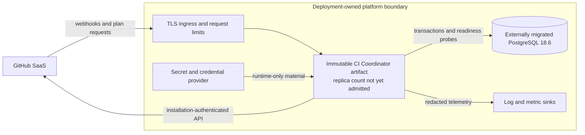

The service image owns process behavior. The deployment owns TLS termination,
network policy, secret delivery, database migration execution, artifact
identity, cardinality, and rollout. PostgreSQL concurrency contracts permit
cooperating processes, but that fact alone does not prove a horizontally scaled
deployment is operable or available.

Owners: [runtime settings](modules/runtime-settings.md),
[runtime composition](modules/runtime-composition.md),
[database compatibility](cross-cutting/database-compatibility.md), and the
[production admission contract](cross-cutting/production-admission.md).

## 9. Runtime Authority And External Admission

Python is the sole repository-owned backend runtime. Local implementation
completion is still not production authority: deployment requires external
evidence tied to one immutable artifact and target repository.

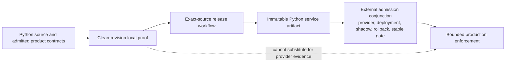

Therefore:

```text
LocalProof and not ExternalAdmissionConjunction
  -> ProductionEnforcementForbidden
```

Owners:
[release artifact publication](cross-cutting/release-artifact-publication.md)
and [production admission](cross-cutting/production-admission.md).

## 10. Local Development Projection

Concurrent worktrees use one topology with independent identities rather than
forking the application architecture or reserving host ports in advance.

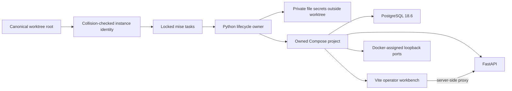

Owner: [local development environment decision](../decisions/local-development-environment.md)
and [developer environment requirements](../specs/ci-coordinator-developer-environment/overview.md).

## 11. Diagram Coverage

The diagram set is complete for architectural orientation when a reader can
answer nine independent questions without inferring an unstated boundary.

| Question                                                                                               | Projection                        | Detailed owner                                  |
|--------------------------------------------------------------------------------------------------------|-----------------------------------|-------------------------------------------------|
| Who interacts with the system?                                                                         | System context                    | meta-specification                              |
| Where does trust change?                                                                               | Trust boundaries                  | security and identity specs                     |
| Which component owns each decision?                                                                    | Component topology                | context map and module specs                    |
| How does a plan move end to end?                                                                       | Dynamic plan dataflow             | dataflow and state machines                     |
| How are organization identity, repository consent, provider authority, and emergency safety separated? | Target organization control plane | organization control-plane contract             |
| Where is durable state committed?                                                                      | State and transaction ownership   | persistence specs                               |
| How is the artifact connected without claiming a deployment?                                           | Deployment boundary               | runtime, database, and external-admission specs |
| When may the runtime claim readiness or authority?                                                     | Lifecycle and migration gates     | runtime and production-admission specs          |
| How is a connected developer instance reproduced and isolated?                                         | Local development projection      | local environment decision and requirements     |

Detailed epoch, transaction, plan, database revision, shard, and replay state
machines remain in [Dataflow and State Machines](03-dataflow-and-state-machines.md).
Repeating them here would increase drift without adding a new orientation plane.
