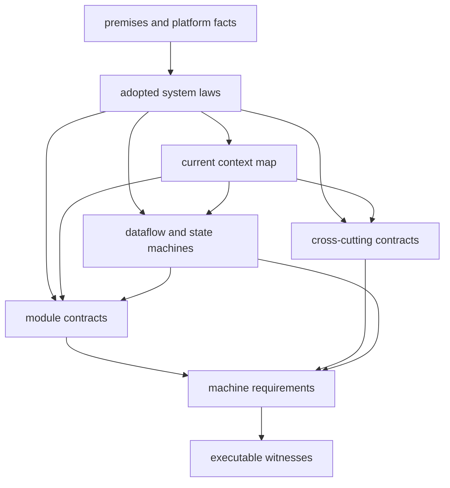

# Architecture and Contract Owners

Status: architecture and specification authority router

Last verified: 2026-09-02

Current offline refinement: [isolated Node executable admission](../features/isolated-node-executable-admission.md)
owns the consumer laboratory's narrow tool-selection environment reader;
`runtime/environment.py` remains the sole production runtime reader.

Current verification-cache refinement: [response-owned freshness](../features/refresh-result-freshness.md)
and its [implementation plan](../features/refresh-result-freshness-implementation-plan.md).

Current identity-cache retry refinement: [Keycloak refresh failure budget](../features/keycloak-refresh-failure-budget.md)
owns bounded failed-load admission while preserving positive-cache freshness
and exact trust-source checks.

Current lifecycle refinement: [bounded runtime recovery](../features/bounded-runtime-recovery.md)
owns nonblocking receipt-file admission and post-startup maintenance independence;
startup authority, operation budgets and durable retention rules remain unchanged.

Current frontend source admission: [transport ownership](../features/frontend-transport-ownership.md)
constrains the declared browser request initiators and global-object syntax.

Current proof refinement: [causal proof oracles](../features/causal-proof-oracles.md)
binds session lock timing, Node signature rejection and pytest mutation outcomes
without changing runtime admission policy.

Current CI qualification: [comprehensive CI matrix](../decisions/comprehensive-ci-matrix.md)
owns native command/input closure and self-consumer parity.
[Proofkit adoption](../specs/ci-coordinator-proofkit-adoption/overview.md) records
the current dependency contract evaluation.

[Pending semantic review](../features/ci-pending-semantic-review.md) provides
source-bound candidate associations without changing execution selection.

## 1. Purpose

This package routes the backend, explicitly marked planned extensions, and the
production admission boundary by an acyclic proof graph rather than file
discovery:



Module and cross-cutting contracts are peer authority classes. A specific
cross-cutting contract may constrain many modules, while a module contract may
introduce facts consumed by a later cross-cutting contract. The explicit edge
must remain acyclic; neither class universally precedes the other.

The shortest projection of system laws MS-1 through MS-3 is:

```text
Deterministic proof may reduce work.
Agent advice may only increase validation.
Uncertainty runs FullCI or produces an explicit failure.
```

## 2. Why This Dependency Graph Is Necessary

For each module `M`:

```text
ExecutableWitness(r) requires ActiveRequirement(r) and OwningContract(r).
OwningContract(r) requires ApplicableLaw(r) and ExplicitContext(r).
ApplicableLaw(r) requires ValidPremises(r) and OwnerAdoption(r).
Therefore premises precede laws, laws and context precede contracts,
and requirements plus contracts precede executable witnesses.
```

This proves the partial order above, not a total order among every module,
cross-cutting contract, and dataflow projection.

[ARCHITECTURE.md](ARCHITECTURE.md) is the visual projection of this graph. It
does not own a second copy of durable facts. [ROADMAP.md](../../ROADMAP.md) owns
future capability order, while this package owns backend structure and proof.

## 3. Authority Map

| Surface                                                                             | Authority                                                                                                                                                                                                                                                         |
|-------------------------------------------------------------------------------------|-------------------------------------------------------------------------------------------------------------------------------------------------------------------------------------------------------------------------------------------------------------------|
| System premises, platform facts, and non-claims                                     | [00-system-axioms.md](00-system-axioms.md)                                                                                                                                                                                                                        |
| System laws and architecture constraints                                            | [01-meta-specification.md](01-meta-specification.md)                                                                                                                                                                                                              |
| Context ownership and import direction                                              | [02-context-map.md](02-context-map.md)                                                                                                                                                                                                                            |
| End-to-end flows and state machines                                                 | [03-dataflow-and-state-machines.md](03-dataflow-and-state-machines.md)                                                                                                                                                                                            |
| Visual navigation                                                                   | [ARCHITECTURE.md](ARCHITECTURE.md)                                                                                                                                                                                                                                |
| Module behavior                                                                     | `modules/*.md`                                                                                                                                                                                                                                                    |
| Cross-cutting invariants                                                            | `cross-cutting/*.md`                                                                                                                                                                                                                                              |
| Production admission                                                                | [production-admission.md](cross-cutting/production-admission.md)                                                                                                                                                                                                  |
| CI trigger and release gate event policy                                            | [ci-trigger-policy.md](../features/ci-trigger-policy.md), [periodic advisory extension](../decisions/ci-coverage-and-advisory-closure.md)                                                                                                                         |
| Release artifact publication                                                        | [release-artifact-publication.md](cross-cutting/release-artifact-publication.md)                                                                                                                                                                                  |
| Machine requirements                                                                | `docs/specs/**/requirements.v1.json`                                                                                                                                                                                                                              |
| Exact machine profiles                                                              | adjacent versioned JSON under `docs/specs/`                                                                                                                                                                                                                       |
| Premise-to-law-to-contract-to-requirement closure                                   | [architecture-traceability-profile.v1.json](../specs/ci-coordinator-core/architecture-traceability-profile.v1.json)                                                                                                                                               |
| Module ownership and decomposition                                                  | [module-ownership-and-decomposition.md](cross-cutting/module-ownership-and-decomposition.md)                                                                                                                                                                      |
| Conditional authority-transition safety                                             | [authority-transition-safety.md](cross-cutting/authority-transition-safety.md)                                                                                                                                                                                    |
| Target organization identity and provider authority                                 | [organization-control-plane.md](cross-cutting/organization-control-plane.md)                                                                                                                                                                                      |
| Current control-plane identity authority cutover                                    | [control-plane-identity-authority-cutover.md](../features/control-plane-identity-authority-cutover.md) and [control-plane-identity-authority-cutover-implementation-plan.md](../features/control-plane-identity-authority-cutover-implementation-plan.md)         |
| API-first configuration lifecycle                                                   | [api-first-configuration-lifecycle.md](../features/api-first-configuration-lifecycle.md) and [api-first-configuration-lifecycle-implementation-plan.md](../features/api-first-configuration-lifecycle-implementation-plan.md)                                     |
| Dormant target-authority relation kernel                                            | [target-authority-relation.md](modules/target-authority-relation.md)                                                                                                                                                                                              |
| Stable workflow authority and source binding                                        | [workflow-authority.md](modules/workflow-authority.md)                                                                                                                                                                                                            |
| Independent target-authority producers                                              | [target-authority-producers.md](modules/target-authority-producers.md)                                                                                                                                                                                            |
| Replayable unactivated target-authority evidence                                    | [target-authority-evidence.md](modules/target-authority-evidence.md)                                                                                                                                                                                              |
| Module ownership candidate-ledger implementation                                    | [module-ownership-candidate-ledger-implementation-plan.md](../features/module-ownership-candidate-ledger-implementation-plan.md)                                                                                                                                  |
| Bounded policy admission implementation                                             | [bounded-policy-admission-implementation-plan.md](../features/bounded-policy-admission-implementation-plan.md)                                                                                                                                                    |
| GitHub Actions JWKS admission implementation                                        | [github-actions-jwks-admission-implementation-plan.md](../features/github-actions-jwks-admission-implementation-plan.md)                                                                                                                                          |
| Explicit outbound proxy implementation                                              | [explicit-outbound-proxy-implementation-plan.md](../features/explicit-outbound-proxy-implementation-plan.md)                                                                                                                                                      |
| Requirement-to-witness graph                                                        | [requirement-bindings.json](../../proofkit/requirement-bindings.json) and `proofkit/routes/*.v2.json`                                                                                                                                                             |
| Developer environment decision and operation                                        | [local-development-environment.md](../decisions/local-development-environment.md), [developer-state-schema-evolution.md](../features/developer-state-schema-evolution.md), and [evaluate-locally.md](../how-to/evaluate-locally.md)                               |
| Current PostgreSQL patch baseline                                                   | [postgresql-platform-baseline.md](../decisions/postgresql-platform-baseline.md)                                                                                                                                                                                   |
| Operator browser projection                                                         | `docs/specs/ci-coordinator-operator-ui/` and [proof-workbench-ui.md](../features/proof-workbench-ui.md)                                                                                                                                                           |
| Repository adoption trajectory                                                      | [repository-adoption-ux.md](../features/repository-adoption-ux.md)                                                                                                                                                                                                |
| Universal workflow adoption                                                         | [universal-workflow-adoption.md](../features/universal-workflow-adoption.md) and [universal-workflow-adoption-implementation-plan.md](../features/universal-workflow-adoption-implementation-plan.md)                                                             |
| Revision-bound target adapter admission                                             | [revision-bound-adapter-admission.md](../features/revision-bound-adapter-admission.md) and [revision-bound-adapter-admission-implementation-plan.md](../features/revision-bound-adapter-admission-implementation-plan.md)                                         |
| Provider catalog structure and authorization                                        | [provider-inventory.md](modules/provider-inventory.md) and [provider-inventory-authorization.md](../decisions/provider-inventory-authorization.md)                                                                                                                |
| Exact-commit workflow discovery and proposal semantics                              | [workflow-discovery.md](modules/workflow-discovery.md)                                                                                                                                                                                                            |
| Owner-approved durable governance baseline                                          | [governance-baseline.md](modules/governance-baseline.md)                                                                                                                                                                                                          |
| Exact deterministic governance comparison                                           | [governance-comparison.md](modules/governance-comparison.md)                                                                                                                                                                                                      |
| Effective default-branch governance observation                                     | [governance-observation.md](modules/governance-observation.md)                                                                                                                                                                                                    |
| Repository attestation, non-activating registration, and separate config activation | [proposal-review-registration.md](modules/proposal-review-registration.md) and [control-plane-identity-and-repository-attestation.md](modules/control-plane-identity-and-repository-attestation.md)                                                               |
| Control-plane identity and repository attestation                                   | [control-plane-identity-and-repository-attestation.md](modules/control-plane-identity-and-repository-attestation.md)                                                                                                                                              |
| Offline capacity and audit-storage evidence admission                               | [capacity-qualification.md](modules/capacity-qualification.md)                                                                                                                                                                                                    |
| Production quality closure decisions                                                | [production-quality-closure.md](../features/production-quality-closure.md) and [production-quality-closure-implementation-plan.md](../features/production-quality-closure-implementation-plan.md)                                                                 |
| Execution and contract integrity hardening                                          | [execution-and-contract-integrity-hardening.md](../features/execution-and-contract-integrity-hardening.md) and [execution-and-contract-integrity-hardening-implementation-plan.md](../features/execution-and-contract-integrity-hardening-implementation-plan.md) |
| Current backend runtime identity                                                    | [execution-and-contract-integrity-hardening.md](../features/execution-and-contract-integrity-hardening.md) and [python-runtime-profile.v1.json](../specs/ci-coordinator-runtime/python-runtime-profile.v1.json)                                                   |

Invariant:

```text
For every durable architectural fact F, exactly one document owns F.
```

References may project an owned fact but may not redefine it.

## 4. Machine Contract Owners

| Contract                                | Owner                                                                                                                           |
|-----------------------------------------|---------------------------------------------------------------------------------------------------------------------------------|
| Audit JSON depth and node bounds        | [audit-json-resource-profile.v1.json](../specs/ci-coordinator-core/audit-json-resource-profile.v1.json)                         |
| Persistable audit byte domain           | [audit-persistence-byte-profile.v1.json](../specs/ci-coordinator-core/audit-persistence-byte-profile.v1.json)                   |
| Config syntax and parser bounds         | [config-document-profile.v1.json](../specs/ci-coordinator-core/config-document-profile.v1.json)                                 |
| Repository policy schema                | [repository-policy.schema.v1.json](../specs/ci-coordinator-core/repository-policy.schema.v1.json)                               |
| Repository policy semantics             | [repository-policy-semantics.v1.json](../specs/ci-coordinator-core/repository-policy-semantics.v1.json)                         |
| Compiled policy shape                   | [compiled-repository-policy.schema.v1.json](../specs/ci-coordinator-core/compiled-repository-policy.schema.v1.json)             |
| Policy admission result                 | [policy-admission-result-profile.v1.json](../specs/ci-coordinator-core/policy-admission-result-profile.v1.json)                 |
| Producer feasibility floor              | [config-producer-feasibility-profile.v1.json](../specs/ci-coordinator-core/config-producer-feasibility-profile.v1.json)         |
| Database compatibility protocol         | [database-compatibility-profile.v1.json](../specs/ci-coordinator-core/database-compatibility-profile.v1.json)                   |
| GitHub Actions JWKS transport           | [jwks-provider-profile.v1.json](../specs/ci-coordinator-core/jwks-provider-profile.v1.json)                                     |
| Module ownership review policy          | [module-ownership-profile.v1.json](../specs/ci-coordinator-core/module-ownership-profile.v1.json)                               |
| Architecture traceability closure       | [architecture-traceability-profile.v1.json](../specs/ci-coordinator-core/architecture-traceability-profile.v1.json)             |
| Organization control-plane authority    | [control-plane-profile.v1.json](../specs/ci-coordinator-control-plane/control-plane-profile.v1.json)                            |
| Configuration lifecycle HTTP projection | [config-lifecycle-http-profile.v1.json](../specs/ci-coordinator-control-plane/config-lifecycle-http-profile.v1.json)            |
| GitHub App transport                    | [github-app-transport-profile.v1.json](../specs/ci-coordinator-runtime/github-app-transport-profile.v1.json)                    |
| Supported interpreter set               | [python-runtime-profile.v1.json](../specs/ci-coordinator-runtime/python-runtime-profile.v1.json)                                |
| Runtime callers and entrypoints         | `docs/specs/ci-coordinator-runtime/runtime-*.v1.json`                                                                           |
| Developer environment invariants        | [ci-coordinator-developer-environment/requirements.v1.json](../specs/ci-coordinator-developer-environment/requirements.v1.json) |
| Operator UI invariants                  | [ci-coordinator-operator-ui/requirements.v1.json](../specs/ci-coordinator-operator-ui/requirements.v1.json)                     |
| Release artifact invariants             | [ci-coordinator-release/requirements.v1.json](../specs/ci-coordinator-release/requirements.v1.json)                             |

Canonical profiles that execute at runtime have byte-identical packaged mirrors
under `backend/src/ci_coordinator/**/resources/`.

## 5. Module Specifications

| Module                                                                                                               | State                                             | Responsibility                                                                                                                   |
|----------------------------------------------------------------------------------------------------------------------|---------------------------------------------------|----------------------------------------------------------------------------------------------------------------------------------|
| [kernel.md](modules/kernel.md)                                                                                       | as-built                                          | Canonical JSON, hashes, ids, clocks, result primitives                                                                           |
| [api-http.md](modules/api-http.md)                                                                                   | as-built                                          | FastAPI transport and DTO boundary                                                                                               |
| [app-use-cases.md](modules/app-use-cases.md)                                                                         | as-built                                          | Application orchestration, ports, transactions                                                                                   |
| [identity-admission.md](modules/identity-admission.md)                                                               | as-built                                          | Webhook, OIDC, repository, and run identity                                                                                      |
| [jwks-provider.md](modules/jwks-provider.md)                                                                         | as-built                                          | Bounded GitHub Actions JWKS retrieval and cache                                                                                  |
| [config-control.md](modules/config-control.md)                                                                       | as-built                                          | Pure policy admission and compilation                                                                                            |
| [config-epoch-lifecycle.md](modules/config-epoch-lifecycle.md)                                                       | as-built                                          | Immutable registration, activation, rollback                                                                                     |
| [github-ingestion.md](modules/github-ingestion.md)                                                                   | as-built                                          | Delivery normalization and seed creation                                                                                         |
| [governance-baseline.md](modules/governance-baseline.md)                                                             | as-built                                          | Owner-approved append-only expected governance state                                                                             |
| [governance-comparison.md](modules/governance-comparison.md)                                                         | as-built                                          | Exact baseline-to-observation relation without policy classification                                                             |
| [governance-observation.md](modules/governance-observation.md)                                                       | as-built                                          | Authorization-first effective default-branch rule observation                                                                    |
| [repo-context.md](modules/repo-context.md)                                                                           | as-built                                          | Diff and dependency-graph evidence                                                                                               |
| [planning-core.md](modules/planning-core.md)                                                                         | as-built                                          | Deterministic selection and omission proofs                                                                                      |
| [target-authority-relation.md](modules/target-authority-relation.md)                                                 | as-built dormant                                  | Finite baseline transition, total raw-domain projection, and exact unactivated relation closure                                  |
| [workflow-authority.md](modules/workflow-authority.md)                                                               | as-built dormant                                  | Stable complete Git-object workflow manifest and exact source binding                                                            |
| [target-authority-producers.md](modules/target-authority-producers.md)                                               | as-built dormant                                  | Owner registration and independently enumerated observation projections                                                          |
| [target-authority-evidence.md](modules/target-authority-evidence.md)                                                 | as-built dormant                                  | Exact Stage C replay bundle and atomic offline publication without production authority                                          |
| [verification-core.md](modules/verification-core.md)                                                                 | as-built                                          | Independent plan admission, proof validation, monotonic coverage                                                                 |
| [agent-risk-advice.md](modules/agent-risk-advice.md)                                                                 | as-built                                          | Monotonic risk escalation                                                                                                        |
| [plan-issuance.md](modules/plan-issuance.md)                                                                         | as-built                                          | Signed envelopes and target-workflow binding                                                                                     |
| [runner-capacity.md](modules/runner-capacity.md)                                                                     | as-built                                          | Exact static runner selectors, bounded GitHub observations, and coverage-preserving shard optimization                           |
| [execution-orchestration.md](modules/execution-orchestration.md)                                                     | as-built                                          | Static target registry, derived provider signals, and fail-closed execution identity; no central runtime dispatcher              |
| [execution-identity.md](modules/execution-identity.md)                                                               | as-built                                          | Obligation, witness, profile, shard, and provider-signal identities                                                              |
| [reconciliation.md](modules/reconciliation.md)                                                                       | as-built                                          | Provider observations and semantic success                                                                                       |
| [shadow-mode.md](modules/shadow-mode.md)                                                                             | as-built                                          | Baseline/candidate comparison evidence                                                                                           |
| [audit-replay.md](modules/audit-replay.md)                                                                           | as-built                                          | Append-only ledger and replay                                                                                                    |
| [capacity-qualification.md](modules/capacity-qualification.md)                                                       | as-built dormant                                  | Offline signed capacity admission and non-authorizing audit-retention prerequisites                                              |
| [ci-economics.md](modules/ci-economics.md)                                                                           | implementation in progress                        | Durable attempt collection, exact measurement, bounded reads, and finite retention                                               |
| [operator-controls.md](modules/operator-controls.md)                                                                 | as-built                                          | Monotonic overrides and rollback controls                                                                                        |
| [workbench-read-models.md](modules/workbench-read-models.md)                                                         | as-built backend                                  | Authenticated, scoped, bounded operator projections                                                                              |
| [provider-inventory.md](modules/provider-inventory.md)                                                               | as-built                                          | Authorization-first GitHub App installation and repository catalog                                                               |
| [workflow-discovery.md](modules/workflow-discovery.md)                                                               | as-built                                          | Exact-commit workflow evidence, closed unknown ledger, local call graph, and conservative proposal                               |
| [proposal-review-registration.md](modules/proposal-review-registration.md)                                           | as-built application capability                   | Freshness-bound affirmative review and atomic non-activating epoch registration; transport and activation remain separate owners |
| [control-plane-identity-and-repository-attestation.md](modules/control-plane-identity-and-repository-attestation.md) | as-built local runtime; external receipts pending | Keycloak principals, token-free sessions, reviewer step-up, repository-attestation receipts, and activation admission            |
| [observability.md](modules/observability.md)                                                                         | as-built                                          | Metrics, readiness, redacted diagnostics                                                                                         |
| [runtime-composition.md](modules/runtime-composition.md)                                                             | as-built                                          | Process lifecycle and fail-closed startup                                                                                        |
| [runtime-settings.md](modules/runtime-settings.md)                                                                   | as-built                                          | Environment, caller, entrypoint, interpreter admission                                                                           |
| [persistence.md](modules/persistence.md)                                                                             | as-built                                          | Unit of work, repositories, schema                                                                                               |
| [database-migration-protocol.md](modules/database-migration-protocol.md)                                             | as-built                                          | Forward declarations, replay, downgrade selection                                                                                |
| [database-principal-attestation.md](modules/database-principal-attestation.md)                                       | as-built                                          | Runtime principal and ACL attestation                                                                                            |
| [database-access-provisioning.md](modules/database-access-provisioning.md)                                           | as-built                                          | Fenced exact runtime ACL installation and verification                                                                           |
| [github-integration.md](modules/github-integration.md)                                                               | as-built                                          | GitHub API adapters and typed unavailability                                                                                     |

## 6. Cross-Cutting Specifications

| Specification                                                                                | Responsibility                                                                                          |
|----------------------------------------------------------------------------------------------|---------------------------------------------------------------------------------------------------------|
| [github-actions-semantics.md](cross-cutting/github-actions-semantics.md)                     | External platform behavior and required-check laws                                                      |
| [security-and-oidc.md](cross-cutting/security-and-oidc.md)                                   | Authentication, authorization, signatures, credentials                                                  |
| [testing-and-proofkit.md](cross-cutting/testing-and-proofkit.md)                             | Test taxonomy, bindings, selective and native gates                                                     |
| [architecture-decision-quality.md](cross-cutting/architecture-decision-quality.md)           | Context, boundary, abstraction, evidence, enforcement, and revision rules                               |
| [module-ownership-and-decomposition.md](cross-cutting/module-ownership-and-decomposition.md) | File-kind applicability, semantic co-ownership, review signals, and verdict ceiling                     |
| [organization-control-plane.md](cross-cutting/organization-control-plane.md)                 | Keycloak, GitHub App, repository attestation, and break-glass credential-plane separation               |
| [documentation-authority.md](cross-cutting/documentation-authority.md)                       | Bounded documentation reachability and readiness-claim ownership                                        |
| [proof-command-execution.md](cross-cutting/proof-command-execution.md)                       | Bounded proof subprocesses and environment projection                                                   |
| [proofkit-adoption.md](cross-cutting/proofkit-adoption.md)                                   | Upstream dependency boundary, adoption modes, and current Proofkit release identity                     |
| [fastapi-production-assurance.md](cross-cutting/fastapi-production-assurance.md)             | Exact FastAPI Production profile epoch, three-valued conformance status, and external evidence boundary |
| [python-proof-tooling.md](../decisions/python-proof-tooling.md)                              | Python-only repository tooling, Python distribution channel, platform class, and admission rationale    |
| [typescript-toolchain.md](../decisions/typescript-toolchain.md)                              | Native TypeScript compiler, language server, and compatibility API boundary                             |
| [backend-architecture-style.md](../decisions/backend-architecture-style.md)                  | Modular-monolith, boundary, consistency, and UI CQRS decision                                           |
| [local-development-environment.md](../decisions/local-development-environment.md)            | Toolchain, connected topology, worktree isolation, secrets, and local lifecycle decision                |
| [provider-inventory-authorization.md](../decisions/provider-inventory-authorization.md)      | Independent installation-catalog and exact repository authority                                         |
| [database-compatibility.md](cross-cutting/database-compatibility.md)                         | Capability revisions, fences, and attestation                                                           |
| [production-admission.md](cross-cutting/production-admission.md)                             | External evidence conjunction required for enforcement                                                  |
| [release-artifact-publication.md](cross-cutting/release-artifact-publication.md)             | Exact-source OCI publication, provenance, SBOM, and signer verification                                 |

## 7. Evidence Boundary

Local proof establishes the connected backend, including the receipt-gated
enforcement consumer and static target contract. It does not authenticate a
deployed artifact, receipt evidence, live provider behavior, a non-vacuous
shadow window, rollback execution, stable required-check administration, or
production omission authority. The exact external conjunction is owned by
[production admission](cross-cutting/production-admission.md).
