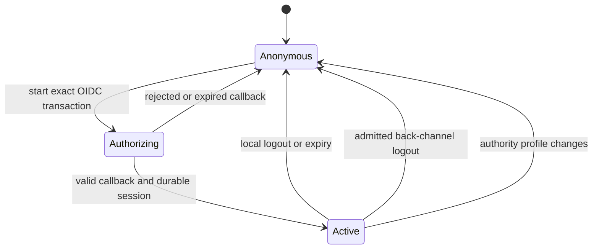
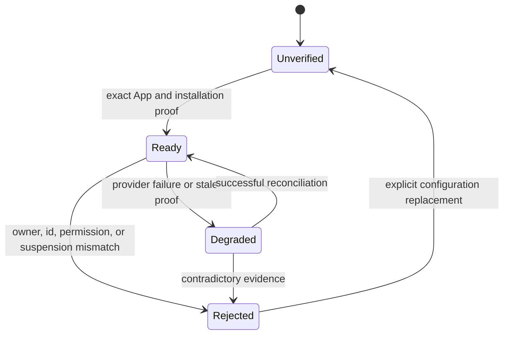

# Organization Control Plane

Status: normative contract; local runtime implemented; external closure pending

Date: 2026-09-02

Owner: `ci-coordinator.control-plane`

## 1. Decision

CI Coordinator uses one organization-owned GitHub App for provider
operations and deployment-owned Keycloak for administrator identity. Browser administration,
machine administration, Keycloak client authentication, target workflow
requests, GitHub webhooks, provider operations, repository-owner attestation,
and emergency safety controls remain separate credential planes.

Local implementation does not prove external provider configuration or
production readiness. The authority planes are:

| Plane                        | Credential                                                                            | Sole authority                                                                                                |
|------------------------------|---------------------------------------------------------------------------------------|---------------------------------------------------------------------------------------------------------------|
| target workflow              | GitHub Actions OIDC token                                                             | Request one revision-bound plan.                                                                              |
| provider event               | GitHub webhook HMAC                                                                   | Admit one delivery as GitHub-originated event evidence.                                                       |
| provider capability          | GitHub App private key, reviewer OAuth client secret, App JWT, and installation token | Authenticate the exact App for an admitted provider operation; repository effects remain installation-scoped. |
| human administration         | deployment-owned Keycloak code flow behind an opaque server session                                | Identify a human administrator and authorize coordinator actions by exact client role.                        |
| identity-provider capability | Keycloak browser secret or workload client credential                                 | Authenticate one exact coordinator or workload client to the Keycloak token endpoint.                         |
| machine administration       | deployment-owned Keycloak access token                                                             | Identify one workload and authorize coordinator API actions by exact audience, client, and role.              |
| repository attestation       | Fresh GitHub repository-manager evidence                                              | Prove that a repository owner accepted exact proposal bytes.                                                  |
| emergency safety             | Deployment-owned break-glass credential                                               | Increase validation or latch omission off; never enable omission or configure policy.                         |

No credential is accepted in more than one plane.

The exact finite projection is the
[control-plane profile](../../specs/ci-coordinator-control-plane/control-plane-profile.v1.json).
Prose explains its derivation; the profile and its semantic admission own the
machine-checkable vocabulary.

## 2. Preconditions And Proof Goal

The decision assumes:

- the deployment-admitted realm exposes standards-conforming OIDC discovery, authorization,
  token, JWKS, and logout endpoints;
- the browser client is confidential and server-side;
- one GitHub App has independently admitted ownership and can have independently
  admitted installations in target organizations;
- repository-owner consent and platform administration are different facts;
- the service is pre-release, so no production browser session or database
  compatibility promise constrains the first-release schema;
- production provider writes remain disabled until a separately admitted
  capability and permission profile exist.

Let:

- `P(x)` be the single authority plane of any credential instance `x`;
- `T(o)` mean the exact transport route admits operation `o`;
- `C(c, o)` mean credential `c` is valid for one caller-authority alternative
  admitted by `o`;
- `I(c)` mean the credential identifies one immutable principal;
- `R(c, o)` mean that principal has every role required by the selected caller
  alternative;
- `S(c, o)` mean the caller evidence binds the exact command scope;
- `F(c, o)` mean the caller evidence is fresh for `o`;
- `D(o)` mean the semantic capability owner admits the command; and
- `M(o)` be the exact provider-effect mode of the operation;
- `H(o)` be the optional provider-evidence receipt profile accepted as input;
- `G(e, o)` mean provider credential `e`, when the command needs a remote
  effect, binds the selected App, installation, repository, and exact active
  permission profile.

```text
CallerAuthorized(c, o) :=
  T(o) and C(c, o) and I(c) and R(c, o) and S(c, o) and F(c, o)

ProviderAuthorized(o) :=
  (M(o) = forbidden and NoProviderEffect(o))
  or (M(o) = required and exists e: G(e, o))

EvidenceAdmitted(o) :=
  NoProviderEvidenceInput(o)
  or ExactFreshScopeBoundReceipt(H(o))

Authorized(c, o) :=
  CallerAuthorized(c, o)
  and D(o)
  and ProviderAuthorized(o)
  and EvidenceAdmitted(o)

For every credential x and distinct planes p and q:
  not (P(x) = p and P(x) = q)
```

Each conjunct excludes an independent counterexample. Removing `T` permits a
credential on an unintended route. Removing `C` permits a credential-type
confusion attack. Removing `I` destroys attribution. Removing `R` promotes
authentication into authority. Removing `S` crosses command scope. Removing
`F` reuses revoked or stale facts. Removing `D` moves business policy into the
identity layer. Removing `M` permits an unrequested provider call. Removing `H`
lets stale or cross-scope evidence enter a pure operation. Removing `G` lets a
valid administrator borrow a wrong App, installation, repository, or permission
profile. Therefore none is redundant for the claimed result. Caller
alternatives may accept different planes, but one credential instance never
changes plane. A provider credential may coexist as a second credential for an
admitted remote effect; it never authenticates the caller. Validation remains
pure: optional provider facts arrive only as an exact receipt produced by the
separately authorized read operation, never through hidden runtime I/O.

## 3. Operation Matrix

`read`, `configure`, `activate`, `override`, and `audit` are Keycloak client
roles on the `ci-coordinator-admin-api` resource client. `administrator` is a
Keycloak composite for assignment convenience; runtime code checks only the
fine-grained roles.

| Operation family                                 | Human role                | Machine role              | Provider plane                    | Additional proof                                                                 |
|--------------------------------------------------|---------------------------|---------------------------|-----------------------------------|----------------------------------------------------------------------------------|
| inventory, workbench, discovery, provider status | `read`                    | `read`                    | GitHub App read profile           | exact installation and repository relation                                       |
| configuration validation                         | `configure`               | `configure`               | none                              | pure admission; optional exact provider-evidence receipt input                   |
| configuration registration                       | `configure`               | `configure`               | none                              | idempotency, exact bytes, audit transaction                                      |
| configuration status and exact source export     | `configure`               | `configure`               | none                              | bounded scope-first PostgreSQL read                                              |
| activation                                       | `activate`                | `activate`                | GitHub App read profile           | fresh reviewer-permission recheck, optimistic concurrency, and audit transaction |
| rollback                                         | `activate`                | `activate`                | none                              | optimistic concurrency and audit transaction                                     |
| force FullCI or disable omission                 | `override`                | `override`                | none                              | monotonic safety command                                                         |
| enable omission                                  | `activate` and `override` | `activate` and `override` | none                              | exact disabled latch and production admission                                    |
| evidence and statistics read                     | `audit`                   | `audit`                   | none                              | bounded retained-evidence query and redaction policy                             |
| future provider mutation                         | capability-specific       | capability-specific       | admitted GitHub App write profile | durable remote-effect fencing and reconciliation                                 |

The read operation may issue a bounded, repository- and observation-bound
`current-read-receipt`. Pure validation may consume that receipt but cannot
refresh it. This separates a deterministic admission result from provider
availability while preserving an exact freshness and scope proof.

This table freezes semantic operation families and caller authority. The
profile freezes fixed trust-boundary routes, but does not yet claim the complete
administrator operation-to-method-and-path mapping. That finite mapping,
versioned transport schema, and endpoint parity are owned by the deferred
API-first requirement and Batch D of the implementation plan.

Authentication alone never supplies a repository-owner attestation. A
Keycloak administrator may prepare, validate, register, or activate a
non-enforcing configuration, but production omission still requires the
separate owner and production-admission evidence defined by their canonical
contracts.

## 4. Keycloak Browser Identity

### 4.1 Protocol

The browser uses a confidential server-side BFF:

```text
GET /api/v1/auth/keycloak/start
  -> state + nonce + PKCE verifier
  -> bounded authenticated-encrypted transaction cookie
  -> exact Keycloak authorization endpoint

GET /api/v1/auth/keycloak/callback
  -> exact code, state, issuer, and transaction
  -> token exchange with PKCE S256
  -> exact ID-token validation
  -> opaque server session
```

The implementation must:

- discover endpoints only from the configured issuer's
  `/.well-known/openid-configuration` document;
- require the discovered issuer to equal the configured issuer byte for byte;
- require Authorization Code, PKCE S256, state, nonce, and an exact registered
  HTTPS callback;
- reject implicit, password, direct-grant, open redirect, token-supplied
  `jku`, and token-supplied `x5u` paths;
- allowlist signing algorithms and validate signature, `iss`, `aud`, `azp`,
  `sub`, `exp`, `iat`, nonce, and the exact role claim;
- bound discovery and JWKS cache age to five minutes, coalesce refresh, refresh
  once on an unknown `kid`, then fail closed;
- discard access and refresh tokens after callback admission; and
- issue only an opaque HttpOnly, Secure, SameSite=Lax, Path=/ session cookie.

The confidential BFF authenticates to the token endpoint only with
`client_secret_basic`. Its high-entropy secret is deployment-custodied and is
never a human credential. The stable production profile does not enable
Keycloak's preview client-secret-rotation feature. Rotation therefore drains
the login and callback ingress, waits out the bounded transaction window,
regenerates the secret, deploys and proves it on every replica, and only then
restores ingress. Existing opaque sessions remain valid; a partially rotated
replica set is rejected.

The retained session contains the digest of its random handle, exact issuer,
stable subject, Keycloak session id, immutable actor id, fine-grained role set,
non-authoritative display metadata, authority-profile digest, issue time, and
expiry. It retains no Keycloak bearer, refresh token, client secret, or private
key.

```text
session_expiry = min(id_token_expiry, issued_at + configured_session_maximum)
```

The session maximum is at most 15 minutes. Back-channel logout accepts one
bounded form-encoded `logout_token` only after validating its signature,
issuer, audience, issue time, expiration, unique `jti`, required back-channel
logout event, absence of nonce, and exactly the specification-authorized `sid`
or `sub` target. Both `iat` and `exp` are required, `exp > iat`, and
`exp - iat <= 120 seconds`; expiry and maximum age use the same bounded clock
skew. Its `jti` is retained durably until the token can no longer satisfy the
expiration, maximum-age, and clock-skew policy. The admitted token then deletes
every session matching the exact `(issuer, sid)` or authorized subject-wide
form.
RP-initiated logout deletes local authority first, then uses the discovered
logout endpoint with the exact client id and registered post-logout URI.
Failure of remote logout cannot restore the local session.

Short lifetime plus back-channel logout bounds the residual revocation window.
Immediate revocation is not claimed. If an owner later requires a smaller
window than this bound, token introspection or per-command reauthentication
becomes a new requirement rather than an implicit implementation detail.

### 4.2 Browser Request Integrity

Reads require the opaque session. Mutations additionally require:

```text
Origin = configured public origin
X-CSRF-Token = canonical session-bound proof
Content-Type = application/json
```

The browser never receives a provider token, Keycloak token, static bearer,
GitHub App key, database secret, or signing key. Personalized responses use
`Cache-Control: no-store`. CORS remains disabled unless a later explicit API
consumer contract proves a different origin model.

## 5. Keycloak Machine Identity

Every automation uses a distinct confidential Keycloak client and the Client
Credentials grant. A shared organization-wide machine client is forbidden.
The workload credential authenticates only to Keycloak and never directly to
the coordinator API. Its resulting access token is a different credential in
the machine-administration plane.

The API accepts only access tokens satisfying all of:

```text
iss = deployment-admitted issuer
aud contains ci-coordinator-admin-api
azp is in the exact workload-client allowlist
sub is non-empty and stable for the token lifetime
exp, nbf, and iat satisfy the configured bounded clock policy
exp - iat is positive and no greater than 300 seconds
resource_access.ci-coordinator-admin-api.roles contains every required role
```

An ID token is never an API bearer. A browser cookie is never a machine bearer.
Each workload actor is derived from exact `(issuer, azp, sub)` coordinates.
Asymmetric client authentication (`private_key_jwt` or mTLS) is preferred when
the deployment secret owner can provide sign-only custody; a client secret is
an explicitly weaker deployment profile, not an application default.

## 6. GitHub App Provider Identity

The deployment owner selects and admits one exact GitHub App identity, its owner,
client ID, distribution policy and installation scopes. The public source owner
is `research-engineering/ci-coordinator`; that source identity does not establish
an App, installation, OAuth registration, key custody or provider readiness.
Public distribution grants no repository access by itself. Each target
installation remains an independent owner-approved scope and credential cache
entry. All external identities require fresh deployment-bound admission.

The current read profile is exact:

| GitHub App permission            | Level |
|----------------------------------|-------|
| Actions                          | read  |
| Administration                   | read  |
| Checks                           | read  |
| Contents                         | read  |
| Merge queues                     | read  |
| Metadata                         | read  |
| Organization self-hosted runners | read  |
| Pull requests                    | read  |

The current event set is exactly `push`, `pull_request`, `merge_group`, and
`workflow_run`. Repository selection defaults to selected repositories. An
all-repositories installation requires an explicit installation-owner
decision; it is never inferred from App ownership.

App JWTs are accepted only for App-level identity and installation operations.
Repository operations require an installation token for the same admitted
installation. Token requests are narrowed to the required repository ids and
permissions when GitHub supports that operation. Tokens remain process-local,
are treated as opaque variable-length values, and expire no later than the
provider expiry minus a refresh skew.

Startup or reconciliation must verify the exact App id and owner organization,
then verify each admitted installation's id, account, target type, repository
selection, suspension state, and permission profile before it can become
ready. Pagination is bounded and complete only when every admitted page and
link relation is consistent; GitHub does not promise an atomic multi-page
snapshot, so reconciliation must detect change rather than claim one.

Write permissions are not pre-granted. Future capability profiles are
additive and independently admitted:

| Future profile              | Candidate permission                    | Blocking prerequisite                                              |
|-----------------------------|-----------------------------------------|--------------------------------------------------------------------|
| PR report publication       | Checks: write                           | exact report identity and idempotent reconciliation                |
| workflow dispatch           | Actions: write                          | registered block identity, remote-effect fencing, timeout fallback |
| recommendation pull request | Contents/Pull requests/Workflows: write | repository-owner opt-in and exact generated-byte review            |
| governance remediation      | Administration: write                   | owner-approved desired state, lease fencing, and rollback evidence |

Granting a candidate permission before its prerequisite is implemented is a
configuration defect.

## 7. Repository-Owner Attestation

Platform administration and repository ownership are not semantically
identical:

```text
KeycloakAdmin(x) does not imply RepositoryManager(x, repository)
RepositoryManager(x, repository) does not imply KeycloakAdmin(x)
```

Fresh GitHub `maintain` or `admin` evidence is the repository-attestation
authority. GitHub user OAuth is a proposal-bound reviewer step-up and cannot
open the administrator UI or authorize general coordinator commands.

The step-up is bound before redirect to the exact Keycloak session,
repository, revision, proposal digest, and OAuth transaction. On callback the
coordinator exchanges the code, resolves the immutable GitHub reviewer and
fresh `maintain` or `admin` evidence, reproduces the proposal, records one
durable receipt atomically with its audit event, and discards the GitHub user
token. The token is never added to the Keycloak session or a second durable
browser session.

The step-up uses exact
`/api/v1/repository-attestations/github/start` and
`/api/v1/repository-attestations/github/callback` routes, state, and PKCE S256.
The server exchanges the code through the exact GitHub App client id and a
deployment-custodied client secret. The secret belongs only to the provider
capability plane, never enters browser state or durable application data, and
is rotated by generating a replacement, deploying and proving it on every
replica, then revoking the predecessor.

The receipt binds repository, revision, proposal digest, reviewer identity,
permission observation, provider observation, review state, issue time, expiry,
and the initiating Keycloak actor. Before activation, the GitHub App rechecks
the named reviewer identity's current repository permission. A stale receipt,
changed proposal, revoked manager permission, changed installation, or failed
recheck rejects activation. This preserves independent repository consent
without retaining a user credential.

Native GitHub review of exact generated bytes remains a possible replacement,
not an assumed dependency. It is admissible only if it preserves every receipt
binding and current-permission recheck above.

## 8. Break-Glass Authority

The static bearer is emergency safety authority.
In production it may authorize only:

- `force_full_ci`; and
- `disable_omission`.

It cannot authorize configuration registration, activation, rollback,
`enable_omission`, repository attestation, evidence export, provider writes,
or browser login. Development may use a separate local profile, but production
startup must reject a broad static scope set.

Rotation remains deployment-owned: isolate the emergency routes, replace the
secret, restart every replica, prove the old value rejected and the new value
accepted, then restore ingress. A partially rotated replica set is not an
admitted state.

## 9. Actor Attribution

Canonical actor ids use immutable coordinates and explicit namespaces:

```text
human actor   = keycloak-human:v1:sha256(issuer || 0x00 || sub)
machine actor = keycloak-workload:v1:sha256(issuer || 0x00 || azp || 0x00 || sub)
review actor  = github-reviewer:v1:<immutable GitHub user id>
break glass   = break-glass:v1:<deployment-owned id>
```

Usernames and email addresses are display metadata, not authority. Every audit
event records actor id, credential plane, effective fine-grained roles,
operation id, causal request id, repository and installation coordinates, and
the GitHub App identity used for provider effects. GitHub attributes an
installation-token mutation to the App; the local immutable audit retains the
initiating Keycloak actor.

Webhook `sender` is provenance metadata and never human authentication.

## 10. Dataflow

```mermaid
flowchart LR
  Browser[Admin browser] -->|code + PKCE| Keycloak[deployment-owned Keycloak]
  BFF -->|client_secret_basic| Keycloak
  Keycloak -->|ID token| BFF[Keycloak identity boundary]
  BFF -->|opaque session| API[Coordinator API]
  Workload[External automation] -->|client credential| Keycloak
  Keycloak -->|access token| Machine[Machine token boundary]
  Machine --> API
  API --> Capability[Capability owner]
  Capability -->|admitted provider operation| App[GitHub App transport]
  App --> GitHub[GitHub installation]
  API -->|proposal-bound transaction| StepUp[Reviewer OAuth boundary]
  Reviewer[Repository reviewer] -->|code + PKCE| StepUp
  StepUp -->|ephemeral user token| GitHub
  StepUp -->|durable receipt| Capability
  Workflow[Target workflow] -->|Actions OIDC| Planner[Plan request boundary]
  GitHub -->|HMAC webhook| Webhook[Webhook boundary]
```



No arrow transfers the authority of its source. The identity boundaries emit
principals, the capability owner emits a semantic decision, and the GitHub App
adapter emits only provider protocol effects.

## 11. State Machines





## 12. First-Release Support Boundary

The repository has no production database or released identity contract. The
supported database origin is therefore one fresh bootstrap migration containing
only the current Keycloak session and reviewer-attestation model. Development
data may be reset; no predecessor identity state or compatibility layer is part
of the product contract. Runtime remains non-enforcing until live Keycloak,
GitHub App, callback, webhook, rotation, and fallback receipts succeed.

## 13. External Observations

Former private-provider observations and their identity coordinates are removed
from this public export. No discovery hash, App installation or capability claim
is inherited by the new repository.

Before deployment, independently qualify OIDC discovery, PKCE, token/JWKS and
logout behavior; exact App ownership, distribution, read permissions, events and
installation scopes; and secret custody, callback/webhook configuration and
rotation. Missing evidence keeps the corresponding readiness claim open.
The implementation's minimum Keycloak baseline is a compatibility input, not
proof that any deployed provider meets it.

## 14. Alternatives

| Alternative                                | Rejection reason                                                                                                                             |
|--------------------------------------------|----------------------------------------------------------------------------------------------------------------------------------------------|
| Keycloak only at reverse proxy             | The application would lack cryptographically bound actor and role evidence unless a separately authenticated proxy protocol were introduced. |
| SPA-held Keycloak tokens                   | Browser storage expands credential exposure and duplicates BFF/session controls already required by mutations.                               |
| One generic bearer for humans and machines | It erases principal type, revocation, role, and attribution boundaries.                                                                      |
| GitHub App identity as human authority     | An installation token identifies the App, not the initiating administrator.                                                                  |
| Keycloak admin as repository-owner consent | Organization administration does not prove repository-manager acceptance of exact proposal bytes.                                            |
| Persist refresh tokens                     | The initial product does not require long-lived browser sessions; rotation, replay, and revocation complexity is unearned.                   |
| Add a legacy-compatible session schema     | There is no production support contract; compatibility would add permanent concepts without preserving required data.                        |
| Pre-grant future GitHub write permissions  | Permission without an implemented capability violates least privilege and creates unused attack surface.                                     |

## 15. Falsifiers And Revision Conditions

The design is invalid if any implementation:

- accepts one credential on two authority planes;
- accepts a Keycloak token with wrong issuer, audience, client, role, signature,
  time, nonce, or profile digest;
- accepts a logout token without a valid bounded `exp`;
- accepts an ID token as an API bearer;
- accepts a Keycloak client credential as a human or machine API bearer;
- persists a browser access or refresh token;
- performs provider I/O for an operation whose effect mode is `forbidden`;
- admits a provider-evidence receipt with stale or mismatched scope;
- starts reviewer OAuth on an unregistered route or without the exact
  deployment-custodied App client credential;
- authorizes a repository action without exact installation and repository
  relation evidence;
- treats a Keycloak role as repository-owner attestation;
- permits the production break-glass credential to enable omission;
- performs a GitHub operation outside the active permission profile;
- loses the initiating actor when the GitHub App performs a provider effect;
  or
- reports readiness before App, installation, and identity dependencies are
  admitted.

Revisit the design if the deployment owner replaces Keycloak, a trusted service mesh supplies a
cryptographically authenticated identity envelope, immediate revocation
becomes a hard requirement, GitHub changes App installation or token semantics,
repository consent moves to a different owner, or one deployment must support
multiple unrelated identity realms.

## 16. Standards And Provider References

- [OAuth 2.0 Security Best Current Practice](https://datatracker.ietf.org/doc/html/rfc9700)
- [OpenID Connect Core 1.0](https://openid.net/specs/openid-connect-core-1_0.html)
- [OpenID Connect Discovery 1.0](https://openid.net/specs/openid-connect-discovery-1_0.html)
- [OpenID Connect RP-Initiated Logout 1.0](https://openid.net/specs/openid-connect-rpinitiated-1_0.html)
- [OpenID Connect Back-Channel Logout 1.0](https://openid.net/specs/openid-connect-backchannel-1_0.html)
- [JSON Web Token Best Current Practices](https://datatracker.ietf.org/doc/html/rfc8725)
- [Keycloak OIDC layers](https://www.keycloak.org/securing-apps/oidc-layers)
- [Keycloak 26.7.3 release](https://www.keycloak.org/2026/08/keycloak-2673-released)
- [GitHub App permissions](https://docs.github.com/en/apps/creating-github-apps/registering-a-github-app/choosing-permissions-for-a-github-app)
- [GitHub installation authentication](https://docs.github.com/en/apps/creating-github-apps/authenticating-with-a-github-app/authenticating-as-a-github-app-installation)
- [GitHub App user access tokens](https://docs.github.com/en/apps/creating-github-apps/authenticating-with-a-github-app/generating-a-user-access-token-for-a-github-app)

## 17. Non-Claims

This contract does not claim that Keycloak clients, roles, workload identities,
target-organization App installations, callback URLs, webhook routes, or
secrets are configured. It does not claim immediate token revocation, provider
write authority, repository-owner approval, production deployment, production
readiness, or CI omission authority.
