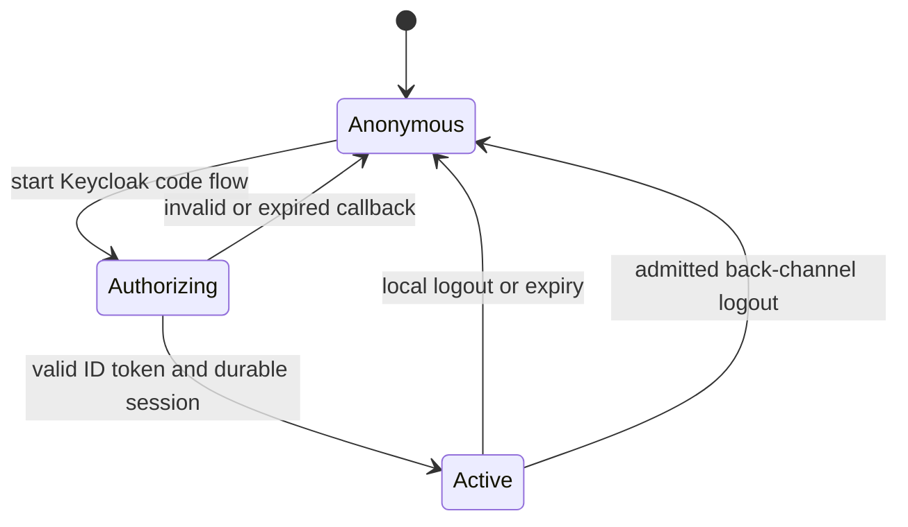
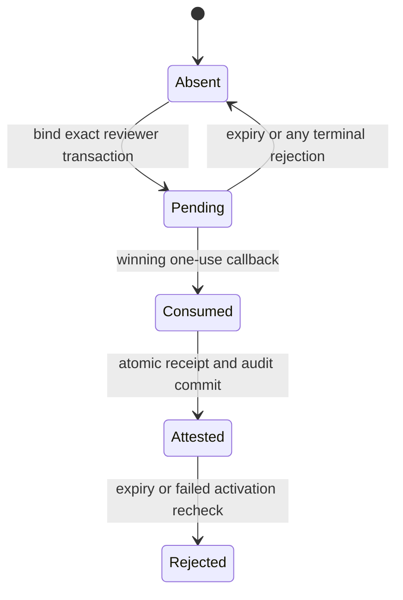

# Control-Plane Identity And Repository Attestation

Status: as-built local runtime; live external receipts pending

Date: 2026-09-02

## 1. Owned Invariant

Every administrator request has exactly one admitted credential plane, one
immutable actor identity, and the exact roles required by its operation.
Repository-owner attestation remains independent from administrator identity
and never requires retention of a provider bearer.

```text
AdmittedAdministratorRequest(r, o) :=
  ExactlyOneCredential(r)
  and TrustedPrincipal(r.principal)
  and RequiredRoles(o) subsetOf r.principal.roles
  and RequestIntegrity(r, r.principal)

AdmittedRepositoryAttestation(a) :=
  KeycloakInitiator(a)
  and ExactProposalBinding(a)
  and FreshGitHubManagerEvidence(a)
  and BoundedReceipt(a)
  and NoRetainedProviderBearer(a)
```

Neither predicate implies the other.

## 2. Public Contracts

The domain exposes exact tagged principals:

```text
KeycloakHumanPrincipal(issuer, subject, sid, actor, roles, session, expiry)
KeycloakWorkloadPrincipal(issuer, azp, subject, actor, roles, expiry)
GitHubReviewerPrincipal(user_id, login, actor, permission)
BreakGlassPrincipal(actor)
```

Actor identities are derived only from immutable authority coordinates:

```text
human   = keycloak-human:v1:sha256(issuer || 0x00 || subject)
machine = keycloak-workload:v1:sha256(issuer || 0x00 || azp || 0x00 || subject)
review  = github-reviewer:v1:<immutable-user-id>
break   = break-glass:v1:<deployment-owned-id>
```

Display names, email addresses, usernames, token text, and request fields are
never actor authority.

The exact runtime roles are `read`, `configure`, `activate`, `override`, and
`audit`. A principal carries role evidence; the operation owner selects the
required subset. Repository scope, optimistic concurrency, state transition,
and provider-effect policy remain with the capability that owns the command.

## 3. Credential Admission

### 3.1 Human Browser Identity

```text
start
  -> exact issuer discovery
  -> state + nonce + PKCE S256
  -> bounded authenticated-encrypted transaction cookie

callback
  -> exact code/state/iss/cookie multiplicity and configured issuer equality
  -> optional bounded session_state metadata, never token sid authority
  -> client_secret_basic code exchange
  -> exact ID-token verification
  -> token-free opaque server session
```

The ID token is admitted only after exact signature algorithm, key id, issuer,
audience, authorized party, subject, Keycloak session id, nonce, issue time,
expiry, and role-claim validation. Access and refresh tokens are discarded
before the session write. The session expiry is the minimum of ID-token expiry
and the configured maximum of 900 seconds.

Browser reads require the opaque session. Browser mutations additionally
require the exact configured `Origin`, canonical session-bound CSRF proof, and
`application/json`. Personalized responses are `Cache-Control: no-store`.

When Keycloak is enabled, GET/HEAD on either workbench page path checks the
current human session and the `read` role before returning HTML. Missing or
expired sessions redirect to the fixed local login-start route. Ambiguous
credentials or insufficient roles reject without redirect; unavailable or
overloaded session admission returns 503. Static assets remain public and API
routes preserve their JSON failure contracts. Callback query fields use one
strict Pydantic model and matching OpenAPI projection: code, state and issuer
are required exactly once; session_state is optional and bounded. Duplicate,
unknown or invalid fields reject before exchange, including missing or unequal
issuer metadata. Token and transaction validation remain independently required.

Browser recovery is specified by `REQ-CI-UI-009` and the
[bounded recovery design](../../features/browser-session-recovery.md). It
revalidates the existing opaque session and may repeat ordinary top-level SSO;
it does not extend the session, retain provider tokens or replay mutations.
Its non-authoritative navigation hint cannot affect any server admission.

### 3.2 Machine Identity

One workload obtains an access token from Keycloak through its own confidential
client. The coordinator never accepts the client credential itself. An API
bearer is admitted only when it has the exact issuer, API audience, allowlisted
`azp`, stable non-empty subject, bounded temporal claims, a positive lifetime
not exceeding 300 seconds, and the exact required roles.

`iat` and `exp` remain mandatory exact integer NumericDates. `nbf` is optional
on the provider wire, not nullable: when present it must pass the same numeric
and interval checks as before. When absent, the adapter supplies `issued_at`
as the evidence's effective `not_before`. This is a local admission bound, not
a claim that the provider signed an `nbf` member. No zero or current-time
default is used, and the domain evidence type remains non-optional.

An ID token, browser cookie, GitHub token, target-workflow OIDC token, or
break-glass bearer cannot be reinterpreted as a machine credential.

### 3.3 Break Glass

The deployment bearer maps only to `BreakGlassPrincipal`. Authorization is
true only for `force-full-ci` and `disable-omission`. No configuration,
activation, rollback, omission enablement, attestation, broad read, evidence
export, or provider effect accepts this principal.

## 4. Discovery, Keys, And Token Verification

`integrations.keycloak` owns remote OIDC mechanics:

- discovery is loaded only from the configured issuer's fixed well-known URL;
- discovered issuer equality is byte exact and endpoint origins are admitted;
- discovery and JWKS responses have finite byte, item, timeout, and cache-age
  limits;
- refresh is single-flight; an unknown `kid` permits exactly one fresh JWKS
  load;
- only the configured algorithm set is passed to the JOSE engine;
- token-supplied `jku`, `x5u`, embedded `jwk`, critical extensions, or an
  ambiguous key selection are rejected; and
- dependency failure is distinct from invalid credentials.

Authlib owns OAuth client protocol mechanics. `joserfc` owns JOSE primitives.
Project code owns endpoint, header, claim, role, time, and failure admission.
No library default is itself an authorization decision.

## 5. Durable State

The pre-release database contains these identity relations:

```text
control_plane_sessions
  handle_digest, issuer, subject, keycloak_sid, actor_id, roles,
  display_name?, profile_digest, issued_at, expires_at

control_plane_logout_replays
  issuer, jti, retain_until

repository_attestation_transactions
  transaction_digest, session_handle_digest, scope, operation_id,
  proposal_manifest_id, provider_revision, proposal_digest,
  expected_active?, issued_at, expires_at
```

No relation contains a Keycloak access token, ID token, refresh token, GitHub
user token, OAuth client secret, private key, verifier plaintext, session
handle plaintext, or CSRF secret.

Session lookup uses trusted database time after compatibility admission.
Expiry, profile mismatch, malformed state, logout, and key rotation all remove
authority. Back-channel logout replay identity is durable until no accepted
clock interpretation can make the token valid.

Anonymous login diagnostics update only fixed hourly counters. They retain the
bounded inline cleanup of expired diagnostic buckets but neither acquire the
activity journal mutex nor delete activity events. PostgreSQL UPSERT owns
same-bucket increment atomicity and saturation; cleanup and the increment share
one admitted transaction. Bucket-row contention remains a bounded best-effort
diagnostic failure, not a reason to hold the journal mutex during that wait.
Principal role-denial/export diagnostics retain ordered journal writes and full
cleanup. Required session, logout replay and journal effects remain atomic.
Existing maintenance and ordered writers retain activity-event cleanup; counter
retention, timeouts, admission limits and cursor semantics are unchanged.

Proposal-review transactions require the identity-state capability as well as
their review, configuration, audit, and compatibility capabilities. Common
admission attests identity schema facts under the same compatibility fence
before exposing the repository. Session and activity transactions use that
same attestor once per admission, without a second wrapper-level catalog pass.
Earlier authentication is not schema admission for a later transaction.

`workflow_proposal_reviews` is the durable repository-attestation receipt. In
addition to the existing exact proposal and audit binding it retains reviewer
identity, observed `maintain` or `admin` permission, initiating Keycloak actor,
issue time, and bounded expiry. Receipt creation, proposal registration,
transaction consumption, and the audit event are one database transaction.

## 6. Repository-Attestation Flow

The start mutation requires an admitted Keycloak human with the `configure`
role and exact browser integrity. It binds a one-use transaction to:

```text
session + repository + installation + provider revision + proposal digest
+ proposal manifest + expected active revision + operation id
```

The callback terminates exactly one transaction. It exchanges the GitHub code
with PKCE, resolves the immutable reviewer, proves current `maintain` or
`admin` permission for the same repository and installation, reproduces the
proposal, commits one receipt and audit event, and discards the user token.
Every terminal rejection also retires the exact pending row. If the store is
unavailable, expiry remains the bounded cleanup fallback and grants no
authority. The redirect carries the original operation id only as an untrusted
navigation hint; the UI must replay that id through the authenticated start
endpoint before it may display retained review authority.

Activation loads the exact unexpired receipt and compares its complete expected
active pointer with current durable state before any provider call. It then
uses the GitHub App to recheck the recorded reviewer's current repository
permission. A changed proposal, revision, installation, reviewer, permission,
profile, baseline, or expiry rejects activation. Provider unavailability
cannot become approval. The same active-pointer comparison is repeated under
the final repository lock before mutation.

## 7. State Machines





Only the winning transaction-consumption compare-and-swap may commit a receipt.
A provider call made by a losing callback has no durable authority.

## 8. HTTP Projection

Exact identity and attestation routes are:

```text
GET  /api/v1/auth/keycloak/start
GET  /api/v1/auth/keycloak/callback
GET  /api/v1/auth/session
POST /api/v1/auth/keycloak/logout
POST /api/v1/auth/keycloak/backchannel-logout
POST /api/v1/repository-attestations/github/start
GET  /api/v1/repository-attestations/github/callback
```

HTTP owns headers, cookies, redirects, form and query multiplicity, content
types, status codes, and bounded wire models. It does not own token claims,
roles, proposal validity, repository permission, durable time, or receipt
semantics.

## 9. Failure Algebra

```text
InvalidCredential       -> 401 without internal reason disclosure
InsufficientRole        -> 403
InvalidRequestIntegrity -> 403
InvalidCallback         -> 400 and transaction-cookie deletion
ExpiredOrReplayed       -> 409 or 401 according to route semantics
AdmissionOverloaded     -> 503 without queueing
IdentityUnavailable     -> 503
UnexpectedFailure       -> correlated 500 with redacted diagnostics
```

Authentication dependency failure is never converted to invalid credentials,
and invalid credentials never expose whether issuer, key, claim, role, replay,
or session lookup failed.

## 10. Ownership And Imports

| Owner                    | Sole responsibility                                                         |
|--------------------------|-----------------------------------------------------------------------------|
| `control_plane_identity` | principals, role evidence, pure transitions, crypto-safe handles            |
| `integrations.keycloak`  | bounded OIDC discovery, exchange, JWKS, JOSE verification, logout transport |
| `persistence`            | identity rows, database time, replay and one-use transitions                |
| `api.http`               | request credential selection and wire projection                            |
| `proposal_review`        | exact proposal receipt and durable review semantics                         |
| `runtime_settings`       | process-input and secret-file admission                                     |
| `runtime`                | concrete wiring and resource lifecycle                                      |

The domain cannot import FastAPI, HTTPX, SQLAlchemy, environment readers,
provider adapters, or runtime composition. Keycloak integration cannot decide
repository scope or configuration policy. Runtime composition contains no
identity or role policy.

## 11. Required Witnesses

- a field-by-field ID-token, access-token, and logout-token mutation matrix;
- key-selection, unknown-`kid`, stale-cache, response-bound, and timeout tests;
- actor derivation and token-confusion laws;
- session expiry, profile change, logout, replay, and concurrent replacement;
- exact cookie, Origin, CSRF, callback multiplicity, and redaction tests;
- machine role and workload-client allowlist tests;
- break-glass operation matrix with every forbidden operation;
- reviewer transaction binding and callback-race tests;
- user-token non-persistence and receipt-expiry tests;
- activation permission-recheck and provider-unavailability tests;
- schema capability, ACL, migration, and catalog-attestation integration tests;
- exact OpenAPI and generated TypeScript contract witnesses; and
- provider exercises for discovery, login/logout, machine tokens, callback,
  and back-channel logout before production admission.

## 12. Falsifiers And Non-Claims

The design is invalid if any general administrator route accepts GitHub OAuth,
any broad operation accepts break glass, a retained row or observable output
contains bearer material, a Keycloak role implies repository ownership, or an
activation succeeds without an exact current attestation recheck.

Local implementation evidence does not prove configured Keycloak clients,
live GitHub installation state, secret rotation, provider availability,
deployment, or production readiness.

## 13. Provider Compatibility

Keycloak's optional `nbf` follows
[RFC 7519 section 4.1.5](https://www.rfc-editor.org/rfc/rfc7519.html#section-4.1.5).
Only absence normalizes to `iat`; explicit null, malformed or out-of-range
values fail. Thus an absent `nbf` adds no authority beyond the retained
`iat <= now + skew` check. Required expiry, positive bounded lifetime,
issuer, audience, workload allowlist and roles remain unchanged.

The pinned Keycloak 26.7.4
[back-channel sender](https://github.com/keycloak/keycloak/blob/26.7.4/services/src/main/java/org/keycloak/services/managers/ResourceAdminManager.java)
uses the form-entity constructor without a charset. Its selected Apache
HttpClient emits the bare media type accepted by this route. No parameterized
media-type extension is inferred from a hypothetical sender mismatch. Custom
senders and live revocation delivery require their own evidence; revisit on
provider changes or a concrete contrary wire receipt.

Regression witnesses use signed tokens with absent, present and malformed
`nbf` through the adapter and machine service. Logout witnesses cover bare
case-insensitive media type, duplicate headers, unadmitted parameters and
credential ambiguity before verifier invocation. They do not prove immediate
revocation of offline machine tokens or deployed provider interoperability.
