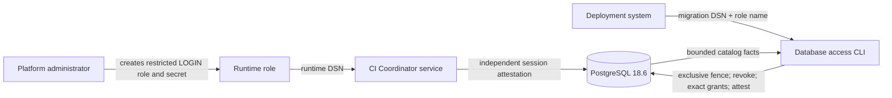

# Database Access Provisioning

Status: module specification

Date: 2026-07-17

## 1. Decision

The deployable image owns one database-access command with two operations:

```text
ci-coordinator-database-access apply --runtime-role <role>
ci-coordinator-database-access check --runtime-role <role>
```

Both operations read the migration connection only from
`CI_COORDINATOR_MIGRATION_DATABASE_DSN`. `apply` transactionally replaces the
target role's direct application-object privileges with the current runtime
allowlist. `check` performs the same bounded catalog attestation without
mutation.

The command never creates a role, changes a password, changes role attributes,
grants role membership, or stores credentials. Those operations remain owned
by the PostgreSQL platform administrator.

## 2. Formal Contract

Let `M` be the authenticated migration principal, `R` the requested runtime
role, `S` the application schema, `E` the exact runtime privilege allowlist,
and `F` the database compatibility fence.

```text
ApplySucceeds(M, R) iff
  MigrationOwner(M, S)
  and RestrictedLoginRole(R)
  and NoMembershipEdges(R)
  and NoOwnedApplicationObjects(R)
  and NoDefaultAclGrant(R, S)
  and Exclusive(F)
  and OtherLiveSessions(R) = empty
  and ReplaceDirectPrivileges(R, E)
  and EffectivePrivileges(R) = E
  and CommitSucceeds

CheckSucceeds(M, R) iff
  MigrationOwner(M, S)
  and RestrictedLoginRole(R)
  and NoMembershipEdges(R)
  and NoOwnedApplicationObjects(R)
  and NoDefaultAclGrant(R, S)
  and Shared(F)
  and EffectivePrivileges(R) = E
```

`NoMembershipEdges(R)` means no `pg_auth_members` row has `R` as either the
granted role or the member. This excludes both privilege acquisition through a
parent and privilege delegation to a child.

`RestrictedLoginRole(R)` requires `LOGIN`, `NOINHERIT`, `NOSUPERUSER`,
`NOCREATEDB`, `NOCREATEROLE`, `NOREPLICATION`, and `NOBYPASSRLS`. The command
rejects an unsafe role instead of silently changing platform-owned identity
attributes.

## 3. Necessity And Sufficiency Argument

The operation is necessary because the schema migration cannot know an
environment-specific role identity, while an operator cannot reconstruct the
column-level allowlist from deployment prose without creating an untracked
second specification.

The operation is sufficient for repository-owned ACL configuration because:

1. the exclusive compatibility fence prevents a runtime capability admission
   from observing a partially replaced ACL;
2. after taking that fence and before the first ACL mutation, `apply` rejects
   any other database session authenticated as the target runtime role;
3. revocation precedes grants in one transaction, so stale direct authority is
   removed before the exact allowlist is installed;
4. identifiers are composed by the PostgreSQL driver, never interpolated;
5. a postcondition query compares effective schema, relation, column,
   sequence, routine, type, and migration-metadata privileges with `E` before
   commit; and
6. independent runtime-session attestors exercise the resulting role in the
   PostgreSQL integration suite.

The contract is not sufficient for production admission. A successful command
does not prove secret custody, database backup, network isolation, provider
wiring, runtime readiness, or rollout evidence. In particular, the deployment
owner must stop predecessor replicas and prevent them from reconnecting during
the cutover. Zero-downtime mixed-version rollout requires generation-specific
roles rather than one shared role.

## 4. Ownership And Dataflow



The persistence package owns the privilege manifest and PostgreSQL operation.
The CLI package owns argument, environment, exit-code, and redacted-output
adaptation. Alembic continues to own schema and PUBLIC revocation.

## 5. Failure Semantics

| Condition                                                             | Result                                                  |
|-----------------------------------------------------------------------|---------------------------------------------------------|
| unsupported Python or invalid arguments                               | exit `2`, stable JSON rejection                         |
| missing or invalid migration DSN                                      | exit `2`, no connection attempt after admission failure |
| role missing or role attributes unsafe                                | rollback and exit `2`                                   |
| membership, ownership, or default ACL exists                          | rollback and exit `2`                                   |
| another target-runtime-role session is live after the exclusive fence | rollback and exit `2`                                   |
| lock, SQL, connection, or commit fails                                | rollback where outcome is known; exit `2`               |
| exact postcondition is false                                          | rollback and exit `2`                                   |
| exact postcondition is true                                           | exit `0`, stable JSON success without DSN or password   |

No error response contains a DSN, password, SQL text, or provider exception.

## 6. Required Falsifiers

1. SQL-looking role names are rejected before database execution.
2. `INHERIT`, privileged attributes, either membership direction, ownership,
   or default ACL grants reject both operations.
3. Extra `MAINTAIN`, table, column, sequence, routine, type, schema, or Alembic
   privileges make `check` fail.
4. `apply` removes stale direct grants and is idempotent.
5. A runtime connection provisioned by `apply` passes all independent base,
   shadow-reconciliation, and operator-override principal attestations.
6. A failure before commit leaves no partial ACL replacement.
7. A live target-role session makes `apply` fail before its first privilege
   mutation; after that session closes, the same operation can proceed.
