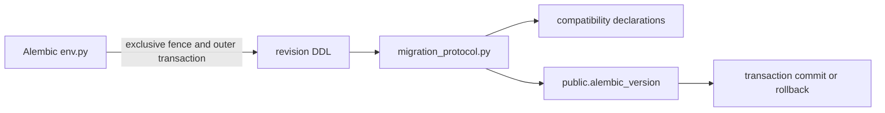

# Database Migration Declaration Protocol

Status: module specification

Date: 2026-07-14

## 1. Decision

`migration_protocol.py` is the sole Python owner of forward declaration append,
byte-exact replay validation, and pre-retention downgrade selection. It runs
only inside the online Alembic outer transaction after `env.py` has acquired
the exclusive compatibility fence.

It does not execute DDL, acquire the fence, choose an Alembic target, decide
whether production retention exists, or expose a runtime database API. Those
decisions have separate owners.

## 2. Necessity Proof

Let `F` mean that the exclusive fence is held, `T` that the caller's Alembic
transaction contains both DDL and the version-table movement, `H` that the
actual current Alembic head equals the declared predecessor, `D` that the
candidate declaration obeys the profile transition algebra, and `A_static`
that the revision-owned attestor has proved every resulting capability against
the post-DDL state independently of any deploy-time runtime role.

```text
SafeForwardAppend iff F and T and H and D and A_static and AtomicInsert
```

`F` prevents a cooperating participant from overlapping the compatibility
change. `T` gives DDL, declaration insertion, and head movement one commit
outcome. `H` rejects a declaration for a head other than the one actually
being migrated. `D` preserves the induction step of the append-only chain.
`A_static` prevents a declaration from asserting schema, data-domain, codec,
routine, ownership, object-ACL, or PUBLIC-absence facts before the owning
migration has checked them. A capability privilege-requirement identifier
defines the exact runtime grant set needed by a future operation; it does not
assert that a deploy-time runtime role already exists or holds that set.
`AtomicInsert`
makes duplicate revision identifiers and partial capability rows unobservable
after rollback. Removing any conjunct admits a counterexample, so none may be
delegated to migration prose or a caller convention.

The helper is synchronous because Alembic revision functions receive a
synchronous SQLAlchemy `Connection`. Requiring an async bridge would add a
second transaction boundary and would therefore violate `T`.

## 3. Boundary



The order is fixed: `env.py` owns the fence, the revision owns DDL and its
declared predecessor/target identities, the protocol owns declaration state,
and Alembic owns the version-table movement. The helper reads the actual
version table only to reject a caller whose declared predecessor is stale.

## 4. Public Internal Contract

```text
apply_forward_declaration(
  connection: Connection,
  profile: CompatibilityProfile,
  previous_revision_id: str,
  proposed: RevisionDeclaration,
  attest_resulting_capabilities: Callable[[RevisionDeclaration], None],
) -> ForwardDeclarationOutcome

validate_pre_retention_downgrade(
  connection: Connection,
  profile: CompatibilityProfile,
  target: RevisionDeclaration,
) -> None
```

`apply_forward_declaration` reads exactly one actual Alembic head. It first
requires it to equal `previous_revision_id`. The caller supplies the required
attestor because only the migration that introduces a capability owns its
post-DDL schema, data, codec, routine, ownership, object-ACL, and PUBLIC facts.
The helper invokes that attestor before either a new append or a replay result
is returned. Runtime-principal grants are separately installed under the
deployment fence and attested per admitted runtime transaction.

| Condition                                                                              | Result                                                                            |
|----------------------------------------------------------------------------------------|-----------------------------------------------------------------------------------|
| proposed revision is absent, predecessor is undeclared, and declaration table is empty | validate bootstrap, insert declaration and rows, return `APPENDED`                |
| proposed revision is absent and declared predecessor is current chain tip              | validate successor, attest result, insert declaration and rows, return `APPENDED` |
| proposed revision exists and is byte-exact, with the actual predecessor relation valid | attest result, return `REPLAY_VALIDATED`                                          |
| existing or new declaration violates any relation                                      | reject and let the Alembic transaction roll back                                  |

`validate_pre_retention_downgrade` reads exactly one actual Alembic head,
loads that declaration and the target declaration, validates their bounded
chain facts, requires `target.generation < current.generation`, and checks
byte-exact target replay. It inserts nothing.

The historical induction invariant makes the generation comparison sufficient:
bootstrap is the only generation one declaration; each successful append has
one greater generation and a foreign-key parent; declarations are immutable.
Therefore a lower stored generation in the same recognized lineage is an
ancestor without scanning the unbounded history.

## 5. Failure And Non-Claims

The helper translates storage failures to the existing typed compatibility
failure family and preserves the causal exception. It never converts a failed
or cancelled outer transaction into success.

This module does not prove:

- that the caller held the fence or owns the migration principal;
- that a deployment is pre-retention or allowed to remove retained state;
- that an arbitrary historic Alembic revision is a supported release artifact;
- runtime role separation, provider enforcement, or production admission.

The initial protocol migration remains self-contained. Importing this mutable
helper from an already shipped historic revision would make old migration
behavior depend on current application source. Future migrations may call the
helper only after its source and declaration are reviewed in the same release.

## 6. Required Falsifiers

1. A forward append with a stale actual Alembic head rejects.
2. An exact re-upgrade appends no duplicate declaration or capability row.
3. A conflicting replay rejects.
4. A candidate with a generation gap, parent fork, or mixed transition rejects.
5. A downgrade target that is current, future, missing, or byte-different
   rejects and inserts nothing.
6. A valid pre-retention ancestor selection inserts nothing.
7. A failing resulting-capability attestor appends zero declaration and
   capability rows.
