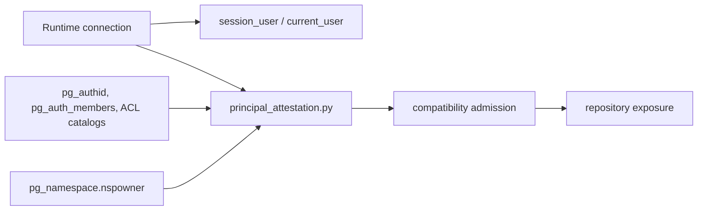

# Database Principal Attestation

Status: module specification

Date: 2026-07-14

## 1. Decision

`principal_attestation.py` owns PostgreSQL fact collection for the runtime
database principal. It derives the runtime identity from the live session and
the migration identity from the owner of the application schema. It does not
provision roles, persist credentials, select a deployment secret, or execute
DDL.

```text
RuntimeIdentity(connection) = session_user = current_user
MigrationIdentity(connection) = owner(ci_coordinator schema)
```

The runtime principal is a direct-login `NOINHERIT` role with no
`pg_auth_members` edge in either direction. Its required application
privileges are direct, exact, and non-grantable. Platform operators create that
role and its connection secret outside the service. The image-owned database
access command installs only its object ACL; the service then admits only a
connection whose independent live database facts satisfy this contract.

## 2. Necessity Proof

Let `R` be the login role of a runtime connection, `M` the owner of the
application schema, and `A(R)` the effective application privileges of `R`.
Let `E` be the capability-owned privilege allowlist for the current schema.

```text
SafeRuntimeConnection iff
  session_user = current_user = R
  and R != M
  and NoMembership(R)
  and RestrictedAttributes(R)
  and NoGrantOptions(R)
  and A(R) = E
  and NoFutureDefaultPrivileges(R)
```

Each conjunct excludes an independent counterexample:

| Omitted condition          | Counterexample                                                                                 |
|----------------------------|------------------------------------------------------------------------------------------------|
| session identity equality  | a login connects as a restricted role, then `SET ROLE` changes the effective authority         |
| `R != M`                   | the service runs as the schema owner and can run arbitrary DDL                                 |
| no memberships             | a parent grants hidden authority, or a child can inherit or select the runtime role            |
| restricted attributes      | a bypass-RLS, role-admin, database-admin, replication, or superuser role escapes relation ACLs |
| no grant options           | the runtime role delegates a capability privilege to another principal                         |
| exact effective privileges | an accidental relation privilege permits mutation outside an operation contract                |
| no runtime defaults        | a future relation acquires authority without a reviewed capability transition                  |

Therefore no deployment environment variable can be a sufficient identity
source: it could name a role different from the one that PostgreSQL actually
authenticated. The database catalog and the active session are the only
authoritative inputs for this decision.

## 3. Boundary



The attestor returns facts only. `compatibility_admission.py` decides whether
those facts admit the operation; `unit_of_work.py` and `readiness.py` enforce
that decision before repository exposure. The Alembic revision owns only
PUBLIC revocations and immutable protocol objects, because it cannot create an
environment-specific runtime login role without taking deployment authority.
The separate database-access provisioner is specified by
[Database Access Provisioning](database-access-provisioning.md); it does not
replace this session-derived attestation.

## 4. Current Capability ACL

The table summarizes direct, non-grantable runtime privileges. Exact table
and column sets are owned by the admitted capability descriptors and
[runtime grant maps](../../../backend/src/ci_coordinator/persistence/runtime_principal_access.py),
bound to the [compatibility profile](../../specs/ci-coordinator-core/database-compatibility-profile.v1.json).
Use those complete maps for provisioning and attestation; a table summary
does not authorize an additional grant:

| Relation                                             | Allowed privileges                                                        |
|------------------------------------------------------|---------------------------------------------------------------------------|
| `ci_coordinator.database_compatibility_declarations` | `SELECT`                                                                  |
| `ci_coordinator.database_compatibility_capabilities` | `SELECT`                                                                  |
| `ci_coordinator.audit_events`                        | `SELECT`, `INSERT`                                                        |
| `ci_coordinator.audit_ledger_head`                   | `SELECT`, `UPDATE`                                                        |
| `ci_coordinator.config_epochs`                       | `SELECT`, `INSERT`                                                        |
| `ci_coordinator.active_config_epochs`                | `SELECT`, `INSERT`, `UPDATE`                                              |
| `ci_coordinator.config_epoch_activations`            | `SELECT`, `INSERT`                                                        |
| `ci_coordinator.config_epoch_registrations`          | column-level `SELECT`, `INSERT`                                           |
| `ci_coordinator.workflow_proposal_reviews`           | `SELECT`, `INSERT`                                                        |
| `ci_coordinator.repository_attestation_transactions` | `SELECT`, `INSERT`, `DELETE`                                              |
| `ci_coordinator.governance_baselines`                | `SELECT`, `INSERT`                                                        |
| `ci_coordinator.governance_baseline_operations`      | `SELECT`, `INSERT`                                                        |
| `ci_coordinator.control_plane_sessions`              | `SELECT`, `INSERT`, `DELETE`, column-level lock `UPDATE`                  |
| `ci_coordinator.control_plane_logout_replays`        | `INSERT`, `DELETE`, column-level `SELECT`                                 |
| `ci_coordinator.webhook_deliveries`                  | `SELECT`, `INSERT`                                                        |
| `ci_coordinator.ci_workflow_observations`            | `SELECT`, `INSERT`, `DELETE`                                              |
| `ci_coordinator.ci_workflow_attempt_collections`     | `SELECT`, `INSERT`, `DELETE`, column-level collection transition `UPDATE` |
| `ci_coordinator.ci_workflow_attempt_snapshots`       | `SELECT`, `INSERT`, `DELETE`                                              |
| `ci_coordinator.ci_workflow_attempt_snapshot_jobs`   | `SELECT`, `INSERT`                                                        |
| `ci_coordinator.ci_job_measurement_reports`          | `SELECT`, `INSERT`, `DELETE`                                              |
| `ci_coordinator.issued_plan_envelopes`               | `SELECT`, `INSERT`                                                        |
| `ci_coordinator.production_admission_authorities`    | `SELECT`, `INSERT`                                                        |
| `ci_coordinator.production_admission_scope_bindings` | `SELECT`, `INSERT`                                                        |
| `ci_coordinator.shadow_evidence`                     | column-level `SELECT`, `INSERT`                                           |
| `ci_coordinator.reconciliation_subjects`             | column-level `SELECT`, `INSERT`, bounded state `UPDATE`                   |
| `ci_coordinator.reconciliation_observations`         | column-level `SELECT`, `INSERT`                                           |
| `ci_coordinator.reconciliation_results`              | column-level `SELECT`, `INSERT`                                           |
| `ci_coordinator.operator_overrides`                  | column-level `SELECT`, `INSERT`                                           |
| `public.alembic_version`                             | `SELECT`                                                                  |

The role also has `USAGE`, but not `CREATE`, on `ci_coordinator`. The
`public.alembic_version` read is protocol metadata, not an application-schema
capability. It has no other privileges on that relation and no privileges on
routines, sequences, types, domains, or any application relation absent from
the admitted grant maps. Capability-specific relations, including staged
production evidence, retain their descriptor-owned admission; absence from
this summary is not a second privilege policy. Changing the actual grant
contract requires its descriptor identity, schema transition, profile update
and witness; correcting this projection grants no database privileges.

## 5. Admission Order And Non-Claims

The principal fact is collected after the shared compatibility fence and
current declaration admission, before a repository is exposed. Catalog reads
are therefore in the same transaction lifetime as the schema-dependent work.

This module does not prove that a superuser, schema owner, or hostile external
client cannot bypass PostgreSQL privileges. It does not create, rotate, or
store runtime credentials, nor does it authorize a deployment to use a role.

## 6. Required Falsifiers

1. The schema owner cannot open a runtime unit of work.
2. A direct restricted role admits and can execute only the current capability
   operations.
3. Membership, `SET ROLE`, privileged role attributes, grant options, or a
   default ACL for the runtime role reject admission.
4. Runtime DDL and declaration mutation fail at PostgreSQL authorization, not
   merely at an application-layer branch.
5. PUBLIC has neither routine execution nor effective type usage in the
   application schema.
6. `MAINTAIN`, global or schema-local default ACLs, `INHERIT`, and either
   direction of a membership edge reject admission.
