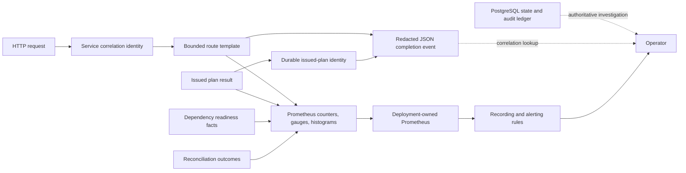

# Observability Module Specification

Status: as-built backend specification

Date: 2026-07-17

## 1. Decision

The service exports bounded Prometheus metrics, service-owned correlation
identities, and redacted JSON request diagnostics. Durable PostgreSQL state and
the audit ledger remain the authority for product facts; telemetry is a
loss-tolerant operational projection.

```text
ObservableOperations :=
  StandardMetricsProtocol
  and BoundedCardinality
  and ActionableObjectives
  and ExecutableAlerts
  and RedactedCorrelation
  and TelemetryCannotChangeDomainDecision
```

The official Python Prometheus client is preferred to a custom exporter because
it supplies a concurrency-safe registry, standard metric types, process
collectors, and the current text exposition contract. A custom implementation
would duplicate protocol and concurrency ownership without adding product
meaning.

OpenTelemetry is not a runtime dependency in this release. GitHub Actions does
not carry an admitted W3C trace context through the complete planning and
reconciliation loop, and no deployment-owned OTLP collector or retention policy
is selected. Adding an SDK and exporter would therefore add lifecycle and
failure modes without proving end-to-end causality. A later deployment may add
zero-code OpenTelemetry instrumentation when it owns the collector, sampling,
retention, and data-classification policy.

## 2. Owned Invariant

Operators can diagnose degraded safety, availability, latency, and optimization
state without exposing secrets, creating unbounded series, or allowing
telemetry to influence a CI decision.

```text
For every domain decision d and telemetry outcome t:
  decide(input, t=success) = decide(input, t=failure)
```

Any telemetry write exception is contained at the projection boundary. Metric
construction failure is a startup failure because a process that promises an
operability surface must be able to construct it.

## 3. Dataflow



No arrow returns from `METRICS`, `LOG`, `SCRAPER`, or `RULES` to planning,
verification, issuance, or reconciliation decisions.

## 4. Public API

```text
GET /healthz       -> JSON liveness
GET /api/v1/health -> JSON liveness
GET /readyz        -> generic JSON readiness
GET /api/v1/ready  -> generic JSON readiness
GET /metrics       -> authenticated Prometheus text exposition in connected runtime
```

`/readyz` returns HTTP 503 exactly when a dependency required by the selected
runtime path is unavailable, but its public body exposes only `ready` or
`not_ready`. Exact dependency classes remain bounded internal metric labels and
private diagnostics. Every readiness response is `no-store`, so neither a stale
ready state nor a stale failure can be reused across dependency transitions.
`/metrics` uses the content type emitted by
`prometheus-client`; it is not a product JSON API.

Connected runtime requires one deployment-owned, header-safe bearer whose value
cannot reuse any configured credential secret before metric rendering.
Comparison uses fixed-length digests and every metrics response is `no-store`. Disabled local runtime may
expose process metrics without this connected credential. The deployment must
still restrict the endpoint at the network boundary: application
authentication does not prove scrape-source identity, distributed abuse
control, or observability-network isolation. The endpoint has no repository,
actor, credential, source, signature, or token labels.

## 5. Cardinality Contract

| Dimension                                                 | Admitted source                                                           |                       Bound |
|-----------------------------------------------------------|---------------------------------------------------------------------------|----------------------------:|
| `result`, `reason`, `mode`, `state`, `surface`, `outcome` | Closed code-owned set plus `other`                                        |                    Constant |
| HTTP `method`                                             | Seven standard methods plus `OTHER`                                       |                           8 |
| HTTP `route`                                              | FastAPI route templates captured before router inclusion plus `unmatched` | Application route count + 1 |
| HTTP `status_class`                                       | `1xx` through `5xx` plus `unknown`                                        |                           6 |
| readiness `dependency`                                    | Constructor-admitted process dependency identifiers                       |    Runtime dependency count |

Repository names, refs, SHAs, pull request numbers, workflow run identifiers,
plan identifiers, audit identifiers, exception messages, and caller paths are
forbidden metric labels. They belong in bounded logs or authenticated read
models.

## 6. Required Signals

- plan requests by terminal result;
- FullCI fallback by bounded reason;
- verifier rejection and signed-envelope outcomes;
- invalid OIDC by bounded reason;
- configuration activation and compare-and-set conflict outcomes;
- unsafe omission and replay mismatch counters;
- runner-snapshot freshness and capacity decision mode;
- planning unavailability by a closed stage and reason algebra;
- GitHub API unavailability by bounded surface;
- HTTP count and duration by method, route template, and status class;
- overall and dependency readiness gauges;
- reconciliation background health, terminal transitions, and round outcomes;
- CI-economics subjects registered for collection and collection-item attempts by
  the closed capability outcome algebra;
- standard process, Python runtime, and garbage-collection collectors.

The normative objective formulas and alert thresholds are owned by
[`docs/reference/service-level-objectives.md`](../../reference/service-level-objectives.md).
Executable Prometheus rules are owned by
[`deploy/observability/ci-coordinator.rules.yml`](../../../deploy/observability/ci-coordinator.rules.yml).

## 7. Correlation Contract

Every HTTP response receives a fresh 128-bit service-generated correlation
identity. A caller-supplied correlation header is ignored. The completion log
contains:

```text
event, observedAt, service, level,
correlationId, method, route, statusCode, durationMs
```

After successful plan issuance it additionally contains:

```text
issuedPlanRecordId, planId, repositoryId, workflowRunId, runAttempt
```

`issuedPlanRecordId` joins to durable issued-plan state and its pair-owned audit
event. The provider run identity joins to reconciliation subjects. These fields
are diagnostic coordinates, not authorization evidence.

## 8. Failure Behavior

| Failure                              | Required behavior                                                                                                                 |
|--------------------------------------|-----------------------------------------------------------------------------------------------------------------------------------|
| Metric update fails                  | Preserve the product outcome; omit only that observation.                                                                         |
| Metric exposition fails              | Return 503; never fabricate a successful empty registry.                                                                          |
| Required dependency unavailable      | Readiness false and dependency gauge zero.                                                                                        |
| Structured logging fails             | Preserve the product outcome; no raw fallback print.                                                                              |
| Secret-like field reaches logger     | Recursively replace the value with `[REDACTED]`.                                                                                  |
| Final record exceeds its byte budget | Replace deterministic largest caller fields with `[RECORD_LIMIT]`, consider `event` last, and record `record_limit` sanitization. |
| Unknown route or method              | Project to `unmatched` or `OTHER`; never use caller text as a label.                                                              |
| Process restarts                     | Counters restart; deployment-owned Prometheus handles resets through `rate`/`increase`.                                           |

Application boundaries that deliberately convert dependency or projection
exceptions into FullCI must propagate cancellation and emit one bounded
planning-unavailability observation. Exception type, message, repository, and
request identity are not metric labels:

```text
CaughtPlanningFailure(stage, reason)
  => FullCI or withheld selected execution
  and planning_unavailable_total{stage, reason} += 1

CancelledPlanningWork => propagate cancellation
```


## 9. Proof Obligations

| Claim                           | Smallest falsifier                                                    |
|---------------------------------|-----------------------------------------------------------------------|
| Exposition is standard.         | `/metrics` returns JSON or a non-Prometheus content type.             |
| Cardinality is bounded.         | A raw path, repository, ref, or exception becomes a label.            |
| Telemetry is non-authoritative. | A metric or logger exception changes an issued plan.                  |
| Readiness is observable.        | A failed required dependency leaves `ci_coordinator_ready` at one.    |
| Correlation is service-owned.   | A caller controls the response correlation identity.                  |
| Readiness state is epoch-local. | A readiness response is cacheable across a dependency transition.     |
| Issuance is traceable.          | A successful plan log lacks provider-run or durable-plan coordinates. |
| Safety failures are alertable.  | Unsafe omission or replay mismatch has no executable alert.           |
| Rules match emitted series.     | A rule references a metric or label value the runtime cannot emit.    |

## 10. Implementation Mapping

```text
ci_coordinator/observability/metrics.py
ci_coordinator/observability/runtime_metrics.py
ci_coordinator/observability/request_observation.py
ci_coordinator/observability/logging.py
ci_coordinator/observability/readiness.py
ci_coordinator/api/http/correlation.py
ci_coordinator/api/http/routers/observability.py
ci_coordinator/runtime/readiness.py
ci_coordinator/runtime/reconciliation_service.py
deploy/observability/ci-coordinator.rules.yml
```

## 11. Non-Claims

- Process-local metric state is not durable product state.
- Local rule validation does not prove a production Prometheus scrape,
  Alertmanager route, notification delivery, retention policy, or dashboard.
- Request correlation is not distributed tracing and does not establish trust.
- SLO formulas do not authorize dynamic omission or prove provider correctness.
- Metrics do not replace the authenticated workbench, audit replay, or database
  evidence.
