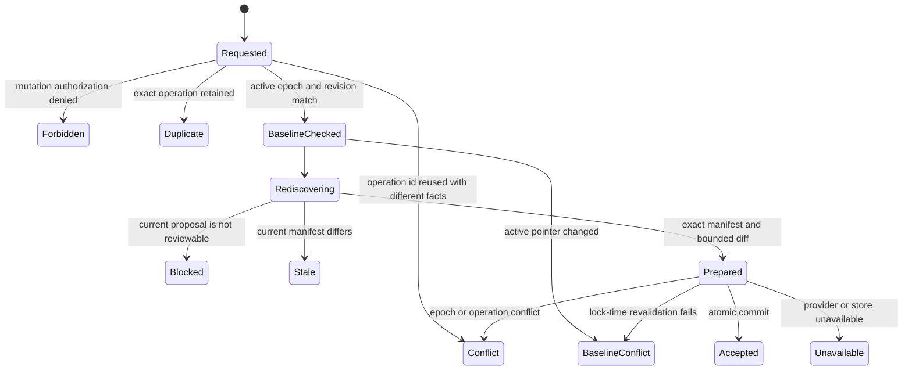

# Workflow Proposal Review And Registration

Status: as-built backend capability

Date: 2026-07-19

## 1. Decision

Add one application capability that accepts an exact current-head workflow
proposal, records the repository owner's affirmative review, and registers the
proposal's already admitted config epoch. Acceptance never activates the epoch,
changes provider state, dispatches work, or authorizes omission.

```text
Discovery produces Proposal
Review reproduces Proposal
Acceptance records Review and Registration
Acceptance does not produce Activation
```

This module owns no HTTP route. Production browser identity, role separation,
and the bounded HTTP mutation boundary are owned by
[Control-Plane Identity And Repository Attestation](control-plane-identity-and-repository-attestation.md),
which composes this application capability without widening its authority.

## 2. Safety Theorem

Let:

- `A` mean the trusted mutation authorizer admits actor `U` for scope `S`;
- `O` mean the scoped operation id resolves to an exact retained acceptance;
- `B0` mean the pre-discovery active pointer, including revision, equals the
  baseline observed by `U`;
- `P` mean a new current-default-head discovery reproduces the exact expected
  proposal manifest;
- `D` mean the semantic diff is deterministic and within its resource bounds;
- `M` mean scope `S` already retains an acceptance for that exact manifest;
- `B1` mean the active pointer still equals the observed baseline under the
  repository-scope transaction lock; and
- `T` mean one compatibility-admitted PostgreSQL transaction registers the
  epoch and appends both the immutable review row and its pair-owned audit
  event.

```text
SuccessfulOutcome(S, U) iff
  A and (O or (B0 and P and D and (M or (B1 and T))))

Created(S, U) iff A and B0 and P and D and not M and B1 and T

not A or not B0 or not P or not D => no attempted durable effect
O => return retained acceptance before proposal or workflow provider work
M => return the previously retained manifest acceptance without another write
commit(T) => Epoch and Review and Audit
abort(T) => not Epoch and not Review and not Audit
unknown(commit(T)) => reconcile by exact operation retry
```

Each conjunct blocks an independent counterexample. Without `A`, a caller can
cross repository authority. Without `B0` and `B1`, an await can approve against an ABA
baseline. Without `P`, a moved default head can retain stale workflow facts.
Without `D`, review evidence can be ambiguous or resource-unbounded. Without
`T`, an epoch, approval, or audit event can survive alone. Therefore no
creation conjunct is redundant. `O` is command idempotence. `M` is effect
idempotence: another authorized command cannot create a second affirmative
review for content already accepted in the same scope, and its duplicate result
returns the original actor and baseline rather than relabeling that review.

## 3. Ownership

| Fact or effect                                                       | Sole owner                                                                  |
|----------------------------------------------------------------------|-----------------------------------------------------------------------------|
| exact provider snapshot and proposal manifest                        | `workflow_discovery`                                                        |
| policy parsing, defaults, compilation, and epoch identity            | `config_control`                                                            |
| active pointer and immutable epoch registration                      | `config_epochs`                                                             |
| review command, semantic diff, acceptance record, and result algebra | `proposal_review`                                                           |
| cross-context sequencing and mutation authorization                  | `app.proposal_review`                                                       |
| serialized review, epoch, and audit commit                           | `persistence.proposal_review_repository`                                    |
| provider transport                                                   | existing GitHub workflow-discovery adapter                                  |
| control-plane authentication and role mapping                        | `control_plane_identity`                                                    |
| one-use reviewer OAuth and permission evidence                       | `app.repository_attestation` and `integrations.github.reviewer_attestation` |

`proposal_review` imports the stable proposal and config contracts but neither
owner imports `proposal_review`. Persistence receives one prepared acceptance
capability and cannot invent policy, review identity, or audit semantics.

## 4. State Machine



`Accepted` and `Duplicate` return the same retained semantic effect. A retry
after an unknown commit resolves by operation identity before another proposal
or workflow provider request, clock read, or write. Mandatory external
authorization evidence precedes entry into this service and therefore is not
bypassed by replay. A changed command sharing the operation id is never a
duplicate.

## 5. Command And Identity

An acceptance command contains only trusted actor context and client-observed
identity:

```text
scope = (installationId, repositoryId)
operationId
expectedManifestId
expectedActive = (scope, epochId, revision) | absent
actor
```

The operation id is non-empty bounded Unicode scalar text without `NUL`.
PostgreSQL text types cannot represent `NUL`; rejecting it in the command
algebra keeps every admitted identity persistable instead of translating one
valid domain value into a storage outage.

The active revision is mandatory when an active epoch exists. Epoch id alone
is insufficient because this legal sequence is an ABA counterexample:

```text
A@7 -> B@8 -> A@9
```

An acceptance prepared against `A@7` must reject at `A@9`. Exact absence is
also a baseline: a concurrent first activation invalidates it.

The retained record binds:

```text
scope
operationId
proposal manifest id
provider revision
inventory digest
baseline epoch id and revision, or exact absence
target epoch id
semantic diff version, bytes, and digest
pair-owned audit event id and input hash
```

The proposal manifest already content-binds the inventory digest, selected
workflow and signal, generated policy source hash, admitted epoch id, unknowns,
and non-claims. The inventory digest content-binds repository identity, exact
provider revision, every source identity, facts, unknowns, graph state, and
parser version. The acceptance record retains the coordinates needed to verify
that chain without copying the entire workflow report.

## 6. Review-Time Freshness

The service does not trust proposal bytes returned by a browser. It receives
only the expected manifest id and invokes the existing discovery service with
`revision = null`. That operation resolves the default branch once to an exact
commit and regenerates the proposal through existing policy admission.

```text
ReviewFresh := CurrentHeadDiscovery.manifestId = expectedManifestId
```

A baseline pre-read avoids unnecessary provider work. Because provider I/O is
an await boundary, the repository acquires the same repository-scope lock used
by activation and rechecks the complete active pointer before writing.

GitHub and PostgreSQL do not share a transaction. A provider head may advance
after the retained observation. This does not corrupt registration because the
registered epoch is immutable and non-active. The record truthfully retains the
reviewed revision. Any future activation or enforcement command must revalidate
provider freshness independently.

## 7. Semantic Diff

Source text is not semantic authority. The diff compares re-admitted normalized
policy documents:

```text
SemanticEqual(A, B) iff A.normalizedDocumentBytes = B.normalizedDocumentBytes
```

The `policy-semantic-diff/v1` projection emits canonical RFC 6901 pointers:

- unequal scalars or unequal types emit the current pointer;
- object keys are compared recursively in canonical UTF-16 order;
- an added or removed object key emits that key's pointer;
- an unequal array emits its array pointer as one atomic policy sequence;
- an absent baseline emits the root pointer `""`;
- equal normalized documents emit no pointer.

Treating arrays atomically avoids false precision when ordered policy rules are
inserted or moved. Omitting values prevents repository text from being copied
into audit or diagnostics. The canonical pointer tuple is bounded before clock
or database access and receives a domain-separated SHA-256 identity over its
algorithm version, baseline epoch id, target epoch id, and pointers.

## 8. Atomic Persistence Protocol

The repository executes this order inside one unit of work:

```text
compatibility shared fence
  -> repository-scope advisory transaction lock
  -> resolve operation and prior manifest acceptance
  -> re-read active pointer
  -> register exact re-admitted epoch
  -> append pair-owned acceptance audit event
  -> insert immutable acceptance row
  -> commit
```

The scope lock composes with config activation and prevents a baseline change
during the local transaction. The operation primary key rejects reuse; the
scope-and-manifest unique key prevents duplicate affirmative review. Foreign
keys bind baseline and target epochs and the audit event. Update and delete are
rejected by a database trigger.

The pair-owned audit event type is rejected by generic audit append. Therefore
an audit-only acceptance cannot be created through the public ledger port. An
epoch identity conflict, audit conflict, cancellation before commit, SQL
failure before commit, or stale baseline marks the transaction unsuccessful
and publishes no attempted effect. A failure or cancellation while PostgreSQL
is committing has an unknowable local outcome; the unit of work marks that
boundary and the adapter never reclassifies it as a known rollback. The caller
must resolve it through the same operation id before any provider refresh.

### 8.1 Runtime ACL Boundary

The bootstrap migration creates the review relation and grants it to neither
the runtime principal nor `PUBLIC`. Runtime access is installed later by the
explicit database-access command. Schema declaration and runtime grants remain
separate proof planes:

```text
Declared(C_review) and not RuntimeAcl(C_review) => no review repository exposure
Declared(C_review) and RuntimeAcl(C_review) => review repository may be exposed
```

The migration proves the relation, immutability machinery, owner, and absence
of unintended access. The operation's shared-fence admission proves the
current session has the exact admitted runtime grants. Thus a declared schema
capability does not become application authority before deployment-owned ACL
provisioning.

## 9. Authorization Boundary

The application accepts an actor only from a trusted Keycloak authentication
boundary and performs dedicated `configure`-role and browser-integrity
admission before store or provider work. The discovery service independently
enforces read authorization. This conjunction permits a deployment to grant
discovery without granting review.

No route is owned by this module. The browser route defined by
[Control-Plane Identity And Repository Attestation](control-plane-identity-and-repository-attestation.md)
supplies independently established Keycloak session identity, origin/CSRF
proof, and a one-use GitHub reviewer attestation bound to the exact proposal.
Break-glass and machine credentials cannot provide human review evidence.
Therefore UI visibility remains distinct from mutation authority.

## 10. Required Falsifiers

- a forbidden scope reaches either PostgreSQL or GitHub;
- a retry of a committed operation performs provider I/O or creates another
  row or audit event;
- the same operation id with another actor, manifest, or baseline is a
  duplicate;
- an explicit historical scan, blocked proposal, or changed current manifest
  is accepted;
- `A@r -> B@(r+1) -> A@(r+2)` passes baseline revalidation;
- a source-format-only change produces semantic field pointers;
- array reordering is reported as unrelated leaf edits;
- a diff above its pointer or byte bound reaches the clock or store;
- epoch registration survives an audit or review-row failure before commit;
- a failed or cancelled commit is reported as known rollback instead of
  outcome-unknown reconciliation;
- a generic audit append creates an acceptance event;
- an acceptance changes `active_config_epochs`;
- the runtime principal can update or delete a review row; or
- the bootstrap omits the review relation, constraints, immutability trigger,
  capability declaration, or default-deny grants.

## 11. Non-Claims

This module does not independently provide control-plane authentication or role
mapping, rejection comments,
multi-review quorum, policy activation, provider writes, workflow dispatch,
omission authority, live deployment proof, or proof that the provider head
remains current after the retained observation. Those capabilities require
separate owners and must not be inferred from a registered reviewed epoch. It
also does not claim deployment approval.
