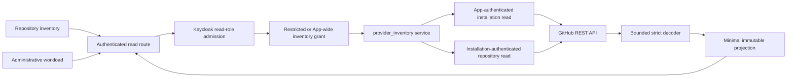

# Provider Inventory Module Specification

Status: as-built read-only query capability

Date: 2026-09-02

Owner: `provider_inventory`

## 1. Owned Invariant

`provider_inventory` projects a bounded read-only catalog from the
organization GitHub App. Control-plane identity admits the caller; deployment
configuration selects restricted installation IDs or App-wide read visibility.

```text
Visible(actor, installation, repository) iff
  AuthenticatedKeycloakPrincipal(actor)
  and HasReadRole(actor)
  and (InventoryMode = app or InstallationAllowlisted(installation))
  and AppInstallationExists(installation)
  and InstallationActive(installation)
  and RepositoryAccessibleToInstallation(repository, installation)
```

The HTTP boundary proves the first two conjuncts. The capability authorizer
proves the inventory grant before provider I/O. GitHub App and
installation credentials prove the remaining provider facts. Break-glass,
GitHub reviewer OAuth, and Actions OIDC credentials are not inventory
credentials.

Visibility is not mutation authority:

```text
ProviderRepositoryCatalog != ProviderWorkflowInventory
ProviderRepositoryCatalog != RepositoryAttestation
ProviderRepositoryCatalog != ConfigActivationAuthority
```

The module owns provider catalog evidence. It does not own repository policy,
workflow semantics, config registration or activation, provider mutation, or
production omission authority.

## 2. Boundary Algebra

```text
Control-plane request
  -> Keycloak session or machine-token authentication
  -> read-role admission
  -> deployment inventory grant (restricted or app)
  -> app-authenticated installation read
  -> exact-installation-authenticated repository read
  -> bounded strict decoder
  -> minimal immutable projection
  -> non-cacheable same-origin response
```

Authorization occurs before any provider call. App authentication is used only
for app-owned installation identity endpoints. Installation authentication is
used only for resources belonging to that exact installation.

```text
AppCredential cannot authenticate Caller
InstallationCredential(I) cannot be used for Installation(J), I != J
ProviderVisibility alone cannot widen ControlPlaneScope
ReviewerCredential cannot list Inventory
BreakGlassCredential cannot list Inventory
```

## 3. Domain Model

```text
InstallationIdentity := positive safe installation id
RepositoryIdentity := (InstallationIdentity, positive safe repository id)

InstallationSummary :=
  identity
  accountId
  accountLogin
  accountType
  repositorySelection
  state

RepositorySummary :=
  identity
  nodeId
  ownerId
  ownerLogin
  name
  fullName
  visibility
  defaultBranch
  archived
  disabled
  fork
  workbenchAuthorized
```

Names are mutable assertions. Numeric ids remain canonical. The complete
composite repository identity is retained through authorization and response
validation.

Every admitted repository page satisfies:

```text
for each repository in page.repositories:
  repository.scope.installationId = page.installation.installationId
  repository.ownerId = page.installation.accountId
```

The first relation prevents cross-installation substitution. The second
prevents a provider page for one organization account from being accepted
under another installation account even when mutable names look plausible.

## 4. Query Contract

```text
list_installations(actor, page = 1, perPage = 30)
  -> InstallationCatalog | Forbidden | Unavailable
list_repositories(actor, installation, page, perPage)
  -> RepositoryPage | Forbidden | IneligibleInstallation | Unavailable
```

Restricted mode is immutable process wiring. Its empty set produces an empty
complete page without provider I/O. Independent reads preserve partial failures.
App mode uses one bounded App-authenticated `GET /app/installations` page, so a
new installation requires no installation-ID configuration. Both modes carry
`page`, `perPage`, `hasNextPage` and `consistency = best_effort`. `complete`
describes the loaded page, never all installations. No total is invented.

App inventory plus a nonempty inventory allowlist is rejected. A connected,
non-enforcing App-inventory runtime may start with empty static command scopes.
Those scopes deny every command under the default restricted scope mode.
The independent explicit App scope mode projects eligible catalog rows as
workbench-authorized without additional per-row provider calls. Scoped commands
then independently recheck exact current repository membership through the
scope authorizer; the catalog is not an authorization cache. Disabled
repositories remain inaccessible. Restricted and enforcing runtimes retain
their nonempty static-scope requirement. See the
[inventory design](../../features/automatic-app-inventory.md) and the subsequent
[administrator access design](../../features/administrator-repository-access.md).

Repository pages use provider pagination with `perPage <= 100` and a bounded
page number. The response carries `observedAt`, `page`, `perPage`,
`totalCount`, `hasNextPage`, and `consistency = best_effort`.

```text
hasNextPage => response Link evidence contains one admitted next relation
unknown or contradictory pagination => Unavailable(malformed_provider_response)
```

Provider pagination is not a snapshot. A caller may display loaded pages but
cannot claim a complete organization inventory until an independently bounded
scan closes every page without drift.

## 5. Failure Algebra

| Provider or policy fact                                                | Result                                            |
|------------------------------------------------------------------------|---------------------------------------------------|
| missing or invalid Keycloak identity                                   | HTTP 401 before use-case execution                |
| identity dependency unavailable                                        | HTTP 503, never 401                               |
| caller lacks `read` role                                               | HTTP 403 before provider I/O                      |
| restricted installation not allowlisted                                | forbidden before provider I/O                     |
| restricted mode without installations                                  | valid empty catalog; no provider I/O              |
| App mode without explicit IDs                                          | bounded App-owned installation page               |
| user-account installation                                              | ineligible for organization adoption              |
| suspended installation                                                 | ineligible and no repository listing              |
| 401/403/404 from GitHub                                                | typed unavailable or removed; never empty success |
| 429 or documented rate-limit 403                                       | rate-limited with safe retry metadata             |
| timeout, TLS, DNS, redirect, or oversized body                         | unavailable                                       |
| malformed JSON, identity mismatch, duplicate id, or invalid pagination | malformed provider response                       |
| repository owner differs from installation account                     | provider binding mismatch                         |
| one installation lookup fails in a catalog                             | partial catalog with typed failure row            |

The API never returns provider response bodies, tokens, private keys, arbitrary
headers, or credential-bearing URLs. Every response is `Cache-Control:
no-store`.

## 6. Dataflow



## 7. Module Boundaries

| Surface                                              | Responsibility                                                |
|------------------------------------------------------|---------------------------------------------------------------|
| `provider_inventory/model.py`                        | immutable identities, summaries, pages, and outcomes          |
| `provider_inventory/ports.py`                        | provider, authorization, and use-case capabilities            |
| `provider_inventory/permissions.py`                  | control-plane actor and deployment-scope projection           |
| `provider_inventory/service.py`                      | authorization-first orchestration and bounded partial catalog |
| `integrations/github/provider_inventory.py`          | GitHub protocol outcome mapping                               |
| `integrations/github/provider_inventory_decoding.py` | endpoint-specific strict JSON decoding                        |
| `api/http/routers/provider_inventory.py`             | authentication, read-role admission, and HTTP projection      |

The provider adapter does not know HTTP DTOs or Keycloak roles. The route does
not decode GitHub. The UI does not call GitHub. The service receives only a
canonical actor id and capability ports.

The app transport admits exact installation reads and the bounded canonical
page query for `GET /app/installations`. An unrelated resource, mutation or
noncanonical query fails before credential construction or provider I/O.

## 8. Required Falsifiers

- an unauthenticated, role-unauthorized, or installation-unauthorized request
  reaches GitHub;
- a GitHub App JWT or installation token appears in a response, log, repr,
  source map, error, or fixture snapshot;
- installation `I` returns repositories under installation `J`;
- installation account `A` returns a repository whose immutable owner id is
  not `A`;
- two installations with the same organization login alias each other;
- a repository rename changes canonical repository identity;
- a suspended or user-account installation is presented as eligible;
- an incomplete page is presented as a complete catalog;
- malformed Link evidence or contradictory total counts becomes empty success;
- a rate limit is mapped to forbidden or retried without a bound;
- one failed authorized installation hides successful independent rows;
- an empty restricted authorization set performs provider I/O;
- a reviewer, break-glass, or Actions credential is accepted for inventory;
  or
- provider visibility is presented as config registration or enforcement.

## 9. Non-Claims

This module does not prove enterprise organization membership, a repository
manager's action authority, workflow behavior, repository eligibility beyond
the declared structural flags, exact-commit workflow inventory, configuration
readiness, ruleset administration, or production enforcement.
