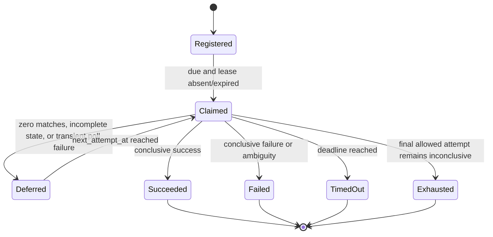

# Reconciliation Module Specification

Status: module specification

Date: 2026-07-17

## 1. Owned Invariants

Reconciliation compares one immutable selected execution with provider state for
the exact GitHub Actions `workflow_run_id + run_attempt`. It never promotes a
missing, foreign-run, foreign-attempt, skipped, neutral, stale-claim, contradictory,
or ambiguous occurrence to semantic success.

The module also owns bounded convergence. Subject liveness is conditional on
fair scheduling and eventual persistence availability; under those conditions a
nonterminal subject is retried only within its immutable deadline and attempt
budget, then becomes a durable terminal failure. A service outage can delay the
transaction that records timeout, but cannot extend or reset the retained
deadline.

```text
ConclusiveSuccess(s)
  iff every ProviderSignal in Contract(s) resolves to exactly one provider job
      in SubjectRun(s), whose admitted state history contains one
      noncontradictory completed-success conclusion
      and no admitted failure or contradiction exists

SubjectRun(s) := (s.workflow_run_id, s.run_attempt)

AdmittedObservation(o, s)
  iff o.subject_id = s.subject_id
      and (o.workflow_run_id, o.run_attempt) = SubjectRun(s)
      and o.provider_job_id is a positive JSON-safe provider identity

EventuallyAvailablePersistence(s) and FairScheduling(s)
  => Eventually DurableTerminalResult(s)
```

## 2. Public Contract

```text
register_subject(subject, contract) -> SubjectRegistration
claim_next(worker_id, now, policy) -> ReconciliationAttemptClaim | absent
load_snapshot(claim) -> ReconciliationSnapshot | ClaimLost
append_observation(claim, expected_revision, observation) -> ObservationAppend | ClaimLost
defer_claim(claim) -> ConvergenceState | ClaimLost
record_result(claim, expected_revision, terminal_result) -> ResultRecord | ClaimLost
poll(subject, provider_signals) -> observations | ProviderSignalAmbiguity
reconcile(snapshot) -> ReconciliationResult
ReconciliationScheduler.stop_and_drain(timeout_ms) -> None
ReconciliationScheduler.wait_for_active() -> absent | succeeded | failed
```

`subject` is an immutable repository, event, SHA, ref, workflow-run, and
run-attempt identity. `subject_id` is the SHA-256 digest of its canonical
identity; callers cannot choose an opaque alias.

`ReconciliationContract` contains two disjoint fact classes:

- `provider_signals`: exact selected-execution identities derived from
  `execution_profile_id + shard_id`.
- `omitted_signals`: planning proof and audit facts for obligations that were
  deliberately omitted.

An omitted obligation is not a provider job. The observer receives only
`provider_signals`; it never synthesizes an occurrence for an omitted fact.
The runtime registration path requires provider identities projected from the
same `SelectedExecution` that can be issued. If no such identity exists,
selected issuance fails closed to FullCI without fabricating a native job name.

## 3. Exact Provider Observation

For each signal `p`, the GitHub adapter requests the attempt-specific jobs
resource for `SubjectRun(s)` and admits an occurrence only under this predicate:

```text
Matches(job, p, s)
  iff job.run_id = s.workflow_run_id
      and requested_attempt = s.run_attempt
      and job.name = p.job_name

Satisfies(p, s, jobs)
  iff cardinality({job | Matches(job, p, s)}) = 1
```

The cardinality cases are exhaustive:

| Matching jobs | Meaning                                                                               |
|--------------:|---------------------------------------------------------------------------------------|
|           `0` | Incomplete provider state; remain pending and retry within the retained bounds.       |
|           `1` | Create one `ProviderOccurrence` bound to the exact run and attempt.                   |
|          `>1` | Terminal provider ambiguity; identity is not unique, so no conclusion is trustworthy. |

Foreign-run payloads are rejected as malformed provider evidence. A foreign
attempt cannot satisfy the predicate because the attempt is part of the exact
requested resource. Pagination is complete before cardinality is decided, so a
duplicate on a later page cannot be missed.

The durable observation retains `workflow_run_id`, `run_attempt`, and
`provider_job_id`; it does not retain only a caller-labelled subject digest.
Snapshot construction, observation CAS, and both codec directions independently
enforce `AdmittedObservation`. Distinct provider job identities retained for one
signal are terminal ambiguity even if inconsistent provider snapshots exposed
them on separate polls.

## 4. Durable Convergence State Machine

Each subject retains:

```text
created_at, deadline_at, next_attempt_at
attempt_count, max_attempts
backoff_seconds, max_backoff_seconds
claim_generation, lease_token, lease_acquired_at, lease_expires_at
```

All durations and counters have domain, codec-profile, and PostgreSQL bounds.
All decisions use the injected `Clock`; wall-clock calls are not hidden in the
domain or adapters.



Claim acquisition increments `claim_generation`; a pollable claim also
increments `attempt_count`. The final allowed attempt is allowed to succeed. It
becomes `attempts_exhausted` only if its outcome remains inconclusive or the
provider poll fails. Deadline dominates every late result.

Every nonterminal deferral derives deterministic equal jitter in
`[ceil(backoff_seconds / 2), backoff_seconds]` from the exact subject and attempt
identity, then computes `next_attempt_at = min(deadline_at, now + jitter)`. The
retained base backoff doubles up to the immutable maximum. The jitter is
replay-stable and can desynchronize unrelated subjects; hash collisions are
allowed and do not affect safety. It does not use process randomness or wall
time. The load-smoothing rule is independent of whether the preceding poll was
incomplete, unavailable, or timed out.

Only `ReconciliationPollUnavailable` and expiry of the round-owned poll deadline
permit an availability retry. An arbitrary exception is a programming or
contract defect and propagates to the scheduler; catching it as transient would
assert retry safety without evidence. A `pending` result is never persisted.
Terminal states are `success` or `failure`; timeout, attempt exhaustion, and
signal ambiguity are explicit failure findings.

## 5. Replica Ownership and Transactions

The database selects one due unresolved subject using
`FOR UPDATE OF reconciliation_subjects SKIP LOCKED`. In the same short
transaction, acquisition advances generation and stores a derived lease token
and expiry under CAS. External provider I/O begins only after this transaction
commits; no database lock is held across network I/O.

```text
AuthorizedOwner(s, c, t)
  iff StoredToken(s) = c.token
      and StoredGeneration(s) = c.generation
      and c.claimed_at <= t
      and t < StoredLeaseExpiry(s)

forall c1, c2:
  AuthorizedOwner(s, c1, t) and AuthorizedOwner(s, c2, t) => c1 = c2
```

An active lease prevents another compliant replica from claiming the subject.
The provider timeout is strictly shorter than the lease, so cancellation-aware
pollers finish before ordinary reclaim. After expiry, a replacement may poll;
a delayed former owner cannot append, defer, release, or record because every
mutation rechecks token, generation, and expiry. A finite lease cannot prevent
physical network overlap with a process that ignores cancellation or is paused
beyond its lease; fencing prevents that process from changing durable truth.
Lease duration is bounded relative to retained `lease_acquired_at`, not the
subject deadline, so a timeout claim remains valid even after a long outage.

Atomic effects are:

```text
Claim := generation + attempt + lease
Observation := observation row + subject revision CAS
Terminal := result + lease release + terminal audit + derived shadow evidence
Registration := subject + planning audit
```

Each effect commits once in one UnitOfWork or rolls back completely.
Cancellation propagates unchanged and cannot commit. Exact replay after an
uncertain commit is idempotent; byte-different replay is a conflict. Duplicate
classification precedes revision conflict only for the exact retained effect,
so retrying a successful commit is safe without allowing a new stale write.

## 6. Runtime and Failure Behavior

```text
ZeroMatchingOccurrence       => retry until deadline/attempt bound
ProviderReadFailure          => retry until deadline/attempt bound
UnexpectedPollDefect         => propagate; no retry classification
MultipleMatchingOccurrences => terminal ambiguous_provider_signal failure
DeadlineReached              => terminal reconciliation_timed_out failure
AttemptsExhausted            => terminal reconciliation_attempts_exhausted failure
StaleOrExpiredClaim          => ClaimLost; no durable mutation
ForeignRunObservation        => rejected at the provider boundary; never satisfies
ForeignAttemptObservation    => rejected by observer, snapshot, CAS, and row codec
ObservedOmittedObligation    => impossible; omitted obligations are not polled jobs
```

The non-enforcing runtime has no provider success publisher. It may retain
terminal reconciliation and shadow evidence, but cannot create a GitHub green
state. A fallback path may register only the exact workflow aggregate gate
proved by the revision-bound target registry and provider inventory. Selected
witness-shard execution uses only identities projected from its signed
`SelectedExecution`; selected native execution uses its declared aggregate
gate. Missing shard manifest or capacity evidence does not erase an already
proved fallback gate. If target authority is unavailable, the runtime records
no reconciliation subject rather than inventing a provider identity.

The scheduler is process-local single-flight. A later interval starts only
after the accepted round terminates. Startup readiness succeeds only after one
successful round; a later failed round makes readiness false until recovery.
Shutdown rejects future ticks, signals the accepted round, and waits only for
the admitted drain bound. If cancellation interrupts work after claim, no false
terminal result is written and the durable lease eventually permits recovery.

## 7. Proof Obligations

| Obligation                                | Falsifier                                                                                                     |
|-------------------------------------------|---------------------------------------------------------------------------------------------------------------|
| Exact run binding.                        | A job or canonically encoded observation whose `workflow_run_id` differs from the subject satisfies a signal. |
| Exact attempt binding.                    | Attempt 1 evidence satisfies an attempt 2 subject.                                                            |
| Unique-name identity.                     | Zero or two provider job identities named `ProviderSignal.job_name` become one success.                       |
| Complete pagination.                      | A duplicate matching name on a later page is not detected.                                                    |
| Omission/provision separation.            | An omitted obligation is emitted or polled as a native provider job.                                          |
| Missing state is bounded, not successful. | Zero matches become success or remain pending past the immutable bounds.                                      |
| Final attempt is usable.                  | A conclusive final allowed attempt is replaced by exhaustion.                                                 |
| Deadline is authoritative.                | A provider response observed at or after the deadline becomes success.                                        |
| One authorized owner.                     | Two unexpired claims with different token/generation pairs can mutate one subject.                            |
| Stale-owner fencing.                      | An expired or superseded claim appends, defers, releases, or records.                                         |
| Claim acquisition is atomic.              | Attempt/generation changes without the corresponding lease, or vice versa.                                    |
| Terminal persistence is atomic.           | Result, audit, evidence, or lease release commits without all required counterparts.                          |
| Pending is not durable terminal state.    | A `pending` row exists in `reconciliation_results`.                                                           |
| Cancellation is non-committing.           | Cancelled work leaves a partial observation or terminal effect.                                               |
| Non-enforcing means non-publishing.       | Reconciliation creates or updates a successful provider check.                                                |

## 8. Implementation Mapping

```text
ci_coordinator/execution_orchestration/provider_signal.py
ci_coordinator/reconciliation/contract.py
ci_coordinator/reconciliation/convergence.py
ci_coordinator/reconciliation/poll_outcome.py
ci_coordinator/reconciliation/state_machine.py
ci_coordinator/reconciliation/ports.py
ci_coordinator/app/reconciliation_registration.py
ci_coordinator/app/reconciliation_round.py
ci_coordinator/app/shadow_reconciliation.py
ci_coordinator/integrations/github/reconciliation_observer.py
ci_coordinator/persistence/reconciliation_queries.py
ci_coordinator/persistence/reconciliation_state_repository.py
ci_coordinator/persistence/reconciliation_pair_repository.py
ci_coordinator/persistence/runtime_adapters.py
```

## 9. Acceptance Evidence

- pure state-transition and bound table tests.
- exact run, attempt, name-cardinality, and pagination falsifiers.
- retry, final-attempt, deadline, ambiguity, cancellation, and claim-loss tests.
- real-PostgreSQL two-replica claim, lease expiry, stale fencing, restart,
  atomic terminal pair, rollback, attestation-tamper, and downgrade tests.
