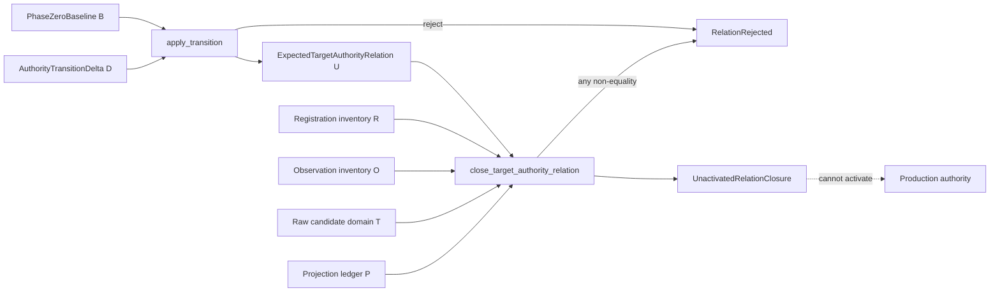

# Target Authority Relation

Status: implemented dormant contract; provider production and activation are deferred

Date: 2026-08-31

Implemented requirement: `REQ-CI-RUNTIME-031`

Implemented companion requirement: `REQ-CI-RUNTIME-032`

Deferred production-successor requirement: `REQ-CI-RUNTIME-030`

Implementation plan:
[Target Authority Relation Implementation Plan](../../features/target-authority-relation-implementation-plan.md)

## 1. Decision Summary

`target_authority_relation` is a pure capability that closes the finite,
content-addressed part of a native-FullCI-to-selective-CI authority transition.
It does not read GitHub, time, process state, environment, SQL, or runtime
settings, and it cannot activate omission.

```text
ClosedTransition(B, D) -> U or typed rejection

ClosedComparison(B, D, R, O, T, P)
  -> UnactivatedRelationClosure or typed rejection

UnactivatedRelationClosure -/-> ProductionOmissionAllowed
```

Where:

- `B` is the non-empty owner-approved pre-adaptation baseline;
- `D` is the owner-approved total disposition and introduction delta;
- `U = Apply(B, D)` is the non-empty expected adapted relation;
- `R` is the registration inventory;
- `O` is the observation inventory;
- `T` is the observation producer's complete raw candidate domain; and
- `P` is the total candidate-to-observed-row projection ledger.

The capability is necessary but intentionally insufficient for production
authority. Strict workflow source binding, independently implemented producers,
provider-governance authority, durable evidence, generation fencing, and the
atomic production cutover remain separate conjuncts.

## 2. Public Dataflow



The sole public closure operation receives `B` and `D`, derives `U` internally,
and then compares evidence. A caller-supplied expected relation therefore
cannot bypass transition conservation.

## 3. Identity And Epoch

Every artifact is bound to one exact `TargetAuthoritySubject`:

```text
Subject = RepositoryScope(installation_id, repository_id) + authority_id
```

Every artifact also carries one exact `TargetAuthorityEpoch`. Its component
states are `present`, `not_applicable`, or `unknown`; adapted-target epochs
require all six components to be applicable:

1. stable workflow source manifest;
2. provider governance;
3. target policy;
4. validation catalog;
5. target registry; and
6. owner approval.

The native Phase-0 epoch permits policy, catalog, and registry to be
`not_applicable`, but source, provider, and owner remain applicable. Baseline,
delta, expected relation, registration, observation, raw domain, and projection
must agree on subject and the applicable epoch relation. Unknown evidence never
coerces to absence or success.

Producer identity is a bounded `(producer_id, version)` pair. Registration and
observation producer identities must differ. The raw domain and projection
ledger must have the observation producer identity.

```text
ProducerIdentity(R) != ProducerIdentity(O)
```

This is a necessary structural condition, not proof of independent key-space
derivation. Stage B must enforce and witness that operational property.

## 4. Finite Row Algebra

Each row has an exact key, disposition, semantic owner, source locator, and a
closed family-specific field set. Every field is explicitly `present`,
`not_applicable`, or `unknown`.

| Family                       | Required fields                                                          | Conditional fields                                                               |
|------------------------------|--------------------------------------------------------------------------|----------------------------------------------------------------------------------|
| `consumer_contract_scenario` | `definition`, `sourceIdentity`                                           | none                                                                             |
| `job`                        | `needs`, `roleSet`, `semanticProjection`, `workflowIdentity`             | `executionKind`, `profileSet`                                                    |
| `provider_gate`              | `enforcementState`, `providerProjection`                                 | `bypassActors`, `checkAppBinding`, `mergeQueueRelation`, `requiredCheckIdentity` |
| `provider_repository`        | `apiVersion`, `defaultBranch`, `repositoryIdentity`                      | none                                                                             |
| `target_policy`              | `compiledPolicy`                                                         | none                                                                             |
| `target_registry_adapter`    | `definition`                                                             | none                                                                             |
| `target_registry_metadata`   | `definition`                                                             | none                                                                             |
| `target_registry_profile`    | `definition`                                                             | none                                                                             |
| `target_registry_workflow`   | `definition`                                                             | none                                                                             |
| `validation_obligation`      | `definition`                                                             | none                                                                             |
| `validation_profile`         | `definition`, `evidenceIdentity`                                         | none                                                                             |
| `validation_witness`         | `definition`                                                             | none                                                                             |
| `workflow`                   | `activeState`, `contentIdentity`, `semanticProjection`, `triggerSurface` | none                                                                             |

Required fields cannot be `not_applicable`. Unknown fields are representable in
observed evidence so uncertainty is retained, but are forbidden in the
baseline, transition successors, introductions, and expected relation. Any
unknown registration or observation row prevents closure.

Canonical full-row bytes, not a member ID alone, define equality:

```text
EqualRow(a, b) := CanonicalBytes(a) = CanonicalBytes(b)
```

Changing a key, disposition, semantic owner, source locator, field state, or
field value changes the row digest or is rejected by the closed schema.

## 5. Transition Conservation

The baseline is non-empty, native-epoch, unknown-free, content-addressed, and
bound to one producer and owner-approval digest. The delta binds the exact
baseline digest, adapted epoch, producer, owner-approval digest, and two
canonical sets:

- one disposition for every baseline key; and
- zero or more explicitly attributed introductions.

```text
forall b in B:
  exactly one d in D.dispositions where d.predecessor = b.key

Disposition(d) in {retained, replaced, retired}

retained -> exactly one successor and EqualRow(successor, predecessor)
replaced -> one or more successors and no successor equals predecessor
retired  -> no successor
introduced(k) -> k not in Keys(B)
```

Every produced successor key must be unique across all dispositions and
introductions. An introduction cannot reuse a baseline key because that would
encode a replacement as a retirement plus an introduction and make the three
disposition kinds non-disjoint. An omitted or extra baseline disposition,
invalid retention, replacement, or introduction, duplicate successor key,
empty resulting relation, subject mismatch, or baseline-digest mismatch returns
`RelationRejected` and no expected relation.

The whole delta has one owner-approval digest. Per-row reasons are diagnostic
and attribution fields; they do not replace owner approval.

## 6. Total Domain And Exact Comparison

The registration source domain is exactly `U`:

```text
R.source_domain_digest = Digest(U)
R.source_item_count = |U|
```

The observation source domain is exactly `T`:

```text
O.source_domain_digest = Digest(T)
O.source_item_count = |T|
```

The comparator additionally requires:

```text
Subject(R) = Subject(O) = Subject(T) = Subject(P) = Subject(U)
Epoch(R) = Epoch(O) = Epoch(T) = Epoch(P) = Epoch(U)
WorkflowManifest(R) = WorkflowManifest(O) = SourceManifest(U)
Complete(R) and Complete(O) and Complete(T) and Complete(P)
Keys(R) = Keys(O) = Keys(U)
forall k in Keys(U): R[k] = O[k] = U[k]
```

For the raw-domain projection:

```text
forall t in T: exists exactly one p in P where p.candidate_id = t.id
forall p in P: p.row exists in O and p.row_digest = Digest(O[p.row_key])
forall p in P: Family(p.row_key) = ProjectedFamily(T[p.candidate_id].kind)
forall o in O: exists p in P where p.row_key = o.key
```

Many raw candidates may legitimately project to one semantic row. No candidate
may be absent, unknown, multiply classified, or projected to a missing or
mismatched row. `workflow_blob` projects only to `workflow`; every other raw
candidate kind projects only to its same-named row family. No observed row may
remain unprojected. Producer correctness beyond this closed structural mapping
remains a Stage B evidence obligation.

The affirmative result is content-addressed and binds every input digest,
producer identity, row count, and candidate count. Its serialized
`authorityState` is permanently `unactivated`.

## 7. Failure Algebra

Failures are canonical, non-empty, unique `RelationFinding` tuples. The closed
codes distinguish these classes:

- baseline conservation and successor collisions;
- baseline-key reuse by a purported introduction;
- subject, epoch, and workflow-manifest mismatches;
- incomplete registration, observation, raw-domain, or projection evidence;
- registration and observation source-domain digest or count mismatches;
- missing, extra, unknown, or byte-mismatched relation rows;
- unknown, unclassified, multiply classified, or foreign raw candidates;
- missing, digest-mismatched, or family-incompatible projections; and
- unprojected observation rows.

All failure paths are fail-closed with respect to this capability:

```text
exists finding -> no UnactivatedRelationClosure
```

The result still does not decide runtime fallback. The later production owner
must map missing or invalid relation evidence to FullCI or enforcing startup
rejection under its own contract.

## 8. Canonicalization And Bounds

All public artifacts have versioned schemas, strict exact-key decoders, exact
runtime container types, canonical UTF-8 JSON, UTF-16 object-key ordering, and
domain-separated SHA-256 identities. Aggregate constructors and codecs enforce
the same relation count and document bounds. Decoding first applies the byte
bound and strict duplicate-key/scalar admission, then requires exact canonical
bytes and the relation depth/node profile before constructing typed artifacts.

| Resource             |  Bound |
|----------------------|-------:|
| Relation rows        |  4,096 |
| Raw candidates       | 16,384 |
| Fields per row       |     16 |
| Field value          |  1 MiB |
| Row                  |  2 MiB |
| Relation document    | 32 MiB |
| Canonical JSON depth |     16 |
| Canonical JSON nodes | 65,536 |

The smaller applicable bound wins. These bounds limit the representable pure
artifact; they do not prove a production retention or throughput budget.

## 9. Module Ownership

| File                    | Sole responsibility                                                          |
|-------------------------|------------------------------------------------------------------------------|
| `limits.py`             | Relation resource constants.                                                 |
| `_canonical.py`         | Domain-separated canonical encoding and hashing.                             |
| `model.py`              | Closed row, subject, epoch, producer, and scalar admission algebra.          |
| `transition.py`         | Phase-0 baseline, delta, and deterministic transition.                       |
| `inventory.py`          | Registration/observation inventories and total raw-domain projection values. |
| `outcomes.py`           | Typed findings, rejection, and unactivated closure.                          |
| `comparison.py`         | Transition-first exact closure algorithm.                                    |
| `_model_decoding.py`    | Strict primitive and row decoding.                                           |
| `_artifact_decoding.py` | Strict aggregate artifact decoding.                                          |
| `codec.py`              | Public exact round-trip codecs.                                              |
| `__init__.py`           | Explicit public capability facade.                                           |

The package may import only itself, `RepositoryScope` from its exact
`config_control.contracts` owner, and the exact canonical JSON, strict JSON,
hashing, and ordering primitives that it uses from `kernel`. Importing either
facade is forbidden because their eager exports would also load policy-admission
or clock mechanisms. Both the Python import-boundary gate and the
module-ownership profile enforce the package's mechanism isolation.

`model.py` exceeds the repository's line-count review signal. Size alone is not
a semantic violation: the file owns one closed mutually dependent value
algebra, no I/O or decision orchestration, and its decoders are already
separate. Split it only if a stable independent responsibility and a strictly
preferable safe decomposition are proved.

## 10. Witnesses

The current unit witness set covers:

- all row-family field schemas and every row-component identity mutation;
- exact distinction among present, not-applicable, and unknown;
- adapted-epoch completeness;
- missing, extra, invalid, colliding, and vacuous transition counterexamples;
- retirement-plus-reintroduction relabelling and aggregate-bound counterexamples;
- transition recomputation inside the closure operation;
- exact inventory equality and agreed-omission rejection;
- source-domain digest and count binding;
- incomplete, stale-epoch, mismatched, unknown, and unprojected evidence;
- total, single, and family-compatible candidate classification;
- producer identity collision;
- exact codec round trips, non-canonical input, duplicate keys, unknown keys,
  authority-state escalation, and subclass rejection.

Repository gates additionally own import boundaries, module ownership,
requirements/Proofkit routing, lint, formatting, type checking, and the full CI
test execution. These witnesses are bounded counterexample checks, not a proof
of producer independence, provider truth, production capacity, or universal
correctness.

## 11. Deferred Conjuncts

The following remain outside this module and must be completed in order. The
stable manifest, source binding, and pure Stage B producers are implemented by
the companion modules governed by `REQ-CI-RUNTIME-032`.

1. pre-adaptation native baseline capture from independent owner and provider
   inventories;
2. strict live provider-governance evidence;
3. durable evidence retention and dormant shadow comparison;
4. successor receipt, generation-fenced persistence, replica drain, and atomic
   production cutover; and
5. pilot target shadow-canary wall-time, runner-occupancy, CPU-time, fallback, and
   unsafe-omission evidence.

No item may be inferred from the existence of this pure package. Revision is
required if a row family, identity component, source-domain definition,
producer boundary, activation state, or admitted dependency changes.
