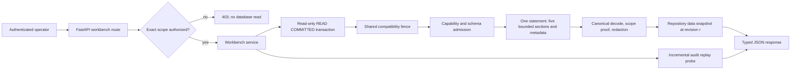

# Workbench Read Models Module Specification

Status: as-built read-only query capability; composed browser review is owned
by a separate command boundary

Date: 2026-07-19

## 1. Decision Summary

The backend exposes one authenticated, repository-scoped, bounded snapshot for
the operator workbench:

```http
GET /api/v1/workbench/repositories/{installation_id}/{repository_id}?limit=10
```

The query side uses lightweight CQRS inside the modular monolith. It reads the
same PostgreSQL authority as command use cases; it creates no second database,
broker, eventual-consistency protocol, or mutation authority.

The response contains redacted recent plans, reconciliation runs, operator
overrides, config epochs, scoped audit events, a ledger revision, replay status,
and per-section truncation facts. The limit applies independently to every
section and is admitted in `[1, 20]`.

## 2. Owned Invariant

Let:

- `p` be an authenticated operator principal;
- `s = (installation_id, repository_id)` be one repository scope;
- `A(p, s)` mean the runtime authorizer grants `p` access to `s`;
- `D(s, r)` be durable repository facts visible at database revision `r`;
- `R(D)` be the redacted workbench projection.

The operation is defined only when:

```text
WorkbenchRead(p, s, limit) = R(D(s, r))
  iff A(p, s)
  and 1 <= limit <= 20
  and one compatibility-admitted read-only snapshot contains every returned row
  and every indexed scope agrees with its canonical or hashed authority
```

It follows that the module may reveal admitted facts but cannot create semantic
success, activate policy, roll back config, apply an override, alter proof facts,
or dispatch provider work.

## 3. Authority And Safety Laws

| Law                                      | Enforcement                                                                                                                                        |
|------------------------------------------|----------------------------------------------------------------------------------------------------------------------------------------------------|
| Authenticate before authorize or read.   | The HTTP route resolves the bearer principal before invoking the use case.                                                                         |
| Authorize the exact scope.               | `RepositoryWorkbenchService` calls `allows_scope(actor, scope)` before persistence or replay probes.                                               |
| Read one coherent state.                 | The adapter uses one statement for all sections and metadata in a `READ COMMITTED`, `READ ONLY` PostgreSQL transaction.                            |
| Establish no stale pre-fence projection. | Capability admission and the projection execute in separate statements after the shared compatibility fence; neither retains a pre-fence snapshot. |
| Bound work and output.                   | Every section query requests `limit + 1`; the extra row proves truncation and is never returned.                                                   |
| Preserve stable order.                   | Every query has an explicit descending temporal key and deterministic identity tie-breaker.                                                        |
| Bind scope to authority.                 | Plan and reconciliation scope columns are checked against signed or canonical records; audit scope is part of `inputHash` and `eventHash`.         |
| Fail closed on corrupt projections.      | Canonical decoders and per-event cryptographic integrity checks run before DTO construction.                                                       |
| Do not overclaim ledger validity.        | A snapshot is `valid` only when the shared replay probe has verified a prefix through at least the snapshot ledger revision.                       |
| Redact execution secrets.                | The view model omits plan signatures, bearer credentials, source config bytes, and reconciliation lease tokens.                                    |

## 4. Dataflow



The repository observes all five sections in one statement. The replay probe
runs separately because it owns a process-local verified-prefix checkpoint. The
service therefore binds its result to the repository snapshot revision instead
of assuming temporal simultaneity:

```text
ReplayStatus(snapshot_revision, verified_revision) = valid
  only if verified_revision >= snapshot_revision
```

## 5. Transaction Proof

Claim: the selected isolation mode returns one post-admission snapshot without
blocking ordinary domain writers for the duration of UI serialization.

Proof:

1. `READ COMMITTED` obtains a new snapshot for each statement; timeout and
   blocking-fence statements cannot retain a pre-migration snapshot for later reads.
2. An online migration requires the exclusive form of the same transaction
   fence, so it cannot overlap the admitted query interval.
3. Capability admission executes after the shared fence has been obtained.
4. One subsequent statement observes the ledger revision, statement time and
   all five independently bounded sections under one MVCC snapshot.
5. Unique family positions preserve the independent limits without a Cartesian
   product; ordinary domain writers remain unblocked.
6. Therefore the returned sections are mutually coherent at an admitted database
   state without domain-row locks or a session-lock lifecycle.

The [snapshot decision](../../features/database-observation-snapshots.md) owns
the countermodels, alternatives and native causal witnesses. READ ONLY forbids
mutation, but does not substitute for the separate capability and scope proofs.

## 6. Projection Contract

| Section       | Included facts                                                                        | Deliberately omitted facts                         |
|---------------|---------------------------------------------------------------------------------------|----------------------------------------------------|
| Plans         | request/run identity, selected and omitted obligations, witnesses, profiles, fallback | Ed25519 signature and raw envelope                 |
| Runs          | subject identity, convergence state, findings, lease activity and expiry              | lease token and observation payload history        |
| Overrides     | command projection, reason, actor, expiry, active state, audit ID                     | no additional secret material exists               |
| Config epochs | immutable hashes, schema/profile IDs, active revision                                 | source bytes and compiled policy document          |
| Audit events  | scoped event identity, payload, chain hashes                                          | unscoped events and events from other repositories |

An empty section means no matching retained fact in the snapshot. It does not
mean that the provider has no corresponding external state.

The active config pointer is an observation in this snapshot, not a command
receipt or a promise that it remains current. A browser-confirmed command may
set a lower bound for a subsequent read; it cannot replace that read with the
receipt or synthesize snapshot rows. Browser read and command lifetimes belong
to the [operator UI contract](../../specs/ci-coordinator-operator-ui/overview.md#read-and-command-lifetimes),
without changing this module's read-only transaction or scope authority.

## 7. Failure Contract

```text
Missing or invalid bearer       -> 401 unauthenticated
Authenticated but ungranted     -> 403 forbidden; no repository or replay call
Invalid path or limit           -> 422 invalid_request; no use-case call
Compatibility/store/corruption  -> 503 unavailable; no partial snapshot
Replay prefix behind snapshot   -> 200 with replay.status = in_progress
Replay integrity failure        -> 200 with replay.status = invalid
```

The last state does not expose a success claim. It preserves read access to
already integrity-checked scoped rows while explicitly blocking any UI inference
that the complete ledger is valid.

## 8. Implementation Map

```text
backend/src/ci_coordinator/workbench_read_models/model.py
backend/src/ci_coordinator/workbench_read_models/ports.py
backend/src/ci_coordinator/workbench_read_models/service.py
backend/src/ci_coordinator/persistence/workbench_queries.py
backend/src/ci_coordinator/persistence/workbench_projection.py
backend/src/ci_coordinator/persistence/workbench_repository.py
backend/src/ci_coordinator/api/http/routers/workbench.py
backend/src/ci_coordinator/runtime/composition.py
```

The HTTP DTOs remain transport-owned; SQLAlchemy rows never cross the
persistence boundary; the query model imports neither FastAPI nor SQLAlchemy.

## 9. Proof Matrix

| Obligation                         | Falsifier                                                                    | Witness                                                              |
|------------------------------------|------------------------------------------------------------------------------|----------------------------------------------------------------------|
| Authorization precedes reads.      | Denied principal causes a repository or replay call.                         | `backend/tests/unit/workbench_read_models/test_service.py`           |
| HTTP auth and bounds are explicit. | Missing bearer or `limit > 20` reaches the use case.                         | `backend/tests/unit/api/http/test_workbench_route.py`                |
| Snapshot is scoped and bounded.    | Another repository's plan appears, or truncation is false with an extra row. | `backend/tests/integration/persistence/test_workbench_repository.py` |
| Scope cannot be relabelled.        | A changed plan or audit scope still projects successfully.                   | `backend/tests/integration/persistence/test_workbench_repository.py` |
| Replay is revision-bound.          | A verified prefix below the snapshot revision is marked valid.               | `backend/tests/unit/workbench_read_models/test_service.py`           |
| Secrets are absent.                | Signature, lease token, source bytes, or bearer token appears in output.     | route and repository projection tests                                |

## 10. Non-Claims

This backend module does not implement pagination cursors, workflow discovery,
policy simulation, capacity history, control-plane identity, SLO attainment,
production deployment, repository attestation, or config activation. Those
identity and command capabilities are implemented by separate trust and
transition owners; they do not widen this query module. Current provider
catalog reads belong to the separate
[Provider Inventory](provider-inventory.md) module. The browser projection is owned by
`docs/specs/ci-coordinator-operator-ui/requirements.v1.json`. This module does
not make repository-scoped audit rows a proof of whole-ledger connectivity;
that claim remains owned by the replay probe.
