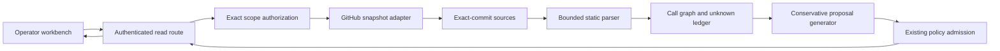

# Workflow Discovery Module Specification

Status: implementation contract for the read-only discovery slice

Date: 2026-07-18

Owner: `workflow_discovery`

## 1. Decision

`workflow_discovery` turns one repository scope and one immutable Git commit
into bounded GitHub Actions evidence and, only when the evidence permits it, a
deterministic review proposal for the existing `ci-repository-policy/v1`
contract.

```text
Discovery produces Evidence
Evidence may produce Proposal
Proposal does not produce Authority
```

The first slice is synchronous, read-only, and stateless. It does not persist
scans, record approval, register an epoch, activate policy, dispatch a
workflow, change a ruleset, or authorize omission.

## 2. Ownership Proof

The capability has four owners with one-way dependencies:

```text
workflow_discovery <- integrations/github <- runtime composition
workflow_discovery <- api/http <- frontend
workflow_discovery -> config_control admission
```

| Owner                 | Owns                                                                                | Must not own                                           |
|-----------------------|-------------------------------------------------------------------------------------|--------------------------------------------------------|
| `workflow_discovery`  | evidence algebra, bounded parser, call graph, unknown ledger, conservative proposal | GitHub credentials, HTTP DTOs, persistence, activation |
| `integrations/github` | exact provider requests, response admission, snapshot acquisition                   | workflow meaning, proposal policy, browser state       |
| `api/http`            | authentication and lossless response projection                                     | provider decoding, discovery decisions                 |
| `frontend`            | runtime response admission and progressive disclosure                               | GitHub calls, policy authority, hidden inference       |

This split is minimal. Merging the provider adapter into the domain would leak
credentials and transport failure semantics inward. Merging parser or proposal
logic into the route would make HTTP the semantic owner. A separate durable
scan context is unjustified until asynchronous refresh, approval, or drift
history is implemented.

## 3. Admission Predicate

For actor `A`, repository scope `S`, requested revision `Q`, resolved revision
`H`, workflow directory listing `L`, admitted sources `F`, parser version `V`,
and graph `G`:

```text
AuthorizedScan(A, S) := Authenticated(A) and ScopeAllowed(A, S)

ExactSnapshot(S, H, F) :=
  RepositoryIdentityBound(S)
  and FullGitHubSha1(H)
  and CommitExists(S, H)
  and DirectoryReadAt(S, H)
  and EverySourceReadAt(S, H)
  and EverySourceBlobBound(F)
  and WithinResourceBounds(F)

CompleteInventory :=
  AuthorizedScan(A, S)
  and ExactSnapshot(S, H, F)
  and EverySourceStaticallyAdmitted(F, V)
  and EveryGraphEdgeResolvedOrExplicitlyUnknown(G)
  and EveryFactHasProvenance
```

`FullGitHubSha1` is exactly 40 lowercase hexadecimal characters under the
current GitHub provider profile. It is not the broader 40..64 Git object
predicate used by provider-independent modules.

If `Q` is absent, the adapter resolves the current default-branch reference
once and then uses the resulting full commit id `H` for every Git object
request. No mutable branch name is used after resolution.

Unknown is not false. A partial or unsupported source yields explicit unknown
rows and `complete = false`; it never yields an empty complete inventory.

## 4. Exact Snapshot Protocol

The GitHub adapter performs these operations in order:

1. authorize the repository scope before provider I/O;
2. resolve `/repositories/{repository_id}` with the installation credential;
3. bind the returned numeric id and canonical `owner/name` identity;
4. resolve the default branch through its exact Git reference when no commit
   was supplied;
5. load the exact Git commit object and bind its root tree SHA;
6. traverse the root, `.github`, and `workflows` trees non-recursively by tree
   SHA, requiring `truncated = false` at every level;
7. admit only direct regular `.yml` and `.yaml` blob entries;
8. fetch admitted blobs by SHA with bounded concurrency;
9. bind each response SHA and size, decode Base64, and recompute the Git blob
   SHA over the decoded bytes;
10. return immutable source evidence or a typed failure.

```text
TreeEntry(path, blob, size)
  and BlobResponse(blob, size, bytes)
  and GitBlobHash(bytes) = blob
  => AdmittedSource(path, blob, bytes)

AnyBindingMismatch => NotAdmittedSource
```

The default limits are 4,096 root or metadata tree entries, 64 workflow files,
256 KiB per file, 4 MiB aggregate decoded content, 1 MiB per provider JSON
response, and eight concurrent blob reads. A limit may become configurable only
through validated runtime settings; request parameters cannot raise it.

Non-recursive Git tree traversal is preferred to the Contents API and to a
recursive tree. It gives a commit-to-tree-to-blob identity chain, avoids the
Contents directory item cap, and avoids repository-wide recursive-tree
truncation. Directories and submodules are not workflow files even when their
names end in `.yml` or `.yaml`. A candidate blob with an unsupported mode
becomes explicit incomplete evidence; any truncated tree, duplicate path, or
structural bound overflow fails the request closed.

Platform basis: GitHub documents non-recursive subtree reads as the recovery
path for a [truncated Git tree](https://docs.github.com/en/rest/git/trees),
returns [Git blob content](https://docs.github.com/en/rest/git/blobs) as Base64,
and limits [reusable workflow nesting](https://docs.github.com/en/actions/how-tos/reuse-automations/reuse-workflows#nesting-reusable-workflows)
to ten levels while forbidding workflow subdirectories. These provider facts
are inputs to this adapter contract, not locally invented defaults.

## 5. Evidence Algebra

```text
WorkflowInventory :=
  repository identity
  exact revision
  parser version
  workflows
  call edges
  facts
  unknowns
  inventory digest
  complete flag

Fact :=
  stable fact id
  subject id
  category
  field
  bounded typed value
  criticality
  provenance

Unknown :=
  stable unknown id
  subject id
  category
  field
  reason
  criticality
  provenance
```

Categories are `identity`, `invocation`, `graph`, `authority`, `execution`, and
`semantics`. The initial deterministic parser emits only `proven` assertions
and explicit `unknown` rows. It emits no heuristic confidence score and no
`inferred` fact. For each workflow and job, a closed expected-predicate catalog
partitions every required field into exactly one assertion or unknown row.
Completeness cannot be established merely because every emitted fact has
provenance.

Provenance binds repository scope, exact revision, workflow path, blob SHA,
parser version, and YAML location. Facts are canonically ordered by stable id.
The inventory digest covers the complete canonical projection, including
unknowns and non-claims.

The parser may prove declared static workflow names, event names, job ids, display
names, `needs`, local or remote reusable-workflow coordinates, direct runner
labels, permission keys and levels, environment names, service ids, timeout
values, concurrency declarations, matrix dimensions, conditions, action
coordinates, and statically named secrets. Dynamic expressions remain syntax
and create a field-specific unknown when they prevent a static conclusion.

Declared absence is distinct from effective behavior. Scripts, action
internals, runtime API calls, effective permissions, OIDC issuance,
environment protection, secret existence, credential contents, runner
availability, fork exposure, check identity, and generated runtime matrices
are not executed or inferred.

Opaque scalar values, including `run` and `with.script` bodies, may use the
existing 256 KiB workflow-file byte budget without entering returned evidence.
Mapping keys remain bounded to 4,096 UTF-8 bytes during event preflight, before
node composition. Reflected text and unknown syntax retain their existing
4,096-byte or narrower field bounds. This distinction does not relax the source
file, 50,000-event, 20,000-node, or depth-64 limits.
Parser provenance is `github-actions-static/v3` for this admission change;
regenerate discovery reports rather than relabeling earlier parser evidence.

## 6. Call Graph

Local reusable-workflow references are resolved only when their normalized
repository-relative path identifies an admitted source in the same snapshot.
The GitHub.com profile admits both `./.github/workflows/{filename}` and
`$/.github/workflows/{filename}` with identical caller-commit semantics. Neither
form admits an `@ref` suffix or expressions. The `$/` form is not available on
GitHub Enterprise Server; that provider profile is outside this adapter's
current `api.github.com` scope. GitHub rejects any `@` in either local call
coordinate, so such a call remains unknown even when a same-named file exists
in the snapshot. Invalid local syntax remains an explicit unknown, never an
inferred remote edge.
Remote calls are recorded but are not fetched in this slice.

```text
ClosedLocalGraph := no missing local target, local cycle, or depth violation
ImmutableRemoteEdge := remote ref is a full lowercase Git object id

GraphSafeForAuthority :=
  ClosedLocalGraph
  and every remote edge independently admitted
```

For every parsed job whose `job.uses` predicate retains a value, the inventory
contains exactly one call edge keyed by workflow path and job id. That edge
preserves the same syntax and dynamic/static classification; no other call edge
is admitted. `localGraphClosed` is derived from the complete edge set rather
than accepted as an independent assertion.

The read-only inventory may be complete while `GraphSafeForAuthority` is
false, because an unresolved remote edge is represented as an explicit safety
unknown. Such evidence cannot authorize omission. Local traversal is bounded
to the platform nesting limit and rejects cycles deterministically.

## 7. Proposal Law

The generator reuses `config_control` and never invents a second repository
policy schema or compiler. Canonical JSON is the proposal source format.

The resulting source has:

```text
repository.dynamicCi = null
rule.mode = observe
rule.omittedSignals = []
expected signal source = native
```

Therefore:

```text
dynamicCi = null => no dynamic planning projection
mode = observe => no workflow dispatch authority
omittedSignals = [] => no declared signal omission

ConservativeProposal =>
  not EnablesDynamicPlanning
  and not DispatchesWorkflow
  and not AuthorizesOmission
```

The source is admitted through `admit_policy_document`. A compiler diagnostic
blocks the proposal. Repeating discovery and generation over byte-identical
snapshot evidence produces byte-identical policy source and manifest identity.

Proposal state is `reviewable` or `blocked`. `reviewable` means structurally
admitted for human review, not approved, registered, active, safe for
enforcement, or proof that the selected job is a FullCI aggregate.

The generator admits `pull_request`, `push`, and `merge_group`, matching the
runtime event algebra. It selects no workflow by path or display-name
convention. Reviewable policy bytes are limited to a scan requested at the
current default-branch head. One selected workflow must expose
`workflow_dispatch` and at least one supported event proven to cover the
coordinator's complete default-branch action domain. A selected event admits no
path, tag, exclusion, expression, or unknown trigger filter; an optional branch
filter must be exactly the default branch within the conservative literal
grammar `[A-Za-z0-9][A-Za-z0-9._/-]*`, and effective default or explicit action
types must include every coordinator-admitted action. Therefore
`pull_request` must explicitly add `ready_for_review`; its GitHub default action
set is insufficient. `merge_group` admits no branch filter.

The selected provider signal is either the sole native, non-matrix,
unconditioned, dependency-free job or the unique native, non-matrix `always()`
job that transitively needs every other job through a complete acyclic `needs`
graph. Every job in every workflow must have a proven display name, and no such
job may share the selected signal's
conservative ASCII collision key. Exact Unicode-scalar signal identity remains
unchanged; case folding is a collision guard only. These predicates prove a
stable terminal check topology and availability surface, not the semantics of
steps, called actions, or dependency-result interpretation.

The implementation indexes facts once and evaluates the repository in
`O(facts + workflows + jobs + needs)` time.
In a finite DAG, every node reaches a candidate exactly when that candidate is
the graph's unique sink: every path ends at some sink, so one sink is sufficient,
while a second sink is an immediate counterexample. This equivalence avoids
recomputing transitive closure for every named job.

## 8. HTTP Contract

```text
GET /api/v1/workbench/repositories/{installation_id}/{repository_id}/workflow-discovery
  ?revision={optional full object id}
```

Absence of `revision` means scan the current default-branch head after resolving
it to an immutable commit. The response always returns the exact scanned
revision. Authentication and exact repository-scope authorization precede all
provider work.

The endpoint is safe and idempotent but not cache-stable across requests that
omit `revision`, because the default branch may advance. Supplying `revision`
makes the inventory input immutable; provider availability can still vary. An
explicit revision always blocks proposal bytes with
`default_branch_head_unproven`, because historical workflow syntax cannot prove
current default-branch manual-dispatch availability.

## 9. Dataflow



## 10. Module Files

| Surface                                                      | Responsibility                                                      |
|--------------------------------------------------------------|---------------------------------------------------------------------|
| `workflow_discovery/evidence.py`                             | provenance-bound fact and unknown algebra                           |
| `workflow_discovery/summary.py`                              | immutable workflow and job syntax summaries plus predicate catalogs |
| `workflow_discovery/graph_model.py`                          | canonical call-edge and graph values                                |
| `workflow_discovery/report.py`                               | exact-snapshot aggregate and inventory digest                       |
| `workflow_discovery/proposal_model.py`                       | deterministic non-authoritative proposal manifest                   |
| `workflow_discovery/outcomes.py`                             | use-case and snapshot-read outcome algebra                          |
| `workflow_discovery/parser.py`                               | bounded GitHub Actions syntax projection                            |
| `workflow_discovery/graph.py`                                | deterministic local call-graph closure                              |
| `workflow_discovery/proposal.py`                             | conservative existing-policy proposal                               |
| `workflow_discovery/ports.py`                                | scope authorization and snapshot capabilities                       |
| `workflow_discovery/service.py`                              | authorization-first orchestration                                   |
| `integrations/github/workflow_discovery.py`                  | exact-commit provider acquisition                                   |
| `integrations/github/workflow_discovery_decoding.py`         | strict endpoint decoders                                            |
| `api/http/routers/workflow_discovery.py`                     | authenticated transport projection                                  |
| `frontend/src/api/workflowDiscovery/schema.ts`               | bounded wire-shape re-admission and cross-field snapshot integrity  |
| `frontend/src/api/workflowDiscovery/events.ts`               | one generated-contract-checked CI event vocabulary                  |
| `frontend/src/api/workflowDiscovery/policyProof.ts`          | stable native-signal and generated-policy proof                     |
| `frontend/src/api/workflowDiscovery/manifestIdentity.ts`     | canonical proposal manifest identity                                |
| `frontend/src/api/workflowDiscovery/client.ts`               | exact-scope bounded browser transport and failure algebra           |
| `frontend/src/features/workbench/WorkflowDiscoveryPanel.tsx` | request state and progressive-disclosure composition                |

No file may own two rows solely to reduce file count. Conversely, a row is not
split until it has an independent invariant or change reason.

## 11. Required Falsifiers

- a forbidden scope performs any provider request;
- mutable `owner/name` input selects the repository without numeric-id binding;
- one file is fetched at a revision different from the response revision;
- a tree SHA, path, blob SHA, declared size, or recomputed blob identity
  mismatch becomes an admitted source;
- an oversized, aliased, duplicate-key, custom-tagged, non-UTF-8, or deeply
  nested YAML document becomes complete evidence;
- an expression is presented as a resolved permission, runner, secret, or call;
- a local missing target or cycle is presented as a closed graph;
- a mutable remote reusable-workflow ref is presented as immutable;
- one failed source disappears from the inventory instead of creating an
  unknown and `complete = false`;
- identical input evidence produces different proposal bytes;
- a policy event exists outside the runtime event algebra;
- a path-filtered, wrong-branch, incomplete-action, or historical workflow
  becomes reviewable;
- a multi-job signal that is conditional, cyclic, missing a dependency, or not
  downstream of every job becomes reviewable;
- any second workflow can publish the same provider signal without blocking
  policy bytes;
- zero or multiple stable provider-signal candidates silently choose one job;
- a generated source bypasses existing policy admission;
- a reviewable proposal enables dynamic planning, dispatch, or omission;
- provider text is rendered as markup or executable browser content; or
- the endpoint registers, activates, approves, or writes provider state.

## 12. Deferred Authority

Durable scan history, refresh webhooks, remote reusable-workflow acquisition,
production owner-role proof, activation, and provider enforcement remain
separate future slices. Semantic diff, current-head revalidation, and
non-activating affirmative review registration are implemented by
`proposal_review`; this read-only module neither imports nor exposes that
mutation authority.

## 13. Non-Claims

This module does not prove runtime workflow behavior, FullCI completeness,
secret existence, environment protection, external action behavior, remote
reusable-workflow safety, owner approval, configuration activation, provider
administration, production deployment, or omission safety.
