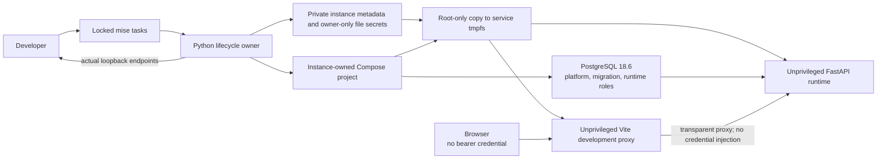

# Local Development Environment

Status: accepted

Date: 2026-07-19

Owner: `ci-coordinator.developer-environment`

## 1. Decision

Use one `mise` configuration as the version and task authority, Docker Compose
as the connected-service authority, and a least-privilege Dev Container as an
optional editor and onboarding projection. A Python lifecycle CLI derives a
collision-resistant instance identity, creates local secrets, invokes Compose,
and reports assigned endpoints.

Do not add a Makefile, shell-script facade, checked-in secret file, fixed host
port, or separately maintained Dev Container service graph.

## 2. Optimization Law

For a candidate local-development mechanism `M`:

```text
Admit(M) := AddsRequiredProperty(M)
            and Reproducible(M)
            and OwnershipIsUnique(M)
            and MaintenanceCost(M) < AvoidedFailureCost(M)
```

Applying the law:

| Candidate                                | Property                                                           | Decision |
|------------------------------------------|--------------------------------------------------------------------|----------|
| `mise`                                   | exact cross-language tools and discoverable tasks                  | admit    |
| Docker Compose                           | connected topology and isolated resources                          | admit    |
| least-privilege Dev Container            | optional host-independent toolchain                                | admit    |
| explicit browser-provider bootstrap      | reproducible rendered-browser witness                              | admit    |
| host Docker socket by default            | root-equivalent host authority                                     | reject   |
| Makefile mirroring tasks                 | no property beyond `mise`                                          | reject   |
| fixed or pre-scanned ports               | familiar URLs but collision/TOCTOU risk                            | reject   |
| Docker-assigned host ports               | atomic collision-free allocation                                   | admit    |
| one global `.env`                        | convenience with cross-worktree coupling                           | reject   |
| Make, just, or Taskfile facade           | a second command authority without a new property                  | reject   |
| Nix or Devbox beside mise and containers | a third environment graph with no uncovered invariant              | reject   |
| Tilt or Skaffold                         | Kubernetes orchestration where no local Kubernetes topology exists | reject   |
| ambient direnv export                    | implicit authority that can override admitted Compose inputs       | reject   |
| mandatory Git hooks                      | bypassable local policy that cannot replace repository proof       | reject   |

## 3. Connected Dataflow



The lifecycle owner alone derives identity, publishes state, mutates resources
and reports endpoints. Compose owns topology; `mise` delegates lifecycle work.

## 4. Concurrent Worktrees

See [instance identity](#5-instance-identity) and [resource ownership](#6-ownership-and-cleanup).

## 5. Instance Identity

Let `R` be the canonical absolute repository root and `H` the first 12 lowercase
hex characters of `SHA-256(UTF8(R))`.

```text
InstanceId(R) := "ci-coordinator-" + H
```

The Compose project name, generated state location, network, volumes, and
container labels are functions of `InstanceId`. State lives under
`$CI_COORDINATOR_DEV_STATE_HOME`, then `$XDG_STATE_HOME/ci-coordinator`, or
`~/.local/state/ci-coordinator` in that order. The canonical candidate is
rejected when it equals or descends from any Git-registered worktree, including
through a symlink alias. Two
worktrees with different canonical roots therefore have independent mutable
resources. A hash collision is detected by storing and checking the full digest
and canonical root in instance metadata; it is not silently accepted.

The [instance-specific proof contract](local-development-environment/toolchain-and-proof.md#instance-specific-proof)
keeps branch-head verification separate from interactive resources.

Host ports use Docker's ephemeral publication on `127.0.0.1`. The lifecycle CLI
queries Compose after startup and prints the actual endpoints. Port selection
therefore occurs inside the resource allocator that performs the bind.

## 6. Ownership And Cleanup

```text
CreatedBy(Instance, Resource) => MayDelete(Instance, Resource)
not CreatedBy(Instance, Resource) => MustNotDelete(Instance, Resource)
```

`down` removes only project-owned containers and networks. Persistent volumes
survive normal shutdown. `reset` is a separate explicit operation that removes
the instance volumes after confirming their project identity. Signal and error
paths preserve this ownership rule.

A full operation holds a stable lock under the user-state root, outside the
instance directory that reset removes. Therefore operations for one instance
are linearizable while different worktree identities retain independent locks.
Captured provider output is terminated at a shared byte bound, observation and
mutation phases have distinct deadlines, and the outer branch-head envelope is
admitted only when it exceeds the sum of child deadlines by the declared
cleanup reserve.

The active root is part of lifecycle authority, so `reset` must run before a
worktree is deleted. A future orphan-pruning command must rediscover stored
metadata, prove both the full root digest and every resource label, and expose
its deletion set before mutation; guessing from a short project name is not an
admissible cleanup mechanism.

## 7. Secret Boundary

The lifecycle CLI generates random local-only database credentials, webhook
secret, break-glass token, metrics token, GitHub App test key, and plan-signing
key under the
user-owned state directory. The secret directory is published atomically,
directories are `0700`, files are regular owner-owned `0600` files, and
existing material is reused only after complete structural admission. Values
are never printed or interpolated into the Compose model. On native Linux,
file-backed Compose secrets preserve host ownership and cannot be read directly
by unrelated container UIDs. Each project-built development image therefore
uses a root-only entrypoint to copy its admitted sources into a service-private
tmpfs, assigns exact runtime ownership, clears the capability bounding set,
sets no-new-privileges, and changes UID/GID before application code starts. The
browser receives none of these values, and the unprivileged development server
proxy injects no authorization credential. Local Keycloak identity is absent
unless a separately configured external provider supplies the complete block.

These are development credentials, not production fixtures or examples. The
checked-in Compose model contains references and non-secret defaults only.

## 8. Database Fidelity

The connected topology uses PostgreSQL 18.6 and preserves the production
principal split:

```text
Platform owner -> creates database and two login roles
Migration role -> owns schema and runs Alembic
Migration role -> applies exact runtime ACL
Runtime role -> starts the service with restricted DML privileges
```

Running the service as the database superuser would make local success unable
to falsify production privilege failures and is therefore rejected.

## 9. Toolchain And Containers

Runtime-version literals in the following paragraph are preserved historical
inputs. The current singleton Python runtime is owned by
[execution and contract integrity hardening](../features/execution-and-contract-integrity-hardening.md)
and its runtime profile; the other policy clauses remain applicable.

The admitted local toolchain is CPython 3.14.7, uv 0.12.9, Node.js 24.20.0
LTS, pnpm 11.25.0, and mise 2026.9.0 or newer. The backend compatibility
surface additionally admits CPython 3.13.15. The seven-day Dependabot
cooldown governs unattended update proposals; it does not
forbid a reviewed
baseline update whose checksums, locks, compatibility, and witnesses pass.
Package locks remain the dependency-graph authority.

The [toolchain and proof companion](local-development-environment/toolchain-and-proof.md#9-toolchain-and-containers)
owns container isolation, tool caches, host support and provider postconditions.

## 10. Developer Commands

Use [Evaluate Locally](../how-to/evaluate-locally.md) to start an instance.
The [command and proof contract](local-development-environment/toolchain-and-proof.md#10-developer-commands)
defines task postconditions and the separate installation/portable/connected
proof boundaries; it introduces no second task implementation.

## 11. Sources And Review Trigger

- [Docker Compose project-name isolation](https://docs.docker.com/compose/how-tos/project-name/)
- [Docker Compose Watch](https://docs.docker.com/compose/how-tos/file-watch/)
- [Development Containers specification](https://containers.dev/)
- [Dev Container CLI identity derivation](https://github.com/devcontainers/cli/blob/65f98a518a1f62355a08e6f38e9d6bfb9a0d8ac9/src/spec-common/variableSubstitution.ts#L161-L169)
- [Dev Container CLI single-container launch lifecycle](https://github.com/devcontainers/cli/blob/65f98a518a1f62355a08e6f38e9d6bfb9a0d8ac9/src/spec-node/singleContainer.ts#L419-L431)
- [mise tasks](https://mise.jdx.dev/tasks/)
- [Node.js release schedule](https://github.com/nodejs/release#release-schedule)

Revisit this decision when measured startup cost, remote-container needs, or a
new runtime requires a property the selected mechanisms cannot provide.
