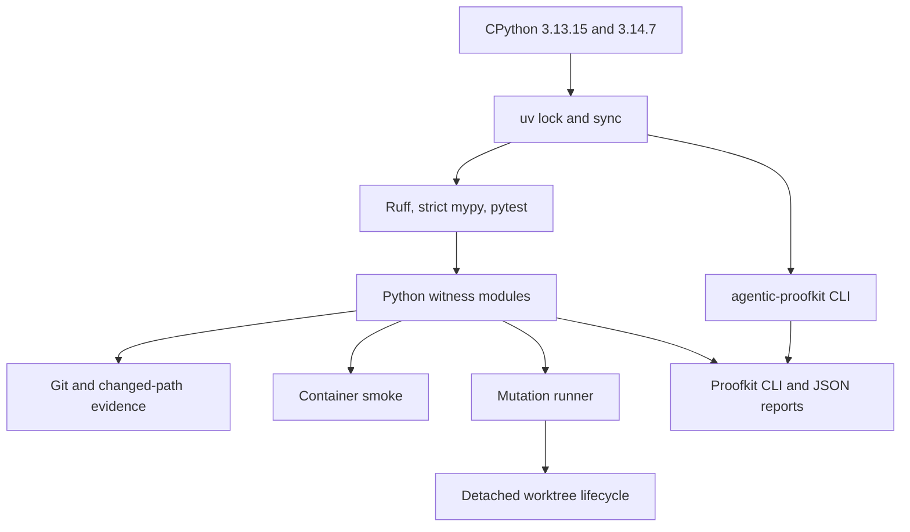

# Python Repository Tooling

Status: accepted

Date: 2026-07-16

## Decision

Repository-owned proof, quality, container, and mutation tooling uses the
admitted GIL-enabled CPython 3.13.15 and 3.14.7 pair, with 3.14.7 as the local
and container authority. Agentic Proofkit is consumed as the exact
`agentic-proofkit==0.6.0` Python distribution through its public CLI and JSON
contracts. The repository has one internal dependency graph, formatter,
typechecker, and test runner: uv, Ruff, mypy, and pytest.

The target-repository bootstrap may use the GitHub Actions Node runtime and the
built-in `node:crypto` Ed25519 verifier. It installs no JavaScript package and
does not transfer Node.js ownership to the coordinator service or its internal
tooling.

The admitted Proofkit wheel set supports macOS 13 or later and glibc-based Linux
on `arm64` or `x86_64`. Windows and musl are not claimed.

## Selection Law

Let `U` be repository-owned backend and tooling, `R(x)` the runtime set required
by component `x`, and `B(x)` its observable behavior.

```text
AdmissibleRuntime(r, U) :=
  ExpressesEveryRequiredBehavior(r, U)
  and SupportsStaticAndDynamicProof(r, U)
  and HasAnOwnedLockedDependencyGraph(r)

MinimalRuntimeSet(U) :=
  arg min |union(R(x) for x in U)|
  subject to every B(x) being preserved
```

Python directly owns filesystem, JSON, Git, Docker subprocesses, signals, HTTP,
and Python AST analysis. A second internal runtime would add another lock,
supply-chain surface, execution model, and verification stack without adding a
required behavior. It is therefore Pareto-dominated by the Python-only internal
toolchain.

The bootstrap exception satisfies a different objective. CPython has no
standard-library Ed25519 verifier, while the GitHub runner's Node runtime
provides one without registry access. Replacing it with Python would require a
consumer package install or operating-system crypto contract. The zero-package
verifier has the smaller target-repository authority surface.

## Structure



Each executable module owns one policy or orchestration responsibility.
Process helpers may normalize subprocess outcomes and repository paths; they
may not own product requirements or reinterpret exit codes. Mutation-suite
variation is versioned data, not copied runner code.

## Behavioral Invariants

```text
ToolSuccess => exitCode = 0 and valid declared report
ToolFailure => exitCode != 0 and no success receipt
Interrupt(s) => descendants terminated and finalStatus = SignalExitCode(s)
Timeout => process group terminated and timeout reported
MutationRun => source restored or detached worktree removed
UnknownMode or UnknownArgument => fail closed
ChangedPathRange => exact admitted base/head plus worktree paths
ProofkitInvocation => exact locked CLI plus caller-owned JSON input
ProofCommand => exact allowlisted environment plus finite timeout and combined output bound
```

Output capture is bounded. Cleanup is idempotent. Failed worktree removal
requires filesystem cleanup, Git worktree pruning, and a residual-registration
check before any completion claim.

## Proofkit Distribution Admission

`backend/pyproject.toml` and `backend/uv.lock` pin distribution identity and
artifact hashes. The repository witness additionally verifies the complete
supported-platform wheel set, installed metadata, executable containment,
platform compatibility, and a public CLI smoke case.

Proofkit's current `package-runtime-dependency-admission` input models npm
integrity and `node_modules` containment, so it cannot prove Python
distribution admission. The repository-owned witness makes only that narrower
claim until Proofkit exposes a package-manager-neutral primitive.

The 0.6.0 upgrade is admitted over the exact seven-command consumer surface.
Those commands retain their v1 input and output contract identities. The new
default brief projection for `agent-route` is outside that surface, while the
new macOS 13 floor is reflected by both lock admission and this decision.
Repository wrappers additionally require exact report roots, exact normalized
`witness-plan` output, and exact per-path selective routes.

```text
Compatible(0.6.0) :=
  SevenCommandContractIdentityPreserved
  and ExactWheelSetLocked
  and PlatformFloorDeclared
  and ConsumerOutputAdmissionPasses
  and UnconsumedBreakingSurfacesDisjoint
```

## Secondary Type-Checker Evaluation

`ty` 0.0.61 was evaluated against the complete backend source set under both
supported Python language targets. The two reports were byte-identical and
contained 99 diagnostics. A diagnostic was changed only under this law:

```text
Change(d) := StaticContractViolation(d) or SoundLocalProofBridgeMissing(d)
RejectChange(d) := ExistingGuardRefutesCounterexample(d)
                   or ChangeWeakensMypy(d)
                   or DependencyOwnsMismatch(d)
```

The review partitioned the complete diagnostic set into equivalence classes.
Members share a checker rule, narrowing shape, incumbent-checker result, and
counterexample outcome. The adjacent
[`ty-0.0.61-evaluation.v1.json`](ty-0.0.61-evaluation.v1.json) ledger binds every
baseline diagnostic fingerprint to exactly one class and records the immutable
base revision, reproduction command, report hashes, and residual count.

| Class                            | Count | Finding                                                                                             | Disposition                                                  |
|----------------------------------|------:|-----------------------------------------------------------------------------------------------------|--------------------------------------------------------------|
| Dynamic JSON container narrowing |    47 | Runtime guards are sound, but invariant generic types need an explicit local bridge.                | Add casts only after the corresponding shape and key guards. |
| Callable contract                |     2 | `object` plus `callable()` did not prove the accepted argument and result types.                    | Declare the exact callable signature.                        |
| Collection element narrowing     |     7 | `ty` does not propagate `all(isinstance(...))` to the element type; mypy and guards prove the path. | Retain code.                                                 |
| YAML impossible key state        |     1 | Public parsing rejects non-string keys, but the defensive normalizer failed accidentally.           | Add an explicit impossible-state assertion.                  |
| Positional-only stream protocol  |     6 | The protocol promised keyword calls that standard text streams reject.                              | Mark the protocol parameter positional-only.                 |
| Relational optional narrowing    |     7 | Early inequality returns exclude `None`; `ty` does not retain that relation.                        | Retain code.                                                 |
| Nested generic inference         |     1 | Splitting an equivalent `min` and `dict.pop` expression removes the diagnostic.                     | Retain the clearer existing expression.                      |
| Mypy-required casts              |     5 | Removing the casts produces exactly five strict-mypy errors.                                        | Retain casts.                                                |
| Nested log mapping               |     1 | Recursive mappings may expose non-string keys despite the public event contract.                    | Filter nested keys locally before recursion.                 |
| Literal membership narrowing     |     9 | Invalid values are rejected before construction; `ty` does not infer the Literal result.            | Retain code.                                                 |
| SQL keyword provenance           |     2 | Arbitrary `str` was wider than psycopg's `LiteralString` security contract.                         | Restrict the internal keyword surface to `LiteralString`.    |
| PostgreSQL row shape             |     7 | `tuple[object, ...]` permitted non-indexable rows behind suppressions.                              | Require sequences, validate width, and remove suppressions.  |
| SQLAlchemy select typing         |     1 | Invariant dependency typing loses the dynamic table-column tuple shape.                             | Retain the project contract; do not spread `Any`.            |
| Workflow evidence category       |     2 | A helper accepted `str` while its downstream contract accepts a closed category type.               | Use the exact category type and remove suppressions.         |
| Generic exact-type narrowing     |     1 | `type(item) is item_type` is not related back to generic `T` by `ty`.                               | Retain code.                                                 |

Thus `68/99` diagnostics justified source changes: 21 exposed unsound static
contracts and 47 justified local proof bridges. The residual 31 consist of 25
checker limitations, five casts required by strict mypy, and one dependency
typing gap. The historical evaluation compared Python 3.13 and 3.14 reports,
found the same 31 residual diagnostics, and introduced no new semantic
fingerprint. That comparison does not admit Python 3.14 as a current runtime.

`ty` remains an exact-version, on-demand advisory audit rather than a blocking
repository dependency:

```bash
mise exec -- uvx --from ty==0.0.61 ty check \
  --python backend/.venv/bin/python --python-version 3.13 backend/src
```

This boundary is necessary because `ty` is still beta, uses an unstable
`0.0.x` diagnostic contract, and disagrees with the admitted strict-mypy
contract on 31 findings. Reconsider a blocking gate when the checker has a
stable diagnostic contract and the retained disagreement set can be removed
without suppressions, weakened types, or source distortion.

## Rejected Alternatives

| Alternative                       | Rejection proof                                                                                  |
|-----------------------------------|--------------------------------------------------------------------------------------------------|
| JavaScript wrappers around Python | Two runtimes and a cross-language AST boundary add complexity without capability.                |
| Shell tooling                     | Structured JSON, portable process groups, typed failure algebra, and unit testing become weaker. |
| Python bootstrap verification     | It adds a package or operating-system crypto dependency to every target repository.              |
| Vendored Proofkit binary          | It duplicates upstream release ownership and loses package-manager provenance.                   |

## Non-Claims

This decision does not prove provider execution, merge safety, deployment, or
production readiness. Proofkit does not own CI Coordinator requirements,
native witness semantics, credentials, rollout, or omission authority.
