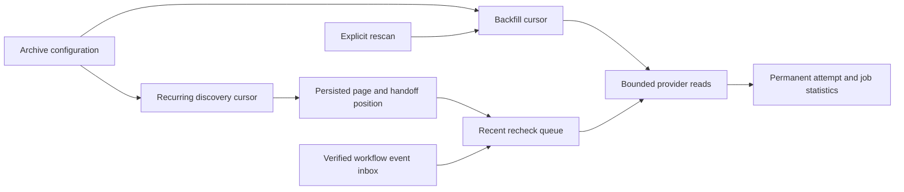

# Recent Actions Archive Recovery

Status: active design and implementation plan; not a deployment receipt.

Owner: `ci_economics`, with application orchestration and PostgreSQL refinement.
Parent: [historical population](actions-history-population.md).
Counterexamples: [recovery hardening](actions-history-recovery-hardening.md).

## Decision

Give the archive independent durable `backfill` and `discovery` scan lanes.
Reuse the existing provider decoder, bounded cursor/pending page, lease/CAS
mechanics and recent recheck queue. Do not couple archive recovery to the
selection, seven-day admission window or capacity of active economics sources.



Two independent frontiers are required because new runs must progress while
the original historical interval is still being processed. Overwriting one
cursor cannot preserve both progress states. Adding a closed lane to the
existing scan key is less machinery than another table/store/service family,
while the lane remains part of exact claim identity rather than an implicit
caller convention.

Represent recent-only state as one optional immutable progress value containing
the recovery floor and last completed frontier. Its presence determines the
closed scan lane; a separate mutable flag cannot contradict that value. The SQL
lane column and key are exact projections and are checked by the canonical codec.

## Population And Recurrence

Initial backfill retains the administrator-selected interval `[L,T]`. The
discovery lane begins at `T`, captured in the same configuration transaction.
Its interval and page remain frozen throughout a cycle, independently from
backfill. Every completed cycle records its exact `completed_through` frontier.

The initial recovery profile schedules another cycle after60 seconds with a
300-second overlap. These named bounds are a conservative starting policy,
not measured optimality or a guarantee about GitHub visibility latency.
Revisit them after measuring API budget, source visibility and freshness.

```text
NextCycleEnd = floor_to_second(trusted database time)
NextCycleStart = max(RecoveryFloor, CompletedThrough - Overlap)

IncompleteCycle => ResumeSameFrozenIntervalAndPosition
CompleteCycle and Due => PrepareNextCycleUnderCurrentAuthority
```

Keep the recovery floor distinct from the moving overlap. Delays longer than
seven days split into bounded provider windows; they do not clip the backlog
to active-evidence eligibility. A cycle can record truncation or availability
gaps without claiming a complete provider snapshot.

Pause defers discovery and preserves both frontiers. Resume catches up from
the retained frontier; it does not treat the paused dates as an exclusion.
Changing workflow selection restarts the original backfill as already specified
and invalidates old claims. It need not rewind independent recent work: new
selection is rechecked at every handoff and the restarted backfill covers the
historical selection change. Ordinary quota/policy edits preserve progress.
Explicit rescan preserves generation and statistical/import identities.

## Atomic Handoff

Discovery admits and persists a bounded provider page before consuming it.
Each pending source carries its exact run/attempt/head, workflow and creation
identity. One claimed handoff processes only the current pending source.

```text
AdvancePendingPosition
  => CurrentClaimAtCas
     and (RecheckAdmittedOrReplayed or CurrentSelectorRejectsSource)

QueueCapacityRefused => PreservePendingSourceAndRetryPosition
LostCas => RollBackQueueEffectAndPosition
```

Advance an accepted prefix, never the whole partially admitted page. Prefix
progress and queue admission share one transaction, so restart or a lost reply
cannot reinsert the first run indefinitely or silently drop the remaining runs.
Active observation does not participate in this transaction and cannot be
blocked by an archive admission decision. Physical database contention remains
bounded by the existing lock/transaction policy, not claimed nonexistent.

Use the established order: compatibility admission, archive scope, dataset,
scan, then recheck/statistical child rows. Read database time after locks and
recheck the terminal lease with the one SQL CAS instant. Scope, lane, generation,
configuration revision, full prior canonical state, revision and lease identity
must agree; `acquired_at <= K < expires_at` remains mandatory.

## Waiting And Fact Reuse

A successful provider observation that a run is still nonterminal is not a
failed I/O attempt. Keep its queue item, release its lease and schedule a bounded
later read without consuming the failure/crash retry allowance. No attempt or
statistical contribution is invented. Conditional liveness requires the provider
eventually to return a terminal or classified failure result; a bounded queue
does not imply an unconditional termination guarantee for an external workflow.

Ordinary recent work may reuse an exact retained complete attempt as a historical
fact, not as a fresh provider observation. The predicate requires current
generation, exact scope/run/attempt/head/workflow/creation identity, canonical
header/job integrity, complete job population and no conflict. Preserve the
observed head in hints if needed to establish that relation; unknown identity
means no shortcut. Partial, unavailable, conflicting, repair and explicit-rescan
work still reads the provider. Existence of attemptN never proves `1..N`.

Reuse neither resets first-import/detail clocks nor increments a provider-read
success counter. Current claim, selection and completion CAS remain independently
required. This consciously trades automatic refresh of already complete facts
for lower provider cost; explicit rescan retains refresh semantics. No CI
selection or verification authority is inferred from archival reuse.

This shortcut remains a follow-on implementation obligation, not a property of
the current recovery writer. Current hints do not retain the independent head
operand or preserve a merged repair's freshness requirement. Therefore this
batch continues provider reads rather than admitting a weaker reuse predicate.
The producer's source-evidence digest covers identity, not statistical freshness.
Close both missing operands and their negative witnesses before enabling reuse.

## Runtime And Presentation

The runtime callback adds a discovery producer alongside the existing three
consumer lanes, with at most one operation per lane concurrently. All lanes
retain the count/time limits and the enclosing maintenance deadline; no hidden
extra unbounded background loop is introduced. Preserve the existing public
three-lane `run` contract for its current callers.

Status reads both scan lanes in one coherent bounded database statement. The
UI distinguishes initial traversal, recent recovery, last completed frontier,
pending handoff count, recheck backlog and gaps. It never substitutes one lane's
interval for the other or exposes private claim/provider-page payloads. Changes
to generated schemas, fixtures, source provenance and exact model inventories
remain part of the same owner change.

## Implementation Sequence

1. Extend the scan identity with a closed lane, preserve exact cycle completion
   and add domain transitions for preparing a due recent cycle and acknowledging
   one admitted handoff. Test lane substitution, time bounds and partial pages.
2. Refine the existing scan relation, primary/due keys, codec, reads and CAS;
   configure both lanes atomically and preserve existing backfill defaults.
   Close the single branch-local unpublished migration, capability profiles,
   grants and independent schema inventories. Never rewrite a published revision.
3. Implement transactional recent claims and pending-source handoff through
   existing recheck admission. Current-selector rejection is explicit; quota
   pressure does not advance the source position or active observation.
4. Add bounded recent discovery orchestration and nonterminal waiting. Reuse
   current authorization/provider deadlines and per-item observations.
5. Add only the complete-fact shortcut whose identity/provenance predicate is
   proved; preserve provider reads for repair/rescan/unknown cases. This step is
   explicitly deferred until hint identity and merged repair intent are complete.
6. Extend coherent status, generated contracts and UI recovery progress; keep
   the original configured range and dirty/unresolved command protections.
7. Qualify the exact candidate through native GitHub tests and a bounded final
   conformance review, followed separately by authorized Swarm qualification.

## Native Acceptance

- Complete backfill, omit webhook, discover a new run afterT and persist exactly
  one attempt/job contribution through actual adapters, both with free and full
  active-economics queues. Do not seed the missing archive hint in the fixture.
- Fill all but one archive queue slot, accept a multi-run page, restart and
  release capacity. The accepted prefix survives; its remainder advances once.
- Verify pause/resume catch-up, A-to-B-to-A selection, rescan, generation change,
  concurrent workers and lease expiry after a held SQL lock. Old claims cannot
  update either lane or the other lane's state.
- Preserve a frozen interval over restart and delays longer than seven days;
  reject foreign/malformed pages and retain all accessible saturated pages.
- A run remains nonterminal for more than the failure-attempt count, then
  completes without a webhook; it is still collected and no false failure gap
  is used to retire its waiting state.
- Missing attempt 1 with complete attemptN, partial/conflicting data, mismatched
  head/workflow/creation identity and explicit rescan defeat inappropriate reuse.
  A valid cached fact avoids provider I/O without renewing its import time.

## Limits

Creation-time recovery cannot discover every lost rerun of an old run outside
its interval. Such cases require admitted event recovery or explicit rescan.
Provider visibility beyond overlap, upstream deletion, irreversible search caps,
unavailable capacity and unqualified workload bounds remain explicit limits.
This design does not claim complete history, measured throughput, final-image
security, additional detail import, analytics, erasure or production readiness.
