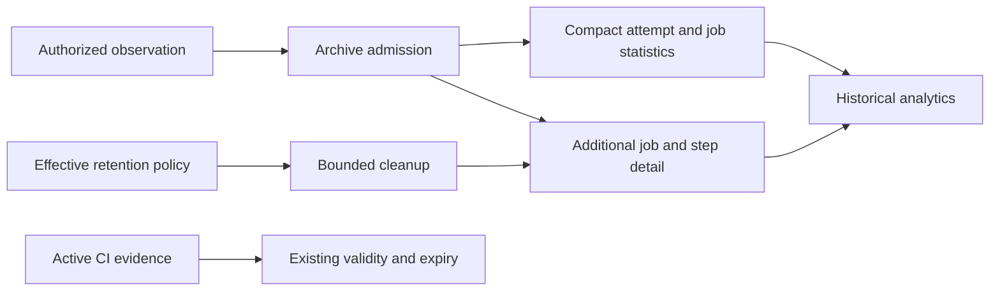

# Actions History Retention

Status: proposed D4-H1 successor design; runtime implementation pending

Owner: `ci_economics`. Product state belongs to the
[roadmap](../../ROADMAP.md#d4-h1-historical-import-and-source-availability).
Execution order: [implementation plan](actions-history-retention-implementation-plan.md).

## 1. Decision

Separate permanent statistical facts, optional detail and active CI evidence.
One lifetime cannot express the requested product.

| Data class                                   | Proposed default                              | Purpose                                                                                                         |
|----------------------------------------------|-----------------------------------------------|-----------------------------------------------------------------------------------------------------------------|
| Compact attempt and job statistics           | No automatic expiry                           | Historical counts, outcomes, durations, measurement quality and reproducible workflow/job/category comparisons. |
| Additional job/step detail                   | 365 days after first successful detail import | Richer drill-down, excluding the operands retained as permanent statistics.                                     |
| Active CI evidence                           | Existing 90-day source-time contract          | Current evidence eligibility, never extended by historical retention.                                           |
| Raw logs, artifacts, arbitrary provider JSON | Not collected by this feature                 | A separate purpose, sensitive-field and storage contract would be required.                                     |

Use a service default and explicit repository overrides, configured through
the same API from the UI or external clients, without a restart. Do not add
a policy DSL, new database, broker or general retention engine.

Permanent means no age-based automatic deletion. It does not mean infinite
capacity, guaranteed durability, public access or exemption from authorized
privacy/deletion operations. Initially statistics have one permanent mode;
detail supports `disabled`, `days` and `forever`. A finite-summary mode needs
its own erasure/non-resurrection contract before it becomes an option.

## 2. Explicit Product Change

The user's first one-year choice was clarified: statistics must remain
permanent and retention should be configurable. This supersedes the roadmap's
blanket finite-retention requirement for the new archive only.

The current [economics module](../architecture/modules/ci-economics.md) and
[observation design](repository-observation.md) bind active collection to a
seven-day registration window and 90-day evidence lifetime. Increasing a scan
window does not admit older evidence. Substituting import time for provider
creation time would violate the existing contract, not implement this design.

Historical observation therefore needs an archive purpose and separate
retention metadata. Job trend and category filtering also require permanent
job-level operands; attempt totals cannot reconstruct a linter's duration.
This document owns that retention decision, not the full
historical provider traversal protocol. Attempt enumeration, API caps and
coverage gaps must be resolved before its collector is implemented.

## 3. Retained Meaning And Identity

Retain one normalized statistical contribution for each exact authorized
installation/repository/run/attempt identity, plus provider host, head,
workflow identity, relevant timestamps, measurement-definition version,
quality and bounded provenance. Preserve missing values as unknown, not zero.

Retain compact child contributions for observed jobs with exact provider job
identity scoped to their attempt. Include supported duration/outcome operands,
measurement and cohort coordinates even when additional detail is disabled.
Fetching job statistics is therefore independent of optional detail collection.
Unknown or incomplete job populations remain explicit. Attempt totals and their
job components are different aggregation grains, never additive populations.

The field allowlist must support the declared counts, conclusions, durations,
queue measurements, CPU when actually supplied, and comparison cohorts.
Exclude actor profiles, arbitrary labels, secrets, raw error text, logs, full
YAML and unrestricted JSON. Every addition needs a specific analytical question,
privacy classification and size bound.

Summaries are retained facts, not cached dashboard totals. Aggregates must be
rebuildable from them; weighted averages require sums and counts. Quantiles
need a retained population or a versioned approximation with stated error.
Deleting detail limits future drill-down and recomputation; it cannot supply
missing operands for a new metric definition or prove older evidence current.

Display names do not define identity. App reinstallation or repository transfer
does not automatically authorize merging histories across old and new scopes.
Such a transition needs an explicit scope mapping and authorization decision;
ordinary rescans remain within their admitted scope.

Support filters by period, workflow, logical job and purpose category such as
lint, typecheck, test, build or deploy. A provider job ID identifies one execution,
not a stable cross-run job. Bind a longitudinal cohort to admitted workflow/job
coordinates, relevant definition revisions and matrix dimensions. If the
provider cannot establish that relation, retain the observed name and unknown
cohort rather than infer identity from its spelling.

Use a bounded repository-owned category mapping with revision and provenance;
automatic recognition is a suggestion unless an explicit rule admits it.
Preserve original observations and make any historical reclassification an
explicit, reproducible query projection, not a rewrite of measured facts.
Unclassified and mixed-purpose jobs stay visible. Overlapping category filters
must not double-count the same job, and a mixed job's whole duration must not
be labelled lint-only time without a separately measured breakdown. Definition,
matrix, tool/input or runner changes are comparison boundaries to show or
stratify, not changes to silently erase for a smooth trend.

The compact summary retains `firstDetailImportedAt` after child detail expires.
Assign it once, with trusted database time, in the first successful durable
detail-import transaction. A failed fetch, queued item, summary-only import or
rolled-back transaction cannot start the clock.

Detail states are `not_imported`, `retained` and `expired`. Policy `disabled`
does not imply existing detail was deleted. Upstream availability is a separate
observation, never a local retention transition.

## 4. Configuration And Change Semantics

Illustrative policy vocabulary, not a currently supported API:

```yaml
statistics:
  mode: forever
details:
  mode: days
  days: 365
  anchor: first_successful_detail_import
```

`days` is a positive bounded integer; other variants reject `days` and `anchor`.
A day means 86400 elapsed seconds, not a local-calendar boundary. Numeric
ceilings and deployment quotas must be admitted before implementation.

Resolve an explicit repository override, otherwise the service default. Return
requested/effective policy and both revisions. Do not merge fields implicitly
or interpret null as both inheritance and forever. Reuse current configuration
revision, actor admission and command idempotency mechanisms where compatible.

Every change explicitly applies to new detail imports only, or also to retained
detail. Updating a default previews all affected inheriting repositories;
explicit overrides remain independent. Existing deadlines are not silently
rewritten by resolving a newer default.

Each retained detail record binds its admitted policy revision and actual mode
and deadline. Reads distinguish that applied policy from the effective policy
for future imports. A future-only update cannot change existing eligibility;
an admitted update to existing records changes their applied policy atomically
with the corresponding guarded operation.

Shortening existing retention or removing existing detail under `disabled`
requires a bounded preview with scope/count/bytes and explicit application.
Apply checks current authorization, policy revision and dataset cutoff again.
A preview is not a write grant. Unknown outcome after a timeout is resolved
through the durable command, not treated as proof of rollback.

Large cleanup runs as bounded resumable batches. Import, policy change and
cleanup share a documented lock order; each batch rechecks exact scope,
operation and policy revision before deleting. Rows newer than the admitted
cutoff are excluded. Policy change invalidates stale cleanup authority.
Pausing collection does not pause already admitted retention; the UI separates
these controls because their meanings differ.

Extension can preserve still-retained detail without resetting its first-import
time. It cannot restore deleted detail. Ordinary rescan never re-imports expired
detail or renews its lifetime. An explicit restoration feature needs a separate
admission contract; it is not implied by changing the duration. Enabling detail
permits a first import for records still in `not_imported`.

Permanent summaries can be removed only by a separately authorized repository
data-erasure operation. Before removing identity, it must fence prior import
workers and define blocked re-import or an explicitly new dataset. A rescan
must not recreate deliberately erased statistics. This retention feature does
not introduce an ad hoc summary-delete endpoint.

## 5. Laws And Falsifiers

For an exact authorized attempt `a`, let `S(a)` be its compact contribution
including permanent job operands and classification provenance,
`F(a)` its immutable first successful detail import, `D(a)` its admitted finite
duration, and `K` database time at the guarded transaction boundary.
`F(a)` is absent only for never-imported detail.

```text
AgeExpiryEligible(a, K) :=
  detailState(a) = retained
  and policyMode(a) = days
  and K >= F(a) + D(a)

ExpireDetail(a, K) => S_after(a) = S_before(a)
ReplayImport(a) => F_after(a) = F_before(a)
ReplayImport(a) => Count_after(a) = Count_before(a)
AdmittedStatistics(a) -/-> AdmittedCiEvidence(a)
ProviderMissing(a) -/-> DeleteLocalStatistics(a)
```

The expiry predicate is total over admitted variants: non-retained or non-days
records are ineligible before finite operands are evaluated. Explicit removal
under a disabled-policy proposal is a separate operation, not age expiry.

| Countermodel                                    | Required exclusion                                                                                           |
|-------------------------------------------------|--------------------------------------------------------------------------------------------------------------|
| Replay counts the same attempt twice            | Unique scoped contribution and idempotent update; another attempt remains distinct.                          |
| Expiring detail erases the annual linter trend  | Cleanup preserves attempt and job statistics, category/cohort provenance and every supported metric operand. |
| Renaming a job rewrites its historical meaning  | Identity and versioned category/cohort mappings remain distinct from display names.                          |
| Category totals duplicate a mixed job           | Aggregate distinct source contributions at one declared grain; do not fabricate a per-tool breakdown.        |
| Rescan renews the one-year clock                | First-import identity survives child cleanup and is never rewritten by replay.                               |
| Missing CPU is recorded as zero                 | Unknown counts and measurement quality remain explicit.                                                      |
| Cached policy deletes newly extended detail     | Current revision, guarded claim and row lock determine deletion authority.                                   |
| Provider 404 deletes local statistics           | Availability is not erasure authority.                                                                       |
| Restore revives erased history or stale workers | Current deletion fences reconcile before writers and visibility resume.                                      |

These are intended laws and witness obligations, not proof that current runtime
enforces them. They remain independent of source, schema and UI validation.

## 6. Storage And Cost

Keep PostgreSQL and the existing capability boundaries. Summary identity and
optional child detail have separate ownership from active evidence. Reuse
typed values, bounded pages, scope checks and transaction primitives where
their semantics match; do not attach archive data to evidence-expiry cascades.



The retained summary already provides deduplication identity and the first-import
anchor; a second permanent tombstone ledger is not justified for ordinary
detail expiry. Cache/rollup tables are rebuildable projections, added only for
an evidenced query budget rather than speculative scale.

For finite storage budget `B`, unbounded distinct attempts with positive
minimum record size cannot all be accepted forever:

```text
N * minimumRecordBytes > B => StoreEveryAttemptWithinBudget is false
```

Therefore permanent retention requires scoped row/byte quotas, bounded batches,
indexed paginated reads and a visible capacity-paused import state. Preserve
existing statistics instead of silently evicting them. Show remaining capacity
and coverage gaps. Raising capacity or narrowing collection is an administrator
decision. Count job contributions, bounded cohort/mapping metadata and indexes
in the budget; an attempt quota alone cannot bound matrix-job growth.
Concurrent admission uses the same budget lock, including replay's
zero-delta case; failed work must not leak reserved quota indefinitely.

WAL, backups and exports are additional copies. Operational qualification must
bind their lifetimes and restore/deletion reconciliation. Primary-row removal
does not prove complete erasure; one live database does not prove permanent
durability.

## 7. User Journey

Repository Settings shows effective policy, inherited/default source, revision,
permanent-statistics status and detail duration. Familiar controls replace a
policy editor. Browser and API share validation, preview/apply and conflict
semantics. Destructive previews show what survives as well as what disappears.

Analytics distinguishes summary available, detail expired, upstream unavailable,
unknown measurement and incomplete coverage. Empty is not zero activity;
expired detail is not failed CI. Collection percentages require a known stable
denominator. Reads/exports remain authenticated and scoped even after provider
access changes. Configuration and destructive outcomes have token-free
actor/time/scope audit records.

A workflow/category overview drills into a specific job trend and contributing
attempts. A linter view shows the selected population, mapping revision, sample
and coverage, with workflow/runner changes marked or separated. Rich detail
expiry cannot remove the supported job trend; unsupported breakdowns remain
unavailable rather than reconstructed from attempt totals.

## 8. Selection And Revision

| Alternative                              | Disposition                                                                       |
|------------------------------------------|-----------------------------------------------------------------------------------|
| Keep current evidence storage only       | Correct for active evidence, insufficient for permanent history.                  |
| Extend everything to one year            | Still deletes statistics and conflates history with proof validity.               |
| Keep raw responses forever               | Adds unnecessary sensitive fields and storage cost.                               |
| Keep fixed dashboard totals only         | Loses deduplication, cohort changes and supported recomputation.                  |
| Compact summaries plus optional detail   | Selected: preserves requested meaning and independent expiry with current owners. |
| Generic DSL or another analytics service | Deferred: no present obligation justifies the additional operational authority.   |

This is a scoped preference, not global optimality. Reopen it when measured
summary/query cost exceeds budget, a required metric needs discarded operands,
privacy requires shorter statistical lifetime, cross-install history must be
unified, or an admitted library removes a mechanism without weakening these
contracts. Forecasting and job/runner attribution remain separately ordered
[roadmap work](../../ROADMAP.md#d4d7-f1-forecasts-and-degradation-attribution).
