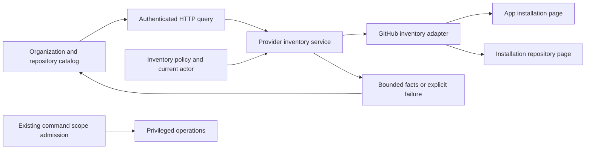

# Automatic GitHub App Inventory

Status: implementation admitted after independent design and plan review

## Decision

Discover organizations and repositories through the configured GitHub App,
without manual numeric-ID entry. Keep catalog visibility separate from
repository configuration, observation and execution authority. Implement this
inside the existing `provider_inventory` capability and provider adapter.

This design owns discovery semantics. The companion
[CI efficiency design](proof-preserving-ci-efficiency.md) owns verification
cost. They share a user-requested delivery batch, not a domain abstraction.
Existing design/plan files remain unchanged; governing module contracts and
requirements are updated by the implementation plan after design review.

## Problem And Protected Behavior

The current authorizer returns deployment-configured installation IDs. The
service reads those IDs individually; GitHub installations outside that set
are invisible even when the App is correctly installed. That restriction is
not a GitHub discovery limitation.

Protect administrator-only inventory, App identity, least-privilege tokens,
bounded reads, exact installation/repository bindings, explicit provider
failure and all existing command-authorization checks. An organization
installation does not imply that every organization repository is accessible.

## User Journey

1. Configure the shared App and enable `app` inventory mode once. Connected,
   non-enforcing startup may omit command scopes in this mode; omission means
   an empty deny-all grant, never a wildcard.
2. Open Organizations. Fetch current App installations, including new
   organizations, with server-backed pagination and a manual refresh action.
3. Choose an organization. Fetch its accessible repositories; numeric IDs are
   transport/storage details, never onboarding inputs.
4. Distinguish available inventory from an admitted workbench scope. Preserve
   existing explicit admission for configuration, observation and coordination.
5. Show suspension, unavailable data, partial results and unsupported personal
   installations honestly. Never render a failed discovery as an empty success.

This batch removes repeated ID entry for visibility. It does not implement a
new durable dynamic command-grant registry. Existing scope admission remains
the owner of privileged actions; the UI must not claim that discovery has
enabled those actions. That separate D5 capability can consume these resolved
identities without teaching users to copy IDs.

## Authorization

Let `A` be a current platform administrator, `G` a granted inventory policy,
`I` a current installation belonging to the configured App, and `R` a repository
returned by credentials scoped to `I`.

```text
Visible(A, I) => Administrator(A) AND InventoryPolicyAllows(G, I)
ReadableRepositories(A, I) => Visible(A, I) AND CurrentAppInstallation(I)
VisibleRepository(A, R, I) => ReadableRepositories(A, I)
                             AND R.installation = I.id
                             AND R.owner = I.account
Discoverable(R) does not imply MayConfigure(R) or MayExecute(R)
```

App JWT permits only admitted App-identity endpoints. Repository inventory uses
installation credentials, never an organization-wide personal token. Reject a
foreign installation, identity mismatch, malformed pagination or response.
The current provider read is the admission source for repository browsing;
an ID previously displayed by the browser is not sufficient authority.

## Policy And Compatibility

Add `CI_COORDINATOR_CONTROL_PLANE_INVENTORY_MODE` with closed values `app` and
`restricted`. Default to `restricted`, preserving existing deployments.
`restricted` retains the existing exact installation allowlist, including an
empty deny-all set. `app` permits administrator inventory across current App
installations and requires the legacy inventory allowlist to be empty; reject
contradictory configuration instead of silently ignoring a restriction.

Document the one-time mode change and use `app` in the owned fresh development
profile. Permit empty command scopes only for connected non-enforcing App-mode
bootstrap. Restricted and enforcing startup keep their existing nonempty
requirements. Existing nonempty command scopes are unchanged and their
workbench projection must not depend on the now-empty inventory allowlist.
An inventory-only administrator can browse but cannot configure, observe or
execute a repository until the separate scope owner admits it. Redacted
runtime diagnostics expose the mode, never credentials. Live deployment
configuration is a separate authorized rollout, not an effect of this PR.

## Dataflow And Ownership



| Owner                 | Responsibility                                                           |
|-----------------------|--------------------------------------------------------------------------|
| `runtime_settings`    | Admit explicit mode, reject contradictions, redact diagnostics           |
| `provider_inventory`  | Inventory grant, page algebra, actor/scope and binding checks            |
| `integrations/github` | Exact App route/query admission, provider pagination and decoding        |
| HTTP                  | Authentication, bounded query parameters, result-to-status projection    |
| Frontend catalog      | Pagination, scope-lifetime cancellation, failure and eligibility display |

No new database tables, distributed cache, generic permissions framework or
background reconciler are needed. A new fresh page request discovers changes;
refresh after login or explicit user action is sufficient for this slice.
Webhook-driven cache invalidation becomes useful only if caching is later
introduced with measured need and separately specified expiry/revocation.

## Pagination And Failure Algebra

Use the existing page-query convention: positive page, bounded per-page size
at most 100, bounded page range. Add a provider installation-page value and a
page-aware catalog response. Preserve canonical ordering and unique IDs within
each page. Restricted mode paginates the sorted configured set before reading
individual installations; App mode reads one provider page, without per-row
fan-out.

`page complete` means this page was admitted without failed rows. It never
means an entire organization/App population was captured. `hasNextPage` is
separate. Provider offset pagination is best-effort, not a transactional
snapshot; do not claim cross-page historical completeness or use omissions to
delete durable data. Reject a malformed/nonmatching `Link`, duplicate ID,
over-bound body or inconsistent terminal page. Rate limits preserve bounded
retry advice. Unknown provider state grants no additional access.

The UI exposes organization pagination and refresh, preserves full names and
stable identities, and resets dependent repository state when the selected
installation changes. Old responses cannot replace newer selection/session
state. Existing API consumers may omit the new page query parameters; explicit
response metadata and generated contracts evolve together.

## Alternatives And Revision Conditions

| Alternative                                            | Disposition and reason                                                             |
|--------------------------------------------------------|------------------------------------------------------------------------------------|
| Keep adding environment IDs                            | Preserves security but fails the requested onboarding journey                      |
| Show every installation and grant every operation      | Rejected: visibility is not command authority                                      |
| Fetch all pages into one response                      | Rejected: unbounded work or hidden truncation                                      |
| Add a durable inventory and webhook synchronizer now   | Deferred: adds stale-state, retention and recovery problems without a current need |
| Use an LLM to resolve IDs                              | Rejected: provider API deterministically owns these identities                     |
| One fresh provider page plus explicit inventory policy | Selected: bounded existing capability, no new state machine                        |

Revisit on measured API-latency/rate-limit pressure, non-admin catalog access,
dynamic command grants, installation counts beyond admitted page range, or a
provider pagination contract change. None of these conditions permits an
implicit authority expansion.

## Required Falsifiers

- App installed in a second organization: visible without an installation-ID
  setting in App mode; restricted mode still excludes it.
- Non-administrator: no provider request and no inventory metadata.
- Foreign/suspended/deleted installation: no repository-read authority.
- Multiple pages, empty final page, duplicate IDs, foreign links, provider
  rate limit, malformed JSON and unavailable response: exact bounded outcomes.
- Found-but-unadmitted repository: listed, not command-authorized.
- Mode/allowlist conflict: rejected startup, not broadened access.
- Fresh connected App-mode bootstrap with no command scopes: inventory works,
  every repository command remains denied; restricted/enforcing empty scopes
  remain invalid. Existing nonempty grants retain their exact projection.
- Organization switch, sign-out and delayed older response: no stale data leak.

Native HTTP/provider-contract, settings, frontend component and browser tests
must run in GitHub. Source/static proof does not establish real installation
visibility in the deployed environment; that requires a separate read-only
App/Keycloak pilot after rollout.

## Provider Contract

The authenticated-App installation endpoint uses an App JWT and supports
bounded page queries; installation-token repository reads remain a distinct
credential scope. See [GitHub's App API](https://docs.github.com/en/rest/apps/apps#list-installations-for-the-authenticated-app).
