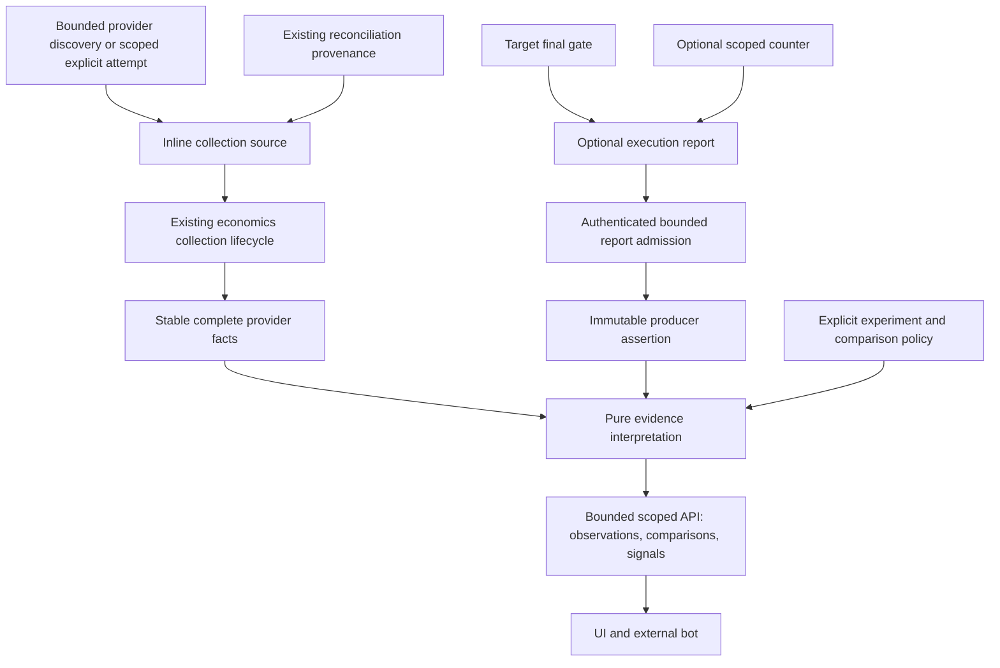

# CI Economics: Measured Comparisons

Status: implementation design; native and external qualification remain open

Owner: `ci_economics`

Execution sequence: [implementation plan](ci-economics-measured-comparisons-implementation-plan.md).
Existing contract: [CI economics](../architecture/modules/ci-economics.md).
Product scope: [roadmap](../../ROADMAP.md), D4 and the measurement part of B3.

## 1. Decision And Visible Changes

Extend the existing economics capability with independently observed attempts,
optional execution and measurement reports, explicit selected/full comparisons,
and bounded budget signals. Use the same scoped API for operators, UI and
optional external bots. Do not add an executor, telemetry service, permanent
target credential or agent decision to the correctness path.

The extension changes what can be observed, not what may be omitted:

| Current contract                                | Proposed addition                                                                        | Protected behavior                                       |
|-------------------------------------------------|------------------------------------------------------------------------------------------|----------------------------------------------------------|
| Attempts originate from terminal reconciliation | Independently discover or explicitly register provider attempts, including fallback runs | A fabricated reconciliation subject is never created     |
| Planned route is retained                       | Separately retain reported consumption and provider corroboration                        | A returned plan does not prove execution                 |
| Queue, occupancy and wall durations             | Typed instrumented CPU, declared capacity estimates, cache/shard/retry facts             | An estimate cannot be displayed as measured CPU          |
| Bounded attempt/job reads                       | Explicit pair/cohort comparisons and configured budget signals                           | Failed, missing and negative observations remain visible |

Old retained evidence is not rewritten into stronger evidence. Existing
selection, signing, production admission, reconciliation and FullCI predicates
remain unchanged. Any API shape change requires an explicit version transition;
an absent reconciliation link cannot be smuggled into a v1 required hash.

## 2. Why This Order

The existing collection registers terminal reconciliation subjects. An
independent FullCI executed during coordinator failure may have no such
subject. Therefore:

```text
OnlyReconciledPopulation
  does not imply AllEligibleExecutionsObserved

MissingFailurePopulation
  does not permit OrganizationWideSavingsClaim
```

First close attempt-source coverage and evidence identity; then collect and
compare measurements. Adding a savings percentage before those relations would
encode an unsupported claim. Provider polling remains bounded and can be
incomplete; incomplete enumeration must be reported, not called exhaustive.

## 3. Evidence Flow



There is deliberately no edge from `J` or `V` to check selection, credential
issuance or provider mutation. A later bot escalation is a separately admitted
monotonic command, not an implicit consequence of an economics alert.

## 4. Identity And Trust

An attempt identity is the existing installation, repository, workflow run,
run attempt and source SHA tuple. Workflow definition, source execution mode,
registry, graph and plan identities are separate provenance, not substitutes
for that tuple. A static job ID, matrix instance, provider job ID and check-run
ID are different identifiers; display names alone cannot join them.

Keep three records distinct:

1. Provider facts: bounded, exact-attempt reads with completeness and stability.
2. Producer assertion: exactly who reported which finite payload and when.
3. Interpretation: what the admitted contract permits deriving from both.

```text
AuthenticatedReport(r) => OriginBound(r)
OriginBound(r) does not imply MeasurementTruth(r)

ExactInterpretation(x) => RequiredOperandsPresent(x)
  and AllIdentityJoinsAgree(x)
  and AdmittedMeasurementBoundary(x)
  and NoContradictoryEvidence(x)
```

The initial transport preference is one optional direct endpoint using
short-lived Actions OIDC and an operation-specific audience. Reuse the JWT
verifier and exact claim admission, not a fake plan request. Require scoped
write authority and independently checked producer/run/attempt binding. An
ordinary audit-read token cannot submit target measurements.

The first producer endpoint uses the existing deployment scope allowlist and
Actions workflow identity allowlist, but a distinct audience:
`urn:ci-coordinator:measurement-report:v1:<sha256(planAudience UTF-8)>`.
It does not require selective-plan activation: an operator may register a
baseline source without enabling omission. The reporter cannot register a new
source, change its provenance, renew its retention, or write outside the
deployment's admitted repository scopes. Policy is observed at request
admission under the existing finite request deadline, not claimed as an atomic
configuration epoch at database commit.

The submission envelope carries the repository name, event, ref and execution
SHA expected from the signed Actions identity, plus one job-page locator
between 1 and 20 with page size 100. The locator is an untrusted lookup hint.
The receiver independently resolves repository ID and the exact run attempt,
then admits a matching job/check-run pair from that exact attempt page. This
is a positive membership witness, not full enumeration: it neither follows
pagination nor claims all jobs were observed. Missing, moved, duplicate or
contradictory membership rejects the report. The producer may retry only within
its finite telemetry budget. This bounded lookup is preferable to repeatedly
scanning the whole job population or assuming that job ID equals check-run ID.

Execution SHA and the provider attempt's head SHA remain separate. In
particular, pull-request execution may use a merge SHA. The signed identity
binds execution SHA; the provider attempt and job page bind the recorded
attempt head. Neither SHA is substituted for the other. The existing JWT/JWKS
verifier and its failure classification are reused without constructing a
fake plan request. Provider job membership authenticates origin, not counter
truth, command coverage or a causal saving.

The alternative is artifact retrieval. It provides durable delivery but adds
redirect admission, credential-free archive download, compressed and expanded
size bounds, entry/path checks, retention and exact producer/attempt binding.
The existing JSON transport does not supply that contract. Do not implement
both transports initially. Reconsider this preference if direct-report loss
makes the admitted pilot population inadequate after bounded provider recovery.

Reporting failure never changes the gate exit code. A finite report deadline,
payload limit and retry count are part of the producer contract. A report can
arrive after the consumed plan expires: original plan-validation time and
completion/report time require different checks. Neither late arrival nor a
fresh OIDC token renews source-time retention or proves timely consumption.

Two report reads select at most two immutable retained records. Each record
must pass repository authorization and exact report-ID/source binding before
comparison; neither a missing record nor an unavailable dependency becomes a
zero measurement. The pair is descriptive evidence, not an atomic provider
snapshot or current execution authority. Responses include both retention
instants and the first receiver observations. No token is retained or exposed.

## 5. Independent Sources And Durable Evolution

Reuse the collection state machine and store its discriminated source inline.
A source has no lifecycle independent of its collection. A separate catalog
would therefore add a table, reference coordination and orphan cleanup without
an admitted benefit. There is no second queue or fake reconciliation subject.

| Source kind      | Identity and link                                                         | Eligibility and retention basis                        |
|------------------|---------------------------------------------------------------------------|--------------------------------------------------------|
| `reconciliation` | Existing collection ID; enforced link to that exact reconciliation        | Original database `reconciliation_subjects.created_at` |
| `provider_run`   | Domain-separated digest of exact attempt identity; no reconciliation link | Provider creation time of the containing workflow run  |

The relation `source -> attempt` is many-to-one. Backfill the new legacy link
for every existing collection, including pending, leased and expired rows;
do not require a snapshot to exist. Preserve every old ID, payload byte, digest,
source time, deadline, retention instant, revision, token and outcome. New
independent identity columns are absent on legacy rows; legacy provenance is
resolved through its existing owner rather than copied into another authority.
Independent columns and their provider provenance are immutable and jointly
present only for `provider_run`. No fabricated contract hash is permitted.

Snapshots retain their existing unique attempt key. An exact same-source replay
does not rewrite evidence. A different source cannot become `captured` by
aliasing another source's snapshot: that would violate the existing expiry
invariant. Overlap retains the existing explicit `evidence_conflict` collection
outcome and the one original snapshot; it does not overwrite that snapshot or
count the attempt twice. Reads distinguish source outcomes from observed attempt
facts. Sharing one snapshot across multiple captured sources is not introduced.

The snapshot repeats the source discriminator only to enforce its relationship
in PostgreSQL: `(source ID, retain-until, source kind)` references the exact
collection tuple. The existing retained-evidence unique key is extended, not
duplicated. This prevents a snapshot writer from relabelling a source or
extending its lifetime. Legacy snapshots require their real non-null contract
hash; independent snapshots require a null hash and the `unknown` planned
route. Both branches are total under SQL NULL. Backfill every existing snapshot
as `reconciliation`, retaining its previous bytes and identity fields.

The private snapshot writer accepts the admitted source, checks exact
source and attempt identity, then records only that source's real provenance.
Conflict replay compares all proposed header values and bounded, canonically
decoded jobs; database-assigned observation time is not new source evidence.
Independent replay does not pass through the reconciliation-only value object.
The existing row-locked claim and retained-evidence FK remain mandatory.

The public v1 read projection remains reconciliation-only and keeps its non-null
contract hash. A v2 read projects the closed source algebra explicitly. Do not
widen v1, fabricate a contract, or infer source kind from a display label. Native
negative witnesses substitute each discriminator, nullness, route, source ID
and retention operand independently, including raw SQL under the runtime role.

Independent observation deliberately uses a **run-created population window**,
not a claim that `run_started_at` is immutable across reruns. The initial window
is the existing collection-policy seven days. Therefore a newly started rerun
of a run created outside that window is `outside_source_window`, even when its
attempt counters are otherwise available. Reports and discovery expose this
exclusion; the population is not described as all executions. The exact attempt
number still binds every job and counter. Provider creation-time accuracy and
immutability are an explicit external trust premise; observed contradiction
rejects admission, rather than refreshing the stored anchor.

Source registration resolves the numeric repository before reading the exact
`run ID / attempt number` endpoint. It checks both response request binding and
the returned repository, run and attempt IDs; the provider supplies the head
SHA and creation time. A caller-supplied SHA is not source evidence. The source
evidence digest covers only this admitted immutable projection and API version,
not mutable status, conclusion, job timing or response formatting. Consequently,
polling an active run after completion preserves its source identity, while a
contradictory head, creation time or provider version remains a conflict.

The provider source ID still binds the full attempt, including its SHA. A
partial unique index additionally admits at most one independent source for
`installation / repository / run / attempt`, irrespective of SHA. Registration
compares that natural-key row under the existing repository quota lock before
inserting. Thus a contradictory provider SHA cannot create a second source or
consume a fresh quota slot. This restriction applies only to `provider_run`,
not the legitimate many-to-one reconciliation sources. Replace the planned
provider-scope index with this unique prefix-compatible index; do not add a
second index or change legacy uniqueness.

Repository-wide discovery enumerates the current attempt returned for each run
in the bounded creation window. It does not enumerate all historical attempts
and does not claim an atomic provider snapshot. A specific older attempt uses
the exact-attempt endpoint. The provider's filtered search limit of 1,000 runs
is an external bound, not proof that a terminal page covers a larger population.
Repeated run IDs, changed totals, malformed links and mismatched window or
repository fields cannot produce a complete result. Failed conclusions remain
in the population. See the primary [GitHub workflow-run contract](https://docs.github.com/en/rest/actions/workflow-runs?apiVersion=2026-03-10).

The initial application operation returns one explicit page of at most 100
sources, its window, observed provider total and page termination. It does not
register those sources or assert cross-page completeness. `exhausted` describes
the returned provider page, not an atomic inventory of the repository. A caller
may request another page up to the ten-page bound; mutable totals and repeated
runs between pages remain a provider observation limitation. There is no hidden
scan behind retained-measurement reads. Registration is a separate authorized
operation that resolves one exact attempt again before writing. This costs one
bounded provider lookup per registration but avoids trusting client-returned
source fields or inventing a scan service and its recovery lifecycle. Revisit
that trade-off only when a measured pilot requires an explicit automated scan.

Both operations authorize the repository scope before any provider or durable
I/O and rebind the returned scope, window/page or run/attempt at the application
boundary. Discovery grants no registration authority. Provider deferral, durable
unavailability, conflicting source, expired window and full quota remain
distinct outcomes; cancellation is not converted to a successful observation.

Use the existing installation transport, request allowlist, strict JSON and
repository decoder. Keep economics source admission separate from reconciliation
signal projection; do not fabricate a reconciliation subject or broaden its
failure algebra. A small owner-local read sequence is preferable to a new
generic provider-observation framework. Reconsider extraction only if an
identical complete contract, including failures and byte accounting, emerges.

This conservative boundary is preferable to silently trusting mutable update
time or keeping an unbounded permanent deduplication ledger. Reopen it if a
required pilot cohort needs old-run reruns: a different exact-attempt anchor or
bounded durable admission protocol then needs its own proof. Increasing a
retention setting alone does not authorize re-admission of an expired source.

```text
admitted -> pending -> leased -> captured | deferred | terminal_unavailable
captured | terminal_unavailable -> expired -> purged

K >= sourceTime + eligibilityWindow => no new admission
RetainUntil = sourceTime + admittedRetention
Retry does not change sourceTime or RetainUntil
Purged does not imply EligibleAgain
```

Keep existing database-time, revision, generation, lease and commit/cleanup
guards. Reports and comparisons expire no later than their required source
evidence. Immutable conflict cannot be overwritten by a later successful
report. Cleanup must preserve bounded tombstones until re-admission is no
longer possible and then delete them in bounded batches.

The collection claim carries the closed source value, not mandatory
reconciliation fields. The existing physical `subject_id` remains its opaque
collection key; only the source discriminator and exact legacy link establish
reconciliation provenance. Keep legacy claim-token and retry-jitter hash inputs
unchanged. Independent claim tokens additionally bind provider creation time,
API version and source evidence digest. Under the collection row lock, a write
must reload and compare the complete immutable source, not just its source ID;
pure lease checks alone do not attest external provenance.

Both source kinds reuse the current bounded GitHub attempt reader. Its new
economics entrypoint accepts the exact economics attempt type; the existing
reconciliation entrypoint retains its own admitted identity domain. In
particular, the latter must not be narrowed by converting its 40-to-64-character
SHA field through the economics 40-character-only constructor. The shared
private pagination and response-binding predicates remain one authority.

At the economics boundary, a valid reconciliation subject outside the narrower
economics identity domain produces `provider_malformed` before provider I/O.
It does not escape as an exception or change reconciliation eligibility. The
existing economics identity constructor remains the validation owner; do not
copy its regular expression into the adapter. This is an explicit measurement
limitation, not a declaration that the reconciliation subject is invalid.

The source-aware schema capability is a new epoch. The migration must fence
incompatible writers through the existing compatibility protocol, not assume
that changing a startup check terminates an already running process. Before
enabling independent writes, the migration and UoW witnesses must establish the
old-transaction/new-migration lock order and rejection of stale capabilities.

The current compatibility algebra admits only a strict capability addition or
removal per revision and preserves the descriptor of every retained capability.
Replacing `ci-economics-evidence/v1` with `v2` therefore requires two forward
revisions: retire `v1` without DDL, then install/backfill the representation and
declare `v2`. This is a required sequence, not an intermediate development
checkpoint. The existing Alembic runner holds the exclusive migration fence
and one outer transaction across both revisions. Normal `upgrade head` is
atomic; an intentional stop after retirement rejects incompatible writers.
An already active old transaction finishes before the migration fence is
acquired; an old binary starting a later transaction cannot satisfy its `v1`
requirement. Retain historical descriptors and attestors for predecessor
upgrades rather than redefining their meaning.

The exact catalog observer is shared only by the two economics schema versions.
A capability-local typed record supplies the expected facts; the default
remains the historical v1 contract. V2 reuses unchanged facts and declares its
own changed columns, constraints and indexes, including PostgreSQL physical
column order after an additive migration. Neither migration nor SQLAlchemy
metadata generates the attestation oracle. This avoids copying catalog queries
without changing the meaning of an old capability. Reopen this choice if an
additional version needs a genuinely different observation protocol.

A new generic replacement operation would save one revision but enlarge the
compatibility protocol and its proof surface. Reusing the existing algebra is
the narrower change. Revisit this decision only if the protocol or deployment
owner changes the transaction/fence contract; native migration and competing
writer witnesses remain required before claiming the ordering holds.

| Predecessor state                                                | Required successor observation                                                                    |
|------------------------------------------------------------------|---------------------------------------------------------------------------------------------------|
| Eligible reconciliation, no collection                           | Ordinary legacy registration still works                                                          |
| Several same-attempt legacy collections, no snapshot             | Every collection and lifetime survives; none is labelled captured                                 |
| One captured source and another same-attempt source              | Original snapshot and payload remain; other-source completion is explicit conflict                |
| Pending, deferred, leased, terminal or expired legacy collection | Exact state fields and policy are retained; stale claims cannot acquire new authority             |
| New independent source without reconciliation                    | It uses the same claim and cleanup lifecycle, never a fabricated legacy link                      |
| Legacy/independent overlap in either order                       | At most one retained snapshot; no alias capture, overwrite, summed duplicate or extended lifetime |
| Expiry, purge, rediscovery or delayed report                     | No eligible-time reset; dependent reads respect the earliest required evidence expiry             |

## 6. Measurement Algebra

### Durable Report Admission

An immutable report belongs to the exact independent provider source, even
when a reconciled snapshot already exists for that attempt. The slot is
`attempt + providerJobId + sampleKey`; changing the producer or payload
conflicts at that slot instead of adding another sample. The source row lock
serializes report admission, quota and expiry. Database time after acquiring
the lock determines eligibility; producer time is a declaration, not a clock
authority. Source identity and retention must match the admitted row exactly.

The report table stores canonical payload, slot and payload digests, the first
verified claim/job-binding digests, database receipt time and inherited expiry.
A composite foreign key binds the provider source kind and expiry. The existing
evidence mutation guard forbids updates and premature deletes. Exact replay is
checked before the 2,000-report quota and preserves the first receipt; a new
credential never renews either lifetime or provenance. Source expiry deletes
dependent reports in the same transaction as the existing terminal transition.
Reads reject expired or inconsistent evidence. No separate report lifecycle,
database or event-processing framework is needed. The unpublished economics v2
migration, independent catalog and exact runtime grants must admit this table
before any report path is published or deployed.

### Definitions

Every value carries a closed metric name, integer unit, method version,
measured scope, exact source identities and a quality/reason outcome. No raw
command line, environment, token or arbitrary metric label is stored.

| Quantity                | Evidence                                                        | Meaning and limit                                                    |
|-------------------------|-----------------------------------------------------------------|----------------------------------------------------------------------|
| Attempt wall time       | Exact provider timestamps for the declared attempt boundary     | Elapsed time, including only the declared boundary                   |
| Job queue delay         | Provider/webhook timestamps with consistent identity and clocks | Unknown if the creation timestamp is unavailable                     |
| Runner occupancy        | Sum of admitted job execution intervals                         | Not CPU utilization or billing                                       |
| Allocated-core time     | Occupancy and declared constant resource allocation             | Capacity estimate, never consumed CPU                                |
| Command CPU             | Instrumented waited child-process accounting                    | Excludes unaccounted descendants, services and other steps           |
| Isolated cgroup CPU     | Before/after counters for the same exclusive cgroup             | Requires unchanged counter domain and reset detection                |
| Cache/shard/retry facts | Bounded typed producer/provider facts                           | Missing instrumentation is unknown, not a cache miss or zero retries |
| Collection overhead     | Independently bounded reporter/collector measurement            | Included in claimed net benefit where applicable                     |

All totals use exact integer arithmetic and reject overflow outside the public
JSON-safe range. Counters cannot decrease. A time interval requires explicit
clock domain, precision and inclusivity. Process-local elapsed intervals use
monotonic time; durable eligibility uses trusted database/provider semantics.

Instrumentation is optional. A Unix child-process wrapper may report its
narrow accounting scope without claiming whole-job CPU. A shared runner cgroup
cannot be labelled exclusive. No privileged daemon is introduced to manufacture
an unavailable metric. Linux/Windows/macOS support and counter scope must be
declared separately; unsupported instrumentation leaves provider facts usable.

The initial counter boundary is `waited_children/v1`: a standalone reporter
process measures only the child processes it starts and waits for, with user
and system CPU microseconds and a monotonic elapsed interval. It runs no other
child concurrently. Detached/unwaited descendants, services, setup, artifact
upload and other steps are not included. It does not publish command lines or
environment values. Unix availability is explicit; unsupported systems report
unavailable and retain the original command outcome. Cgroup-wide measurement
is a future adapter requiring evidence of exclusive ownership, not an initial
privileged daemon or an alias for the same counter.

The optional producer is a separately exportable, standard-library-only Python
script. The four existing target-control artifacts and their selection/gate
semantics remain unchanged. Wrapping the final gate or a test command uses the
same command arguments and preserves its return code; report configuration,
counter failure, provider refusal and upload failure cannot replace that result.
Shell syntax is not reinterpreted: workflows that need it pass their shell as
the command explicitly. Signal exits use the usual `128 + signal` CLI mapping.

One reporter process starts and waits for one command. `getrusage(RUSAGE_CHILDREN)`
before/after values supply CPU differences; their conversion to integer
microseconds does not claim finer resolution than the OS API. A monotonic
interval includes command launch and wait overhead. No other child is started
in that interval. Detached descendants are outside the accounting guarantee.
Unsupported or failed counters remain unavailable, never zero by substitution.

After the command finishes, a separate isolated Python worker performs the
optional upload. Its parent enforces one 15-second process deadline, including
DNS, OIDC, provider lookup and upload, and kills/waits for that worker on timeout.
Socket timeouts alone do not provide this bound. The worker starts no children,
does not retry, disables redirects and ambient proxy discovery, bounds every
response, and keeps credentials in memory. The runner-provided OIDC URL is
accepted only as an HTTPS endpoint in the GitHub Actions host namespace; the
repository token is sent only to `api.github.com`. The Coordinator endpoint is
an explicit HTTPS deployment input, never a provider-response redirect.

The worker decodes an OIDC claim only as a job lookup hint, not as signature
verification. It resolves exact attempt metadata and at most twenty job pages;
the service independently verifies the token and repeats exact job membership
admission. Missing permission, stale pagination or deadline exhaustion loses
optional telemetry, not CI correctness. The payload contains only the declared
workload digests, bounded counters and identities, never command lines or env.
After a successful upload, the worker emits one closed, bounded JSON receipt to
the inherited job output. Its report ID and digest must equal the locally
derived request identity and canonical payload digest. Only the five admitted
receipt fields are printed; arbitrary provider response fields are rejected.
The parent never captures command or worker output. Isolated startup disables
site initialization; the worker has one successful print site and no child
processes. This is an output bound for this owned worker, not for hostile or
modified scripts. The receipt makes the existing exact-ID reads usable without
adding a report inventory or local artifact lifecycle. Missing receipts mean
telemetry was not confirmed; they never mean the wrapped check succeeded.
Revisit scoped report discovery when cohort browsing requires it.
The producer digest identifies script bytes read before command execution; it
is not proof of a hostile job's honest execution or of protected filesystem
isolation. Revisit this producer for proxy/enterprise support, stronger process
containment or independently attested measurement requirements.

This optional artifact avoids installing the service and its dependencies in
consumer jobs. The existing exact-file export/check mechanism distributes it;
no new bundler, long-running agent, credential store or reporting queue is needed.

The exact exported resource is a client-side executable, not an in-process
server dependency. Its import rule admits only a closed standard-library set,
including its own environment and process boundary, and forbids every first-party
import. The existing global environment/OS restriction is narrowed for that one
path only; sibling resources and all server modules retain their current rules.
Static negative-import witnesses guard both sides. This is not a runtime sandbox.

One capability-owned Pydantic payload contract serves report input and durable
canonical decoding. The schema and units mean the same thing at these two
boundaries; HTTP authentication and database write authority remain separate.
The contract rejects unknown or missing fields, wrong scalar types and
unsupported schema/method identifiers. It delegates counter-set, value/reason,
scope and identity invariants to the existing immutable domain constructors.
Raw duplicate-key rejection precedes Pydantic. Wire time is UTC with six
fractional digits; domain construction still admits and normalizes aware
instants. Canonical output sorts counters, so order is not an extra identity.
This avoids separate HTTP and persistence versions of the same decoder.

Typed instances are not validation exemptions. A nested payload is revalidated
when included in a retained report, comparison or budget response. Untrusted
mappings accept only wire aliases; internal instances first expose their shallow
stored fields under those aliases and then pass the same Pydantic validator.
Undeclared stored fields reject before projection. Nested objects and lists are
not serialized away: each remains subject to strict revalidation. Thus valid
instances preserve canonical bytes, while missing, extra or mutated fields
cannot bypass admission. This narrow bridge is preferable to disabling instance
revalidation or admitting snake_case from untrusted JSON; remove it if the
admitted Pydantic version directly preserves both constraints.

An Actions OIDC `check_run_id` identifies the report producer. Exact attempt-job
provider data must bind its check-run URL and provider job ID; a display name
or static job ID is insufficient. Missing or ambiguous binding retains the
report as uncorroborated or rejects admission, depending on the transport
stage; it never produces an exact whole-job measurement. A final gate can
report its own declared execution outcome but cannot impersonate counters
from every matrix instance. Each measured job reports its own finite payload.

## 7. Comparisons And Budget Signals

A comparison has an explicit owner-admitted experiment identity, baseline and
treatment attempts, metric definition, protected workload identity and allowed
treatment changes. It is not an automatic pairing of nearby timestamps.

Protected dimensions include checked source/workload, dependency and test-data
identity, validation obligation set, runner class, cache policy, retry policy,
measurement boundary and instrumentation version. Allowed treatment changes
can include orchestration/workflow bytes, selected route and configuration
switches; demanding identical workflow bytes would prohibit comparing the
legacy and adapted workflows that this product is intended to improve.

```text
Comparable(b, t, p) = SameScope(b, t)
  and ExactSources(b, t)
  and ProtectedDimensionsAgree(b, t, p)
  and ChangesSubsetOfAllowedTreatment(b, t, p)
  and ValidationCoverageEquivalent(b, t, p)
  and CompatibleMeasurement(b, t, p)

ObservedSaving = BaselineValue - TreatmentValue
SavingBasisPoints = 10000 * ObservedSaving / BaselineValue
```

The percentage is unavailable for a zero baseline; preserve exact numerator
and denominator until an explicit display-rounding policy is applied. Negative
savings are valid observations. A failed/incomplete attempt remains in the
population but cannot silently stand for a successful equivalent workload.
No causal claim follows from one uncontrolled pair. Record runner contention,
cache state and other unresolved confounders with the comparison.

Initial paired reads require the same source SHA and an explicit protected
workload descriptor. Baseline and adapted workflow definitions may be different
files in that same commit; only declared treatment dimensions may differ.
Comparing different commits would additionally require verified equality of
the protected input closure and is not silently admitted by equal user-supplied
hash labels. Authenticated workload declarations are displayed as declarations,
not as independent proof of equivalent validation. Missing coverage evidence
withholds a comparable-savings verdict even when raw durations are available.

Repeated confirmatory comparisons retain the complete experiment family and
unfavorable attempts. A renamed cohort cannot reset its error/evidence budget.
The initial API may report descriptive paired differences without a statistical
significance claim. Inferential claims require a separately admitted sampling
and sequential-testing policy, not an arbitrary minimum sample count.

Budget policies use a closed metric, scope, limit and evaluation window.
`breached`, `within_budget`, `insufficient_evidence` and `conflict` are distinct.
A threshold breach is an operational signal, not proof of a causal regression.
It cannot change CI success unless a separate explicit owner policy later
admits a performance contract with environment and variance assumptions.

The first budget read evaluates one retained report and an explicit caller
threshold: `GET /reports/{reportId}/budget?counter=...&maximumUs=...` under the
scoped v2 repository prefix. Its window is exactly that report, not a moving
average. It returns the original report, counter scope, microsecond threshold,
and `breached` iff an available value is greater than the threshold; equality
is `within_budget`, and an unavailable counter is `insufficient_evidence`.
The threshold is caller-supplied, not a durable organization policy. Current
audit authorization and the shared report-read deadline precede evaluation.
No scheduler, provider call, notification side effect or CI failure is added.
Persistent windows, alert routing and policy administration remain the later
D4 operational qualification, rather than being implied by this read-only
signal. This bounded read closes the initial API path without inventing a
second metrics store or automatic causal-regression verdict.

## 8. Resource, API And Privacy Contract

Reuse scope-first authorization, bounded keyset reads, fixed-cardinality
operational outcomes, existing bulkheads and request deadlines. Collection,
provider discovery, report admission and comparison each need independent
finite budgets. A small per-request body does not prove bounded total storage.

The initial profile uses the existing seven-day collection window, ninety-day
evidence retention and one-day tombstone grace. It adds at most 1,000 retained
independent sources per repository, 2,000 reports per attempt, 32 measurement
items per report, 128 KiB per report, 100 items per read page, and 1,000 provider
runs per bounded discovery. Admission at capacity returns an explicit outcome;
it does not evict evidence or discard another source. Legacy rows are not
deleted to fit the new quota, and this independent-source quota does not prove
total legacy or organization-wide database capacity.

Independent registration holds a domain-separated, per-repository transaction
lock across its bounded population check and insertion, reading database time
after acquiring the lock. Equal sources replay without refreshing any timestamp;
conflicting provenance, an excluded source time or a full quota has its own
outcome. This lock does not join repository authority mutations. Hash collisions
can only serialize unrelated registrations, not bypass capacity enforcement.
The registration port is separate from the worker port so a collector does not
implicitly acquire permission to register arbitrary provider sources.

Discovery carries its run-created window, page/attempt limits, excluded old-run
reruns and completeness state. It never filters out failed conclusions.
Truncated provider discovery exposes its
window and incomplete outcome. API reads may not perform an unbounded provider
scan or materialize an entire history. Comparisons use retained source records
and bounded operands; they must not bypass repository scope through a cursor,
experiment ID or referenced attempt.

New source, report and paired-read shapes use the `/api/v2/economics` family.
Source operations are explicit JSON POSTs: `/source-discovery` requires `audit`,
and `/sources` requires `configure`. Both also require current administrator
scope and the existing browser CSRF/origin or machine-request integrity policy.
Their flat strict bodies are limited to 2 KiB before framework parsing. A
router-local [FastAPI route handler](https://fastapi.tiangolo.com/how-to/custom-request-and-route/)
then rejects duplicate keys, non-finite numbers, wrong media/encoding and
excess JSON depth before delegating to native Pydantic admission. Checking only
inside the endpoint would be too late to protect FastAPI's earlier JSON parser.
The native handler retains OpenAPI generation; parsing at most 2 KiB again is
preferable to maintaining a second request-schema generator. A shared no-queue
source-operation bulkhead admits two requests independently of economics reads,
under the existing absolute request deadline. This reuses current security
owners instead of introducing a new role or long-lived telemetry credential.
Discovery returns 200; registration returns 201 for a new source, 200 for exact
replay, and 409 for source conflict, excluded time or capacity refusal. Input,
authentication, authorization, body and dependency failures retain explicit
400/422, 401, 403, 413 and 503 responses. All responses are non-cacheable.

The existing v1 projections retain their required reconciliation contract hash
and expose only reconciled snapshots. A v2 independent snapshot explicitly has
no reconciliation contract. Existing payload versions and their canonical bytes
remain readable; readers do not manufacture a placeholder hash for them.

The exact retained read is `GET /api/v2/economics/repositories/{installationId}/{repositoryId}/attempts/{workflowRunId}/{runAttempt}/measurements?headSha=...`.
It authorizes current audit scope before the database read, then rebinds every
attempt operand in the result. It returns aggregate measurements and explicit
source provenance, not an unbounded job array. Eligibility means the snapshot
has not expired at the database statement selecting it; a concurrent cleanup
that removes a dependent row yields unavailability, not invented evidence.
Absence or expiry is 404, forbidden scope is 403, and unavailable or inconsistent
evidence is 503. The existing shared read bulkhead, absolute deadline and
no-store policy apply. The current query port and read service are sufficient;
a second pass-through service would not establish a new boundary.

Queue, occupancy and wall duration depend on exact provider jobs and webhook
observations, not a reconciliation contract. Both source types therefore use
one derivation returning `AttemptMeasurements`: the existing definition, three
aggregates, equal job cardinality, all-or-none conflict and observation digest.
The v1 facade still requires its exact legacy snapshot and returns unchanged
fields. Independent provider evidence can use the shared calculation without
fabricating a hash; calculation alone grants no durable-retention provenance.
Native parity and operand-mutation witnesses guard this extraction. Revisit it
if a future formula depends on planning, rather than duplicating today's
formulas or making the v1 contract nullable.

Operational metadata is repository-private. Public metrics contain no repository,
job, branch, actor or arbitrary reason labels. Report ingestion excludes raw
logs, credentials, SARIF payloads and arbitrary environment values. Derived
exports remain subject to source authorization and expiry.

## 9. Minimality And Falsifiers

The declared alternatives are status quo, this capability extension, a separate
telemetry service, and a privileged runner monitor. Status quo cannot represent
independent attempts or instrumented comparisons. The new service/monitor add
deployment, trust and recovery duties not required by the admitted observation
contract. This is a scoped preference, not a proof of a global optimum.

Removing identity, source-time retention, bounded admission or quality states
admits concrete false or cross-scope observations. Removing a second service,
agent or generic event framework loses no current requirement. Keep the former;
do not add the latter without a new evidenced need.

Mandatory falsifiers include wrong attempt/job/producer, absent operands,
duplicate and contradictory reports, rerun lineage conflict, late and expired
reporting, counter reset, overlapping scopes, integer overflow, cross-repository
pairs, unauthorized treatment changes, missing fallback population, incomplete
enumeration, negative/zero saving, expired source reads, cleanup/reclaim races
and telemetry failure while the original gate still returns its original exit.

## 10. Admission Limits

This design selects inline source ownership and the explicit run-created
observation window. It does not infer that migration, provider binding, source
coexistence, counter collection or comparison witnesses have run. Their exact
native acceptance remains mandatory before publication closeout. No CPU
saving, five-minute FullCI, complete population, production capacity, working
webhook or deployment is asserted.

Primary interface premises: [GitHub run/attempt endpoints](https://docs.github.com/en/rest/actions/workflow-runs?apiVersion=2026-03-10),
[OIDC claims](https://docs.github.com/en/actions/reference/security/oidc),
and [Python resource accounting](https://docs.python.org/3.13/library/resource.html).
These sources define interface fields and available counters; they do not
prove deployed provider behavior, complete descendant accounting or savings.

## 11. Bounded Native Diagnostic Identity

The complete duration profile must not copy large adversarial payloads into
test node IDs. Use explicit descriptive parameter IDs for the observed large
body/token fixtures. Keep their values, order, multiplicity, fixtures and
assertions identical; only the diagnostic labels change. No published selector
depends on these raw-value labels. Preserve the full duration profile, native
case selection, process deadlines and coverage floors.

This is preferable to truncating test data, dropping duration rows or adding a
global pytest ID hook. It removes the witnessed megabyte-sized diagnostic name
at its owner without changing application behavior or unrelated test naming.
AST comparison excluding only the new `ids` metadata proves the bounded source
preservation claim; exact native CI still owns execution and timing evidence.
Shorter output does not establish faster tests, lower CPU use or provider-wide
log transport throughput. Reopen if another fixture emits a large identifier.
