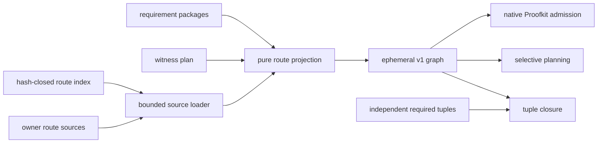

# Compact Proof Route Authority

Status: implementation design

Owner: `ci-coordinator.proofkit-adoption`

Implementation plan:
[Compact Proof Route Authority Implementation Plan](compact-proof-route-authority-implementation-plan.md)

## 1. Decision Summary

Store requirement-binding routes as a hash-closed index plus one compact source
per requirement owner. Expand those rows in memory and submit the complete v1
projection to the pinned Agentic Proofkit `requirement-bindings` command.

This changes the operative route representation only. Requirement meaning,
claim level, command argv, environment ownership, selective-planning semantics,
and merge authority do not move. The migration intentionally removes the stale
binding-local copy of requirement `nonClaims`: projected prose comes from the
canonical requirement source, and the report exposes the exact normalization
count.

## 2. Problem

The previous graph repeated requirements, commands, object keys, and identity
prefixes. Its 1,876 routes occupied 25,028 lines and 1,041,217 bytes even though
requirements are already owned by specification packages and commands are
already owned by the witness plan.

The independent required-tuple oracle occupied another 3,915 lines and 118,047
bytes. Its relation is valuable; its repeated whitespace is not.

The optimization target is therefore decoded relation equality under lower
review, storage, and agent-context cost. LOC reduction alone is not sufficient.

## 3. Preserved Observables

Let `B` be the base v1 graph, `C` the compact sources, `P(C)` their v1
projection, `A` the repository paths added in the same change, and `R(x)` the
set of route tuples:

```text
MigrationAdmitted(B, C, A) iff
  RequirementCore(B) = RequirementCore(P(C))
  and forall q in Requirements(P(C)):
        q.nonClaims = CanonicalRequirementSource(q).nonClaims
  and Commands(B) = Commands(P(C))
  and R(B) subsetOf R(P(C))
  and forall r in R(P(C)) - R(B): r.witnessPath in A
  and RequiredTupleManifest subsetOf R(P(C))
  and NativeProofkitAdmission(P(C)) = passed
```

A route tuple contains requirement ID, scenario ID, witness ID and kind,
witness path, command IDs, and environment classes. Source boundaries, JSON
layout, and source hashes are representation details. `RequirementCore` contains
requirement ID, owner, specification path, claim level, and proof state. The
legacy binding-local `nonClaims` text is deliberately not a second authority;
its normalization is a disclosed proof-contract change, not a runtime business
logic change.

Because selective planning is a deterministic function of the normalized route
relation and unchanged planning inputs, equality of old route tuples implies
equal planning outcomes for all old paths. New paths deliberately add only
their declared routes.

## 4. Authority And Dataflow



| Surface                               | Sole authority                             |
|---------------------------------------|--------------------------------------------|
| Requirement meaning and claim level   | `docs/specs/**/requirements.v1.json`       |
| Native command argv and environment   | `proofkit/witness-plan-input.json`         |
| Source identity and exact bytes       | `proofkit/requirement-bindings.json`       |
| Owner-partitioned route facts         | `proofkit/routes/*.v2.json`                |
| Pure reversible projection            | `scripts/proofkit_route_contract.py`       |
| Bounded current or historical loading | `scripts/proofkit_route_sources.py`        |
| Final binding admission               | Agentic Proofkit `requirement-bindings`    |
| Independent must-exist tuples         | `proofkit/required-binding-tuples.v1.json` |

The adapter may join existing authorities. It may not invent requirement text,
command text, environment classes, witness paths, or route identities.

## 5. Compact Contract

Each owner source declares exact identity prefixes once and stores rows with
these columns:

```text
requirementIdSuffix
scenarioIdSuffix
witnessIdSuffix
witnessKind
witnessPath
commandIds
environmentClasses
```

The inverse concatenates admitted prefixes and suffixes. Command IDs resolve
through the witness-plan catalog; each command's sole environment must be in
the route environment set. Unknown facts, unsorted sets, duplicate identities,
missing blocking requirements, or non-reversible identities reject the graph.

The source index contains source ID, repository path, and SHA-256. It is the
only source inventory: directory scanning cannot add authority.

## 6. Bounds And Failure Semantics

The loader bounds route and requirement source counts, index bytes, per-source
bytes, both aggregate source sets, witness-plan input, and historical Git
output. Current reads use descriptor-relative no-follow acquisition; historical
reads use the bounded Git wrapper. Planning resolves symbolic refs to immutable
commit IDs once before reusing base artifacts.

```text
UnknownSource
or HashDrift
or UnknownField
or DuplicateIdentity
or UnknownRequirement
or UnknownCommand
or EnvironmentMismatch
or NativeProofkitRejection
  => reject
```

There is no fallback to a stale generated graph. Base and head epochs are
loaded independently.

## 7. Alternatives And Falsification

| Alternative                                   | Result                                                                                                                                  |
|-----------------------------------------------|-----------------------------------------------------------------------------------------------------------------------------------------|
| Pretty v1 graph                               | Rejected: 1,041,217 bytes and duplicated owner facts.                                                                                   |
| Minified single v1 graph                      | Rejected: poor review locality and unchanged authority coupling.                                                                        |
| Proofkit 0.5.0 route source-set v3            | Rejected for this dataset: measured 1,847,649 bytes because full command strings and positive/falsification selectors repeat per route. |
| Numeric dictionaries for every repeated value | Rejected: smaller bytes do not justify opaque review or another lookup algebra.                                                         |
| Delete the tuple manifest                     | Rejected: tuple closure would become self-derived and vacuous.                                                                          |
| Track compact and expanded graphs             | Rejected: two mutable authorities can drift.                                                                                            |

The selected source format measured 474,036 bytes for the route authority, a
54.5% reduction from the previous graph. Together with compact tuple
serialization, the two authorities fall from 28,943 to 2,402 lines and from
1,159,264 to 566,009 bytes while retaining separate semantics.

## 8. Acceptance And Revision

Acceptance requires base-to-head route and independently authored required-tuple
relation preservation, exact source hashes, negative mutation coverage, tuple
closure, native Proofkit admission, all repository static gates, and exact-head
provider CI. New routes and required tuples are admitted during migration only
when their witness paths are Git additions in the same comparison epoch.

The temporary ability to read a v1 base remains only while stale branches can
legitimately have a pre-cutover merge base. Remove it after the owner-declared
transition window. Replace the repository adapter when a pinned Proofkit release
supports command-catalog references and yields an equal or smaller measured
representation without weakening review locality.

## 9. Non-Claims

This design does not prove witness quality, execution freshness, mutation
adequacy, merge safety, deployment readiness, or global proof completeness. It
proves only route representation, admission, and routing preservation.
