# Control-Plane Identity Authority Cutover

Status: implemented locally; external identity and provider closure pending

Date: 2026-09-02

Owners: `ci-coordinator.control-plane`, `ci-coordinator.operator-ui`,
`ci-coordinator.runtime`

Successor scope: implementation-time refinements to the identity,
repository-attestation, and local-state portions of the organization
control-plane trajectory and the browser workbench designs.

## Authority Relation

The
[organization control-plane implementation plan](organization-control-plane-implementation-plan.md)
remains the broader delivery trajectory for API completeness, UI parity, live
provider wiring, and production admission. This document supersedes only that
plan's implemented identity and repository-attestation details. The
[proof workbench](proof-workbench-ui.md),
[repository adoption](repository-adoption-ux.md), and
[developer state evolution](developer-state-schema-evolution.md) documents
remain authoritative outside the exact surfaces replaced here. Those
pre-existing documents remain byte-identical to the PR base.

## Decision

Replace broad GitHub-user-backed administrator sessions with four disjoint
credential planes:

```text
Keycloak human or workload -> control-plane roles
GitHub reviewer OAuth       -> one proposal-bound repository attestation
GitHub App                  -> provider reads and permission rechecks
Break-glass bearer          -> {force_full_ci, disable_omission}
```

The browser retains only an opaque, bounded, token-free Keycloak session. A
repository review and configuration activation remain separate transitions.
The initial database migration and local developer state are regenerated for
this pre-release authority model; no production compatibility contract exists.

## Selection Proof

Let `I` replace retained browser identity and `A` replace authorization and
provider access. The predecessor couples both to one retained GitHub token.

```text
I and not A
  -> the new principal cannot satisfy predecessor repository reads
     or the forbidden retained provider bearer survives

A and not I
  -> the new principal has no durable browser-session representation

parallel(predecessor, I and A)
  -> two administrator authorities exist for one operation
```

Therefore the minimum authority-safe merge unit is `I and A`, including the
frontend projection and removal of the predecessor path. Configuration API
expansion, visual redesign, provider enforcement, and production omission are
independently deployable and remain separate roadmap stages.

## Authority Algebra

For Keycloak principal `K`, deployment-allowlisted GitHub App scope `G`, exact
proposal `Q`, unexpired reviewer receipt `R`, and complete active pointer `B`:

```text
K(read) and G
  => repository evidence read

K(configure) and G and Q and GitHubReviewer(maintain-or-admin)
  => repository attestation and non-active epoch registration

K(activate) and G and Q and R and FreshReviewerPermission and Unchanged(B)
  => configuration activation

BreakGlass
  => force_full_ci or disable_omission
```

No implication may be reversed. Provider visibility is not control-plane
authorization, repository attestation is not activation, and break-glass is
not general administration.

## Dataflow

```mermaid
flowchart LR
    B["Browser"] -->|"opaque cookie; Origin + CSRF"| H["FastAPI control plane"]
    H --> S["Token-free PostgreSQL session"]
    S --> K["Keycloak actor and exact roles"]
    K --> G["Allowlisted GitHub App scope"]
    G --> Q["Current-head workflow proposal"]
    Q --> O["One-use GitHub reviewer step-up"]
    O --> R["Bounded review receipt"]
    R --> C["Baseline-bound activation"]
    C --> D["Atomic epoch and audit state"]
```



Keycloak and GitHub reviewer tokens are discarded after their exact evidence
is projected. GitHub App credentials remain server-side. No browser asset,
cookie, local storage entry, response, log, or database row retains those
bearers.

## State And Consistency

The reviewer callback binds the Keycloak session, repository scope, operation,
proposal manifest, expected active pointer, OAuth state, PKCE verifier, and
expiry. Every terminal response clears its path-scoped cookie. Every opened
pending transaction is deleted on terminal or exception paths; expiry bounds a
cleanup failure without granting authority.

The callback query operation id is only a navigation hint:

```text
QueryOperationId != ReviewAuthority
ReviewAuthority := authenticated durable replay of QueryOperationId
```

Activation compares the complete expected active pointer before provider I/O
and repeats the comparison under the final repository lock. Thus a stale
baseline cannot consume provider capacity and cannot win an ABA race.

```text
CurrentActive != ReviewedExpectedActive
  => ProviderCalls = 0 and Activation = rejected
```

## Error And Perimeter Contract

The outer application error boundary covers correlation, observation, public
rate admission, request deadlines, body admission, routing, and endpoint code.
For either callback route, every response path appends exactly one deletion of
the corresponding transient cookie. A valid pre-existing correlation identity
is retained on redacted downstream failures; failure to create that identity
still produces a cookie-clearing redacted response.

Every config admission response conforms to `ConfigControlErrorBody`, including
middleware-generated `invalid_config`, `overloaded`, and `unavailable` results.
The browser client requires exact agreement between HTTP status and error code.

## Pre-Release Persistence

The repository has no released database or deployed browser-session contract.
The final control-plane relations are therefore folded into one initial
migration. Carrying successor migrations for impossible production data would
increase test and operational state without preserving an observable.

Local metadata schema 3 renames the former operator bearer to the safety-only
break-glass bearer while preserving its bytes and all persistent volumes.
Metadata is the commit marker and is written last under the instance lifecycle
lock. Schema 1 converges through schema 2; malformed, mixed, foreign, future,
or non-resumable states fail before mutation.

The frontend development container receives no secret and injects no
authorization header. The backend copies file secrets into private tmpfs and
runs without effective capabilities or privilege escalation.

## Preserved Product Observables

- authenticated operators can select authorized installations and repositories;
- workflow discovery, proposal inspection, attestation, and activation remain
  distinct, typed UI states;
- successful review returns to the original repository and operation context;
- every stale, conflicting, overloaded, unavailable, replayed, or malformed
  state remains explicit;
- no provider mutation, workflow dispatch, or omission authority is added.

## Rejected Alternatives

| Alternative                                    | Rejection reason                                                                                  |
|------------------------------------------------|---------------------------------------------------------------------------------------------------|
| Retain GitHub user tokens for convenience      | It conflates administrator, reviewer, and provider authority and retains a broad bearer.          |
| Treat Keycloak login as repository consent     | Organization identity cannot prove repository-owner approval.                                     |
| Let review activate policy                     | It collapses two owners and removes explicit baseline-bound administrator intent.                 |
| Keep the broad operator bearer for API clients | It defeats least privilege and creates a second administrator plane.                              |
| Reset every local instance                     | Exact byte-preserving migration exists, so reset would destroy unrelated state without necessity. |
| Add a generic identity-provider framework      | One provider is admitted; substitutable behavior is unproved.                                     |

## Falsifiers

The design is invalid if any admitted path can:

- retain a Keycloak, GitHub reviewer, or GitHub App bearer in browser or durable
  session state;
- authorize a repository operation from provider visibility alone;
- activate without an exact unexpired review receipt, fresh reviewer permission,
  and unchanged complete active pointer;
- use break-glass outside its two safety operations;
- leave callback-cookie or pending transaction authority after a terminal path;
- perform proposal/provider work before operation replay or stale-baseline
  rejection;
- accept a config error body that contradicts its declared HTTP status; or
- require production data migration despite the absence of a released schema.

## Non-Claims

This cutover does not prove live Keycloak realm configuration, GitHub App
installation, provider callback registration, production deployment, external
credential rotation, repository-owner consent, provider enforcement, or safe CI
omission. Those facts require their separately owned external receipts.

## Session Lock Authority Closure

Repository-attestation registration must serialize the exact live session row
with concurrent logout and bounded-capacity decisions. PostgreSQL 18 requires
`UPDATE` privilege on at least one selected column for every row-locking clause,
even when no update statement is issued. The runtime principal therefore holds
column-level `UPDATE(handle_digest)` solely as lock admission; a migration-owned
`BEFORE UPDATE` trigger rejects every attempted session mutation.

```text
SessionRowLockRequired
and PostgreSQLRowLockRequiresUpdatePrivilege
and SessionIdentityImmutable
=> ColumnUpdateGrant(handle_digest)
   and RejectEverySessionUpdate
```

A table-level update grant is excessive. Omitting the column grant makes the
documented serialization path unexecutable. Granting it without the trigger
makes immutable authority state mutable. The paired grant and trigger are the
minimal sufficient implementation of both requirements.
