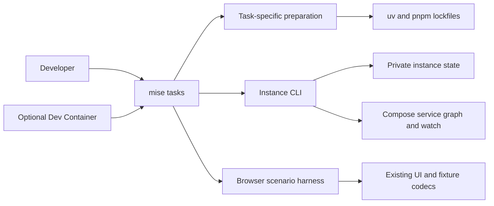

# Developer Experience Convergence

> Public-export boundary: historical source, PR, run, provider and rollout
> observations retained below are design context only, not acceptance evidence
> for `research-engineering/ci-coordinator`. Former private receipts are revoked.
> Synthetic pilot archetypes are proposed examples, not renamed executions.
> Requalify applicable requirements and open tasks against the new exact source.

Status: design and implementation contract; exact-revision native evidence owns qualification

Date: 2026-09-08

Owner: `ci-coordinator.developer-environment`, with operator-UI, runtime,
dependency-maintenance and proof owners retaining their existing boundaries.

Delivery: [Implementation plan](developer-experience-convergence-implementation-plan.md).

## 1. Outcome And Scope

A developer can prepare only the tools needed for a task, start an isolated
application, understand a partial failure, edit and debug it, explore repeatable
scenarios, and stop it without damaging another worktree. A maintainer can update
the toolchain coherently and explain the configuration to another project.

This is a proposal for that behavior, not evidence that it is implemented,
regression-free, fastest, universally optimal, or adopted elsewhere. The design
owns the proposed decisions and falsifiers; the plan owns sequencing and closure.
Existing requirement records continue to describe shipped obligations until a
behavioral slice updates them together with implementation and native witnesses.
Design references are not substitute executable requirements.

The comparative source baseline is `58b8d29e0338e727d4d33ab9e28e47814cf34eac`.
Implementation starts from `eed5a6ec56fbc35599aa21b434f989f6e2d7c2e1`, preserving
the intervening console navigation change. Rebind the actual base before delivery.
Earlier ADR preferences
are evidence of history, not premises proving this design's superiority.
Preserve historical design/plan files. Route successors through the documentation
index; update executable contracts in their owning slice.

The work is local developer experience. It does not change CI selection policy,
production permissions, GitHub integration authority, database business semantics,
or deploy another repository. It does not introduce a shared development platform.

## 2. Evidence And Transfer Decisions

The comparison used these immutable repository revisions:

| Archetype | Useful convention to evaluate | Required boundary |
| --- | --- | --- |
| Coordinator | Exact tools/locks, isolated instances and bounded diagnostics | Requalify the current public source; complexity is not necessity. |
| Synthetic application pilot | Discoverable demo, reset and browser-debug journeys | Preserve the consumer's admitted native-process topology. |
| Synthetic extension-service pilot | Provider-aware doctor with actionable remedies | Preserve integration-specific prerequisites and pinned tools. |
| Synthetic reporting-service pilot | Small host prerequisite set for container startup | Require readiness evidence, not merely a printed endpoint. |

These archetypes are proposed examples, not renamed private repositories or
claims of executed synthetic runs. No cross-project startup, memory or editing
latency benchmark is admitted for the new public repository.

Current causal observations, independently distinguishable from preferences:

| ID | Current source and observation                                                                                                            | Consequence                                                                                           |
|----|-------------------------------------------------------------------------------------------------------------------------------------------|-------------------------------------------------------------------------------------------------------|
| E1 | `scripts/dev_environment/compose.py` accepts Compose 2.22; `compose.yaml` uses `sync+restart`, introduced in 2.23                         | Published minimum is insufficient for a required capability; no installed-runtime failure is asserted |
| E2 | `cli.py` holds the instance operation lock around streaming `logs` and `watch`                                                            | Another lifecycle command can wait for the entire stream                                              |
| E3 | `cli.py` maps different exceptions to `development_environment_unavailable`; status resolves every endpoint before returning services     | Failure diagnosis and partial-state observation lose useful distinctions                              |
| E4 | Frontend watch covers `src`, package manifest and lock; Dockerfile also copies HTML, Vite/configuration and workspace inputs              | Some material edits are not automatically applied                                                     |
| E5 | `dev:up` depends on full host `install`; service images install their own dependencies                                                    | Host frontend and test dependencies are prerequisites even for container-only app use                 |
| E6 | Browser fixtures and authenticated UI scenarios exist under `frontend/tests`; public tasks expose no equivalent guided demo/debug journey | Existing capability is difficult to discover and reuse interactively                                  |
| E7 | `.github/dependabot.yml` covers uv, npm, Actions and Docker, without a mise entry                                                         | Toolchain update coordination needs explicit coverage; other automation may still exist externally    |

The old Python version in the local-environment ADR is historical, explicitly
routed by `docs/INDEX.md`; it is not an active version defect.

## 3. Decision Rule And Protected Properties

For a candidate change `c`, evaluate a finite set of required journeys `J`, hard
properties `H`, and maintenance objectives `M`. Unknown measurements remain
unknown; counts of files, commands or installed tools are not utility measures.

```text
AdmitForDelivery(c) :=
  every h in H has a preserved or strengthened native oracle
  and c addresses a named journey failure or required capability
  and a cheaper sufficient alternative has been compared
  and every new persistent component has an owner and retirement condition

Close(c) :=
  AdmitForDelivery(c)
  and required witnesses pass on the delivered revision
  and no unresolved regression contradicts its claimed improvement
```

This does not prove absence of every possible regression. Where benefit is
empirical, a pilot must establish it before a conditional component is adopted.
An explicit cost can be acceptable; silently worsening a protected property is
not. Do not manufacture a weighted score to hide a hard-property regression.

| ID | Protected property                                                                                                             | Dangerous counterexample                                                     |
|----|--------------------------------------------------------------------------------------------------------------------------------|------------------------------------------------------------------------------|
| H1 | Resources, credentials and mutable dependency artifacts belong to an admitted root and platform                                | Worktree A stops B, or Linux provisioning replaces macOS dependencies        |
| H2 | Ordinary startup, update and shutdown preserve data and existing credentials                                                   | An upgrade fixes startup by resetting a volume or rotating unrelated secrets |
| H3 | Owned provider clients do not overlap incompatible instance operations; ambiguous watch completion fences subsequent mutations | Reset races a live watcher that recreates the removed service                |
| H4 | Runtime authentication, privilege and database-role boundaries remain effective                                                | Demo/debug makes an unauthenticated production route reachable               |
| H5 | Installation is locked; verification does not repair or install implicitly                                                     | A check downloads dependencies and succeeds on an unreviewed graph           |
| H6 | Unknown, partial and stale observations are identified honestly                                                                | An unavailable service is reported healthy or a stale endpoint is opened     |
| H7 | Required proof selection and evidence classes remain intact                                                                    | A faster developer shortcut silently replaces a required CI witness          |

## 4. Selected Architecture And Alternatives

Keep mise for tool versions and public task entrypoints, uv/pnpm for dependency
graphs, and Compose for the service graph and source updates. Retain a small
Python adapter for Coordinator-specific identity, state, secrets and safe
operations. Reuse existing parsers, process primitives and provider CLIs before
introducing another framework.



| Candidate             | Decision now                                        | Strongest benefit and cost                                                                                                                         | Reconsider when                                                                        |
|-----------------------|-----------------------------------------------------|----------------------------------------------------------------------------------------------------------------------------------------------------|----------------------------------------------------------------------------------------|
| Make facade           | Do not add to Coordinator                           | Familiar company interface can help; duplicated recipes cannot                                                                                     | A real consumer needs compatibility; a pure delegating shim is then allowed            |
| just / Task           | Do not add                                          | Alternative task interfaces, without an identified missing capability here                                                                         | A demonstrated requirement cannot be met economically by mise                          |
| Tilt                  | Keep out of the default stack                       | Existing Compose dashboard and local resources are useful; direct control must integrate instance ownership and replace overlapping update control | A measured developer pilot needs a panel; compare Tilt before writing a custom panel   |
| process-compose       | Keep out of the default stack                       | Useful supervision of multiple host processes; wrapping Compose adds another supervisor                                                            | A supported native app profile is justified and it replaces manual process supervision |
| Nix / devenv / Devbox | Do not add                                          | Stronger declaration of system dependencies; another environment model and migration cost                                                          | Repeated host-library divergence remains after the supported container/tool setup      |
| Dagger                | Do not add                                          | Reusable container pipelines; engine and pipeline migration cost                                                                                   | Measured local/CI duplication can be removed while preserving witness selection        |
| Renovate              | Qualify as replacement for version-update proposals | Covers mise and related manifests; provider installation and lock execution need validation                                                        | The complete qualification in section 10 succeeds                                      |

Do not attribute Kubernetes dependence to Tilt: its Compose integration supports
project name, environment file and readiness options. Do not run Tilt Live Update
and Compose Watch as competing writers. A future panel must call the instance
boundary or replace it through explicit behavioral equivalence, not bypass it.

## 5. Preparation And Command Interface

Preserve existing task names and direct Python entrypoints. Existing JSON output
remains the default during migration. Add `--format human|json`; interactive
convenience tasks may request human output explicitly. Existing success keys and
the generic error code remain available; add a versioned diagnostic envelope
without exposing exception text. New commands appear in mise help with purpose
and prerequisites. Do not encode product policy in task recipes.

| Journey                 | Entry point                                         | Preparation and boundary                                                            |
|-------------------------|-----------------------------------------------------|-------------------------------------------------------------------------------------|
| Diagnose installation   | `dev:doctor`                                        | Dependency-free Python preflight; no automatic installation or state repair         |
| Prepare/start/watch app | Existing `dev:prepare`, `dev:up`, `dev:watch`       | Python/uv and backend-only preparation; app frontend dependencies stay in its image |
| Full host development   | Existing `install`                                  | Existing complete Python and pnpm setup remains explicit                            |
| Observe/open            | `dev:status`, `dev:logs`, new `dev:open`            | Admitted installed controller, bounded observations; no installation                |
| Stop/reset              | Existing `dev:down`, `dev:reset`                    | Owned mutation; reset still requires explicit destructive confirmation              |
| Explore UI              | New `dev:demo --scenario NAME`                      | Explicit frontend/browser preparation; isolated synthetic browser session           |
| Debug browser           | New `browser:ui`, `browser:debug`, `browser:record` | Existing Playwright and fixture/session harness                                     |
| Debug backend           | New `dev:debug backend`                             | Explicit debug-only Compose override and pinned optional debugger                   |
| Verify                  | Existing `check`, `check:portable`                  | Preserve their current meaning, prerequisites and execution placement               |

The initial smaller startup uses backend-only preparation:
`uv sync --project backend --frozen --all-groups`, retaining `backend/.venv` and
omitting host pnpm installation. It avoids a second environment and preserves
the installed Python verification tools. The controller still needs runtime
dependencies: `cryptography` and runtime-settings imports cannot simply be removed.

A separate ignored `.venv-control`, selected with `UV_PROJECT_ENVIRONMENT` and
the existing backend runtime lock, is conditional on measured savings from
omitting Python test tooling outweighing duplicated storage and lifecycle cost.
It creates no new manifest. A no-dev sync must never prune `backend/.venv`.
Compare this candidate with backend-only preparation before enabling it.

For either candidate, serialize preparation under a root-local installation lock.
Supported task entrypoints coordinate environment use with installation; an active
reader prevents a concurrent sync, and readers report `preparation_in_progress`
while it is changing. Admit root, interpreter, platform and lock identity before
reuse; refuse symlinked or foreign destinations. Arbitrary external uv/Python
commands bypassing the task interface are outside this concurrency guarantee.
An interrupted sync is repaired only by explicit preparation. Keep dependencies
rebuildable and separate from credential state. Dev Container provisioning uses
its owned dependency volume and must not write either host environment.

Acquire an environment read lease before a supported task invokes its venv, and
hold it through that command's environment use. Full `install` and app preparation
take the corresponding exclusive lease for sync. Both modes fail fast on conflict;
an installer does not queue ahead of a shutdown reader. The dependency-free task
front door owns acquisition; an already running venv interpreter is too late to
protect bootstrap. Preparation releases its exclusive lease before instance work;
that work reacquires a read lease and re-admits the environment. Global order is
environment lease, then control lock, then mutation lock; no reverse acquisition.
Thus watch and shutdown may hold compatible read leases while install reports
busy. Direct external uv/Python commands retain their functional entrypoints but
cannot claim the task interface's environment-concurrency protection.

Use mise's supported task-scoped/lazy tools only after verification against the
selected mise release. Preserve one version declaration per tool. A bare app-start
path must not eagerly install Node/pnpm only because they are globally configured.
If the selected release cannot express the separation without duplicate version
authority, retain the existing behavior for that slice and report the unmet
bootstrap objective; do not invent a second version manager.

`dev:doctor` imports only standard-library preflight code before reporting missing
dependencies. Python itself is still a prerequisite, supplied by mise. If mise or
Python cannot start, a short bootstrap instruction supplies the remedy; no CLI can
diagnose its own absent executable. Full diagnosis upgrades to installed adapters
only when available. Host checks cover supported macOS/Linux; native Windows is
not claimed. WSL requires its own tested Linux-host route.

## 6. Diagnostics And Observation

Expose closed reason codes for unsupported tool/capability, unavailable daemon,
missing/incomplete dependencies, invalid/foreign state, operation busy, provider
timeout, unhealthy service and stale observation. Include operation, phase,
service when safe, retryability and a fixed remedy identifier. Human rendering
maps these to instructions. Raw provider stderr, environment mappings, secret
paths and arbitrary exceptions never become public output.

The existing captured-command owner supplies bounded output and deadlines.
Retain sanitized phase context rather than disabling those bounds for diagnosis.
`dev:doctor` is read-only by default. Remote credential/provider checks require an
explicit connected option; the normal preflight does not contact GitHub, AWS or
Vault. Expected secret presence can be checked without printing secret values.

Status enumerates running and stopped owned services before resolving available
endpoints independently. Return service-specific health/exit observations and
`unavailable` reasons, including a missing-state result on a fresh checkout.
Do not fail the whole result because one port is absent. Return observation time
and `stable|changing|unavailable` consistency; this is not a transactional Docker
snapshot. Bounded re-observation detects lifecycle overlap and container identity
changes, with `changing` after the retry budget rather than invented stability.

The JSON status contract distinguishes observation completeness from readiness:

| Outcome                                    | stdout                                                                                                  | stderr                       | Exit |
|--------------------------------------------|---------------------------------------------------------------------------------------------------------|------------------------------|------|
| Complete observation                       | Existing identity/endpoints/services and `state: observed`, plus observation metadata                   | Empty                        | 0    |
| Partial or changing observation            | Same projection with available endpoints/services and explicit incompleteness reasons                   | Generic code plus diagnostic | 2    |
| Missing instance state                     | Locally derived identity, empty endpoint/service collections, `state: missing`, unavailable observation | Generic code plus diagnostic | 2    |
| Invalid or foreign state                   | Empty; do not project unadmitted state                                                                  | Generic code plus diagnostic | 2    |
| Provider unavailable after state admission | Admitted identity, empty endpoint/service collections, unavailable observation                          | Generic code plus diagnostic | 2    |

Endpoint values remain strings; omit an unavailable key and identify it in
observation reasons, rather than inserting null or a guessed URL. Service health
does not alone determine observation completeness: a fully observed unhealthy
service is reported as such, and `smoke` retains readiness verification. Diagnostic
objects use `schemaVersion: 1` and closed reasons. The old error code remains
`development_environment_unavailable`. Adding useful stdout in admitted failure
cases is an intentional interface extension; consumers must still honor exit 2.
Do not claim byte-identical failure output. Human rendering uses the same outcome
and exit classification.

Logs validate ownership, select allowed services, bind exact container identities
and release observation locks before following. On replacement, end with a clear
reconnect instruction rather than silently attach to an unverified container.
Expose tail, follow and service filters with finite admission bounds.
Preserve the current default of following with tail 200. Add `--tail` as an integer
from 0 through 10000, explicit `--follow`/`--no-follow`, and repeated `--service`
selectors from the admitted service allowlist. Reject invalid values before
provider access; non-follow mode exits after its finite result. The tail ceiling
bounds initial replay and is not a promise that an active follow stream is finite.

Use the already locked Docker SDK decoder for both application output channels.
Keep provider diagnostics separate and sanitized; discarding Docker CLI stderr
would also discard application errors. Declare the SDK as a direct development
dependency. A supervised reader inherits the shared dependency lease so an
installer cannot replace its environment after the controller exits. Delegate
transport to `docker system dial-stdio` through an owned socket pair; Python's
HTTP parser and the pinned SDK decoder retain their protocol responsibilities.
This preserves CLI-selected Unix/TLS/SSH connections, including SSH socket paths
which direct SDK transport rejects, without a second context/TLS configuration
parser. The CLI child remains in the reader's supervised process group. Native
qualification includes finite and followed stdout/stderr, idle following, clean
cancellation, replacement requiring reconnect, sanitized provider failure and a
localhost SSH connection with a nonempty socket path. Hidden CLI entrypoints and
private SDK helpers require exact-version qualification when either owner changes.
Bound handshake to 10 seconds, a finite read to 30 seconds, and one multiplexed
frame to 16 MiB; oversized or incomplete frames fail explicitly. Following permits
unlimited idle time. This bounds decoder allocation without truncating a frame
and reporting success; larger-frame support needs a streaming-decoder qualification.
Preserve effective Docker `HttpHeaders` from `DOCKER_CONFIG`, falling back to
`HOME/.docker/config.json`. The HTTP request owner retains framing, connection
and built-in header precedence. Read only a regular configuration file, bounded
to 1 MiB, with at most 64 configured fields and 64 KiB of aggregate field names
and UTF-8 values. Reject invalid or excessive metadata without exposing values.
These explicit admission limits bound local configuration work; larger files
or header sets require a revised admission decision. Native qualification uses
a header-checking proxy with CLI positive controls, finite/followed application
channels, both configuration locations and a missing-header negative control.

`dev:open` resolves the owned UI endpoint anew and opens only an admitted loopback
HTTP URL using an argument-vector OS opener. No arbitrary user-supplied URL or
shell interpolation. On a headless host, print the endpoint and a clear outcome.
Opening a page never seeds data, changes identity or starts remote work.

## 7. Lifecycle Concurrency And Cancellation

Retain one exclusive mutation lock per instance. It protects preparation of
instance state and provider mutations; the watcher holds it while it can change
containers. Another worktree uses another lock. Observation does not hold this
lock throughout a stream. An ordinary conflicting mutator fails promptly with
`operation_busy` instead of waiting indefinitely.

Provide an explicit `dev:down --stop-watch` route (and the analogous confirmed
reset option) for another terminal. The default conflicting mutation fails fast;
it never guesses whether an interactive session should be interrupted.

The watch parent owns one child provider session and a random session nonce in
the existing private operation directory, outside the worktree. A bounded control
lock protects publication of the current watch session and a nonce-bound stop
request. The parent polls the request at a bounded interval while supervising
its own child. The requester never signals a PID obtained from a file.

```text
watch: environment read lease -> control lock -> mutation lock
       -> publish fresh session -> release control
       -> own and supervise provider child -> stop/reap -> clear session
       -> release mutation lock and environment lease

cancel stage: stdlib root/session admission -> control lock
              -> publish stop request for that exact nonce
              -> await mutation lock and quiescence within cancellation deadline
              -> release every lock held by this invocation

down/reset stage: environment read lease -> fresh environment/state admission
                 -> ordinary mutation admission -> down/reset -> release locks
```

Watch cleanup must not acquire the control lock while the requester holds it;
it removes only its own nonce-bound session after proven quiescence. New watchers
cannot start across the cancel stage's control-lock interval. If another mutation
already owns the lock, report busy without cancelling it. A stale stop request
cannot stop a subsequent session. Reuse the existing process lifecycle owner for
owned child termination; add only the interactive lifetime/cancellation seam it
needs, preserving all finite-command callers and residual-process policies.

Both lock acquisitions have fail-fast or explicit finite deadlines, including
control acquisition while another requester is stopping a session. Distinguish
`quiescent` from `blocked`: only the first permits the next provider mutation.
Reuse is not an assertion that the current process helper already satisfies this
interactive contract. In particular, unconditional final waits and explicit lock
unlock on parent exit require separate review before they can serve this route.

The cancel stage needs neither the venv nor agreement between its installed graph
and an edited lockfile. It never acquires an environment lease while holding
control/mutation locks. A `blocked` result ends the invocation with exit 2.
After successful cancellation, down/reset is a new admitted operation. If its
environment is missing, stale or being prepared, report the original session's
stop outcome, that down/reset was not performed, and an explicit preparation or
retry remedy with exit 2. Do not infer the current container state without a fresh
observation, and do not install automatically. A newer watcher may win the gap
between stages; return busy rather than cancel that new nonce. Atomic cancel plus
down is not promised. Reset confirmation remains required before its destructive
stage. This stage boundary keeps recovery available after supported lockfile edits.

Cancellation has a fixed finite graceful-stop and escalation budget. The admitted
normal outcome requires a joined Compose watch client, no forced escalation,
and no surviving process group. Accept exit zero, or Compose exit 130 only when
this owner requested graceful cancellation and the process receipt records that
cause. An unsolicited 130 is a failure. This is a clean client stop, not proof
that Docker has transactionally drained every daemon-internal effect. Compose
2.23 launches watch batches in an unjoined goroutine; Compose 2.39.4 runs batches
within the joined watch event loop. Therefore 2.39.4 is the minimum candidate,
subject to the native cancellation witness. See the primary
[2.23 implementation](https://github.com/docker/compose/blob/v2.23.0/pkg/compose/watch.go)
and [2.39.4 implementation](https://github.com/docker/compose/blob/v2.39.4/pkg/compose/watch.go).
The [Compose command adapter](https://github.com/docker/compose/blob/v2.39.4/cmd/compose/compose.go)
returns 130 for cancellation after the command function returns; requiring zero
for this handled path would incorrectly fence every normal cancellation.

An unadmitted exit, forced termination, unknown completion, or abandoned parent
leaves a durable fence. Normal stop must release its own session so that a
successful watch does not permanently disable later work. An inherited kernel
descriptor retains the process ownership boundary while a child survives; the
durable fence additionally rejects new mutations after ambiguous parent death.
Do not recover by deleting a live lock, trusting a file-recorded PID, running a
global prune or resetting a database. Doctor reports the blocked owned session.
Daemon-internal crash recovery and administrator intervention remain separate
boundaries; absence of a client alone never qualifies them.

Finite debug-provider commands inherit the admitted instance mutation lease.
Controller death therefore cannot release mutation authority while its provider
child still runs. Qualify this through the actual Docker/Compose command chain,
in addition to host descriptor tests. The Linux Compose matrix and macOS host
process tests are distinct evidence; the latter do not qualify Docker Desktop.

CI teardown obeys the same lifecycle admission as the user entrypoint. An
ambiguous watch completion or failed reset retains the entire disposable source,
private state and credentials, with a structured location and completion report.
An assertion failure following a proven clean stop still performs ordinary
cleanup. Expected-abnormal probes use separate disposable instances; passing their
assertions does not authorize deletion of retained state. Runner disposal remains
an external boundary and is not recorded as successful application cleanup.

This small cooperative protocol is justified by cross-terminal cancellation of
an existing single watcher. It has no permanent daemon, network API, generic
scheduler or process registry. If a prototype cannot preserve H3 with this bounded
mechanism, stop that slice and compare a replacement supervisor; a larger custom
orchestrator is not an automatic fallback.

## 8. Complete Edit And Debug Feedback

The supported Compose floor is derived from all used capabilities, not a guessed
latest version. `sync+restart` alone requires at least 2.23; joined watch-client
cancellation raises the candidate to 2.39.4. Test the selected
minimum plus the current supported release, including CLI flags, interpolation,
health dependencies and watch actions. Publish only the proven floor.
The qualification matrix installs checksum-pinned 2.39.4 and 5.5.1 explicitly;
the runner's bundled client is not the current-release authority. The
[5.5.1 watch owner](https://github.com/docker/compose/blob/v5.5.1/pkg/compose/watch.go)
also joins the watch loop and its batches. Each version still requires the same
native lifecycle and effect witnesses before qualification.

| Input class                                                                      | Required effect                                                      | Independent observation                                        |
|----------------------------------------------------------------------------------|----------------------------------------------------------------------|----------------------------------------------------------------|
| Frontend source/styles                                                           | Sync and HMR                                                         | Changed rendered value without full image rebuild              |
| `index.html`, frontend configuration                                             | Sync/restart as required by Vite's selected loader                   | Changed document/config effect, not only file presence         |
| Backend source                                                                   | Sync and restart                                                     | Changed response and changed runtime identity                  |
| Manifests, locks, patches, workspace settings, Dockerfiles and entrypoint inputs | Rebuild affected image                                               | Changed installed/build effect and retained unrelated data     |
| Compose model, ports, environment and health configuration                       | Explicit watcher stop, configuration admission and owned recreate/up | New model applied with unrelated data and credentials retained |
| Migrations / database ACL changes                                                | Explicit controlled migration/reconciliation                         | Correct schema/role behavior; never blind SQL hot reload       |

Enumerate material inputs from current Dockerfile COPY and runtime configuration
edges before editing watch rules. Watch only relevant inputs, excluding caches,
credentials and generated noise. One mechanism owns each update action. Preserve
host/container native dependency separation and loopback bindings.

For Compose-model changes, stop the admitted watcher first, validate the new model,
then run owned recreate/up and optionally start a new watch session. Rebuilding an
image alone is not model reconciliation. A failed validation leaves the existing
resources intact and returns an actionable outcome. No second hot-reload daemon
or automatic database reset is introduced for this path.

Browser commands reuse existing Playwright modes and scenario routes; interactive
debugging is not recorded as a passing automated witness. Keep the existing CI
browser setup isolated from any externally running development stack.

Backend debugging uses a debug-only image target/Compose override with a pinned
optional debugger and explicit attach configuration. Resolve actual source paths
and dynamically bound loopback debug port. Do not install the debugger in release
images, broaden Linux capabilities or disable application authentication. Disable
competing watch/restart for the debug-owned backend session; leaving debug restores
the ordinary mode. If startup waits for attach, distinguish `awaiting_debugger`
from application readiness and use an attach-aware startup deadline.

## 9. Repeatable Scenarios Without A Parallel Product

Start with the existing browser route fixtures, runtime schemas and UI. Extract
only side-effect-free scenario data and request handlers shared by tests and the
interactive harness; production code never imports the harness. The initial
`dev:demo` launches a loopback Vite session and an owned Playwright browser context.
It routes synthetic responses in that context and identifies the session visibly
as synthetic. A plain URL in an unrelated browser is not the promised demo path.

Initial named scenarios cover populated portfolio, empty portfolio, unauthorized
access, provider failure/retry, retained successful/failed runs, economics
comparison, and an old response arriving after navigation. Each has deterministic
identities/time inputs and a reset action that creates a fresh context. Reuse
existing scenario semantics; validate payloads with production runtime schemas.
Assert unsupported requests fail rather than silently reach a real provider.
Block non-loopback navigation/network requests and all unhandled application API
requests in the synthetic context. Do not persist real cookies or credentials.

This gives useful UI data without a backend auth bypass, production seed endpoint,
new database schema, mock server product or new mocking dependency. Browser
preparation is an explicit cost. These scenarios prove presentation and client
behavior only; existing real PostgreSQL, connected-stack and provider witnesses
retain their separate roles.

Do not copy company databases into the default demo. A future real-data import
requires a separate privacy/ownership decision and staged restore-before-promote;
synthetic scenarios do not authorize production access. Full local OIDC/GitHub
emulation is also conditional on a concrete integration-debug journey. The normal
local app's authorization boundary must remain unchanged by this slice.

## 10. Toolchain Maintenance And Optional Editor Environment

Keep versions and digests in the ecosystem-native manifests that consume them.
Use consistency checks and a coordinated update operation rather than another
universal version registry or generated Dockerfile framework. Cover mise tools,
Python runtime admission, package-manager metadata, CI setup and image tags/digests.
Different supported versions in unrelated components may be intentional; validate
the declared relationship rather than force arbitrary numerical equality.

Qualify Renovate on an isolated proposal before replacing Dependabot version
updates. Required evidence: extracted mise/npm/uv/Docker/Actions dependencies,
complete supported-platform lock regeneration, a coherent Python and Node update,
exact manifest/image relationships, safe lock execution under the provider's
permissions, and the usual exact-revision checks. It must not require broadening
runtime or release credentials. Hosted availability and organization installation
are external prerequisites. The pilot does not authorize merge or deployment.

On success, transfer version-update proposal ownership once, without concurrent
bots on the same dependency. Preserve GitHub security alerts and required checks.
On failure, keep Dependabot and an explicit maintainer procedure for missing
toolchain coverage. Record a concrete failed criterion and remedy; do not leave
a nominally enabled bot as evidence of coverage. A new self-hosted maintenance
service is not the default fallback.

Retain the Dev Container as optional during this work. Its unique functions are
the supported Linux editor environment and provisioning/isolation checks; the
existence of its CI job is not proof of economic value. Reuse the same tools and
locks, retain identity-owned dependency volumes and no host Docker socket.
The full connected-stack lifecycle remains on the trusted host. Do not promise
that this container eliminates all host preparation or sandboxes hostile code.

Measure editor adoption and provisioning cost separately. Remove the editor
configuration only after a decision that its interactive use is unnecessary and
the required Linux/offline properties are preserved by a simpler witness. Until
then, preserve its witness. The observed baseline CI elapsed time (535 seconds
for the container job versus 1664 seconds for PostgreSQL in run 34232232389) is
one run, not CPU cost or guaranteed pipeline savings from removal.

## 11. Adoption And Cost Controls

Deliver a concise how-to, machine-readable task help, example human/JSON errors,
and a capability checklist that another project can map to its own commands.
Keep project-specific secrets, OIDC, databases and integration endpoints out of
any proposed common template. Permit mise-for-tools plus existing Make in a
consumer; common task semantics matter more than identical command spelling.

Use the application archetype as an unqualified candidate for an explicitly authorized adoption exercise:
retain its native `dev-all`, npm, demo and debug workflows, and adopt tool/version
and diagnostic conventions first. The extension-service archetype must preserve ODBC/add-in
constraints; the reporting-service archetype must preserve its Docker-only initial launch. This plan
does not modify those repositories. If a real consumer is unavailable, publish
an unqualified example and mark transfer qualification pending.

Extract reusable code only after two real owners need the same stable behavior,
with fewer total adaptation and maintenance obligations than local implementations.
No framework, template generator, plugin protocol or cross-repository runtime is
created merely to make adoption look complete.

Measure baseline and candidate on the same host/runtime/architecture, declared
cache state and task inputs. Separate cold provisioning, warm start, source-to-UI
feedback, backend restart, partial-failure diagnosis, dependency bytes installed,
and provider job elapsed time. Use paired repetitions and report every failure;
choose repetitions and an acceptance budget before examining candidate results.
Do not extrapolate macOS results to Linux, job elapsed to CPU, or two samples to
a population percentile. Every conditional tool gets an owner and an explicit
reject/retain decision rather than an indefinite pilot.

## 12. Completion Boundary

Core delivery requires all H1-H7 witnesses plus the plan's journey criteria,
safe upgrades of existing local state, current requirement/binding routes,
preserved CI selection, documented rollback and supported-platform evidence.
Native tests execute through the repository-owned GitHub route; a human's
interactive local debug session is a different evidence class. Optional bot and
cross-project adoption have explicit independent outcomes and cannot silently
count as passed core behavior. No document score certifies global perfection.

## 13. Source References

- [Current CLI](../../scripts/dev_environment/cli.py), [Compose adapter](../../scripts/dev_environment/compose.py), [watch witness](../../scripts/dev_environment/watch_witness.py).
- [Task entrypoints](../../mise.toml), [Compose inputs](../../compose.yaml), [frontend image](../../frontend/Dockerfile.dev).
- [Browser fixtures](../../frontend/tests/fixture.ts), [browser setup](../../frontend/tests/browser/globalSetup.ts), [economics scenarios](../../frontend/tests/browser/economics.spec.ts).
- [mise task configuration](https://mise.jdx.dev/tasks/task-configuration.html), [uv environment selection](https://docs.astral.sh/uv/concepts/projects/config/#project-environment-path).
- [Compose develop capabilities](https://docs.docker.com/reference/compose-file/develop/), [Compose Watch](https://docs.docker.com/compose/how-tos/file-watch/).
- [Tilt Compose support](https://docs.tilt.dev/docker_compose.html), [Tilt API](https://docs.tilt.dev/api.html#api.docker_compose), [process-compose](https://f1bonacc1.github.io/process-compose/).
- [Playwright debugging](https://playwright.dev/docs/debug), [Renovate mise manager and trust model](https://docs.renovatebot.com/modules/manager/mise/).

External capability references were inspected on 2026-09-08. Their moving pages
do not freeze future releases; revalidate the exact chosen release at each pilot.
