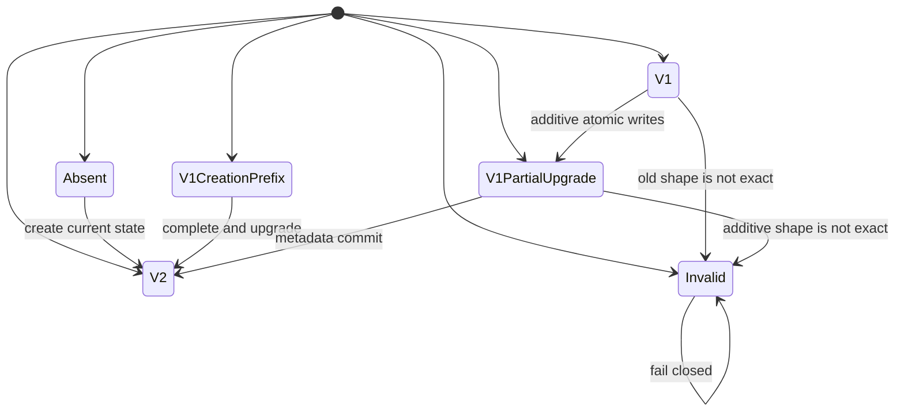

# Developer State Schema Evolution

Status: accepted design

Date: 2026-09-02

Owner: `ci-coordinator.developer-environment`

## 1. Problem

Local state created before production-quality safeguards has metadata schema 1,
but lacks the metrics bearer token and three runtime environment values. The
unversioned shape change makes an otherwise admitted instance unusable and
forces `dev:reset`, which destroys data that normal lifecycle operations must
preserve. Schema 1 also has reachable interrupted-creation prefixes because its
metadata was published before its secrets and environment; the upgrade must
not regress their prior restart behavior.

## 2. Decision

Metadata schema 2 is the commit marker for the expanded state. An exact schema
1 instance is upgraded under the existing per-instance lifecycle lock. The
migration admits the complete old or resumable additive shape before its first
write, preserves every old value, adds only the new material, and publishes
schema 2 metadata last. A schema 1 creation prefix with no environment admits
only absent, exact V1, or exact resumable V2 secrets and converges directly to
V2 without replacing any secret already published.

```text
V1Environment := exact V1 required keys + optional canonical proxy
V1Secrets     := exact V1 secret filenames
V2Environment := V1Environment + exact V2 defaults
V2Secrets     := V1Secrets + metrics-bearer-token

Migratable(s) :=
  ExactIdentityMetadataV1(s)
  and Environment(s) in {V1Environment, V2Environment}
  and Secrets(s) in {V1Secrets, V2Secrets}
  and ExistingFilesArePrivateRegularFiles(s)
```

The accepted write order is:

```text
admit all existing components
-> stage metrics token outside the closed secrets directory and rename when absent
-> atomically replace environment when V1
-> atomically replace metadata with schema 2
-> admit the complete V2 state
```

## 3. State Machine



`admit_instance_state` remains non-mutating and accepts only V2. Lifecycle
operations that already call `ensure_instance_state` perform migration before
provider work. Reset remains explicit and is not an upgrade mechanism.

## 4. Proof Sketches

### Credential Preservation

Let `S1` be the schema 1 filename set and `bytes(f)` the bytes of an existing
file. The migration writes only `metrics-bearer-token`, which is not in `S1`.

```text
forall f in S1: bytes_after(f) = bytes_before(f)
```

Environment replacement begins with the admitted V1 mapping and adds three
previously absent keys. Therefore every existing binding is preserved.

### Crash Recovery

Every file publication is atomic and metadata is the last write. A crash can
leave the authoritative components in only one of these admitted prefixes:

```text
(V1Secrets, V1Environment, metadata=1)
(V2Secrets, V1Environment, metadata=1)
(V2Secrets, V2Environment, metadata=1)
(V2Secrets, V2Environment, metadata=2)
```

The predecessor creation sequence additionally admits these environment-absent
prefixes:

```text
(NoSecrets, NoEnvironment, metadata=1)
(V1Secrets, NoEnvironment, metadata=1)
(V2Secrets, NoEnvironment, metadata=1)
```

Re-execution accepts each prefix, reuses already published material, and
converges to the final state. No prefix authorizes provider work because final
V2 admission occurs before lifecycle execution continues. A hard crash during
token publication may leave an owner-only unreferenced temporary file in the
state-directory staging namespace, but never inside the closed secrets filename
set; that file grants no authority and cannot block convergence.

### Invalid-State Exclusion

Identity, key sets, file ownership, file modes, link count, proxy
canonicalization, and root bindings are checked before mutation. Any state
outside the finite admitted set is rejected. Consequently migration does not
convert an unknown or foreign state into a trusted V2 state.

## 5. Alternatives

| Alternative                                 | Decision | Reason                                                        |
|---------------------------------------------|----------|---------------------------------------------------------------|
| Require `dev:reset`                         | reject   | destroys data during an ordinary upgrade                      |
| Accept both schemas forever                 | reject   | leaves two runtime contracts and hides incomplete upgrades    |
| Regenerate all secrets                      | reject   | invalidates credentials without necessity                     |
| Introduce a generic migration framework     | reject   | one predecessor and one additive transition do not justify it |
| Edit state in place without a commit marker | reject   | cannot distinguish complete and interrupted upgrades          |

## 6. Observable Change

The only new observable is that `dev:prepare`, `dev:up`, and `dev:watch`
upgrade an exact V1 instance instead of rejecting it. Existing credentials,
proxy choice, ports, Compose identity, and persistent volumes are unchanged.
Previously recoverable schema 1 creation prefixes remain recoverable. Invalid
or future-version state still fails closed.

## 7. Falsifiers

- Any old secret file changes bytes during migration.
- Any old environment value changes during migration.
- A crash-prefix replaces or duplicates an already published metrics token.
- A hard-crash temporary file appears inside the closed secrets directory.
- Metadata becomes V2 before both additive components exist.
- A resumable V2 component has a non-default added value or invalid token.
- An environment-absent schema 1 creation prefix loses restart recovery.
- A foreign root, unknown key, unsafe file, or future schema is migrated.
- A non-mutating admission call modifies state.

## 8. Non-Claims And Revision Triggers

This design does not define production secret rotation, downgrade, recovery of
corrupt local files, or migrations from unknown future schemas. A second
non-additive predecessor, secret rotation, or multi-process migration outside
the lifecycle lock requires a new design rather than extending this transition
implicitly.

Implementation order and witnesses are owned by
[the implementation plan](developer-state-schema-evolution-implementation-plan.md).
