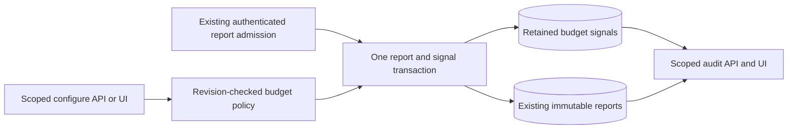

# Persistent CI Report Budgets

Status: implementation in progress; independent review and native qualification pending.

Owner: `ci_economics`. Delivery belongs to the
[implementation plan](economics-budget-policies-implementation-plan.md).
This extends [measured comparisons](ci-economics-measured-comparisons.md),
not planning, omission authority or provider workflow execution.

## Decision And User-Visible Boundary

An operator can save a repository-private budget, inspect its current version
and see signals for subsequently accepted matching measurement reports. The
same operations are available through the API and repository economics UI.

The initial evaluation window is one newly accepted report. Policy creation,
editing or re-enabling does not reinterpret historical reports. The existing
ad-hoc budget reader remains available for an explicit historical evaluation.
The UI must expose this boundary before saving, not describe it as a moving
average, all-history scan or complete regression detector.

A breach means an available reported counter exceeded an operator threshold.
It proves neither a causal regression nor excessive total workflow CPU. An
unavailable counter is insufficient evidence. No matching reports is unknown,
not within budget. Failed commands remain eligible and visibly failed.
This feature cannot modify a plan, fail a check, dispatch work or send a
notification to an external provider. External delivery remains separate D6
work with its own uncertain-effect recovery contract.

## Selected Mechanism And Alternatives

Store the active policy separately from planning configuration. At first
report insertion, evaluate the finite matching policy set and write compact
signals in the same existing PostgreSQL transaction. Reuse `ReportBudget`
and `EvaluatedReportBudget` as the authoritative threshold calculation. SQL
owns bounded shapes, identity/retention foreign keys and append-only privileges,
not threshold arithmetic. The storage decoder rederives each signal and rejects
contradictory rows; browser admission independently validates received values.
Catalog attestation does not prove arithmetic. Neither boundary chooses budgets
or re-evaluates historical reports. Adding a SQL evaluator would duplicate the
domain rule without a current independent SQL arithmetic requirement; revisit
this choice if a consumer bypasses the validated storage adapter.
No HTTP route or background worker owns another threshold policy.



The decision domain contains four alternatives:

| Alternative                            | Result under this scope                                                                                                                       |
|----------------------------------------|-----------------------------------------------------------------------------------------------------------------------------------------------|
| Existing caller-supplied read          | No persistence or automatic signal; does not meet the requested behavior                                                                      |
| Evaluate only when UI reads            | No observation for unopened pages; loses the policy-at-acceptance relation                                                                    |
| Periodic anti-join evaluator           | Can support historical windows, but adds scheduling, fair progress, policy-history and recovery obligations not required by this first window |
| Atomic evaluation on report acceptance | Uses the existing transaction and bounded report; adds finite writes and policy-read synchronization, without a second queue or provider call |

The final alternative is selected for implementation, conditional on native
latency, contention and storage evidence under the existing ingress budgets.
It is not yet proved hard-feasible under production load. If those budgets
fail, revisit asynchronous evaluation with an explicit policy-at-receipt
snapshot; never silently relax atomicity or move the report deadline.
The decision horizon is this per-report window, not future cohort analytics.

## Policy Contract

A policy has exact repository scope, a stable bounded ASCII key, positive
JSON-safe revision, enabled state, a selector and one `ReportBudget`.
The selector contains an exact sample key, producer digest and method, plus
an explicitly nullable declared runner-class digest. Null deliberately means
any declared runner class; omission is invalid at the wire boundary. The UI
must distinguish that wildcard from a verified runner equivalence claim.
Cache and workload declarations do not silently become matching evidence.
This is a per-sample operational threshold, not a controlled comparison.

Reuse the existing report identifier, sample-key, digest, method, counter and
integer-domain validation owners. Introduce no parallel regex or unit system.
The configure transport must project the domain contract through Pydantic,
with raw duplicate-key, required-key, nullability and value-domain admission.

At most 16 policy identities exist per repository, including disabled ones.
An operator can revise a disabled identity for another purpose; its revision
and historical signals remain distinct. No delete/recreate operation resets
identity. The bound limits per-report matching and writes; it is not evidence
that the deployment can afford the maximum theoretical retained population.

Create requires expected revision zero and an absent identity. Update and
disable require the current positive revision; success increments it exactly
once. Overflow rejects the operation. A stale precondition is a conflict,
not an implicit overwrite. No automatic mutation retry follows uncertainty:
read the current policy and require a new explicit operator decision.

While a write is pending, disable editor replacement and refresh. After an
unknown or rejected write, closing the editor also starts a fresh read; no
replacement editor is available until that read succeeds. Reuse the existing
loading/error states rather than a second reconciliation cache or retry queue.
A failed refresh cannot expose the preceding editable snapshot. Leaving the
view discards it; returning performs a new read. These UI guards do not replace
server-side revision and operation admission.

Configuration changes use the existing paired audit mechanism. Audit records
contain policy configuration and actor/operation identity, never copied CPU
measurements. Audit retention is independent of source-report retention.
The implementation must reuse the existing operation replay contract rather
than invent a second unbounded request-history table.

## Transaction And Replay Semantics

Report admission already serializes the immutable report slot through its
source row. Add a separate repository budget lock domain: shared for new
report evaluation, exclusive for policy mutation. Do not reuse the repository
omission-authority lock, which would add an operational dependency on planning.

The implementation must establish and test one acyclic lock order including
the compatibility fence, source row, budget scope and audit append. Report
insertion does not append a second audit event. Policy mutation never acquires
a source row. Authorization occurs before storage access; locks do not grant
scope, role, provider or execution authority.

Budget adapters import tables through the existing schema facade so family
registration order does not depend on which adapter loads first. Audit event
time is the database sample serialized as UTC milliseconds under the existing
audit contract; generic datetime serialization is not that wire contract.
This representation does not replace the lock/CAS authority or expiry clock.

The database protocol permits a pure capability retirement or expansion, not
both in one declaration. Therefore one PR delivers two forward revisions:
`0008` retires economics v2; `0009` installs and admits v3. The migration runner
keeps both under its exclusive fence and transaction. Existing migrations and
reports remain unchanged; old binaries cannot resume v2 report writes after
v3 admission. A deployment must drain the old runtime, migrate, apply the new
least-privilege ACL, and start the matching image. This is not a zero-downtime
rolling-upgrade claim.

Compatibility and repository-authority locks use PostgreSQL's two-integer
namespace; the new budget scope uses its disjoint bigint namespace. The
transaction order is `compatibility -> source -> shared budget` for a report
and `compatibility -> exclusive budget -> audit head` for a policy. No budget
path acquires a source after taking the budget lock, and report writes do not
acquire the audit head. Native lock-barrier tests must substantiate these
ordering claims. Hash collisions may serialize unrelated budget scopes but
must never confer authorization.

Let `P` be the enabled policy set admitted while the shared lock is held and
`R` a newly accepted report. The intended committed relation is:

```text
Signals(R) = { Evaluate(p, R) | p in P and Matches(p.selector, R) }
Commit(R) <=> Commit(R and every required signal in this transaction)
0 <= |Signals(R)| <= |P| <= 16
```

This equivalence applies to the first insertion under the new schema contract,
not old retained reports or an unknown commit outcome. Report replay retains
the original signals; it does not evaluate a newer policy. Contradictory report
replay remains a conflict. A crash before commit leaves neither new report nor
signals; a crash after commit is resolved through the existing immutable slot.
Commit or cleanup uncertainty must not be reported as confirmed absence.

Each signal binds exact scope, report ID and digest, source retention,
policy key/revision and immutable selector/threshold snapshot. Its measurement
and outcome derive from that report, not the current policy. Policy edits and
disabling cannot relabel older signals as evaluations of the current revision.
No new report receipt may extend the source's retention.

## Read, Retention And Capacity

Private reads list current policies and retained signals, with optional exact
policy/revision and outcome filters. Pages use the existing bounded keyset
conventions, limits 1-100 and metadata projections. Cursor order is not an
append-time or complete-population watermark. Every page repeats scope and
retention admission; callers refresh to discover concurrently committed rows.
Policy keys use ASCII order after the bounded read. Signal cursors use explicit
PostgreSQL `C` collation in both comparison and indexed ordering, matching the
domain and browser order independently of the database's default locale.

Read eligibility requires exact live source/report relation and database time
strictly before source expiry. Signal retention equals report retention; a
foreign key and the cleanup owner prevent orphaned signals. Deleting a report
removes its signals atomically. Policy records survive because configuration
is not measurement evidence. UI detail can become unavailable after listing.

Missing policies, absent matching reports, insufficient counters, historical
revisions, unavailable storage and forbidden scope are distinct states. Public
metrics use only the existing bounded label discipline: never repository,
policy key, sample, report ID, actor or provider text labels.

Prove finite payload, row, transaction and response costs before release.
Additional storage is at most 16 bounded signal rows per accepted report,
with no copied canonical report body. Measure that amplification and query
plans in native PostgreSQL fixtures; include it in E1 capacity admission.
Finite arithmetic bounds alone do not prove memory, latency or disk fitness.

## Falsifiers And Revision Conditions

The following independently defeat the design or implementation:

- changing any scope, selector operand, method, counter, policy revision,
  enabled state, report identity/digest or source retention admits a wrong signal;
- equality, unavailable counter or failed command receives the wrong outcome;
- a concurrent policy change produces mixed-revision signals for one report;
- replay changes old signals, or a crash commits only part of the required set;
- a stale configure command overwrites a newer policy or resets a revision;
- empty reads become success, expired evidence remains visible, or cleanup
  creates an orphan or extends a measurement's lifetime;
- a telemetry change touches planning authority, changes the command exit code,
  weakens fallback or requires an external provider mutation;
- maximum admitted policy count violates existing latency or capacity budgets.

Use real transaction/lock barriers for races and sensitive native negative
controls, not scheduling sleeps or route existence. Cross-replica mutation,
schema upgrade, ACL and cleanup must be covered before release. Retain explicit
unknowns for production capacity and actual consumer measurements.
Historical windows, statistical inference, notification delivery or finer
selectors require a new owner decision; they are not implied by this feature.
