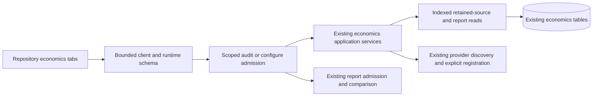

# Economics Operator Console

Status: implementation design; native and live acceptance pending

Owner: CI economics reads and repository-scoped operator journeys.
The [plan](economics-operator-console-implementation-plan.md) owns delivery.
This extends [measured comparisons](ci-economics-measured-comparisons.md)
without changing measurement, collection, comparison or planning policy.

## Outcome

An authorized operator can find a retained run, inspect measurements, choose
two retained reports and understand the server's comparison without entering
opaque identifiers. Discovery and registration remain explicit operations;
viewing a page never enrolls a run or dispatches checks.

The existing repository economics page gains three related tabs:

| Tab                 | Task                                                                                       | Authority                               |
|---------------------|--------------------------------------------------------------------------------------------|-----------------------------------------|
| Registered runs     | Browse retained independent sources, collection state and reports                          | Scoped audit read                       |
| Discover runs       | Choose a bounded creation window, inspect provider results, explicitly register an attempt | Audit discovery; configure registration |
| Reconciled attempts | Inspect the existing reconciliation-derived evidence                                       | Existing scoped audit read              |

Within a selected run, related measurement and report views remain local to
that identity. Comparison shows both selected identities together. It does
not become another long page containing every repository operation.

## Why The API Must Expand

Current v2 supports provider discovery and reading a known report ID. Neither
enumerates retained independent sources and reports. Provider discovery has a
shorter window than durable retention. Therefore a frontend-only change cannot
complete the retained-evidence journey without a manual or incomplete index.

Use the existing source and report tables and their existing indexes. Extend
the current economics read ports, application services and transactional
adapter. No catalog table, migration, provider write, generic pagination
framework, new service or frontend state library is needed.

The shared single-report lookup stays in one capability-owned protocol.
Read catalogs extend that lookup, while report storage extends it with writes;
the ingestion adapter is not forced to implement an unrelated listing method.
This separates two actual consumers without duplicating their common contract.



## Read Contracts

Add two read-only operations under
`/api/v2/economics/repositories/{installation_id}/{repository_id}`:

| Relative path                  | Result                                                 | Ordering and cursor                                                   |
|--------------------------------|--------------------------------------------------------|-----------------------------------------------------------------------|
| `/sources`                     | Provider source, public collection state and retention | Descending numeric run ID and attempt; canonical `run.attempt` cursor |
| `/sources/{source_id}/reports` | Exact source plus bounded report pointers              | Ascending report ID; last report ID cursor                            |

Page size is 1-100, with a browser default of 20. Fetch at most `limit + 1`
rows to determine continuation. A next cursor identifies the last returned
item and requires an observed additional row. The source order is an identity
order, not a promise of chronological ordering. Display actual timestamps.
Pages are independent current reads, not a multi-page snapshot or exhaustive
population count. Newer sources require an explicit refresh.

The source query uses the existing partial index on
`(installation_id, repository_id, workflow_run_id, run_attempt)` for
`source_kind = 'provider_run'`. The report query uses the existing
`(subject_id, report_id)` index, joins the exact retained source and projects
only pointer metadata. It never selects `payload_canonical` for a list.
A bounded outer join distinguishes a missing or expired source from an
existing source with no reports in one database statement.

A report pointer contains its ID, digest, receipt time and retention end. It
is not a re-admitted report body, a successful job, a CPU value or execution
authority. Selecting it invokes the existing full report reader. That reader
may return not-found after retention or reject inconsistent evidence.

Public source state excludes lease owner, lease token and claim credentials.
Collection state and measurement availability are distinct: a captured
snapshot can have unknown metrics, and registration can precede collection.
Reconciliation-derived measurements retain their actual source kind even when
the same attempt also has an independent provider-source registration.

## Invariants And Falsifiers

For requested scope `s`, source `x`, cursor `c`, limit `L` and statement time
`T`, every admitted source-page row satisfies:

```text
authorized(actor, s) before query
row.source.attempt.scope = s
row.source.kind = provider_run
row.source_id = canonical_provider_source_id(row.attempt)
row.status != expired and T < row.evidence_retain_until
0 <= page.size <= L <= 100
strict descending order; no duplicate identities
c exists => every row.key < decode(c)
next exists => next = key(last returned row) and another row was observed
```

The report query adds exact `source_id`, source/report retention equality,
strict ascending report IDs and `report_id > cursor`. No response field is
an SQL identifier or executable provider text. Cursors do not grant access;
each request repeats scope authorization and all predicates.

Each operand has an independent negative witness: installation, repository,
source kind, source digest, attempt identity, retention boundary, ordering,
duplicate row, continuation cursor and requested limit. A successful empty
page, expired source, forbidden scope and unavailable store remain distinct.

Browser admission verifies generated operation types and runtime structure,
then requested scope, source/attempt/report identity, cardinality, ordering
and continuation. A schema-valid response for another request is invalid.
Scope, session-authority or request changes abort old work and reject late
results. Refresh invalidates unfinished selections; completed comparison
evidence remains tied to the exact two visible report identities.

Registration carries the existing session CSRF proof and configure role. It
is explicit, disables duplicate submission and preserves the selected attempt
on retry. Conflicts, retention rejection and capacity rejection never render
as successful registration. Discovery is still a read of best-effort provider
evidence even though its existing bounded transport is POST.
That POST also carries session CSRF proof under the existing transport policy;
its required capability remains audit, not configure. The development proxy
admits these exact operations and scoped reads but excludes report ingestion.

## Measurement Presentation

Show units, scope, provenance and evidence quality beside values. Keep wall
time, queue time, summed job occupancy, runner-slot occupancy and measured
process CPU separate. Missing evidence is not zero. The browser does not
derive savings, comparability, budget success or permission to omit CI.

The existing comparison and ad-hoc report-budget endpoints remain the only
owners of those decisions. Show incomparable and unknown reasons directly;
never extrapolate a pair into organization-wide savings. Persisted budgets,
cohort aggregation and alerts remain separate roadmap work.

## Interaction And Accessibility

Reuse the repository task navigation, session hook, bounded fetch transport,
installed Zod and Lucide controls. Use accessible tabs for related views,
ordinary links for navigation and explicit buttons for commands. Only the
selected task performs its expensive reads. No credential enters storage.

Source and report selections have visible identity and action context on
desktop and mobile. Long hashes are secondary disclosures, not primary
navigation labels. Finite tables or responsive rows preserve the name/action
relationship without requiring horizontal scrolling to identify the target.
Loading, empty, unavailable and invalid-evidence states have distinct labels
and bounded retry actions; no automatic infinite polling or page loading.

## Alternatives And Revision Conditions

Manual report IDs are cheaper to implement but do not satisfy the journey.
Provider discovery alone loses retained evidence outside its window. A second
catalog duplicates existing retention and identity authority. Loading whole
report bodies for a list makes memory proportional to `L * MAX_REPORT_BYTES`
without contributing to selection. Indexed metadata projections avoid these
costs while retaining full admission at the detail boundary.

Revisit indexes if measured scoped query plans exceed their budget; revisit
snapshot pagination only if an admitted export or population statistic needs
it. Revisit UI state decomposition if ownership or lifecycle differs, not
because a file crosses a size heuristic. Native PostgreSQL, API, client and
Chromium witnesses are required; this design proves neither production
capacity nor a globally optimal interface.
