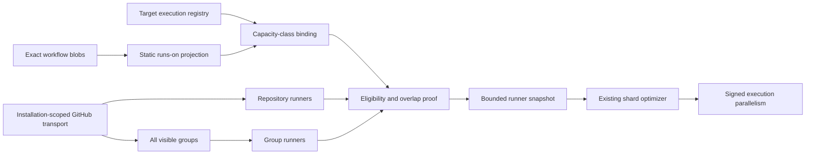

# Exact Runner Capacity Evidence

Status: accepted design
Last updated: 2026-09-05
Owner requirements: `REQ-CI-CORE-005`, `REQ-CI-RUNTIME-039`

## 1. Decision

CI Coordinator may optimize `witness-shards` parallelism only from a bounded
count of observed free self-hosted runners that are proved eligible for the
exact static `runs-on` selector of each execution profile.

The capability joins two independently acquired facts:

1. the target registry binds an execution profile to one exact workflow job;
2. the exact workflow blob binds that job to one static runner selector.

GitHub provider evidence then projects only runners that satisfy that selector
and the repository's runner-group access. Unknown syntax, incomplete provider
evidence, workflow-restricted groups, or overlapping capacity pools with
different class identities withhold optimization for every affected class.

This decision does not add another planner. Deploy builds, Compose rendering,
and other selectively useful checks remain ordinary validation obligations;
their input closure belongs to repository policy and dependency-graph evidence.

## 2. Why This Is The Minimum Sufficient Design

Let `V` be the already verified validation set, `P` an execution profile,
`S(P)` its exact static runner selector, `B(C)` the selected profiles sharing
capacity class `C`, and `F(C)` the observed free eligible self-hosted runner
identities for that class. Define the additional parallelism above the
coverage-preserving serial baseline as:

```text
Extra(P) = max(0, maxParallel(P) - 1)
```

The required safety relation is:

```text
Optimize(P) =>
  ValidationSetAfter = V
  and ExactSelector(P, S(P))
  and CompleteBoundedEvidenceForEveryUsedSource
  and PairwiseDisjointCapacityClasses

AdmittedCapacity(C) =>
  sum(Extra(P) for P in B(C)) <= max(0, |F(C)| - |B(C)|)
```

One serial lane per selected profile is the mandatory execution baseline, not
capacity-derived optimism. Therefore, when `|F(C)| < |B(C)|`, all profiles
still execute and GitHub may queue them; observed capacity adds no parallelism.
This distinction avoids the impossible claim `1 <= maxParallel <= 0` while
preserving every selected test.

The alternatives are ordered by the product objective and hard constraints:

| Alternative                                       | Safety                                         | Utility                              | Complexity                                         | Verdict                               |
|---------------------------------------------------|------------------------------------------------|--------------------------------------|----------------------------------------------------|---------------------------------------|
| Always unknown capacity                           | Strong                                         | No adaptive parallelism              | Minimum                                            | Insufficient for the accepted roadmap |
| Count every idle runner                           | False: availability does not prove eligibility | High when lucky                      | Low                                                | Rejected                              |
| Static selector plus bounded eligible observation | Strong within declared non-claims              | Useful for current self-hosted pools | Proportionate                                      | Selected                              |
| Reservation or central allocator                  | Potentially stronger                           | Potentially high                     | Requires provider authority GitHub does not expose | Deferred                              |

The selected alternative strictly dominates the first two: it preserves the
same coverage and fallback safety as always-unknown capacity, enables a useful
subset of adaptive parallelism, and excludes the label/group counterexamples
that invalidate a global idle-runner count. A reservation layer is not selected
because an abstraction over a nonexistent provider guarantee would add code
without adding truth.

## 3. Ownership

| Concern                            | Semantic owner        | Boundary                                                            |
|------------------------------------|-----------------------|---------------------------------------------------------------------|
| Static `runs-on` syntax            | `repo_context`        | Parse exact-revision YAML into a bounded non-authorizing selector   |
| Capacity-class selector projection | `runner_capacity`     | Bind one class to one normalized label set and optional exact group |
| GitHub HTTP and decoding           | `integrations.github` | Acquire complete bounded runner and visible-group evidence          |
| Shard optimization                 | `runner_capacity`     | Consume only admitted class capacities after validation is fixed    |
| Cross-capability sequencing        | `app`                 | Pass trusted selectors to the provider and preserve fallback        |
| Runtime construction               | `runtime`             | Wire the GitHub implementation without owning eligibility policy    |

No database, HTTP API, target-artifact schema, signed-plan schema, or frontend
contract changes are required. The observation is request-local and influences
only parallelism, never check selection or omission authority.

## 4. Static Selector Contract

A supported selector is one of:

```yaml
runs-on: dev
```

```yaml
runs-on: [self-hosted, linux, x64]
```

```yaml
runs-on:
  group: build-runners
  labels: linux-x64
```

Admission requires:

- a scalar, sequence of scalars, or a mapping with only `group` and `labels`;
- at least one group or label;
- bounded visible-ASCII labels and bounded Unicode-scalar group text without
  control characters;
- no expression marker, alias, duplicate label under ASCII case normalization, or
  unsupported mapping value; and
- an exact static selector for every profile job that contributes a capacity
  class.

Labels are restricted to visible ASCII and normalized to lowercase. GitHub
documents case-insensitive labels but not its Unicode collation; using the
ASCII intersection avoids inventing equivalence such as `U+00DF = ss`. Group names
retain exact spelling because the provider documentation does not establish
case-insensitive group identity.

A static label does not prove whether GitHub-hosted, larger, or self-hosted
runners may also satisfy it. The provider therefore treats every admitted form
only as a selector and projects the observed self-hosted subset. It neither
classifies the provider family from label spelling nor claims unobserved
capacity.

For capacity class `C`:

```text
Selectors(C) = {selector(profile.job) | profile.capacityClassId = C}

AdmittedClassSelector(C, S) <=> Selectors(C) = {S}
```

Zero selectors or multiple distinct selectors make `C` unknown. This rejects a
configuration that gives one class identity to behaviorally different pools.

## 5. Provider Evidence

The provider reads, under the request's installation token:

1. every repository-scoped self-hosted runner page;
2. every organization runner-group page filtered by
   `visible_to_repository=<repository>`; and
3. every self-hosted runner page for each visible group, including restricted
   groups needed to exclude ineligible repository-runner observations.

All reads use GitHub REST API version `2026-03-10`. The provider admits an
inventory only when request identity, response framing, total count, unique
identities, exact same-origin sequential pagination, page count, item count,
aggregate admitted bytes, and total deadline all close within fixed bounds.
The page budget is checked before every request. The transport independently
bounds every response body, so even a response that crosses the remaining
aggregate budget has a finite read bound:

```text
providerRequests <= maxPages
admittedResponseBytes <= maxTotalResponseBytes
bodyBytesDeliveredBeforeAggregateRejection
  <= maxTotalResponseBytes + transportMaximumResponseBodyBytes
```

Expected provider unavailability and the provider's own total timeout yield
unknown capacity and serial selected execution. Timeout ownership is determined
by the provider's deadline state, not by exception type alone:

```text
OwnDeadlineTimeout := caught TimeoutError and deadline.expired()
caught TimeoutError and not deadline.expired() => propagate
```

Thus a factory or provider-implementation `TimeoutError` raised outside the
GitHub client's admitted transport-outcome algebra is an unexpected
implementation exception. It propagates to the application boundary, which
records a bounded diagnostic and withholds selected execution so the existing
FullCI path runs; it is not disguised as ordinary provider absence. A transport
timeout remains expected unavailability because the common GitHub client owns
and normalizes that transport outcome before returning it to this provider.

Organization evidence requires the GitHub App's read-only
`organization_self_hosted_runners` permission. A provider denial, including an
ambiguous `404`, malformed response, exceeded bound, or partial page makes the
snapshot unavailable. A repository-runner response alone cannot reveal
workflow restrictions owned by its runner group.

The snapshot timestamp is captured before the first provider read. GitHub does
not provide an atomic multi-page snapshot, so the resulting count is bounded
observational evidence, not a lower bound on availability at a later instant.

Workflow-restricted groups are excluded from version 1. Their eligibility
depends on a separate exact workflow-ref relation; treating them as generally
eligible would be unsound. A group-specific selector that names such a group is
unknown rather than zero.

## 6. Eligibility Algebra

For runner `r`, selector `s`, repository `q`, and provider observation `O`:

```text
LabelEligible(r, s) := ascii_lower(s.labels) subset_of ascii_lower(r.labels)

GroupEligible(r, s, q, O) :=
  s.group is absent and r is repository-scoped
  or s.group is absent and r belongs to an unrestricted group visible to q
  or s.group = exact(group.name)
     and r belongs to that unrestricted group visible to q

Eligible(r, s, q, O) := LabelEligible(r, s) and GroupEligible(r, s, q, O)
Free(r, O) := r.status = online and r.busy = false
Pool(s, q, O) := {r.id | Eligible(r, s, q, O)}
FreePool(s, q, O) := {r.id in Pool(s, q, O) | Free(r, O)}
```

Repository and group inventories are unioned by runner id. Eligibility labels
for one identity must agree; conflicting labels reject the snapshot. Transient
state is intersected conservatively across occurrences: `online` uses AND and
`busy` uses OR. Before capacity projection:

```text
forall C1 != C2:
  Pool(selector(C1)) intersection Pool(selector(C2)) = empty
```

If this relation fails, every intersecting class is omitted from the snapshot.
This prevents one free runner from being counted independently for two capacity
classes. Introducing an allocator is the revision trigger for admitting
overlapping pools.

For each remaining class:

```text
freeSlots(C) = |FreePool(selector(C), repository, observation)|
```

Zero is valid evidence and retains conservative execution. Missing classes are
unknown and also retain conservative execution.

## 7. Data Flow



The arrow from `S` to `O` cannot alter the previously verified validation set.

## 8. Failure And Fallback

| Condition                                                                                      | Result                                |
|------------------------------------------------------------------------------------------------|---------------------------------------|
| Dynamic expression or unsupported selector                                                     | Capacity class omitted                |
| Missing or conflicting selector for one class                                                  | Capacity class omitted                |
| Provider timeout, denial or ambiguous `404`, malformed body, unstable total, or pagination gap | Entire snapshot unavailable           |
| Caller cancellation                                                                            | Propagated; no execution plan issued  |
| Workflow-restricted or ambiguous named group                                                   | Affected class omitted                |
| Capacity pools overlap                                                                         | Every intersecting class omitted      |
| No matching free runner                                                                        | Exact zero; conservative profile plan |
| Snapshot stale at optimization time                                                            | Conservative profile plan             |

Every row leaves the verified validation set and the workflow's FullCI fallback
unchanged. Expected observation failure serializes selected shards; an
unexpected implementation failure withholds selected execution and activates
the existing FullCI path.

## 9. Explicit Non-Claims

Version 1 does not claim:

- runner reservation, future availability, queue ordering, or start-time SLO;
- a common-instant or atomic multi-page provider snapshot;
- complete GitHub-hosted, larger-runner, ARC scale-set, or enterprise capacity;
- provider family or complete capacity from static label spelling;
- eligibility through workflow-restricted groups;
- globally cost-optimal allocation across profiles sharing one capacity class;
- optimal allocation across overlapping pools;
- a cross-request cache, single-flight read, or provider rate-budget receipt;
- live GitHub App permission, installation, or production readiness; or
- wall-time or CPU savings before a shadow-pilot receipt measures them.

## 10. Falsifiers And Revision Triggers

| Claim                                                  | Required falsifier                                             |
|--------------------------------------------------------|----------------------------------------------------------------|
| Static syntax cannot become dynamic capacity authority | Expressions and unsupported mappings produce no class selector |
| Labels are conjunctive                                 | A runner missing one required label is excluded                |
| Access is repository-specific                          | A runner in a non-visible group is absent                      |
| One runner is not double-counted                       | Intersecting class pools are omitted                           |
| Pagination is complete                                 | Missing, repeated, foreign, or skipped next links reject       |
| Page count bounds provider I/O                         | No request is issued after the page budget is exhausted        |
| Capacity cannot reduce coverage                        | Snapshot changes shard parallelism but not manifest membership |

Revisit this design when GitHub exposes reservation semantics, an admitted
allocator owns overlapping pools, workflow-restriction identity is required,
or a measured pilot shows that provider polling cost exceeds its wall-time
benefit.
