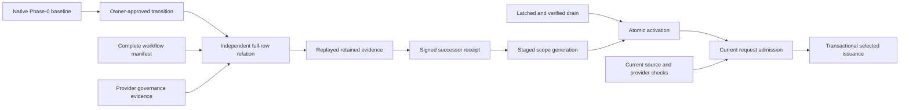
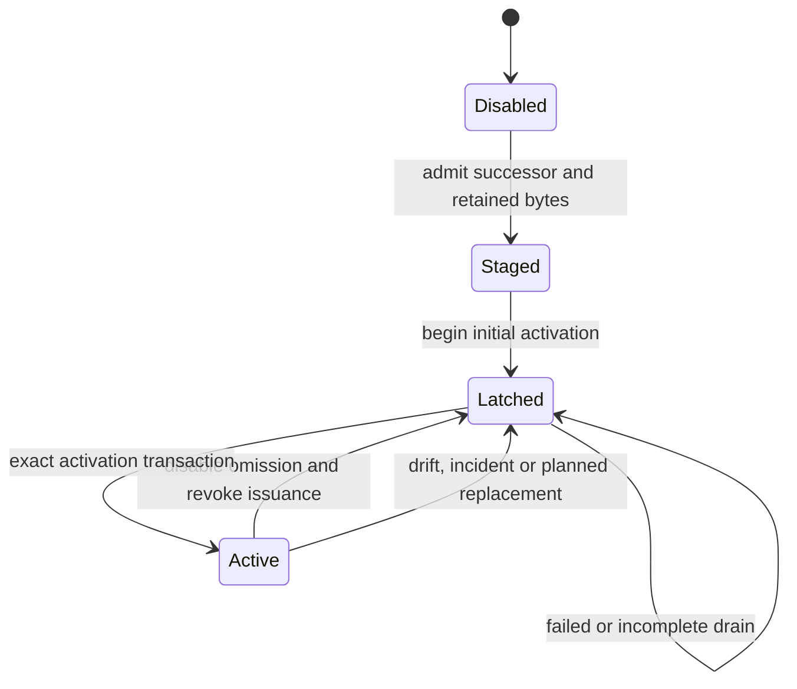

# Generation-Fenced Production Authority

Status: implementation design for the atomic Stage D source cut

Owner: `REQ-CI-RUNTIME-030`; the atomic candidate makes its native acceptance
blocking, without claiming that those witnesses have passed before execution.
This document refines Stage D of the
[target-authority plan](target-authority-relation-implementation-plan.md) under
the governing [transition contract](../architecture/cross-cutting/authority-transition-safety.md).
The [implementation plan](generation-fenced-production-authority-implementation-plan.md)
owns work order and acceptance, not a second authority predicate.

## 1. Observable Changes

The enforcing runtime will accept only a successor production-admission
receipt. A valid v1 signature alone will no longer permit selected execution.
Non-enforcing operation and independent target FullCI remain available.

Registration retains verified evidence but does not activate it. Activation is
a separate administrator operation that binds one repository, generation,
receipt, current configuration and completed drain. Process startup must not
clear an omission-disable latch. A rollback disables optimization; it never
restores a prior generation's write authority.

These are intentional admission changes, not a behavior-preserving refactor.
They implement the already required separation between dormant relation
evidence, production permission and actual operational readiness.

## 2. Evidence And Permission

Reuse the existing owners without rebuilding their algebra:



For a scope `s`, request `q`, generation `g`, receipt `r` and issue-time database
observation `K`:

```text
Selected(q) =>
  SignatureAndReleaseAdmitted(r)
  and ExactScopeAndPolicy(q, r)
  and RetainedRelationReplays(r)
  and ActiveGeneration(s) = g = ReceiptGeneration(r)
  and ActiveReceipt(s) = Digest(r)
  and CurrentSourceBinds(q, ReceiptManifest(r))
  and CurrentProviderDigest(q) = ReceiptProviderDigest(r)
  and ObservationWithinBound(q, K)
  and NoActiveOmissionDisable(s, K)
  and ExistingPlanAndReconciliationGuards(q, K)
```

This is a necessary-condition contract. Cryptography proves who signed exact
bytes, not whether the signer inspected the deployment correctly. Live
provider reads do not make a subsequent administrator mutation linearizable.
The external owner must maintain the existing latch-before-provider-mutation
rule; an out-of-band mutation invalidates that production premise.

## 3. Receipt And Retained Bytes

Introduce exact v2 receipt, envelope and subject schemas. Extend each scope
grant with one typed relation binding: positive generation, predecessor
generation, canonical evidence-bundle identity, relation-closure identity,
stable workflow-manifest identity, provider-governance digest, owner epoch and
initial source-binding identity. Include the binding in the signed scope and
release subject; independently mutating any coordinate must reject admission.

Derive the relation binding by replaying `UnactivatedEvidenceBundle` inside
production admission. A public `AdmittedTargetAuthorityEvidence` value is not
an unforgeable receipt. Reuse the complete transition, producer and full-row
replay; do not accept caller-supplied zero failure counts instead of replay.
The relation subject, adapted epoch,
repository identity, policy, catalog and registry must equal the production
scope grant. A nonempty Phase-0 baseline remains mandatory.

This cut explicitly refines the Stage C import boundary: production admission
may consume its pure codec, model and replay; its offline file and CLI owners
remain outside runtime dependencies. `REQ-CI-RUNTIME-033` projects that boundary.
The evidence value remains unactivated: consuming a proof is not permission to
issue a selected plan. No predecessor design or implementation-plan bytes change.

Keep the small signed envelope separate from its bounded evidence payload.
Retain the existing canonical bundle bytes by content identity in PostgreSQL;
do not add an archive format, base64 wrapper, object-store dependency or second
authority database. Staging admits a bounded regular input once, replays it
outside the request hot path, then persists the exact admitted bytes and small
verified projection atomically. A same-digest/different-byte conflict rejects.

Retained evidence is immutable. Referenced bytes cannot be deleted while a
staged or active receipt, retained issuance or audit-replay obligation needs
them. The first profile offers no physical deletion of accepted bundles:
accepted staging has an immutable audit reference. Rejected input is never
persisted. A future retirement policy requires explicit closure of audit,
issuance and scope references; receipt expiry alone is insufficient. This does
not claim erasure from WAL, backups or copies outside the declared store.

The provider component is exactly
`ProviderAuthoritySources.authority_digest`: it includes the complete stable
provider workflow inventory and governance state. It is not interchangeable
with a governance-state digest. The policy and catalog components likewise
use their named producer identities, not another similarly named policy hash.
Admission compares each retained producer coordinate with its production
subject coordinate before it can construct a scope binding.

### 3.1. Resource Envelope

The first staging profile admits at most 8 MiB for the complete JSON command,
including its signed envelope and evidence. The existing signed-envelope bound
remains 256 KiB. Replay runs in one cancellable worker per service process with
nonblocking admission, no waiting queue and a five-second execution deadline.
The worker uses the existing bounded canonical JSON and evidence codecs; an
unsupported size, shape, depth, count or execution duration rejects staging.
It does not weaken replay to make a large input fit.

The child-process adapter projects validation `TypeError` and `ValueError`
subclasses to a plain, redacted `ValueError` before serialization. The caller
therefore observes `invalid_evidence`, not a domain exception constructor that
cannot survive the process boundary. Worker failure and timeout remain
unavailability; cancellation propagates and all exit paths release admission.
Successful evidence retains the exact bytes, scope and lookup checks. This
projection is preferable to adding serialization hooks to every domain error:
the application requires only invalid versus unavailable, not their private
diagnostics. Revisit if a new public error algebra needs more information.

The deployment retains at most 1,024 distinct bundles and 1 GiB of canonical
bundle bytes in this profile. A store-wide transaction lock serializes capacity
check and insert; exact duplicate bytes consume no additional bundle capacity.
These are release-profile ceilings, not measured capacity claims or per-tenant
fairness guarantees. Referenced bundles are not evicted to admit a new one. At
the ceiling, staging reports explicit capacity exhaustion and operators must
qualify an enlarged or archival profile; existing authority and independent
FullCI remain intact. This finite-horizon limitation is intentional.

Staging response and scope inspection carry bounded identities and status,
never the retained bundle. Scope-authorized artifact reads return one bounded
object. Parent/worker serialization memory, database indexes, WAL and backup
costs remain part of external E1 capacity qualification; a canonical-byte bound
alone does not prove a resident-memory or storage-allocation bound.

The alternative of automatic age-based eviction is rejected because the audit
contract does not currently expire these references. An object store or a
generic archival subsystem is deferred until the measured retention horizon
justifies its additional lifecycle and custody boundary.

## 4. Scope State And Cutover

Use one durable scope state under the existing repository-scope lock. It owns
the generation, staged/active receipt identity, exact disabling override,
revision and transition audit identity. Keep signature registration and scope
activation separate; a second replica registering the same receipt is harmless.



Staging a future generation may coexist with an active one, but cannot change
its authority. The diagram describes the activation lifecycle, not an
exclusive storage enum for all retained artifacts.

The begin-cutover command atomically installs the existing `disable_omission`
override and records the exact scope revision and predecessor authority. It
does not merely toggle an in-memory flag. Existing v1 selected issuance reads
that same guard. Every later activation uses this exact latch identity.
Begin-cutover binds the expected current revision and an authority identity
that is either active or staged in that scope. An incident may therefore revoke
active authority before a successor exists; a foreign receipt cannot name this
transition. Only activation requires an exact staged successor. Revocation
does not renew, replace or activate a receipt.

Before clearing it, the activation transaction requires:

1. an authentic, unexpired successor receipt for the exact next generation;
2. retained relation bytes matching its signed binding and current policy;
3. the expected prior scope revision, generation and disabling override;
4. revocation of predecessor grants for future issuance;
5. database evidence that predecessor issued plans and leases cannot remain
   usable, and no locally known nonterminal selected operation remains;
6. fresh signed deployment-owner evidence for old-replica unroutability and
   termination of predecessor target executions; and
7. the current workflow source and provider-governance checks.

Check database time after acquiring the scope lock. Commit scope activation,
predecessor revocation, exact latch removal and audit as one transaction. A
failed check or cancellation leaves the latch and prior durable state intact.
Concurrent activation attempts share the expected revision, so at most one
can commit. A retry resolves the exact committed command identity before
attempting fresh effects.

```text
SamePriorRevision and ScopeLock and ConditionalUpdate
  => AtMostOneCommittedSuccessor

MissingDrainConjunct or StaleGeneration or UnknownProvider
  => LatchRetained and not Selected
```

Database evidence and deployment evidence are independent conjuncts. A signed
statement that old replicas are absent cannot override a locally known live
lease; an empty lease query cannot prove that a remote target process ended.
Old coordinator binaries must be drained before clearing the latch. Do not
claim that a column unknown to an old binary fences that binary by itself.

### 4.1. Revocation And Latch Ownership

The scope row retains a monotonic `revoked_through_generation`. Begin-cutover
advances it to the current generation in the same transaction that installs or
adopts the exact non-expiring disable override. Selected authority requires
`generation > revoked_through_generation`; neither activation nor restart may
decrease this floor. A successor advances generation by exactly one. Retaining
the prior receipt identity while revoked is historical evidence, not permission.
This single floor revokes every receipt for an old generation without a second
per-receipt revocation registry.

If omission is already disabled, begin-cutover adopts that exact override;
it does not append a conflicting second disable. The ordinary `enable_omission`
path must reject a cutover-owned latch. Only the activation transaction may
append its exact enable/audit transition after all cutover guards succeed.
Override history remains append-only; clearing the scope's latch reference is
not deletion of the override or its audit evidence. Preserve scope-lock before
operation-lock ordering.

The scope revision covers staging as well as activation changes. Replacing a
staged receipt conservatively invalidates in-flight current observations and
any drain statement for the prior revision. It does not change the active
generation or its permission; a fresh request may use that generation again.
A short FullCI fallback during concurrent staging is preferable in this profile
to maintaining a second independent authority-revision counter.

### 4.2. Independent Remote Drain

Use a separate canonical Ed25519 envelope under the configured production
admission key, with its own versioned schema. It names the exact repository,
staged authority and admission subject, successor/predecessor generation,
expected scope revision, latch ID, observation time and expiry. Three explicit
true statements are required: old replicas are unroutable, their in-flight
requests have completed, and predecessor target executions have ended. Being
unroutable alone does not establish the second or third statement.

The envelope is at most 16 KiB and its validity interval at most 300 seconds.
At the locked activation predicate, require:

```text
latch_applied_at <= observed_at <= database_now < expires_at
and ExactStatementScopeReceiptGenerationRevisionLatch
and revoked_through_generation >= predecessor_generation
```

Signing proves the statement's issuer and exact bytes, not actual deployment
termination. Local drain, live source/provider checks and the activation CAS
remain independent mandatory conjuncts. Reuse the existing canonical envelope
codec and kernel Ed25519 primitive; no additional cryptographic scheme is needed.

### 4.3. Local Drain And Registration

The local drain must use actual plan expiry, not a guessed universal TTL.
Project `expires_at` from the retained signed envelope into an indexed column
through a forward migration and the normal issuance encoder. Malformed or
contradictory legacy bytes reject the upgrade rather than receiving a default.
Validate the projection against the decoded envelope on subsequent reads.

For reconciliation, an old terminal result is insufficient: the result must
bind the subject's current revision and pass its existing canonical decoder.
An expired lease alone does not make a nonterminal subject terminal. Inspect
bounded pages, preserve the latch when any page or result is unavailable, and
recheck the drain in the activation transaction. Never materialize an entire
repository history merely to decide whether a blocking record exists.

Registration currently precedes issuance and does not acquire the repository
scope lock. Therefore an empty query before old replicas finish their in-flight
requests is not a stable drain witness. Old-replica drain must close those
requests first. Successor registration and activation must serialize their
scope-relevant changes under the same lock; a request arriving after latching
cannot create a new selected reconciliation operation. Preserve reconciliation
of already registered operations so that the drain can complete.

The selected registration transaction checks the prepared generation, receipt,
scope revision, current observation and disable/revocation state before its
first subject or audit effect. A lock plus absence of a latch is insufficient:
an old request can resume after a complete cutover. A production-owned selected
registration port composes this admission with the existing reconciliation
transaction; the ordinary reconciliation domain port gains no production policy.

New registrations retain explicit `full_ci` or `selected` provenance and, for
selected operations, the production generation and receipt. Existing rows that
lack provenance form a conservative scope-wide legacy cohort. Never infer
selectedness from omitted-signal count, worker claim generation, creation time
or the existence of an issued-plan row. Registration can commit without issue.

For this cutover, the canonical durable terminal set is `success`, `failure`
and `conflict`, each bound to the subject's current revision and released lease.
This explicitly refines the older reconciliation prose's `success/failure`
shorthand to agree with its existing result codec and scheduler. `conflict`
remains non-success; no historical result is relabelled or manufactured to pass
drain. Do not use `SKIP LOCKED` to hide a potentially blocking subject.

### 4.4. Durable Representation

Reuse the existing signed-authority and scope-binding tables. Three additional
relations are sufficient: immutable content-addressed bundle bytes, immutable
staged scope grants, and the current scope state. A staged row references its
receipt and bundle; it does not duplicate the signed relation as another policy
authority. Bounded repository, source-SHA and provider-path lookup hints are
derived during staging. Incorrect hints cannot grant permission: subsequent
source and composite-provider digest equality remains mandatory.

The active subject digest is read through the existing exact scope binding.
Foreign keys bind active receipt and generation to a staged row. Revision and
revocation are monotonic; the latch ID references retained override history.
Runtime privileges cannot delete immutable evidence or rewrite staged grants.

Use the existing pair-owned audit ledger for exact command replay, not a second
operation table. The event binds the canonical command hash, actor, operation,
scope, before/after revisions and original result. A duplicate command returns
that original result before testing its now-stale expected revision. A different
command under the same operation identity is rejected. State and audit commit
together. The global bundle-capacity lock precedes the repository scope lock;
the existing override and audit locks follow it.

The transaction guarantee covers the admitted application/UOW path. It does not
claim that a compromised runtime process or arbitrary SQL client obeys advisory
locks or invokes paired audit methods. This preserves the existing database
compatibility profile's cooperation boundary, rather than introducing a new
exception. Database-owned immutable identity, generation-shape, reference and
privilege constraints still apply to every supported-role write. An exposed raw
SQL route, broader privileges or a new untrusted database client reopens this
assumption; it is not a waiver for ordinary application defects.

The application resolves that exact historical command after authorization but
before acquiring new evidence. Command input identity binds the received
canonical envelope and bundle bytes plus provider paths; it is computable
without renewing a receipt. Otherwise a successful activation followed by
receipt expiry would make a lost-response retry impossible. Resolution returns
the original result with `duplicate = true`, not a claim that its authority is
still active. A missing audit result proceeds through every fresh admission
check, and the mutation transaction repeats resolution under the scope lock.

Activation has no Actions-run identity. Its independent current observation
reacquires the retained source commit and composite provider state and matches
the signed stable manifest/provider digests under the original 30-second DB
window. It does not invent a candidate run or require a feature-branch manifest
to equal the default branch. Request-time admission independently uses the
actual OIDC caller/reusable-workflow SHAs; activation evidence is not a substitute
for that request evidence.

The migration adds actual envelope expiry and immutable reconciliation
provenance. Runtime decoding requires the expiry column to equal the canonical
envelope, while a separate migration-only projection validates legacy rows
before backfill. Upgrade requires an admitted maintenance window with old
writers drained; mixed-version selected issuance is not supported. Failed
transactional upgrade rolls back, and retained cutover evidence requires forward
repair rather than destructive downgrade. Native PostgreSQL and operational
upgrade/restore evidence remain distinct obligations.

The existing database compatibility profile makes capability-owned catalog
closures immutable and rejects a successor that both adds and removes
capabilities. Adding mandatory expiry and provenance changes the ingress and
reconciliation v1 closures; exempting the new objects from those v1 attestors
would silently weaken the old contract.

Therefore the minimal admitted upgrade has two revisions in the existing
single, exclusive-fenced outer transaction:

1. A contract revision retires `runtime-ingress-issuance-state/v1` and
   `runtime-shadow-reconciliation-state/v1` without changing their tables.
2. An expand revision performs D3 DDL and strict backfill, then declares
   `runtime-ingress-issuance-state/v2`,
   `runtime-shadow-reconciliation-state/v2` and
   `production-generation-cutover/v1`.

Both original v1 definitions and their exact attestors remain available for
historical migration validation. New v2 attestors may reuse predecessor
projections, but must independently cover their entire successor closure.
The intermediate capability set is not an admitted application deployment.
A successful upgrade no longer declares support for the old selected-runtime
binary; rollback requires forward repair or an independently admitted restore.
Both D3 revisions reject automatic downgrade, including an empty new schema:
the append-only compatibility history must not regain retired capabilities.
Migration guard SQL is a frozen local copy, not an import of mutable runtime
DDL. This small historical duplication preserves an independently replayable
migration closure; native tests compare the installed routines with the
current capability contract.
One mixed revision or a v1 exemption would violate the current owner algebra.
Changing that algebra is a separate design decision, not justified here.

## 5. Request-Time Checks

The application service loads a small active-generation projection, obtains
current provider evidence through capability ports, then requests the existing
pure production authorization and signed issuer. Pure `production_admission`
does not perform SQL, network calls or environment reads.

Use the trusted Actions workflow-source revision, not a branch name or an
arbitrary caller SHA. Preserve the distinct caller and reusable-workflow
identities. Every workflow-source coordinate admitted by the target must be
covered; an unsupported external source produces FullCI, not partial proof.

The first profile covers target-local callers and reusable requester workflows
whose admitted coordinates belong to the complete target workflow manifest.
Cross-repository reusable sources are not silently projected into that manifest;
they retain FullCI until their independent authority owner is admitted.

Reuse `GitHubWorkflowAuthorityReader` to construct the complete manifest and
source binding. A new application commit may keep authority when the stable
manifest is identical. Changed workflow content, path, mode, type, unsupported
object, incomplete traversal or repository/default-branch identity rejects.
Cache only immutable source evidence with complete keys and producer-owned
age; cache availability is never permission.

Obtain bounded fresh governance and complete provider workflow inventory for
the same immutable repository scope. Reconstruct the existing
`ProviderAuthoritySources` value and compare its `authority_digest` with the
receipt's provider epoch. This catches a disabled, removed or substituted
workflow even when branch rules are unchanged. Reuse
`GitHubWorkflowInventoryLoader` and its exact-revision capability admission;
do not enumerate only the adapter registry's subset when the retained producer
domain includes more workflows. Preserve its existing complete-pagination,
path, count and byte bounds. An unsupported inventory yields FullCI.

Staging retains a canonical, bounded set of provider capability paths as
acquisition hints. They must be valid paths in the retained manifest and obey
the existing loader's 64-path bound. The bundle's composite provider digest is
the authority, not these hints: acquisition must reproduce that complete digest.
A missing, extra or stale hint may prevent activation but cannot grant partial
permission. This preserves the retained producer's actual capability domain
without inventing an inverse operation for a digest.

No stale-while-revalidate or stale-on-error fallback can supply either mutable
provider operand. Retain both current source-binding and composite provider
witness identities with issuance evidence. A new application commit with
unchanged stable workflow/provider state must not invalidate permission merely
because its evidence-provenance digest differs.

Use monotonic time for process-local execution deadlines. Database predicates
use the existing trusted database-time authority. A database-time sample taken
before provider acquisition conservatively bounds the observation's age at
the final locked issue predicate; do not compare unrelated process epochs or
convert an arbitrary monotonic value to UTC. Missing clock-order agreement,
deadline exhaustion or an expired receipt produces FullCI.

The issuer rechecks active scope generation, receipt, policy, latch and time
in the transaction that persists the signed plan. An application-layer check
alone cannot authorize the insert. Keep existing identity, registry, capacity,
reconciliation, expiry, audit and idempotency guards; the successor evidence
adds conjuncts and never substitutes for them.

The first profile bounds a current observation to 30 seconds, starting at the
database sample before provider acquisition. Exact equality with its expiry
rejects issuance. Request and dependency deadlines may be shorter and never
extend that age. Current evidence also binds each authenticated caller and
reusable-workflow SHA independently; equal branch names do not substitute for
these source identities. Unsupported or absent source SHA yields FullCI.

### 5.1. Blocking Statement Completion

Transactional adapters commit only an applied result (or a retained exact
issuance duplicate). A typed rejection explicitly rolls back instead of trying
to commit a rollback-required unit of work. This preserves both the failure
algebra and the atomicity of every intermediate write.

A time predicate evaluated before an awaited insert or audit append is not a
bound on its successful completion. For example, a compatible read lock can
allow admission reads while a conflicting write lock delays the paired audit
until the receipt or observation expires. After all pair-owned effects, selected
issuance, staging and activation must sample trusted database time again while
holding their scope lock. A late result marks the entire UOW for rollback; it
must not leave an inserted plan or an enabled generation behind.

```text
K_after_effects < E implies K_effect <= K_after_effects < E
K_after_effects >= E implies rollback(state, paired_audit)
```

Use the existing temporal predicates and original observation, not a renewed
clock origin. No extra framework or background compensator is required.
Beginning a cutover remains allowed without fresh optimization evidence because
it only disables authority. Historical duplicate commands retain their original
result without reactivation. The final check is an admission linearization
witness, not a promise that commit, network delivery, or target consumption
occurs before expiry; those later boundaries keep their own validation.

## 6. Ownership And Administrative Surface

Preserve the existing enforcing-startup gate: the configured receipt must be
an authentic, time-admitted v2 receipt for the exact running release,
environment, rollout and configured enforcement scope set. It establishes the
bootstrap trust configuration, not active scope authority. Startup registration
does not stage evidence, activate a generation or remove a latch. An empty
activation store therefore permits only FullCI even after successful startup.

Request-time authority comes from the active durable receipt, revalidated with
that same configured key, release and scope set. A hot generation change does
not require process restart; a trust-key, release or allowed-scope change still
uses the existing runtime configuration lifecycle. Multi-scope signed receipts
remain supported, but each stage/inspect/activate operation addresses only one
authorized repository; read responses never expose another scope's evidence.

This retains the stricter startup contract instead of introducing a second
bootstrap configuration mode. Revisit it only with an explicitly designed
runtime-settings transition; neither receipt expiry nor startup registration
can revive a revoked scope generation.

`production_admission` owns signed successor values and opaque permission;
`target_authority_evidence` still owns only replayable dormant evidence.
The application layer coordinates staging, cutover and request validation
through capability ports. Persistence owns rows, scope locks, database time and
atomic effects; GitHub adapters own retrieval; runtime composes them.

The composite GitHub current-source adapter may consume only the production
lookup and source-result values plus `ProviderAuthoritySources`. It cannot
import receipt minting, activation stores or target-artifact production.
Production registration ports consume the exact reconciliation subject and
contract values, never its state machine or persistence implementation. Exact
import allowlists and negative edge tests enforce these new dependency edges.
This avoids three redundant adapter protocols while keeping provider retrieval
separate from the application decision and locked database authority.

Stage, inspect, begin-cutover and activate operations need a complete versioned
API. Reuse the existing `configure`, `read`, `override` and `activate` role
boundaries respectively, with exact repository scope and normal command audit.
The API transports admitted commands; it must not reproduce relation or
cutover policy. A deployment CLI may call those same operations. Break-glass
and external review-bot credentials cannot activate omission.

Keep large evidence admission off ordinary plan-request and webhook budgets.
Use explicit payload, count, deadline, concurrency and retention limits at
staging. Reuse the current bounded execution and model libraries; do not put a
128 MiB replay on the ASGI event loop or create an unbounded staging queue.

## 7. Alternatives And Revision Conditions

| Alternative                                      | Decision under current constraints                                                                                              |
|--------------------------------------------------|---------------------------------------------------------------------------------------------------------------------------------|
| Keep v1 plus a deployment flag                   | Rejected: a flag does not bind relation, generation, scope or current provider evidence                                         |
| Rebuild the full relation for every request      | Rejected: repeats stable proof and large decoding on the hot path; exact current source/provider predicates are still necessary |
| Generic authority-transfer framework             | Rejected: adds owners and states unrelated to this single activation lifecycle                                                  |
| Mixed-version selected rollout                   | Rejected: old code cannot enforce new predicates; a bounded FullCI-only transition has fewer permitted unsafe states            |
| Embed all evidence in every signed plan          | Rejected: duplicates immutable data and expands runner/network cost without giving the target independent activation truth      |
| Small receipt plus one retained canonical bundle | Selected: reuses admitted codecs and separates one-time proof from current request checks                                       |

The chosen route is preferred within these stated alternatives, not globally
optimal. Revisit it if measured evidence size or staging memory exceeds the
admitted budget, a second backend requires a real storage port, target-owned
credential custody changes, or an independently proved mixed-version protocol
offers a material operational benefit. Such a change needs its own owner and
falsifiers; future speculation does not justify it now.

## 8. Completion Boundary

The expanded native corpus retains one complete covered persistence pass and
the isolated portable test selection. Its aggregate execution budget supersedes
only the earlier 1,200-second coverage and 600-second portable test budgets:
coverage has 2,400 seconds and portable tests have 1,080 seconds. Each command
adds the existing 60-second wrapper reserve; portable proof additionally keeps
its 240-second aggregate reserve. The Dev Container command retains a finite
2,160-second stage budget: provisioning 600, installed-Node proof 60, portable
proof 1,380 and cleanup 120. This is a shared cancellation ceiling, not a promise
that every stage and provider operation can simultaneously exhaust its maximum.
The branch aggregate and the global command cap project all selected child
budgets plus the unchanged 420,000 ms orchestration reserve: 32,306,000 ms.
Existing GitHub job ceilings remain unchanged.
This does not relax any test, service deadline, coverage threshold or isolation.

Run `34079512112` exhausted the old budgets with no reported test failure:
coverage reached 30% and portable tests reached 92%. The previous portable
witness completed, including provisioning, in 518.15 seconds. These observations
justify a bounded diagnostic window, not a performance or completion guarantee.
Increasing a finite ceiling is less complex than splitting and recombining
coverage or introducing test parallelism before measuring its database isolation
cost. Both commands report their 25 slowest test phases. Another timeout requires
hotspot or hang analysis, not an automatic further increase; optimization belongs
to the existing CI-cost roadmap and must preserve the same proof obligations.

Consumer-owned budget admission must include the existing `load_quality_plan`
check on the real command graph. Structural Proofkit admission alone does not
evaluate this arithmetic. A changed child budget requires rechecking its stage,
branch aggregate and global command cap before publication; a missing or short
Dev Container stage envelope is rejected before provisioning.

Run `34081395193` subsequently exhausted the 2,400-second coverage budget at
55% without a reported functional failure. Case order does not identify a
hotspot, and pytest's end-of-run duration summary did not survive termination.
Before changing implementation or another limit, the independent repository
quality job profiles the existing positive current-observation witness with
standard-library `cProfile`, within four minutes, and prints its 30 highest
production cumulative costs and 20 highest exclusive call costs. Restricting the
first view to the production package prevents pytest ancestors from hiding the
relevant operation. This diagnostic does not replace any full-suite case,
measure production latency, or include coverage-instrumentation overhead.
Remove the diagnostic duplication after a measured causal repair is validated.

The profile at `31e2311` measured 11.28 seconds of fixture setup and 0.02 seconds
of test call time. Canonical traversal accumulated 8.644 seconds; Python scalar
and UTF-8 scans contributed 11,223,875 `ord` calls. These overlapping cumulative
costs must not be added or extrapolated into a whole-suite speedup. Prefer an
exact built-in ASCII fast path over caching admitted authority, bypassing replay,
adding workers, or increasing the execution ceiling again. For every exact
Python string `s`:

```text
s.isascii()
  => every code point belongs to [0, 127]
  => no surrogate exists and len(UTF8(s)) = len(s)
```

Empty strings satisfy the same predicate. Non-ASCII strings keep their existing
validation and early bounded UTF-8 scan; the optimization adds no full-size
encoding allocation. Raw UTF-8 length is only a lower bound on quoted JSON:
existing escaping and actual output-byte accounting remain mandatory. Preserve
exact host types, error precedence and coordinates, node/depth limits, ordering,
numbers, hashes and signatures. The cost is three small conditional branches
inside the existing kernel owner, with no new API or dependency. Any byte,
admission, error, resource or full-suite regression defeats this choice. A fresh
native profile must measure the removed work; neither the algebra nor a faster
single fixture proves production latency or complete CI improvement.

The same native witness at `ce4bba7` completed in 8.48 seconds and reported
17,634,094 calls, versus 12.22 seconds and 34,016,920 calls at `31e2311`.
This confirms removed work for that bounded profile, not a full-suite speedup.
The temporary duplicate profiling step can therefore be removed; complete
native coverage and mutation results remain required independently.

The public regression oracle must distinguish raw-size equality from overflow:
an ASCII string of length 64 inside a list has error coordinates `($[0], /0)`
at limit 63, but `($, "")` at limit 64, where quoted output exceeds the sink.
Keys have the same distinction between their own pointer and the sink pointer.
After an earlier admissible element overflows the byte sink, a later invalid
Unicode value or key must still produce the scalar error, not the deferred byte
error. Three exact mutations in the existing audit-byte suite test these
independent predicates without adding a runner or enlarging its finite budget.

The PostgreSQL run at `31e2311` separately failed to observe the staging
transaction's audit lock within its three-second supervisor. That result is
incomplete temporal proof, not evidence of a committed effect or a latency
contract violation. Only the two expiry-during-audit scenarios use a 15-second
signed fixture horizon, a 10-second lock-observation supervisor and a 16-second
post-lock deadline ceiling. Other helper callers retain their existing bounds.
The oracle still requires the real database block before expiry, observed
database time at or after expiry before lock release, the exact expired outcome,
and unchanged tables. Production deadlines and aggregate CI budgets do not
change; a supervisor timeout still fails the witness rather than passing it.

The `a6ece20` native run exposed an incomplete test prerequisite: its real
transaction retained the five-second participant lock timeout, so the audit
insert could fail before the intended signed expiry. The two scenarios now
use a test-local unit of work that changes only transaction-local
`lock_timeout` to 27 seconds after the normal capability admission. It retains
the production adapter, repositories, commit/rollback and cleanup. Failed
test setup also exits the entered unit of work. Actual PostgreSQL settings must
satisfy the finite observation envelope:

```text
signed horizon = 15 seconds < lock timeout = 27 seconds < statement timeout
lock observation (10) + expiry observation (16) < lock timeout (27)
lock observation (10) + expiry observation (16) + completion (5)
  < transaction timeout
```

Both database-time probes and the wait belong to the expiry supervisor.
These inequalities admit the intended experiment; they are not a host
scheduling or production latency guarantee. Changing the production profile
would broaden runtime behavior, and a direct repository call would bypass the
adapter's rollback policy. Neither is needed. Restoring a shorter signed
horizon would reintroduce the measured arrival race. Revisit the test envelope
if the real participant settings change; never accept an early lock timeout as
evidence of the post-expiry rejection.

The waiter is now the exact backend PID published by the tested unit of work,
not any backend blocked by the holder. PID publication and lock observation
share the ten-second supervisor. A wrong-PID probe must not accept the already
observed block. Predecessor setup and final reads use the unmodified store;
only the target command uses the observing unit of work. A completed task's
original exception or early result is surfaced instead of being hidden by a
generic lock assertion. The later exact rejection and eight-table snapshot
checks remain mandatory.

Setup also respects SQLAlchemy's runtime API rather than its typing-only tuple
view: [`Result.tuples()`](https://docs.sqlalchemy.org/en/20/core/connections.html#sqlalchemy.engine.Result.tuples)
returns the same result object, while [dictionary construction](https://docs.python.org/3.13/library/stdtypes.html#dict)
can choose its mapping protocol. Materializing the three settings rows before
constructing their dictionary avoids that protocol mismatch without a new
adapter or an unbounded result load. The `6bc1189` native run exposed early task
completion; its generic assertion alone did not identify the original error.
This source-level correction still requires fresh native acceptance.

Source completion requires v2 schema/codec, retained evidence, state transitions,
API, runtime wiring, transactional guards, migration, proof routes and native
positive and negative witnesses in one merge unit. Historical v1 code must not
remain an alternate enforcing path.

Production activation still requires E1-E3: administrator-owned working
webhook/installations, immutable Swarm deployment, PostgreSQL migration and
access controls, Keycloak administration, signer custody, live drain and
rollback evidence, shadow and paired FullCI/selected pilot results. This source
change neither performs those actions nor proves their success.
