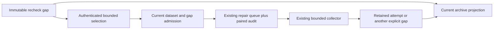

# Recorded History Gap Recovery

## Decision And Scope

Keep gap observations immutable. Show their current retained-attempt context,
and let an authorized administrator explicitly requeue selected recheck gaps
through the existing history queue. This extends historical administration;
it changes neither CI planning nor automatic failure budgets.

The [recent recovery design](actions-history-recent-recovery.md) owns ordinary
discovery. This document owns the new operator-triggered transition after
bounded recovery has stopped. The [plan](history-gap-recovery-plan.md) owns
implementation and acceptance ordering. Earlier design/plan bytes are unchanged.

An observed gap count is not a count of currently absent attempts. Multiple
observations can name one attempt, and later imports do not erase those facts.
The existing finite retry policy also intentionally leaves exhausted historical
work outside the queue. An explicit targeted operation is needed when a later
provider or software repair makes that work recoverable.

## Protected Observations

- Preserve scope, generation, workflow, run, attempt and source-time identity.
- Preserve statistics, original import clocks, retention, configuration and gaps.
- Keep fresh repository authorization, CSRF, bounded request/transaction work,
  current selection, queue capacity, hard leases and revision fencing.
- Keep historical failure separate from present archive state and provider truth.
- An unknown HTTP outcome never means rollback or permission for a new command.

## State And Authority



The request contains one exact repository, generation, expected configuration
revision, operation ID and 1-50 distinct sorted gap IDs. The server supplies
the actor. The request freezes a decoded JSON array to a tuple at its capability
boundary, including FastAPI's Python-mode validation; element types, count,
ordering and uniqueness remain strict. Only canonical `HistoryRecheckGap`
records carry the required workflow/source-time operands; page-origin gaps remain unsupported for this
targeted command. Existing full rescan remains available for those cases.
Never invent a run creation time from its discovery window or a workflow ID
from a display name.

Under the existing dataset scope lock, revalidate every selected record's
canonical hash, scope/generation and current workflow selection. Group by run;
workflow and source creation must agree. A group's inclusive interval is
`[min(selected attempts), max(selected attempts)]`. It may include intervening
reruns. The sum of interval cardinalities must not exceed 50; do not allocate
an array proportional to numeric attempt IDs. Return these exact intervals in
the receipt so clients cannot present an exact-set operation instead.

All queue admissions and one actor-bound audit receipt share one transaction.
The event type must be admitted by the existing closed paired-audit registry;
generic audit append remains forbidden for this type.
Any missing, unsupported, stale, unselected, inconsistent or capacity-refused
target rolls the entire new batch back. Existing queue work is merged with the
current hint/rewind relation, not overwritten. A changed child revision defeats
the predecessor worker's terminal CAS; this does not restore an expired lease.

```text
Committed(command)
  => EverySelectedGapAdmitted and QueueEffects and ExactAuditReceipt

Replay(same operation, same actor and command)
  => OriginalReceipt and NoNewQueueEffects

SameOperation and DifferentCommand => Conflict
FailureBeforeCommit => NoBatchQueueEffects and NoBatchAudit
```

Replay remains historical after a worker consumes the queue item. A fresh
operation may deliberately request another bounded attempt, but no automatic
loop is added. Pause, erasure and configuration changes fence new admissions.
Provider I/O is performed only by the existing worker, outside this transaction.
The HTTP route returns the capability-owned result through FastAPI's declared
response model, setting only transport status and private headers. No duplicate
response DTO or route-local model serialization policy is introduced.
The audit retains bounded canonical source gaps alongside the receipt. Replay
recomputes their content IDs and interval derivation against the exact command,
including after dataset erasure. These copies are proof inputs, not another
mutable gap authority; the public receipt needs only the request and intervals.

## Read And UI Contract

For each bounded gap page, join only its matching current-generation attempt
headers in the existing statement snapshot. Distinguish no retained attempt,
complete retained summary, incomplete retained summary, conflicting summary
and a window whose resolution is not evaluated. Do not materialize all child
jobs, mutate gap counts or equate a complete header with fresh provider proof.
Malformed canonical identity fails the read, not a successful missing result.
For a recheck gap, source creation must not postdate its recorded observation,
which must not postdate the page snapshot. This relation also applies when no
retained header exists; absence never exempts source-time admission.

The UI labels original failure and current local evidence separately. Selection
is scoped to the current page, repository and generation. Checkboxes and one
labelled retry command use the existing scoped-command/unknown-outcome pattern.
Only gaps with complete durable retry operands can be selected. Report queued
intervals, not successful collection; refresh the existing status and archive
views after a confirmed receipt. Authentication or scope replacement discards
foreign state, while an uncertain command retains its exact retry identity.

## Alternatives And Revision Triggers

Full rescan repeats unrelated historical reads; automatic retry of every old
gap creates an unbounded outage loop. A new broker, queue table or generic retry
framework adds no required authority. Reuse existing queue and audit contracts.
The bounded interval representation is preferable to a new sparse-attempt
format here; revisit it if measured intervening reads exceed the stated budget.

Current stage observations do not establish a database bottleneck. Do not add
live-authority caches, widen pools or change cadence without discriminating
measurements. Revisit metadata support if standalone page gaps demonstrably
need targeted recovery; a new provider-backed preparation contract must then
preserve the same exact identity and failure boundaries.

This is not complete provider-history, sustained capacity, automatic deletion
classification, causal savings, global optimality or production-readiness proof.
