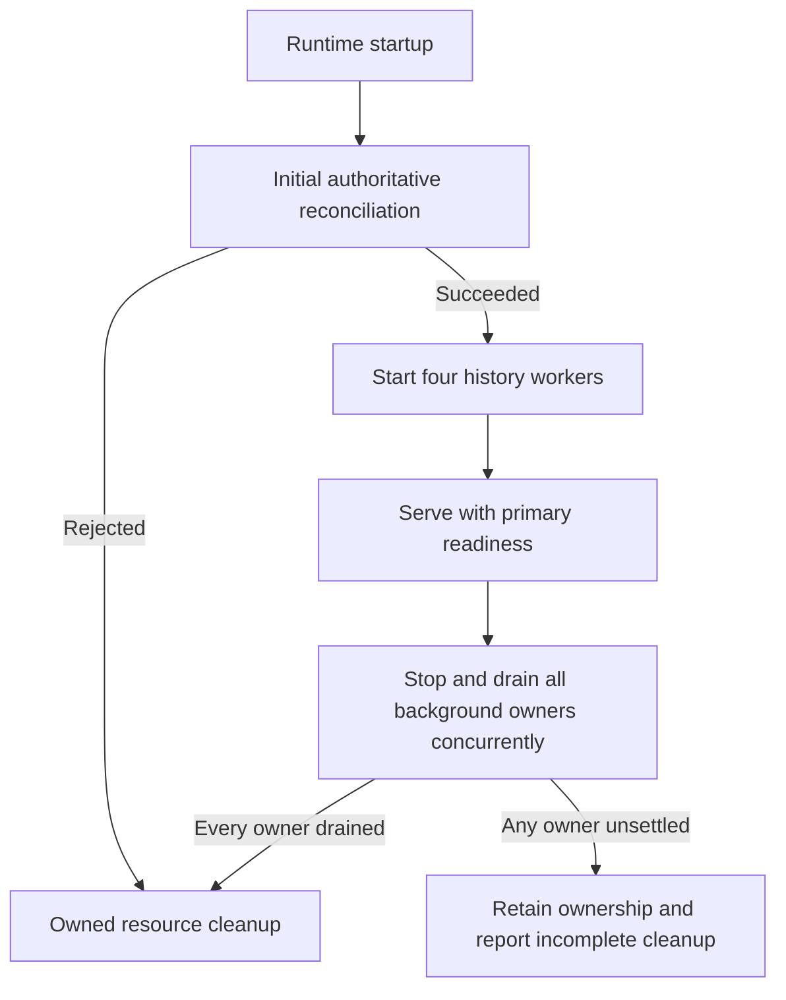

# Work-Conserving History Workers

Status: implementation design; native and live qualification pending.

Owner: runtime scheduling, `REQ-CI-RUNTIME-054`.
Delivery: [implementation plan](history-worker-progress-plan.md).

## Decision

Run the four archive lanes as process-owned, single-flight workers. Bound each
item independently; continue after progress and wait after no progress. Start
them only after initial authoritative reconciliation succeeds, and drain every
background owner before closing its shared resources.

This replaces only the runtime count/cumulative-drain policy in
[recent recovery](actions-history-recent-recovery.md#runtime-and-presentation).
The per-item source, access, generation, lease, retry, quota and transaction
contracts remain unchanged. Authoritative reconciliation keeps its existing
cadence and readiness meaning. No broker or new durable representation is needed.

The active requirement `REQ-CI-RUNTIME-048` retains the application item and
public `run` contracts, but routes its former count/cumulative runtime-drain
clause to `REQ-CI-RUNTIME-054`. Only the latter owns current process scheduling;
there are not two simultaneously applicable, contradictory runtime limits.

## Why Change Scheduling

The predecessor cancels a lane after 45 seconds across at most 16 items, then
the enclosing periodic service waits its configured interval. A late item can
lose its caller while retaining its 60-second database lease. The next round
may therefore find no due work despite a backlog.

One reachable trace, with compatible steadily advancing clocks, is:

```text
claim at t=44; lease expires at104
drain expires at45; operation is cancelled
next round at75 cannot reclaim that lease
```

This is a scheduling counterexample, not a claim that every cancellation has
that cause. Retrying faster does not remove the artificial interruption, and
increases polling by unrelated maintenance operations.

## Protected Relations

Let `L = {backfill, discovery, recent, repair}`. For every lane:

```text
active_items(lane) <= 1
active_history_items <= |L| = 4
item_deadline = item_start + 45 seconds, in one monotonic clock domain
progress in {applied, recovered} -> yield, then consider the next item
other outcome or own deadline expiry -> bounded idle wait
stop observed -> no new item
```

The idle wait uses the already admitted reconciliation interval, but is local
to the idle lane. It is interruptible by shutdown. The existing 20-second
authorization/provider deadline stays inside the item deadline; neither timer
is renewed by a retry. Both scopes cancel the same task, so the effective child
deadline is the minimum of the remaining item deadline and its own deadline;
no second clock or deadline-carrying DTO is needed. Database finalization retains
its separate bounded cleanup margin rather than claiming immediate preemption.
Cancellation cooperation is a prerequisite for prompt settling: timeout is not
proof that a cancellation-suppressing dependency has stopped. An unsettled
operation retains its lane; no replacement starts concurrently.

Workers claim through the existing due-time ordering and scoped database locks.
They retain no private in-memory work queue, transaction or connection between
items. Cross-repository progress remains conditional on finite admitted backlog,
eligible work, dependency recovery and the existing fair-claim contract.
One explicit cooperative yield after progress prevents an immediately returning
adapter from starving other tasks.

Per-item failures keep their existing typed outcomes. An unexpected worker
termination is visible separately from authoritative reconciliation health;
it cannot silently change planning readiness or authorize omission. Normal
provider/store failures keep a recovery actor and wait before another attempt.

## Lifetime And Failure Ordering



`RuntimeBackgroundGroup` owns only ordered startup and conjunctive drain. Its
first, explicitly named primary service remains the readiness owner. Additional
services are bounded, distinct instances; attempted startup establishes cleanup
ownership before the await. Startup is single-use. `RuntimeResources` continues
to quiesce startup before stopping the group and owns the total shutdown budget.

Stop calls run concurrently, not as sequential copies of the drain budget.
The group returns true only if every attempted owner returns exact `True`.
Failure, timeout or cancellation never implies safe engine disposal. A failed
drain remains retryable through the existing resource owner; no new child is
created by retry. The group neither closes borrowed engines nor hides an
undrained child's state.

`HistoryCollectionWorker` owns a retained parent task and its four structured
children. Each lane keeps a per-item deadline and an interruptible idle wait.
Its stop signal and cancellation drain the same retained task; a failed drain
does not discard that reference. Unexpected exceptions are diagnosed without
retaining exception graphs. There is no request-scoped state in these tasks.

The gauge `ci_coordinator_ci_history_worker_running{lane}` is initialized only
by the configured worker: four admitted lanes and an instrumentation fallback
`other` bound its application label domain to five values. A live idle task is
running; the gauge is neither throughput nor success. `CIHistoryWorkerStopped`
requires an admitted lane at zero for two minutes on a reachable
`job="ci-coordinator"` target. It preserves scrape `job` and `instance`
labels. Absent series do not prove that a worker was configured, and unreachable
targets are handled by the existing target-availability alert.

The [Python task contract](https://docs.python.org/3.13/library/asyncio-task.html)
provides structured child ownership, monotonic timeout and cancellation
primitives. The [SQLAlchemy async contract](https://docs.sqlalchemy.org/en/20/orm/extensions/asyncio.html)
keeps engine disposal on its loop and transactions inside their actual task.
No custom task framework or cross-loop engine handoff is introduced.

## Responsibility Map

| Owner                                   | Responsibility                                                      |
|-----------------------------------------|---------------------------------------------------------------------|
| `app/ci_history_collection.py`          | One admitted item and the existing public three-lane `run` contract |
| `runtime/history_collection_worker.py`  | Per-lane scheduling, owned tasks, idle wait and drain               |
| `runtime/background_services.py`        | Primary-first startup and all-owner drain, without domain decisions |
| `runtime/composition.py`                | Bind existing adapters, workers and the shared shutdown partition   |
| `observability` and alert rules         | Finite worker-liveness signals separate from planning health        |
| Existing domain and persistence modules | All durable identity, admission, retry and lease/CAS authority      |

The two runtime owners have distinct change predicates: lane scheduling can
change without the group lifecycle; adding a separately scheduled capability
can change the group population without archive-item semantics. Combining the
worker with application orchestration would couple runtime timing to domain
operations. Starting it in an additional resource's `prepare()` is invalid
because preparation precedes the mandatory initial reconciliation.

## Alternatives And Acceptance

- Interval-only tuning is cheaper in code but preserves routine interruption
  and couples busy throughput to empty polling by every maintenance capability.
- Changing global reconciliation cadence would alter an unrelated authoritative
  contract. A separate worker preserves it.
- Larger drains or pools postpone the symptom and do not prove fair progress,
  completion, bounded cancellation or lower provider cost.
- PostgreSQL already owns durable work and recovery. A broker, new queue table,
  copied DTO or transaction batching adds no required authority here.

Native witnesses must distinguish opposite startup/stop orderings, progress
beyond the old 16-item boundary, two individually valid items crossing the old
cumulative deadline, idle waiting, per-item expiry, lane independence, late
completion, partial startup, failed/retried drain and unchanged primary health.
Existing PostgreSQL stale-success/stale-failure and cancellation witnesses remain
required. No local behavioral test is substituted for the native route.

Reconsider the design if measured loop lag, provider limits or shared-pool waits
regress, if a smaller existing mechanism satisfies these relations, or if
operational evidence requires stronger isolation. Live throughput, complete
history, production capacity and omission safety remain separate qualifications.
