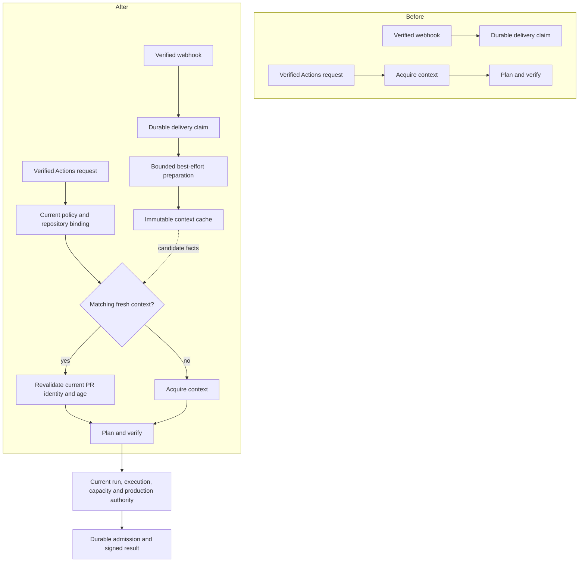

# Pre-CI Context Preparation

Status: implementation design for bounded speculative preparation.

Owner: repository-context freshness and application planning; ROADMAP D2.

## Decision

Use admitted webhook seeds to prepare immutable repository-context facts before
an Actions job requests a plan. Keep a small process-local cache and a bounded
nonblocking queue. A cache entry is neither a signed plan nor execution
authority. A miss uses the existing request-time acquisition path; the target
workflow retains its independent timeout-bound FullCI behavior.

This is deliberately best effort. GitHub can delay or reorder webhook
deliveries, and does not guarantee delivery before an Actions run starts.
Therefore `EveryPlanReadyBeforeCI` is not a realizable baseline promise.
[GitHub delivery timing](https://docs.github.com/en/webhooks/testing-and-troubleshooting-webhooks/troubleshooting-webhooks)
and [failed deliveries](https://docs.github.com/en/webhooks/using-webhooks/handling-failed-webhook-deliveries)
remain external constraints, not defects solved by adding a queue.

The implementation plan is
[Pre-CI Context Preparation Implementation Plan](pre-ci-context-preparation-implementation-plan.md).

## Before And After

Before, authenticated webhook processing durably records the delivery and
returns its normalized seed without starting planning. Every authenticated
plan request acquires repository identity, diff and graph from GitHub.



No webhook path receives a signer, issued-plan store or execution-authority
capability. Preparation does not dispatch jobs, mutate GitHub, activate policy,
change requirements or reuse a previous test result.

## Identity And Freshness

Reuse the existing `RepositoryEpoch` and `PolicySnapshot` value contracts.
The key is their complete pair, not only a head SHA:

```text
K = (installation, repository_id, owner, name, event, ref, base, head,
     config_epoch, compiled_policy_hash, policy_hash, graph_source,
     global_risk_paths, risk_classes)

Reusable(entry, request, policy, now) :=
  entry.key = Key(request, policy)
  and SuccessfulCompleteInput(entry)
  and entry.acquisition_started <= now < entry.expires_at
  and CurrentRepositoryIdentityMatches(request)
  and CurrentPullRequestRangeMatchesIfApplicable(request)
```

Capture acquisition time before the first preparation read using one injected
monotonic clock. Expiry is fixed at that time plus the cache lifetime. A late
response, a read, an unsuccessful refresh or a repeated event cannot extend it.
Recheck age after external revalidation and before returning cached facts.
Invalid or backwards clock observations do not admit an entry.

Every lookup resolves repository ID to current canonical owner/name through
the installation-bound provider. For pull requests it also observes the
current PR number/base/head. The ordinary miss path keeps the existing mutable
pagination before/after checks and immutable comparison. A hit does not page
mutable PR files: their already admitted immutable comparison remains bound to
the same exact range, while a fresh PR observation rejects a changed range.

The GitHub adapter receives a run-independent epoch for preparation; it must
not fabricate a `PlanRequest`, workflow run ID, execution SHA or OIDC identity.
The existing request API retains its exact `PlanRequest` input and delegates to
the same epoch acquisition implementation.

### Safety Argument

Under the existing admitted immutable-Git-object and provider-identity
contracts, equal key operands imply the same repository range, graph source
and policy meaning. Source completeness and graph freshness were established
by the ordinary context acquisition path. Live repository/PR checks reject
mutable identity drift. Therefore a hit can replace repeated acquisition of
those facts, but cannot replace any other planning prerequisite.

```text
CacheHit !=> OmissionAuthorized
PreparationSucceeded !=> PlanIssued

OmissionAuthorized => ExistingRequestAdmission
  and CurrentPolicy and PlanVerified and CurrentExecutionAuthority
  and CurrentProductionAdmission and DurableIssuance

not Reusable => ExistingRequestTimePath
```

The request still resolves overrides and active configuration, independently
plans and verifies coverage, checks OIDC/run/attempt/execution and requester
identity, loads current workflow/capacity evidence, and performs transactional
production admission and signing. A policy activation gives a different key;
an old in-flight preparation may finish only into its old key. No latest-wins
overwrite, cross-policy reuse or shared mutable key is allowed.

The proof remains conditional on the existing input model. It does not prove
that a repository-owned dependency graph includes every real dependency.
ROADMAP D2/E2 retains independent input-closure and selected/full pilot proof.

## Scheduling And Lifecycle

Only a successfully committed `SeedIngestion` with an exact supported range
can be offered. Rejections, unavailable storage, duplicate deliveries, ignored
events and completed-job observations do not schedule preparation. The offer
retains only a compact epoch, never raw request bytes, headers, credentials or
an arbitrary payload object. Owner/name are limited to 256 code points, ref to
4096, repository/installation IDs to positive JSON-safe integers, and both Git
SHAs to 40 lowercase hexadecimal characters. PR number and ref must agree.
These are preparation-retention bounds, not changes to full ingress acceptance.

| Boundary      | Contract                                                                                                                                                     |
|---------------|--------------------------------------------------------------------------------------------------------------------------------------------------------------|
| Waiting queue | At most 32 distinct epochs; nonblocking offer; duplicate full epochs coalesce, without claiming chronological event order                                    |
| Worker        | One lifecycle-owned task; each attempt has a five-second cooperative async timeout                                                                           |
| Eligibility   | Load the current active configuration first; absent or inapplicable dynamic policy performs no GitHub reads                                                  |
| Cache         | At most four complete immutable contexts and 100,000 total graph-node, dependency-edge and diff-file units                                                   |
| Freshness     | At most 120 seconds from acquisition start, checked at consumption                                                                                           |
| Failure       | No successful cache entry after error, cancellation, incomplete input or expired acquisition; later queue items remain eligible                              |
| Shutdown      | Reject offers, discard pending epochs, cancel and await the worker, clear cached references before provider closure under the existing outer shutdown budget |

Existing artifact byte, node, path, diff-page and provider deadlines remain
independent conjuncts. A single context exceeding the cache budget is still
handled by the ordinary request path; it is not partially cached. The worker
never holds a database transaction while awaiting provider acquisition, and a
foreground request never waits for a speculative task or its queue position.

These limits bound retained logical inputs and concurrent speculative work,
not measured RSS or an event-loop scheduling guarantee. Capacity qualification
must include this overhead. `asyncio` cancellation cannot preempt synchronous
parsing or a stalled event loop; the existing finite artifact/graph limits
remain necessary, and five seconds is not a hard OS-level wall-clock bound.
Cache freshness is not a secure-memory-erasure
promise: expired references are removed on cache maintenance/use and shutdown;
no persistent copy or exported raw evidence is introduced.

## Observable Delta

The delivery claim remains durable before success is returned. If the local
queue accepts preparation, HTTP reports `downstream: best_effort_preparation`;
otherwise it retains `downstream: none`. Neither value promises completion,
durable scheduling, GitHub redelivery or a plan. Existing authentication,
payload bounds, idempotency and error statuses stay unchanged.

Finite metrics distinguish offered, coalesced, saturated, ineligible, prepared,
invalid, failed, timed-out and cancelled work, and cache hit/miss/expiry. No
repository ID, ref, SHA, URL, exception text or payload becomes a metric label.
These observations measure preparation, not saved CPU or successful execution.

The existing active dynamic policy opts a configured repository into useful
preparation. No additional environment variable, database migration, broker,
credential, settings-state upgrade or frontend dependency is necessary.

## Alternatives And Revision Conditions

| Alternative                                      | Decision and cost                                                                                                               |
|--------------------------------------------------|---------------------------------------------------------------------------------------------------------------------------------|
| Keep only synchronous acquisition                | Simplest baseline, but cannot use webhook lead time; retained as the miss path                                                  |
| Cache signed plans or skip authority             | Rejected: run identity, overrides, capacity and durable authority are time-sensitive and not known at preparation time          |
| Process-local bounded preparation                | Selected: safe loss and low operational cost; misses across replicas/restarts and speculative overhead are explicit             |
| Shared PostgreSQL preparation queue/cache        | Revisit when measured replica affinity loss or restart cost justifies durable lifecycle, retention, schema and contention costs |
| Add a broker or generic background-job framework | No current owner requirement needs another service or generic job model                                                         |

Python's `asyncio.Queue`, task cancellation, finite timeout and `OrderedDict`
provide the required mechanics. Existing immutable values, provider adapters,
Pydantic response model and Prometheus client retain their boundaries. A new
cache dependency is not needed for four owner-specific entries; a generic
cache abstraction would still need exact context identity, live validation and
logical-size admission. Reconsider if an admitted dependency removes actual
complexity without weakening these semantics.

This is a bounded design choice, not a global-optimality or performance claim.
Reopen it if preparation delays foreground work, hit rate is poor, logical or
measured resource budgets fail, multiple replicas require shared preparation,
or a counterexample violates key/age/authority separation. A persistent
successor must not silently reinterpret these best-effort ACK semantics.
