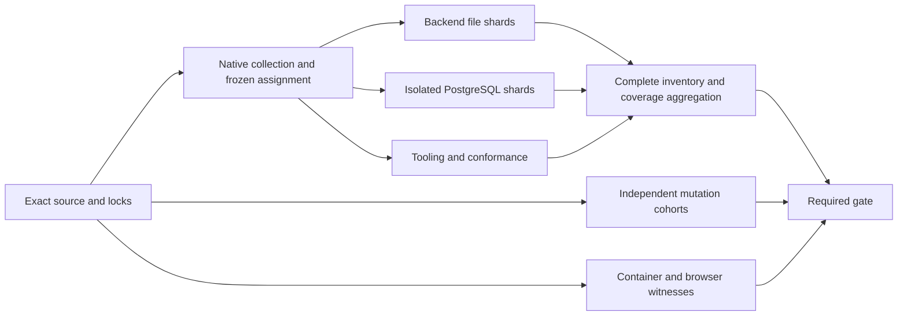

# Proof-Preserving CI Efficiency

Status: implementation admitted after independent design and plan review

## Decision And Objective

Reduce unnecessary construction, subprocess, database and repeated verification
work before adding concurrency. Partition independent remaining work using
existing pytest, coverage.py and GitHub matrix execution. Preserve the complete
test/mutant population, environment-specific witnesses and every coverage floor.

The requested five-minute job/workflow target is a soft latency objective,
not a correctness deadline or permission to delete slow tests. Measure runner
queue time, critical-path elapsed time, runner occupancy and process CPU
separately. A faster wall clock alone is not reduced CPU cost.

This design owns test-cost and proof-preservation decisions. The
[inventory design](automatic-app-inventory.md) owns the independent product
change. The batch does not activate self-selective CI or alter client workflows.

## Measured Starting Point

Five native runs, `34213409772`, `34219865872`, `34232232389`, `34252750870` and
`34257651186`, place the PostgreSQL-labelled job at 1,653-1,672 seconds.
The last run at `85edcd4280dde4a26521b8ecc4f5712d98c2a60c` passed 6,829 tests,
skipped two and ran pytest for 1,611.67 seconds. Its test-loop duration was
1,572.32 seconds. Approximate case-phase sums were:

| Group                     | Cases including skips | Elapsed sum |
|---------------------------|----------------------:|------------:|
| PostgreSQL                |                   342 |    689.90 s |
| Other backend             |                 5,364 |    737.47 s |
| Tooling                   |                 1,119 |    127.17 s |
| Byte-contract conformance |                     6 |      1.19 s |

These are rounded hosted-runner elapsed observations, not causal benchmarks.
Keep all inspected runs, including subgroup regressions. The base mutation
step took 1,016 seconds: 531.402 baseline seconds plus 479.855 mutated seconds
over 190 mutants. The current Dev Container job still takes 535 seconds.

The later public-repository [Full Check](https://github.com/research-engineering/ci-coordinator/actions/runs/35918291178)
at exact source `9e3fc3d18c01f75b9e6e6c240825e3d3c45ef840` changes the
scheduling premise: the single tooling shard completed 3,454 tests from 99
files in 877.58 seconds; its recorded pytest phases total 859.69 seconds.
All nine native shard reports passed, with 12,593 unique node identities and
three terminal phases per node. The previous per-file hints came from source
`85edcd4280dde4a26521b8ecc4f5712d98c2a60c` and under-estimated this
expanded population. These are elapsed observations, not process CPU or a
causal speedup experiment.

## Complete Cost Review, Not A Top-N Audit

Produce a machine-readable CI artifact with one row per native collected test
and one row per tracked workflow job. A test row binds source, exact node ID,
file/group, call/setup/teardown duration, outcome, and its applicable fixture
lifecycle. Job rows bind workflow/job/environment, direct stages, dependencies
and measured or explicitly unknown cost. Preserve skipped, unknown, unmeasured
and newly added rows; do not imply that ranking establishes review closure.

Ask of every row and shared owner group:

1. What failure can this oracle detect, and where is its authoritative contract?
2. Which setup must be fresh? Which bytes/data are immutable and safely shared?
3. Does a predecessor already establish the same fact in the same environment?
4. Are wall-clock waiting, real commits, multiple connections and process
   startup the behavior under test or incidental preparation?
5. Which cheaper trajectory preserves the same falsifier, isolation and bounds?
6. What observation would invalidate the proposed equivalence?

Group-level dispositions may cover multiple rows only with a common owner,
setup contract and stated equivalence. An automatic inventory is not a claim
that every test was manually read or that maximum performance is proved.

## Proof Invariants

For exact collected universe `U` and admitted shard sets `S_i`:

```text
union(S_i) = U
forall i != j: intersection(S_i, S_j) = empty
AdmitCoverage => EveryExpectedShardSucceeded
                 AND SameSourceAndToolchain
                 AND CompleteNodeAndOutcomeReceipts
                 AND OriginalRiskOwnedFloors(Combine(Coverage_i))
ReusePreparation(x) => SameImmutableInputs(x) AND IsolatedMutableState(x)
FasterVerdict => PreservedOracle AND PreservedHardConstraints
```

No result from a missing, stale, cancelled, empty, foreign or invalid shard is
success. No threshold reduction, coverage suppression or collection exclusion
is an optimization. Production timeouts, lease authority and migration files
are not changed to shorten tests.

Shard admission also rejects any failed setup/teardown, unexpected skip or
xfail, and missing call outcome. The only currently admitted Linux skips are
the two real-esbuild parameter cases whose installed-toolchain executions
remain required in repository-quality. Bind those exact identities and reason
to that required job; do not allow a file-wide skip exemption. A same-head
serial qualification independently compares node and terminal outcome sets;
historical counts cannot exclude newly added regression tests.

## Remove Work

### Evidence Fixtures And Source Epochs

Extend the existing module-seed/isolated-copy pattern only to measured fixture
families. Cache immutable construction, not the admission/serialization call
under test. Key every variant explicitly. Keep fresh mutable mappings and
clock/identity-bound grants; a frozen dataclass alone does not prove deep
immutability. Add negative alias/mutation/copy-boundary witnesses.

For CLI source-epoch cases, share an immutable prepared source template where
equivalent, then create isolated per-case copies/branches. Keep the real CLI,
subprocess coverage, source binding and malicious worktree/bytecode cases.
Profile encode/decode, copy/Git and process startup separately before claiming
which operation dominates a test file.

### PostgreSQL Lifecycle

Use an isolated Testcontainers database per test process/job. Testcontainers'
session fixture is process-local; different pytest workers do not inherently
share one database. Never introduce a globally shared external test DSN.

Coalesce migration and runtime-role setup only for a positively reviewed
ordinary-state cohort. Unknown or schema/ACL-changing cases retain fresh
preparation. Preserve data cleanup and committed/multi-connection semantics;
an outer rollback cannot replace those tests. Migrations, drift and privilege
tests keep independent lifecycles. A marker alone does not prove equivalence.

Retain real database-clock and PID/lock-barrier witnesses. The 30-second plan
expiry and 15-second audit-block horizon are deliberate, not evidence of a
deadlock. Move redundant predicate combinations into deterministic unit tests
only when their database interleaving is already covered by retained witnesses.
Do not shrink a horizon without justified order and execution-variance margin.

### Mutation And Environment Repetition

Partition independent manifests first. The database-compatibility cohort is
about 448 seconds and may need further partitioning. Retain per-mutant baselines
in this batch: most commands differ and full clean-state equivalence has not
been established. A future baseline reuse requires
after exact source, command, environment, dependency, selected-test and clean
restored-state equivalence is established. A test-ID digest alone is insufficient.
Restoration must be checked before reuse; each mutant still executes and must
fail for its admitted oracle, not an infrastructure error.

Dev Container runs are not automatically duplicates of host runs: their user,
network, mount and installed-toolchain boundary differs. Preserve that proof.
Apply shared fixture savings there too; inspect its stage costs before replacing
any full portable route with a smaller environment-conformance corpus.

## Parallelism And Aggregation

Prefer file-cohesive shards so module fixtures are not rebuilt on every worker.
Use a compact file-cost projection only as a scheduling hint. Unknown/new files
must remain in the collected universe. The exact-source planning phase freezes
the test inventory and assignment once; every job consumes that same artifact.

Use deterministic file-cohesive LPT with stdlib `heapq`: descending cost/path
ordering and least-load/index tie-break. Start with four backend, four isolated
PostgreSQL and one tooling/conformance shard. This is an initial measured-load
hypothesis, not proof of the minimum worker count. New files use the cohort
mean cost or a positive fallback and always remain in the native universe.

For the 12,593-node baseline population, revise the tooling count from one to
three while retaining four backend and four PostgreSQL shards. Rebalance with
complete per-file phase hints from the exact successful run above. LPT on the
observed tooling phases yields about 287 seconds per tooling shard before
per-job setup and scheduling variance. Two additional runner preparations are
the cost of a shorter critical path; measure both wall and aggregate runner
time after implementation. Each tooling shard must install the test scanner
because source-file assignment is free to move scanner witnesses between
shards. The complete native partition, serial route and coverage/mutation
oracles remain unchanged. If measured total cost outweighs the latency gain,
revisit the count rather than declaring three universally optimal.

Existing pytest plugins were considered before this bounded assignment. Test-level
duration splitting can duplicate expensive module fixtures; process-local
xdist can saturate a small runner without reducing CPU. A bounded file
partition keeps module fixtures together without adding a plugin-specific
selection or grouping protocol. Do not add
a reusable scheduling framework for this one CI gate.



Coverage.py owns data merging, branch measurement and the aggregate floor from
`backend/pyproject.toml` (`fail_under = 84`). The existing coverage policy owns
owner/changed-critical floors; its aggregate field is informational. Run both
unchanged gates on the combined data. The new collector owns
only exact-source shard and test-population completeness. Bind artifacts to
run, attempt, source, toolchain, assignment and cohort; bound input sizes and
reject path traversal or untrusted executable artifact content.

Before combining, read and materialize every dataset through the supported
`CoverageData` API. Require branch data and reject any unreadable input even
when its receipt hash matches and all other shards meet every floor. A hash
proves byte identity, not that `coverage combine` consumed the input: the CLI
can warn and skip a corrupt file. Dataset admission and aggregate floors are
independent obligations; neither replaces the other.

## Observability And Budgets

Forward bounded progress without mixing diagnostics into machine-readable
stdout. Preserve the existing process-group termination and output limits.
Record monotonic phase durations, selected node IDs and terminal outcomes;
fixture timings are inclusive unless explicitly measured otherwise and must
not be summed as disjoint CPU. Optional CPU metrics must identify process and
waited-child scope, excluding unmeasured database/container work.

Select the smallest worker count meeting the soft target with measured
headroom and available capacity. Keep a serial full route for independent
qualification and fallback. Report full-workflow critical path, not just the
fastest shard. Hosted queue delay is outside a hard five-minute guarantee.

## Acceptance And Review

Before implementation: root falsification, one independent reviewer under
`AGENTS.md`, revised design and a separately reviewed implementation plan.
After implementation: source/oracle review, all admitted local static checks,
then exact native GitHub tests and completeness/coverage/mutation results.

Compare serial and optimized runs with identical source, lock, environment and
oracle definitions where the performance claim requires them. Keep failures
and unfavorable timings. Do not publish p95 or CPU-saving percentages from
one run. An unmeasured candidate remains a candidate, not a claimed optimization.

The batch closes only demonstrated improvements. Remaining real-time waits,
environment-specific costs or uncertain reuse must have explicit retained
dispositions and revision triggers. Independent Full Check and fallback stay
available before later self-optimization under ROADMAP D2/D4/D9 and E2/E3.

## Dev Container Full-Test Budget Follow-up

The [PR #10 Full Check attempt](https://github.com/research-engineering/ci-coordinator/actions/runs/35995918521)
ran the complete portable `python.test` selection in the least-privilege Dev
Container to about 98% before its 900-second process deadline expired. All
ordinary native shards passed. The timeout is a failed test obligation, not a
green result or evidence that the remaining tests would pass. One same-head
failed-job rerun is diagnostic; a lucky pass does not supply headroom.

Preserve the exact collected portable population and raise only this process
ceiling to 1,080 seconds. Its command envelope is 1,140 seconds including the
existing 60-second wrapper reserve. The portable parent is 1,380 seconds,
including its existing 240-second aggregate reserve. Provision 600, Node
proof 60, portable parent 1,380 and cleanup 120 yield the finite 2,160-second
Dev Container stage budget, below its unchanged 40-minute job ceiling. The
branch aggregate and global command cap must be recomputed from their exact
child set. The ordinary native shard keeps its separately owned 900-second
process deadline below its 960-second workflow watchdog; it must not import
the portable budget. Coverage floors, selected-test population,
mutation oracles and test behavior are unchanged. Revisit the bound after
measuring the full portable stage and removing proved redundant work; this
budget repair alone does not reduce CI cost.

Coverage combination uses the existing [coverage.py command](https://coverage.readthedocs.io/en/latest/commands/cmd_combine.html),
not a hand-written merger of coverage percentages.
