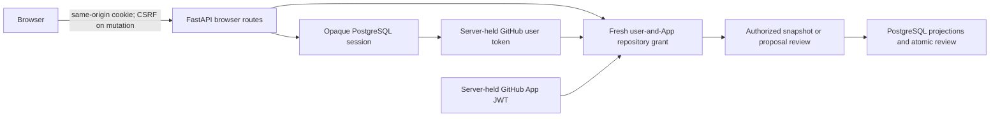

# Operator Proof Workbench

Status: browser identity, provider catalog, proof snapshot, workflow discovery,
and non-activating proposal review implemented; acceptance is commit-scoped
through `quality.branch-head`

Date: 2026-07-19

Owners: `ci-coordinator.operator-ui`, `ci-coordinator.runtime`

## 1. Decision

The browser surface is an authenticated repository portfolio with one bounded
mutation: affirmative review and non-activating registration of an exact
current-head workflow proposal. Its primary path discovers the intersection of
the signed-in GitHub user and explicitly installed GitHub App repositories,
then opens exact-scope proof and workflow evidence. It answers four ordered
operational
questions:

> Which repositories can this operator discover, and which of them are also
> authorized for coordinator evidence?

> What does the coordinator currently know about this repository, and which
> evidence is missing, truncated, or invalid?

> Which workflow topology and observe-only proposal are proven at this exact
> commit, and which predicates remain blocked or unknown?

> Does the current user still hold the repository-manager role required to
> register this exact proposal as reviewed without activating it?

It does not edit policy, activate configuration, dispatch workflows, mutate
GitHub, or authorize CI omission. UI code cannot manufacture those authorities.

## 2. Selection Proof

Let `A` be the admitted browser identity boundary, `G` a fresh exact
repository grant, `C` the existing durable proposal-review contract, and `N`
the explicit non-activation invariant.

```text
A and G(read) => Admit(repository evidence reads)
A and G(maintain-or-admin) and C and N
  => Admit(affirmative non-activating review)

not A or not G => Reject(repository operation)
not N => Reject(browser review exposure)
```

The review command reuses the existing freshness, replay, ABA, semantic-diff,
and transactional service rather than creating browser-owned semantics.
Provider visibility does not create workbench or review authority. The
complete adoption trajectory is owned by
[Repository Adoption Experience](repository-adoption-ux.md).

## 3. Trust Boundary



Production browser routes admit only an opaque session. The provider token,
deployment bearer, and CSRF key never enter browser assets or storage. Every
repository action rechecks both the user-token repository evidence and the
app-JWT installation relation. The development proxy retains a canonical-GET
static-credential path only for isolated local evaluation; it cannot proxy the
review mutation and is absent from production assets. A new backend route or
method therefore acquires no browser authority by proximity to `/api`.

## 4. Information Architecture

The page has eight stable regions:

1. bounded browser identity with sign-in, session, and sign-out states;
2. an organization selector populated from the authorized installation
   catalog;
3. a searchable current-page repository table that keeps provider visibility
   and exact workbench authorization separate;
4. an explicitly disclosed degraded numeric scope form for catalog outages or
   an empty inventory grant;
5. evidence summary: ledger revision, observation time, replay status, and
   truncation warning;
6. bounded sections for plans, runs, overrides, configuration epochs, and audit
   events;
7. exact-commit workflow topology, provenance, unknowns, and an admitted or
   blocked observe-only proposal; and
8. one explicit non-activating proposal-review control with retained outcome.

Catalog and snapshot regions each own typed loading, empty, forbidden,
unavailable, invalid-response, and network-failure states with an explicit
retry action. The catalog additionally preserves partial, suspended,
unsupported-account, not-found, and rate-limited facts.

The layout is table-first and work-focused. Desktop optimizes comparison;
mobile preserves every fact through horizontal containment or stacked rows.
Color is supplementary to text and icon labels.

## 5. State Algebra

```text
IdentityState := Loading
               | Anonymous
               | Authenticated(BoundedUser, CsrfProof)
               | Unavailable
               | InvalidResponse
               | NetworkFailure

CatalogState := Loading
              | Ready(ValidatedInstallationCatalog)
              | TypedCatalogFailure

RepositoryPageState := Idle
                     | Loading
                     | Ready(ValidatedRepositoryPage)
                     | TypedCatalogFailure

SnapshotState := Idle
               | Loading
               | Ready(ValidatedSnapshot)
               | Unauthenticated
               | Forbidden
               | Unavailable
               | InvalidResponse
               | NetworkFailure

ReviewState := Idle
             | Submitting
             | Accepted
             | Duplicate
             | Stale
             | BaselineConflict
             | OperationConflict
             | EpochConflict
             | DiffLimit
             | Unauthenticated
             | Forbidden
             | Unavailable
             | InvalidResponse
             | NetworkFailure
```

Only an authenticated identity and the corresponding `Ready` state may render
browser-authorized catalog or snapshot evidence. Only `Accepted` or
`Duplicate` may render retained review evidence, and both must display
`active=false`.
An empty installation grant, a complete empty repository page, and provider
unavailability are distinct states. Empty snapshot sections are explicit
projections of a validated snapshot, not a transport state. A replay state
other than `valid` is never mapped to success. Truncation is preserved per
section rather than collapsed into a generic flag. The backend observation
time is displayed; the browser does not infer freshness without a separately
specified policy.

## 6. Contract Boundary

FastAPI OpenAPI output is the transport authority. A checked-in, deterministic
OpenAPI projection generates TypeScript types. Runtime schemas validate the
untrusted JSON before it becomes a validated catalog, page, or snapshot.

```text
BackendDTOs -> OpenAPIProjection -> GeneratedTypes
OpenAPIRequestBounds -> ScopeAdmission -> SameOriginRequest
ResponseBytes -> RuntimeSchema -> ValidatedCatalogOrSnapshot -> Components
```

Generation and drift checks are repository witnesses. Generated types do not
replace runtime validation, and runtime validation does not redefine backend
business semantics.

## 7. Component Boundaries

| Owner                | Responsibility                                     | Forbidden responsibility   |
|----------------------|----------------------------------------------------|----------------------------|
| `api`                | request, status mapping, runtime decoding          | presentation decisions     |
| `domain`             | immutable validated view types and pure formatting | network or DOM access      |
| `features/workbench` | query state and page composition                   | backend authority          |
| `components`         | reusable semantic primitives                       | repository-specific policy |
| `styles`             | tokens, layout, responsive rules                   | data-dependent truth       |

A new component or abstraction is admitted only when it owns a reusable
semantic contract or removes demonstrated duplication. File count and pattern
fashion are not sufficient reasons.

## 8. Acceptance Proof

The slice is complete only if all of the following hold:

```text
Typecheck
and StaticAnalysis
and ComponentStateFalsifiers
and ContractDriftCheck
and ProductionBundleSecretScan
and DesktopBrowserProof
and MobileBrowserProof
and AccessibilityProof
and ConnectedStackSmoke
```

## 9. Deferred Capabilities

- policy activation and rollback mutations;
- operator overrides and other mutations;
- review rejection comments and quorum;
- release, drift, and agent-advice projections;
- live update transport.

Each deferred capability needs its own backend authority and falsifiable
requirements before a UI implementation is admitted.
