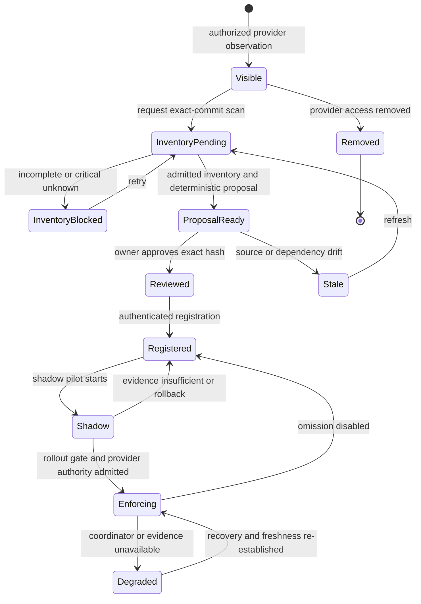

# Repository Adoption Experience

Status: product design; browser identity, authorized catalog, workflow
discovery, proposal, and non-activating review slices implemented

Date: 2026-07-19

Owners: `ci-coordinator.provider-inventory`, `ci-coordinator.operator-ui`

## 1. Decision Summary

The primary adoption path is not manual entry of GitHub numeric identifiers.
It is an authority-preserving sequence:

```text
Authenticated operator
  -> authorized GitHub App installation
  -> provider-visible repository
  -> immutable workflow inventory
  -> deterministic configuration proposal
  -> repository-owner review
  -> registration
  -> shadow evidence
  -> separately authorized enforcement
```

Human-readable organization and repository names are presentation facts.
Installation and repository ids remain the canonical identity carried through
every request, response, proposal, audit event, and authorization decision.

```text
DisplayName(id) does not replace Identity(id)
ProviderVisible(repo) does not imply OperatorAuthorized(repo)
OperatorAuthorized(repo) does not imply Configured(repo)
Configured(repo) does not imply Enforcing(repo)
```

The UI must present those predicates independently. A single status such as
`connected` would be semantically false.

## 2. Why This Is The Minimal Complete Trajectory

Let:

- `P` mean that provider metadata is available;
- `A` mean that the operator is authorized for the installation;
- `I` mean that an exact-commit workflow inventory is admitted;
- `Q` mean that a deterministic proposal exists;
- `R` mean that the repository owner reviewed the exact proposal hash;
- `S` mean that shadow evidence satisfies the rollout policy; and
- `E` mean that provider enforcement is separately authorized.

Then:

```text
BrowseEligible := P and A
ProposalEligible := BrowseEligible and I
RegistrationEligible := ProposalEligible and Q and R
EnforcementEligible := RegistrationEligible and S and E
```

Removing any term either makes the product unusable or transfers authority
without evidence:

| Removed term | Counterexample                                                        |
|--------------|-----------------------------------------------------------------------|
| `P`          | The UI invents repositories that the app cannot access.               |
| `A`          | A valid app credential leaks another operator's repository metadata.  |
| `I`          | A proposal is generated from an incomplete or mutable workflow view.  |
| `Q`          | Review has no stable bytes or semantic diff to approve.               |
| `R`          | Service configuration replaces repository-owner consent.              |
| `S`          | Omission is enabled without comparing it to full validation.          |
| `E`          | A developer action silently changes rulesets, checks, or credentials. |

Therefore the sequence is necessary. Within the bounded goal of guarded
repository adoption, it is sufficient only after every owner-policy row in
Section 9 has an admitted value: each transition then has one owner, one
immutable subject, and one conservative failure state. It is not a
sufficiency claim for deployment, organization governance, or production
omission.

## 3. Actors And Authority

| Actor                      | May do                                                                                                               | Must not imply                                                   |
|----------------------------|----------------------------------------------------------------------------------------------------------------------|------------------------------------------------------------------|
| Repository developer       | run local discovery, inspect a proposal, open a repository PR                                                        | provider administration or production omission                   |
| Repository manager         | affirmatively review exact repository-owned proposal bytes when current GitHub evidence grants `maintain` or `admin` | GitHub organization administration or policy activation          |
| Platform operator          | browse explicitly authorized installations, register reviewed policy, run a shadow pilot                             | repository-owner approval                                        |
| Organization administrator | install the GitHub App, select repositories, configure rulesets and required checks                                  | semantic safety of coordinator decisions                         |
| Runner administrator       | expose capacity and runner-class evidence                                                                            | repository policy ownership                                      |
| CI Coordinator             | collect evidence, produce proposals and plans, publish owned checks when authorized                                  | authority outside its admitted installation and repository scope |
| Optional risk agent        | recommend validation increases or explain uncertainty                                                                | validation omission or credential expansion                      |

Read, propose, approve, register, activate, enforce, and administer-provider are
different permissions. A role model that combines them must prove why the
combination is required; convenience is insufficient.

## 4. Target Information Architecture

The product uses progressive disclosure. The first view is an operational
repository inventory, not a generic dashboard.

This section defines the target product, not an assertion that every state is
already implemented. The current slice implements browser identity,
organization and repository discovery, exact workbench evidence, workflow
inventory, deterministic proposal, and affirmative non-activating review.
Lifecycle beyond registration, drift policy, shadow admission, provider wiring,
and enforcement remain absent until a backend owner supplies each admitted
projection.

### Level 1: Repository inventory

- organization selector populated from operator-authorized GitHub App
  installations;
- organization selector remains visible but disabled for an empty grant so the
  discovery surface is explicit without fabricating provider data;
- searchable, paginated repository table;
- provider state, repository eligibility, coordinator lifecycle, drift, and
  last observation shown as separate columns;
- bulk selection only for proposal generation, never for implicit activation;
- explicit partial-page, stale, rate-limited, suspended, and unavailable
  states.

### Level 2: Repository detail

- current evidence overview;
- discovered workflow topology and unknown ledger;
- proposed configuration and semantic diff;
- shadow and reconciliation evidence;
- provider wiring and authority gaps;
- immutable audit history.

### Level 3: Governed actions

Actions appear only when their backend command, authorization, idempotency,
audit, and rollback contracts exist. A disabled mock action is not evidence
that the product supports the transition.

```text
Overview -> Workflows -> Proposal -> Shadow -> Enforcement -> Audit
```

Global views for runs, runner capacity, policies, and audit are justified only
when they answer a cross-repository operator job. They must link back to the
exact repository and evidence identity.

## 5. Target Orthogonal State Model

One repository row is a product of independent state dimensions:

```text
ProviderState := visible | suspended | removed | unavailable | unknown
EligibilityState := eligible | archived | disabled | unsupported | unknown
InventoryState := absent | scanning | complete | incomplete | stale | failed
ProposalState := absent | reviewable | approved | stale | rejected
CoordinatorState := unmanaged | registered | shadow | enforcing | degraded | retired
AuthorityState := local_only | service_configured | provider_pending | provider_enforced
```

The UI may derive a recommended next action, but it may not collapse the source
dimensions into one badge. For example:

```text
ProviderState = visible
and CoordinatorState = unmanaged
and AuthorityState = local_only
```

means "available for analysis", not "connected" or "ready".

The implemented catalog must not synthesize any unowned dimension from
provider visibility. Until the corresponding read model exists, absence from
the UI is more truthful than a guessed state.

### Repository adoption state machine



No transition from `Visible`, `ProposalReady`, or `Reviewed` directly to
`Enforcing` exists.

## 6. Organization And Repository Discovery Contract

The browser never receives a GitHub App private key, app JWT, installation or
user access token, or operator bearer token. It calls same-origin read endpoints
and one origin- and CSRF-protected proposal-review endpoint.

The backend:

1. resolves an unexpired opaque browser session before provider I/O;
2. lists only installations and repositories visible through the GitHub App
   user access token;
3. rechecks the exact immutable repository id and normalized user permission
   for every repository action;
4. independently uses app authentication to bind the same owner/name to the
   requested installation;
5. uses installation authority for bounded workflow evidence only after that
   conjunction succeeds;
6. parses bounded provider responses into minimal typed projections;
7. exposes pagination and partial failure honestly; and
8. never treats catalog visibility or review as activation or enforcement
   authority.

Names are mutable. Every item therefore carries the composite identity
`(installation_id, repository_id)` and the current `(owner, name)` assertion.
Renames update presentation facts without changing repository identity.
Transfers, installation removal, suspension, or repository-selection changes
invalidate prior visibility and trigger reconciliation.

Provider pagination is not snapshot isolation. Each page records observation
time and completeness. Search over loaded pages must not claim
organization-wide completeness until every page in one admitted scan is collected.

## 7. Ideal Client Repository Contract

The target repository retains a small, pinned bootstrap and a native FullCI
fallback. The coordinator and a platform workflow library may reduce repeated
logic, but they do not become an unbounded single point of failure.

```text
provider event
  -> static bootstrap identity and request validation
  -> bounded coordinator plan request
  -> signature and exact-run binding validation
  -> fixed generic jobs expanded by admitted matrices
  -> stable aggregate required check
  -> FullCI on timeout, unavailable, stale, invalid, or unsupported plan
```

GitHub Actions workflow structure is statically declared. A preceding job may
produce a matrix for a later declared job, but it cannot add arbitrary new job
definitions after the run starts. Therefore "dynamic workflow" means dynamic
inputs, matrices, conditions, and external check evidence inside a bounded
static execution skeleton. It does not mean runtime generation of an arbitrary
GitHub job graph.

Use the central workflow library for coherent reusable execution lanes and
composite actions. Keep in the target repository:

- event triggers and repository-specific permissions;
- the pinned bootstrap/fallback boundary;
- stable required-check aggregation;
- repository-owned environment and secret decisions; and
- a reviewable configuration source or generated artifact manifest.

The coordinator must never require a repository developer to possess
organization-admin authority. Provider wiring is a separate admin step and
local-only adoption remains a truthful supported state.

## 8. Deterministic And AI Responsibility

Deterministic analysis owns facts that affect omission, identity, authority,
and execution:

- exact diff and commit identity;
- workflow syntax and bounded call graph;
- dependency and ownership rules;
- required checks, permissions, environments, credentials, and runner class;
- test manifest, shard bounds, and fallback conditions; and
- plan signatures, freshness, and replay.

AI may add monotonic advice:

- identify likely missing test obligations;
- recommend greater validation depth;
- explain ambiguous workflow behavior;
- propose test data or credential classes without accessing values; and
- rank unknowns for human review.

```text
FinalObligations = DeterministicObligations union AdmittedAgentAdditions
```

Agent output cannot remove deterministic obligations, create credentials,
approve a proposal, or change provider enforcement.

## 9. Product Question Ledger

### Resolved decisions

| Question                                                     | Answer                                                                                          | Proof obligation                                                                        |
|--------------------------------------------------------------|-------------------------------------------------------------------------------------------------|-----------------------------------------------------------------------------------------|
| What is the first screen?                                    | Authorized organization repository inventory.                                                   | A user can find a repository without external numeric IDs.                              |
| Are provider-visible repositories managed?                   | No; visibility, configuration, shadow, and enforcement are independent.                         | The UI renders counterexample combinations distinctly.                                  |
| Can discovery mutate GitHub or coordinator policy?           | No; it produces evidence and proposals only.                                                    | Read routes have no mutation capability and proposal hashes cannot activate themselves. |
| What happens when the coordinator is unavailable?            | The client bootstrap runs FullCI or fails explicitly according to the stable fallback contract. | Timeout and malformed-plan witnesses reach FullCI without silent green.                 |
| Where should reusable workflows live?                        | In a platform-owned library, with pinned target-repository bootstrap and fallback.              | Library outage or access failure does not suppress FullCI.                              |
| Can an agent decide what not to test?                        | No.                                                                                             | Final validation is a superset of deterministic obligations.                            |
| Can repository configuration change without service restart? | Yes, through immutable validated config epochs.                                                 | Activation is atomic, scoped, replayable, and rollback-safe.                            |

### Decisions that remain owner policy

| Question                                                                          | Required owner                           | Why unresolved                                                                                                                                                     |
|-----------------------------------------------------------------------------------|------------------------------------------|--------------------------------------------------------------------------------------------------------------------------------------------------------------------|
| Which roles may activate reviewed policy or authorize enforcement?                | Security and platform owners             | Browser reads require current app-user access and review requires normalized `maintain` or `admin`; neither decision establishes activation or omission authority. |
| Does repository onboarding write a PR, register external config, or support both? | Repository and platform owners           | Each choice transfers different write authority and review ownership.                                                                                              |
| What shadow duration and sample size admit omission?                              | CI/platform SLO owner                    | A universal threshold cannot be derived from repository code alone.                                                                                                |
| Which repositories are eligible for bulk proposal generation?                     | Organization admin and repository owners | Archived, fork, regulated, and environment-protected repositories may require different policy.                                                                    |
| Which runner capacity source is authoritative?                                    | Runner platform owner                    | GitHub repository metadata alone does not prove currently free runner capacity.                                                                                    |
| What cost objective and fairness policy selects shard counts?                     | Platform finance and operations owners   | CPU, wall time, queue delay, and fairness have no universal weighting.                                                                                             |
| Which provider changes may the service apply automatically?                       | Organization security owner              | Rulesets, secrets, environments, and workflow writes require separate permissions and rollback contracts.                                                          |

Unresolved rows must remain configuration or decision records. They must not be
encoded as hidden constants.

## 10. Documentation Projection

Use this classification rule for every answer:

```text
Falsifiable runtime behavior or trust invariant -> requirements package
Stable structural choice and rejected alternatives -> architecture module or ADR
Product trajectory and interaction rationale -> feature design
Executable user goal -> Diataxis tutorial or how-to
Exact schema, route, field, or command -> generated/API reference
Ordered implementation work -> implementation plan
Future sequencing and state -> ROADMAP
Missing business authority -> unresolved decision ledger
```

Consequences for this feature:

| Content                                                                      | Owner                                                                     |
|------------------------------------------------------------------------------|---------------------------------------------------------------------------|
| Provider authentication, parsing, bounds, pagination, and failure algebra    | runtime requirement plus `provider-inventory.md`                          |
| Browser catalog admission, states, accessibility, and no-secret boundary     | operator UI requirement plus this feature design                          |
| Explicit installation-level authorization                                    | `provider-inventory-authorization.md` ADR                                 |
| Automatic organization and repository discovery as the primary operator path | operator UI requirement, this feature design, and `provider-inventory.md` |
| Current implementation status and explicit non-claims                        | `ROADMAP.md` and concise README current-state projection                  |
| Ideal target-repository workflow contract and fallback                       | bootstrap contract and target-repository adoption playbook                |
| Unresolved product, authority, rollout, and policy choices                   | Section 9 decision ledger until an accountable owner decides              |
| Multi-worktree local operation and dynamic endpoints                         | executable local-development how-to                                       |
| Requirement-to-witness mapping                                               | `proofkit/requirement-bindings.json`                                      |
| Current local evaluation steps                                               | `how-to/evaluate-locally.md` after implementation                         |
| Workflow scan and proposal behavior                                          | `workflow-discovery-ui.md`                                                |
| Product sequencing                                                           | `ROADMAP.md`                                                              |

No how-to may describe a capability that is not executable. No feature design
may silently become normative authority.

## 11. Staged Product Trajectory

1. Authenticated authorized installation and repository catalog.
2. Exact-commit workflow inventory with explicit unknowns.
3. Deterministic configuration proposal and semantic diff.
4. Repository-owner review handoff and immutable approval hash.
5. Registration and shadow pilot with FullCI retained.
6. Provider wiring proposal for an administrator.
7. Bounded enforcement after production admission.
8. Drift reconciliation, bulk proposal generation, and offboarding.
9. Monotonic AI advice after deterministic contracts are closed.

## 12. Non-Claims

This design does not claim live deployment, current provider availability,
automatic GitHub App installation, review quorum, policy activation, provider
ruleset mutation, production omission, or authoritative runner free-capacity
measurement unless the corresponding stage is implemented and witnessed.
