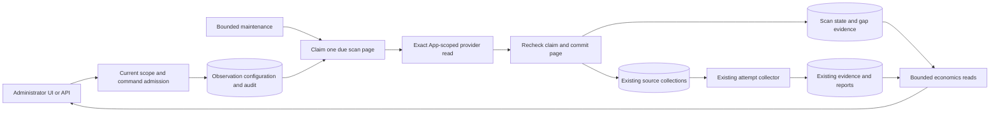
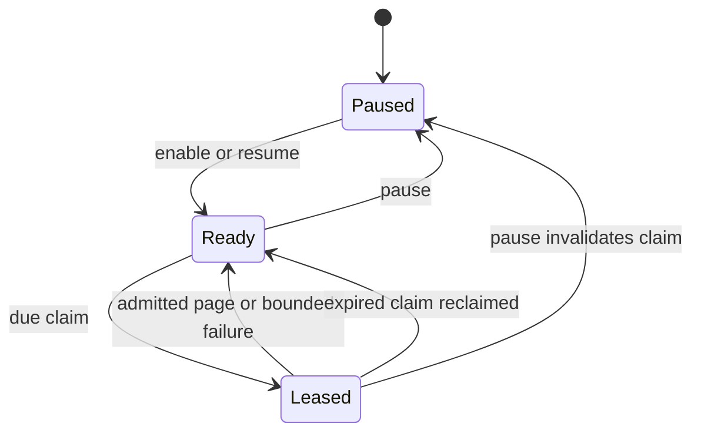

# Continuous Repository Observation

Status: implementation in progress; native and live qualification remain open.

Owner: `ci_economics`. Roadmap: D4/D5/D7.
Companion: [implementation plan](repository-observation-implementation-plan.md).
Base: `c5618a5e7af64265e23f4effa2a90a4eff0d8841`.

## 1. Decision

An administrator can enable or pause durable observation of an installed
repository, select all workflows or specific numeric workflow identities, and
inspect stored progress, evidence and gaps. Ordinary Actions run/job evidence
requires no consumer workflow changes. Optional command CPU reports remain a
separate measurement channel.

Reuse the current source registration, attempt collector, database and runtime
maintenance. Add repository configuration and bounded resumable discovery;
do not add another service, broker, measurement store or generic task engine.

Observation is neither CI activation nor proof of complete history. It cannot
dispatch checks, authorize omission, change planning or weaken FullCI fallback.
This design adds background discovery to the
[source contract](ci-economics-measured-comparisons.md), not a successor source
identity or retention policy.

### User-visible changes

- The economics workspace adds a focused Observation tab: enabled/paused,
  workflow selection, recent scan, backfill progress, capacity and gaps.
  Registered runs remains its initial view.
- Enabling starts server-owned work that survives browser closure and restart.
- Pausing stops new background registrations after its committed boundary;
  previously registered attempts may finish collection and retained evidence
  remains readable. Pausing is not erasure.
- Scan progress, attempt collection and telemetry availability are separate.
  A captured attempt may retain a previous retry reason; the UI labels it
  historical, never the latest collection outcome.
- API clients have the same configuration and inspection capabilities as UI
  users. No configuration is hidden in browser storage.

## 2. Protected Contracts

The existing owners remain authoritative for exact source identity, immutable
run creation time, seven-day source eligibility, ninety-day evidence retention,
one-day tombstones, command authorization and provider admission.

```text
ObservationEnabled -/-> PlanningEnabled
RunCreatedAt + CollectionWindow <= DatabaseNow => RegistrationRejected
NewObservationTime -/-> NewSourceIdentity or NewRetentionLifetime
MissingMeasurement -/-> ZeroCost
ProviderElapsedTime -/-> CpuTime or SavedCompute
```

The population is current run attempts returned by bounded provider discovery
for the selected workflows and creation windows. It is not all historical
attempts, an atomic provider snapshot or a complete webhook stream. In
particular, a new attempt of a run created outside the source window is not
automatically made eligible. A successor population contract is required before
that behavior changes.

## 3. Ownership And Data Flow



`ci_economics` owns pure configuration, selector and scan transitions. `app`
owns authorization and orchestration through capability ports. GitHub adapters
own exact authenticated request/response bindings. Persistence owns locks,
database time, atomicity and compatibility admission. Runtime only composes and
schedules bounded operations. HTTP and UI project these outcomes.

This is one product capability with distinct policy, transaction, provider and
presentation boundaries. File-size signals do not justify a new domain or a
generic abstraction.

## 4. Configuration And Authority

One durable configuration exists per exact installation/repository scope.
It contains a positive revision, enabled flag, selector and initial backfill
duration. A selector is either `all` or a nonempty set of at most 32 unique
positive safe workflow IDs. Names and paths are display metadata, not identity.
Creation uses expected revision zero; changes require the current revision.
An operation ID binds actor, scope and exact normalized command. Same operation
and payload replays the original result; a different payload conflicts.

Initial backfill is zero to six days, defaulting to one day. The one-day margin below source admission
does not guarantee successful collection: late discovery and provider failures
still produce explicit unavailable outcomes. All workflows means all identities
observed by the configured read, not all possible future or deleted workflows.

The UI selector must bind a displayed workflow to its provider-observed numeric
ID, not a hash of its path, order in a YAML report or underscore naming. The
existing workflow-discovery report has paths but no provider IDs; it is not a
complete selector data source. Before the selector is shipped, expose an
authorized bounded provider workflow catalog using the existing GitHub client
and response-binding mechanisms. Retain a configured ID absent from a later
catalog as unavailable metadata, not a proved deletion or an implicit request
to remove it. A catalog lookup cannot change observation or dispatch a workflow.

The catalog reads one provider page per request, at most 100 items, with pages
1-20 and a 20-second application deadline. It uses numeric repository resolution
and the existing workflow-list client, validating request/response API, path,
query, pagination and unique safe IDs. Display metadata has finite text bounds
(name256, path1024, state64 characters), remains inert, and need not be a local
`.github/workflows` path. Provider-built-in workflows remain selectable by ID.
The result distinguishes next page, exhausted traversal and truncated remainder;
no outcome proves an atomic inventory or deletion. An unavailable page is not
an empty catalog. Explicit page navigation is cheaper and easier to bound than
eagerly fetching up to 2000 workflows on every editor opening. Reconsider this
choice only if measured operator needs justify a bounded cache/search design.
The API uses the existing current-audit authorization and shared economics read
bulkhead; it neither persists catalogue snapshots nor changes source retention.
The [provider workflow API](https://docs.github.com/en/rest/actions/workflows#list-repository-workflows)
requires Actions read permission for the installed App.

Every command requires current `configure` authority and exact scope access;
browser commands retain CSRF admission. Reads require current `audit` authority.
Configuration is durable administrator intent, not a cached identity grant.
Session expiry or an administrator leaving the organization does not erase an
already committed configuration. Subsequent commands reauthorize. Background
reads use the App, never a stored browser token, and revalidate provider scope
through the existing installation-membership reader before discovery. An
App-authenticated GET of a public repository alone does not prove membership.
Loss of App access stops useful collection and is visible; it never broadens
the configured scope or deletes evidence.

Enabling or changing the selector starts a new configuration revision and scan
generation. Pausing invalidates all outstanding scan claims. A change to one
repository cannot affect another repository or installation. Existing static
emergency scopes and production omission admission remain unchanged.

Every successful non-replay command increments the revision, including an
identical configuration submitted with a new operation ID. Revision is also
the scan generation. Enabled revisions initialize both lanes; paused revisions
invalidate them without deleting evidence. Operation replay returns its original
snapshot, even after a later command, and cannot restore that old configuration.

Configuration uses the existing paired audit owner on the same UOW connection:
read the exact operation slot, compare its command digest and actor, check the
expected revision, append its audit event, write configuration and initialize
lanes, then commit. A matching replay adds no audit event or state write. Public
success is emitted only after commit; an uncertain commit has no success receipt.

## 5. Bounded Scanning

Use two fixed lanes per enabled repository, not an unbounded task queue:

1. `recent`: periodic creation-window discovery with overlap, so new work is not
   delayed by the initial backfill.
2. `backfill`: oldest-first progress over the admitted initial interval, then a
   periodic bounded rescan of the still-eligible interval to observe late
   visibility and reruns. Rescans do not reset source lifetime.

Each lane holds one finite interval, one active subwindow and a page cursor.
Each newly frozen outer interval also stores an immutable cycle start time;
that time binds gap identity and expiry even if detail was previously evicted.
Claims process one provider page, not the entire repository. Due-time ordering
and `SKIP LOCKED` permit independent repositories to progress; after a claim,
its next eligibility moves forward so one repository cannot monopolize a round.
Recent and backfill lanes alternate when both are due. Cross-replica fairness is
conditional on available workers and finite provider/database operations.

Initial policy bounds: recent polling every five minutes with five-minute
overlap; a full eligible-window rescan every six hours; at most four claims per
maintenance round with two concurrent reads. These are tunable operational
values, not claims about provider latency or sustainable production throughput.
There are at most two scan rows per configured repository, including paused
configurations; the finite deployment configuration limit is 256 repositories.
Creation and updates acquire one transaction-scoped configuration-quota lock
before the per-scope lock. Creation checks the bounded global population under
that lock; two creators observing255 cannot both commit. Pausing does not free
a slot, and updates/replays do not consume a new slot.

The provider adapter retains the existing page size100, ten-page search limit
and strict API-version, scope, route and pagination admission. A separate
discovery projection binds each run source to its numeric workflow ID without
changing the existing source digest. Selected-workflow filtering is applied to
provider-admitted values before registration. Missing workflow identity is a
typed malformed page, not an implicit match or silent exclusion.

Provider windows have inclusive whole-second endpoints, but admitted run times
may contain microseconds. Start with windows no wider than six hours. Adjacent
windows share their boundary: `[a,b]` then `[b,c]`, never `[b+1s,c]`.
Consequently every `t` in `[a,c]` is covered; duplicate boundary sources replay.
When a page declares more than 1000 results and `b-a > 1s`, choose the interior
whole second `m = a + floor((b-a)/2)` and replace the active window by `[a,m]`,
page one, before registering sources. After exhaustion continue from `m` toward
the frozen outer interval end. No pending subwindow stack is required. Each
split strictly reduces span; each completed positive-span window advances it.
An irreducibly saturated window of at most one second becomes an explicit
`provider_truncated` gap. Its cursor may advance only with that gap, not a claim
that all runs were observed. No arbitrary ordering of provider rows is assumed.
Changing totals, duplicates between pages and
temporarily missing runs remain provider non-atomicity limitations; overlap and
rescans reduce misses but do not prove absence of misses.

At enable time let `T = floor(DatabaseNow)` in UTC seconds. Recent discovery
starts at `[T,T]`; initial backfill is `[T-backfill,T]` or absent when zero.
Subsequent recent intervals start at the previous completed endpoint minus the
five-minute overlap, bounded below by `T`, and end at the newly frozen current
second. A completed backfill waits six hours, then freezes the still-eligible
interval. Changing wall time cannot mutate a stored interval under an existing
page cursor; every new interval is clipped to the current source window and an
unrecoverable prior remainder produces a gap. Scan selection alternates lanes
within a scope, then advances that scope's due time for cross-scope fairness.

An empty exhausted page is a successful bounded observation, not an error.
An interrupted scan resumes its stored window/page, never a newly computed
window under an old cursor. A source that ages out before commit is classified
`outside_source_window`; a stale cursor cannot revive it. After a long outage,
the unrecoverable interval is recorded as a gap before scanning the current
eligible interval. Scan attempts and unique source registrations are separate
counters, so re-reading a page does not inflate unique evidence counts.

Cycle preparation is a separate fenced transition, not holder completion. A
still-valid cursor retains its interval, page and cycle start. An aged unfinished
cursor is replaced only without a live lease, atomically recording the lost
interval under the new recovery cycle before acquiring its claim. A recovery
gap describes an unobserved interval, not a count of known missing runs. Its
ninety-day expiry starts at that immutable recovery cycle, so an old outage
does not erase the newly observed warning immediately. Whole-second query
clipping may overfetch the current age boundary by less than one second; source
registration still applies its exact database-time eligibility predicate.
Retain the last completed endpoint separately from an active cursor. A completed
backfill, including initially zero backfill, uses the normal six-hour rescan
schedule. Clock regression never moves a stored cursor or a completed endpoint
backwards; defer preparation until the required stored times are reached.

## 6. Transition And Transaction Model



Let `S` be configuration, `Q` one lane, `C` its claim and `K` trusted database
time read after row locks. A claim binds scope, configuration revision, lane,
generation, row revision, worker identity, unpredictable token, exact window,
page and expiry. Acquisition increments the row revision; holder completion
uses that resulting revision, not the acquisition's predecessor.

```text
Holder(C,S,Q,K) :=
  S.enabled and C.scope = S.scope = Q.scope
  and C.configRevision = S.revision
  and C.lane = Q.lane and Q.configRevision = S.revision
  and C.generation = Q.generation
  and C.expectedRevision = Q.revision
  and C.worker = Q.worker and C.token = Q.token
  and C.interval = Q.interval and C.cycleStartedAt = Q.cycleStartedAt
  and C.window = Q.window and C.page = Q.page
  and Q.acquiredAt <= K < Q.expiresAt

CommitPage := Holder and ExactProviderPage and SelectedSourceSetAdmitted
CommitPage => Atomic(SourceRegistrations, NextScanState, Counters, GapEvidence)
```

All transactions first take the shared storage compatibility fence. Commands
then take the global configuration-quota lock. The common order thereafter is
scope advisory lock, subscription row, lane rows in canonical order, source
quota if needed, and the audit-head lock if needed. Commands and page completion
share the scope/subscription lock, including first creation where no row exists.
Source-only registration never requests an observation lock. Audit appends
never acquire an observation lock after their head lock. Claim selection locks
the subscription before its lane; `SKIP LOCKED` cannot invert that order.
No transaction is held while acquiring credentials or calling GitHub.

Native lock observers refresh their transaction-local statistics snapshot
before each poll. Otherwise a contender connection opened after the first
`pg_stat_activity` query may remain invisible throughout the observer's
transaction, even while holding the intended blocking relation. This follows
the [PostgreSQL statistics snapshot contract](https://www.postgresql.org/docs/18/monitoring-stats.html#MONITORING-STATS-VIEWS).
Refreshing the observer, not extending its timeout or weakening the blocking
predicate, preserves the race proof for both early and late connections.

If pause commits first, `C.configRevision != S.revision`, so page completion
cannot register a source or advance progress. If page completion commits first,
those registrations precede the pause boundary and are allowed. Holder and
reclaim predicates use disjoint time intervals and compete on the same prior
revision, hence at most one successor commits. Every failure/retry transition
uses the same current-claim predicate; failure is not a bypass.

Lease duration is 60 seconds; the complete provider operation, including
credential acquisition, has a 20-second monotonic deadline. Commit uses current
DB time and may reject even a successful provider result. Request cancellation,
commit uncertainty or worker crash publishes no success; recovery replays the
same page through source idempotency. A lost claim cannot retry its writes.
Transient failures retain the cursor and set bounded jittered backoff. Expired
claims are reclaimable without the previous worker. Paused rows are not due.

The application has separate current-admin command/read and autonomous scan
owners. A manual browser discovery service cannot own autonomous scanning:
its caller identity expires, whereas admitted observation intent is durable.
Both owners reuse capability values and store/provider ports. Reconsider this
separation only if their authorization and lifecycle contracts become identical.
Two worker tasks each process at most two claims; no claim waits in a local
semaphore queue while its lease expires. Fresh App membership and discovery
share the20-second deadline. Abort or cancellation prevents later effects;
already committed effects are not rolled back by an observation metric.
Fixed per-item outcomes distinguish recorded pages, provider/access failures,
deadline, lost claim, capacity, storage failure and unexpected failure. They
carry no scope, actor, URL, credential or exception message labels. A page
recorded is not proof of complete history or a captured attempt snapshot.
Discovery maintenance has a 55-second overall deadline; the two sequential
provider operations per worker consume at most 40 seconds of that budget.
Database work may consume the remainder and force cancellation; this is an
upper-bound policy, not a promise that all four claims finish. Gap cleanup is
independently bounded to 10 seconds and at most four scopes. Initial startup
still runs authoritative reconciliation alone. Later observation failure cannot
prevent other already-scheduled maintenance or change planning outcomes.

Source registration can wait for its separate quota lock. Therefore the final
scan CAS, including acquisition, checks a single fresh database clock value
against the half-open lease interval after that work. PostgreSQL range
containment uses one `clock_timestamp()` evaluation; two independent clock
calls cannot jointly admit a clock jump across both boundaries. Losing that
guard rolls back the whole transaction before returning `claim_lost`, including
any new sources, counters or gaps. It cannot return a successful partial page.
Transient and capacity retries wait a uniformly jittered 60 to 120 seconds;
successful page continuation remains immediately due. This finite initial
policy adds no mutable exponential-attempt state; revisit it if measured
provider load exceeds the admitted operational budget.

## 7. Capacity, Retention And Cost

The existing1000 retained-provider-source cap is not silently adequate for
continuous use. With arrival rate `lambda`, retained lifetime `R` and capacity
`Q`, sustained `lambda * R > Q` eventually saturates storage even if scanning
is fast. This design proposes a finite10000-source default per repository,
subject to native query/cleanup evidence before acceptance. It does not alter
the ninety-day evidence or tombstone contract. No unlimited mode is admitted.

Register a page as one bounded batch: one quota lock, one bounded population
query, one exact existing-source lookup and bounded inserts. The public
single-source path delegates to the same admission with batch size one.
Do not perform a REST resolution or full population count for every row after
the internal page has already established the required source provenance.
Public client-supplied registration still requires exact provider resolution.

Quota counts retained provider sources, including tombstones. Preserve the
public admission precedence for each source: outside the source window first,
then exact replay or provenance conflict, then quota, then new registration.
Thus an aged-out replay is still `outside_source_window`, even at full quota.
Replays do not consume new slots; contradictory provenance cannot evade identity uniqueness.
Batch outcomes retain input positions. Admission order is numeric run ID,
attempt, head SHA, creation time, API version and evidence digest, in that order;
identical entries use stable input order. The first admissible identity occupies
the slot and later identical entries replay; different provenance conflicts.
If a page exceeds remaining capacity, admit existing exact replays and only
the deterministically ordered new sources fitting the remaining slots. Persist
`capacity_reached` and the unchanged page cursor atomically. Later retries may
fill the remaining page after normal expiry; they may not silently skip it.
Expose occupied slots and limit, without claiming job-byte capacity from a
source count. Maximum jobs, bytes and collector concurrency remain separately
bounded by the existing profile.

The batch returns a per-source outcome partition, not a single success boolean.
Any capacity rejection of an eligible new source retains the page. Conflicting
or aged-out sources produce explicitly scoped gaps and do not retry forever.
When all quota-blocked sources eventually age out, record that loss and resume
pagination. Mixed outcomes, committed inserts and the cursor are one transaction;
an invalid page or stale claim admits no partial source writes.

Gap records are bounded to 256 retained rows per repository. Each row binds exact
scope, configuration revision and selector digest, lane, cycle start, interval
and reason. A gap interval is ordered and observed but is not restricted to the
seven-day provider query window: an outage may have lasted longer.
Expiry is the immutable cycle start plus ninety days, not retry or
insertion time. Identical gap replay, including after detail eviction, changes
neither time; different provenance is never coalesced. Prefer
this small exact ledger over an interval-union algorithm with ambiguous owners.
On overflow evict the oldest detail and atomically set the scope-level
`detailTruncatedUntil = max(prior, evicted.expiry)`. Until that time the UI must
show `gap_detail_truncated`, even with an empty page or a changed configuration.
This watermark has no claimed interval, selector or per-reason population; it
records a detail eviction, so retained-detail completeness is not claimed even
if a later replay happens to reinsert the removed row. Each removed row contributes
its original expiry, so retries do not extend its contribution. Purging elapsed
rows does not set truncation. A full ninety-day detail guarantee is not claimed.
The read API returns at most 50 rows with a scope/revision-bound keyset cursor.
Its canonical representation is `installation.repository.revision.gapId`, using
safe positive decimal IDs without leading zeros and a lowercase SHA-256 gap ID.
The revision is the current subscription revision, not the historical gap's
revision. Under the scope lock, continuation requires matching scope and current
revision plus an existing, unexpired anchor. A removed, expired, foreign or stale
anchor returns `invalid_request`; the operator can restart from the first page.
Historical gaps remain readable after reconfiguration using a newly issued
cursor. This bounded read position is not a credential or a frozen snapshot:
concurrent insertion before the anchor requires a fresh scan. No signing key,
cursor table or generic pagination layer is justified for this read-only query.
Application metrics use a closed reason set, never repository IDs as labels.
Do not store raw provider payloads, credentials, logs or artifacts for scanning.

A finite logical limit is not a production capacity receipt. Query work,
lock duration, memory, provider rate budget and retention throughput must be
measured at the admitted limits. If those gates fail, revise the capacity or
batch algorithm; do not raise test budgets to conceal an unsuitable design.

The native capacity witness must include the10000-source population lookup and
child-bearing retention batches, not only empty parent rows. Exercise the
existing maximum100 expirations with the admitted2000 jobs per expired attempt,
snapshot/report/signal relationships and populated tombstones. Record statements,
query plans, cleanup duration and surviving relations. The fixture is bounded
native cost evidence; it is not the full256-repository production population.
Capture the exact population and expiry queries from a rolled-back operation,
then explain them on the populated fixture before the measured committed run.
The population fixture also includes a distinct larger repository population;
assert scope cardinality and record buffer/filter work without requiring a
particular planner node or index name. Acquisition, registration and commit use
the existing observation lease budget; cleanup uses the existing expiry budget.
Assert connections return to the pool. These are finite fixture gates, not p95,
p99, cold-cache, full-fleet or production capacity receipts.

Keep population preparation distinct from the measured cleanup. Replaying the
complete ingestion of 200000 jobs took 711.50 seconds in the native witness,
while committed cleanup took 0.72 seconds. Use real single-job capture for each
parent, then a bounded private fixture expansion preserving all 200000 canonical
child rows and their complete snapshot digests. This is not ingestion-throughput
evidence. The fixed prototype contains only ASCII strings, JSON-safe integers,
nulls, lists and objects; sorted compact standard-library JSON is equivalent to
the canonical encoding on that closed domain. Check first/middle/last generated
rows against the production codec for every parent, and decode one entire
expanded snapshot through the independent production reader before expiry.
New field types or a failed equivalence check invalidate this shortcut.

Only the privileged fixture may adjust immutable header count/digest, with
normal trigger mode restored before bulk child insertion. The measured runtime
path retains ordinary CHECK/FK/trigger enforcement. Bound and report preparation
separately at180 seconds; preserve the full population, cleanup deadline,
transaction boundary and surviving live evidence. Reducing cardinality,
disabling coverage or raising the cleanup deadline would weaken the obligation;
another production serializer or isolated shard would not remove setup work.

## 8. API And Operator Experience

Add observation configuration/status and bounded gap endpoints under the
existing `/api/v2/economics` namespace. Reuse strict Pydantic boundary admission,
duplicate-key rejection, bounded bodies/deadlines, no-store responses, current
role admission and same-origin mutation protection. Unknown or extra fields,
invalid selector shapes, unsafe IDs and revision conflicts remain typed.

The Observation tab is a focused workspace, not another long combined page.
Retain the current Registered runs default and add Observation as a separate
tab. A narrow status reader retains last valid same-scope data on refresh
failure, pauses automatic refresh when hidden and never overlaps requests.
Successful enabled-state reads schedule another status read after15 seconds;
authorization or read failures require an explicit retry. Other economics
readers keep their existing behavior. Background status updates do not remount
the editor or replace an unsaved draft. A newer configuration revision is
visible and requires explicit reload or server conflict handling. An uncertain
write locks its exact command and operation ID for an explicit identical retry;
no new mutation is generated automatically after a refresh or session change.
Use an enabled toggle, native workflow selection controls and a save command
with an explicit pending/conflict/unknown-result state. Show desired state,
effective scan state, last successful read, current interval, registered count,
capacity, retry reason and gaps separately. A disabled provider control explains
its missing capability; administrator identity does not invent provider rights.

Progress derives only from durable counters and processed interval boundaries.
Unknown provider totals use indeterminate animation; reduced-motion preference
removes motion. Basic motion denotes an enabled scan with a lease valid at the
server's `observedAt`; an expired recorded lease is awaiting recovery, not active
scanning. Keep that observation timestamp visible. Rich history-import animation
remains a separate roadmap enhancement. Never present a fabricated percentage, ETA or completeness
claim. Existing Registered runs, Discover runs, Reports, Budgets and Signals
remain separate task views. Evidence survives refresh and a second browser.
Failed reads cannot replace prior evidence with zero or hide stale status.

Workflow selection refers to provider workflow IDs that own run executions, not
every YAML file discovered in the repository. Pipeline presentation is a D7
projection of the existing same-revision call graph: standalone event entrypoints
first, reusable calls expandable inside them, and a separate complete component
inventory. A leading underscore is never a classification rule. A workflow with
both standalone triggers and `workflow_call` has both roles; a shared callee has
multiple callers, not one invented parent. Unresolved/cyclic/remote calls remain
visible uncertainty. A missing graph or workflow metadata must not hide a run or
block all-workflow observation. Neither workflow definitions nor graph edges are
execution-cost rows: totals deduplicate by existing attempt/job identities and
must not sum a parent aggregate with its already included child jobs. The richer
graph navigator is separate D7 delivery; this batch keeps these identity and
measurement boundaries without claiming that navigator implemented.

Authentication return-to-view is a separately owned D7 repair. Its failure must
not lose a committed subscription; unsubmitted form state must not be silently
replayed as an authorized mutation after login.

## 9. Alternatives And Revision Conditions

| Candidate                         | Decision and counterexample                                                                                         |
|-----------------------------------|---------------------------------------------------------------------------------------------------------------------|
| Existing manual registration only | Retains safety but cannot satisfy server-owned continuous observation.                                              |
| Browser timer                     | Closing the page stops work; client state is not durable configuration or restart recovery.                         |
| Stateless scan of all history     | Repeats provider cost and cannot express durable pause fences, gaps or backfill progress.                           |
| One global queue/broker           | Adds a failure/operations boundary without a demonstrated need beyond bounded PostgreSQL claims.                    |
| Webhooks only                     | Missing delivery, permission changes and prior history remain unobserved; no completeness proof.                    |
| Creation cursor only              | Late visibility and reruns can be missed; bounded overlap/rescans are required with explicit limits.                |
| Generic shared lease framework    | Existing collection and discovery have different identities, guards and progress; similarity alone is insufficient. |

The preference is conditional on the stated single-service/PostgreSQL topology,
bounded repository population and first-release horizon. Objectives are less
provider/DB work, recoverable operation and lower maintenance complexity without
trading away hard correctness or trust constraints. No globally optimal claim
is made. Reconsider polling periods and capacity after measured pilot arrival
rates; reconsider the source population when all rerun attempts are required;
reconsider a queue only after measured database scheduling limits. An observed
post-pause registration, hidden gap or cross-scope source directly falsifies the
chosen safety contract rather than merely triggering a style review.

## 10. Evidence And Non-Claims

Full historical import, explicit rescan and provider-side deletion/availability
presentation are separately planned as `D4-H1` in [ROADMAP](../../ROADMAP.md#d4-h1-historical-import-and-source-availability).
This bounded observation feature does not claim those journeys or silently
change source eligibility and retention to approximate them.

### Storage evolution

Use one additive forward revision for observation-owned tables and its new
capability. Existing source, snapshot, report and budget bytes do not change.
The current economics capability remains admitted: old collectors cannot mutate
observation tables and their stricter source cap cannot exceed the new cap.
An old collector's reduced registration availability is not a reason to invent
an authority-transfer migration. New observation writers require the new exact
capability and ACL attestation. If implementation reveals shared write semantics
that old writers could violate, stop and design the required retirement fence.

Preserving a capability does not imply that an older binary accepts an expanded
runtime role. Its exact ACL attestation may reject observation grants. Retain
the old restricted role for predecessor compatibility witnesses; the shared-role
deployment must drain old workers, migrate, apply the new exact grants and then
start the new image. Do not claim zero-downtime coexistence from additive DDL.
The observation UOW requires `ci-repository-observation/v1` in addition to the
existing economics set; ordinary collection UOWs keep their existing set.

The transaction adapter returns a positive mutation outcome only after commit
and connection finalization. A lease expiring during page writes requires an
explicit successful rollback before projecting `claim_lost`; failed rollback,
uncertain commit or failed cleanup is storage unavailability, not success.

Prove empty install, populated upgrade, atomic rollback on migration failure,
unchanged old data and allowed predecessor operations. Deny a new observation
writer before migration or after each relevant constraint/grant is tampered.
The migration does not enable observation; rollout remains a separate operation.

The companion plan binds each state, authority, resource and presentation
predicate to a native falsifier. One independent frozen design review precedes
code; the repository reviewer policy owns model selection. Tests run through
the repository's GitHub routes, not locally. Static admission is not execution.

GitHub's [repository run API](https://docs.github.com/en/rest/actions/workflow-runs#list-workflow-runs-for-a-repository)
documents installation-token Actions-read access, creation filters, page bounds
and the1000-result search cap. Its
[workflow API](https://docs.github.com/en/rest/actions/workflows#list-repository-workflows)
provides workflow identity metadata. Documentation does not prove a complete
live inventory, provider consistency or rate-budget sufficiency.

No claims are made here about implementation completion, native tests passing,
CPU savings, billing, statistical regression, complete run history, production
capacity, deployment or selective CI safety. Those require their own evidence.
