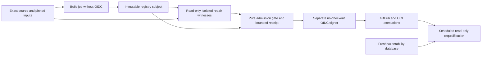

# Runtime Base Qualification

> Public-export boundary: historical source, PR, run, provider and rollout
> observations retained below are design context only, not acceptance evidence
> for `research-engineering/ci-coordinator`. Former private receipts are revoked.
> Synthetic pilot archetypes are proposed examples, not renamed executions.
> Requalify applicable requirements and open tasks against the new exact source.

Status: current design and bounded implementation plan.
Owner: runtime packaging and release admission.
Date: 2026-09-21.

## Outcome And Protected Behavior

Build the smallest justified runtime closure without sacrificing supported
behavior, security evidence or measured performance. Size is a result, not a
60 MB acceptance threshold. This change does not alter planning, authorization,
persistence, CI omission or the supported Python 3.13.15 application contract.

The selected construction is a scratch filesystem with Ubuntu 26.04 system
libraries and the optimized official CPython 3.13.15 interpreter. It is not a
full Ubuntu installation and not an unchanged vendor image. The Dockerfile
owns immutable base digests; the signed Ubuntu snapshot owns package resolution.

## Why This Construction

| Alternative | Evidence and disposition |
| --- | --- |
| Existing Debian runtime | Simple and maintained, but the checked updates retained independent glibc, ncurses and zlib High matches. Retain as the same-source performance comparator, not as an admitted release. |
| Alpine 3.24.2 / musl | Complete application: 131,911,160 bytes unpacked, 41,044,666-byte gzip Docker archive. Native measurements found substantial inherited CPU regressions, not just repair overhead. |
| Alpine with mimalloc | Improved CPU cost, but remained slower on measured paths and raised peak RSS about 50%. Adds an allocator lifecycle without satisfying the measured tradeoff. |
| Docker Hardened Images | Requires registry credentials; does not meet the requested anonymous acquisition path. |
| Google Distroless | Public acquisition works, but the screened candidate retained independent High findings and did not preserve the exact supported interpreter without additional construction. |
| Private optimized CPython build | More compiler, performance and security maintenance than reusing the official PGO/LTO interpreter. Not justified by current evidence. |
| Minimal Ubuntu/glibc | Slightly larger than Alpine, but preserves optimized interpreter performance and removes the observed independent High system-package blockers. Selected subject to exact-image qualification. |

Do not infer universal superiority, zero CVEs, production capacity or smaller
size from the distribution name. Revisit if a maintained vendor image satisfies
the same support, runtime, performance and admission predicates at lower cost.

## Construction And Layers

1. Bootstrap HTTPS using the certificate bundle from the pinned Python image.
   Resolve runtime and builder packages from snapshot
   `20260921T000000Z`; require signed APT metadata, explicit CAInfo, finite
   retries/timeouts and fatal index-update errors. Never disable TLS or signatures.
2. Copy the official optimized interpreter, not Debian system libraries.
   Compile the narrowly patched zlib for the Ubuntu ABI. Use truthful local
   Debian package metadata; do not impersonate a Canonical package or signature.
3. Use the snapshot's existing `lddtree` to copy ELF dependencies, including
   libgcc, then verify every ELF through the actual glibc loader in a chroot.
   Retain CA certificates, timezone data, C.UTF-8 locale and fixed NSS policy.
4. Verify copied system-library bytes against their package-owned originals.
   Retain package/version and license inventory. Remove package managers,
   shells, compiler, Node, pip, development dependencies and build caches.
5. Keep three content layers: runtime, frozen third-party Python dependencies,
   application/UI/build identity. Application-only changes must preserve both
   lower-layer digests; measure the rebuild rather than assuming cache benefit.
6. Keep UID/GID 10001, read-only root compatibility, runtime assets and Alembic
   migrations. Existing smoke remains required; a successful image build is
   not runtime qualification.

The package archive timestamp is the upstream repair commit's epoch, not build
wall time. This removes a known nondeterministic input; it does not prove
cross-builder byte-identical OCI images.

## Security Repairs And Admission

Seven Python advisory repairs and one zlib repair are disclosed in
[the upstream input manifest](../../docker/runtime/security/stdlib-backports.json)
and [the installed repair manifest builder](../../docker/runtime/security/manifest.py).
Original component versions remain visible to scanners. Pure-Python repairs
require original-module and patch hashes, zero-fuzz application, exact resulting
module hashes and checked-hash bytecode. The zlib package requires the source
archive hash, upstream diff, equal baseline/repaired compilation settings and
the actual installed library hash.

Causal witnesses must establish the expected defect before the repair, the
intended behavior after it, and the same behavior through the final image.
Positive controls protect valid tar paths, Unicode preparation, file URI
handling, POP3 bounds and whole ZIP content. ZIP legacy decompressor witnesses
also distinguish input-drain and terminal behavior. The zlib witness injects
EAGAIN only on its own descriptor and checks stale input reset; this is bounded
branch evidence, not a proof about every hypothetical zlib defect.

The user explicitly authorized exact, expiring repaired-match admission.
The [repair policy](../../docker/runtime/security/repaired-matches.v1.json)
pins construction inputs, installed interpreter/module/bytecode/library/manifest
bytes and exact scanner occurrences. The existing
[release policy](../specs/ci-coordinator-release/vulnerability-gate-policy.v1.json)
now uses schema v2 at its stable owner path.

```text
AdmitRelease(subject, source, time) =>
  ExactRegistryIndexAndPlatformChild
  AND FreshPinnedScannerDatabase
  AND NoCallerSuppressions
  AND NoUnknownSeverity
  AND ExactCurrentRepairEvidence
  AND ForEveryDisallowedMatch(ExactProvedRepair)
```

A repaired occurrence is the conjunction of advisory, severity, package,
version, package type, PURL, locations, evidence roles and runtime layer.
A known CVE at another location is not admitted. A changed severity is not
silently normalized. Raw Grype matches and exit status remain observable.
Every unknown or unproved High/Critical occurrence still rejects admission.

The fixed policy window is at most 14 days. Expiry is exclusive and does not
renew when scanned. Source or installed-byte drift requires a reviewed policy
change and fresh qualification. Remove backports when maintained vendor
releases pass equivalent witnesses; never renew solely to unblock CI.

## Trust And Effect Boundaries



The host collector pulls the exact registry index, binds config/platform/source,
copies only named regular files through a bounded tar reader, and executes
network-none, read-only, UID10001, resource-limited witnesses. It cleans only its
UUID-labelled containers, including unknown create-result paths. Source hash
expectations alone are not observations of installed bytes.

The signer never checks out or executes the image. It checks the admitted
repair artifact hash, then signs a dedicated runtime-repairs/v1 predicate with
the same subject as provenance and SBOM using the already pinned actions/attest.

Scheduled requalification never executes the released image. It verifies the
exact repository, source, signer workflow, hosted certificate, release run and
attempt in both stores, requires one identical canonical repair payload, and
reapplies the current unexpired policy with a fresh Grype database.
Local qualification evidence is explicitly `sourceKind: local` and cannot
pass registry release admission. A signature does not repair missing witnesses.

The scheduled aggregate retains raw process outcomes. Grype exit 2 is admitted
only for exactly one scan command whose subject, options and stdout hash bind
to the accepted vulnerability receipt. Database update/status and every other
command still require exit 0; a repaired-match decision is not a generic
nonzero-exit waiver.

## Writer Readiness And Implementation Order

| Owner | Intended delta | Protected observations | Independent falsifier |
| --- | --- | --- | --- |
| Runtime assembly | Minimal glibc closure and stable layers | Interpreter, dependency lock, ABI, UI, migrations, UID | Native read-only/TLS/rollback/shutdown and loader checks |
| Repair inputs | Eight disclosed upstream repairs | Valid behavior and truthful original versions | Before/after/final causal witnesses and byte hashes |
| Release admission | Exact expiring repaired occurrences | Raw matches, severity, database, registry identity | Independently mutated subject, source, bytes, CVE, location, layer, time and witness |
| Signing and schedule | Signed immutable proof reuse | No image execution in signer or schedule | Wrong run/attempt/source/predicate and disagreeing store payloads |
| Tooling projections | Current source discovery and proof routes | Existing mandatory checks | Static generation/readback plus native focused and full checks |

Implementation sequence:

1. Freeze exact construction and component repair inputs.
2. Qualify complete runtime, repair witnesses, size, same-source performance and
   application-only layer reuse on repository-native GitHub runners.
3. Freeze expected installed bytes from that evidence; independently observe
   them again through the release collector.
4. Integrate strict admission, isolated signing and scheduled proof reuse.
5. Execute negative tests and focused native qualification; review the frozen
   complete change with the current repository reviewer policy.
6. Refresh generated ownership/proof bindings; obtain required exact-head CI,
   open the PR, and preserve unresolved release/deployment obligations.
7. Only after merge, Full Check and successful release may a separate authorized
   deployment and own-CI pilot proceed.

## Observed Evidence And Limits

Former private runtime qualification receipts are removed. Requalify runtime
smoke, TLS/hostname rejection, rollback, migrations, SIGTERM, before/after/final
repair witnesses, layer reuse and unchanged scanner admission at the exact
public source. No prior successful subtest qualifies this exported release.

The complete candidate measured 141,565,560 unpacked bytes and 44,422,268 bytes
as a gzip Docker archive. This is not registry transfer size. Performance
evidence consists of five alternating same-source samples, not service load,
tail latency, production capacity or a universal no-regression claim.

Full release publication, custom attestation retrieval, deployed behavior,
all possible embedded library occurrences, complete exploit coverage and global
absence of vulnerabilities remain separate obligations. Passing a bounded
counterexample does not imply global perfection.

## Primary References

- [Canonical APT snapshot support](https://snapshot.ubuntu.com/)
- [Official Python image construction](https://github.com/docker-library/python)
- [zlib upstream repair](https://github.com/madler/zlib/commit/df84af25dc1942490e1d1c899a07619152a46148)
- [GitHub custom attestations](https://github.com/actions/attest)
- [Grype scanner](https://github.com/anchore/grype)
