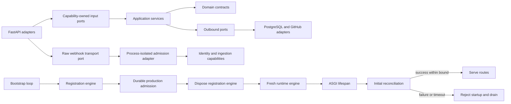

# Runtime Reliability and Architecture Hardening

Status: implemented successor

Last updated: 2026-08-22

Supersedes the active contract of
[Runtime and HTTP Contract Hardening](runtime-http-contract-hardening.md) while
retaining that predecessor unchanged as historical design evidence.

Owner requirements: `REQ-CI-CORE-002`, `REQ-CI-CORE-007`,
`REQ-CI-CORE-016`, `REQ-CI-RUNTIME-001`, `REQ-CI-RUNTIME-004`,
`REQ-CI-RUNTIME-008`, `REQ-CI-RUNTIME-017`, `REQ-CI-RUNTIME-021`

## 1. Decision

Preserve the predecessor's four authority corrections and extend the connected
runtime at four additional boundaries:

1. ASGI startup succeeds only after the initial reconciliation round succeeds
   within its configured bound.
2. Production-admission registration and the serving runtime use distinct
   PostgreSQL engines. The registration engine is created, used, and disposed
   inside one temporary event loop before any provider client is allocated.
3. Browser-session expiry is the minimum of the absolute provider-token expiry
   and the durable database-time session bound.
4. HTTP adapters depend on capability-owned behavioral ports, retain only
   transport-specific policy, and map unexpected defects to one redacted
   `500` response. The sole additional webhook ingress port carries only raw
   transport identity into a process-isolated adapter. Typed unavailable
   outcomes remain `503`.
5. Request admission, webhook CPU work, provider calls, unit-of-work cleanup,
   and process shutdown have finite owner deadlines or immediate no-queue
   rejection.
6. Webhook replay identity binds authenticated body bytes independently from
   unsigned delivery metadata, and audit replay uses a frozen, page-bounded,
   two-pass stream.
7. Reconciliation retries only typed temporary failures and applies
   subject-stable equal jitter to every nonterminal deferral.
8. Config rollback, capability ports, and domain admission each retain one
   semantic owner; application aliases and policy-free pass-through wrappers
   are retired.

The correction also gives shutdown one owner and one total deadline. It samples
background health after asynchronous readiness probes, makes disabled-mode
route ownership exact, and makes database-readiness injection explicit. It
separates workbench ports from their implementation, aligns the ownership
profile with actual environment and GitHub transport owners, and strengthens
the HTTP import boundary against direct service implementation imports.

## 2. Finding Adjudication

| Finding                                                                                        | Verdict                                                | Reason                                                                                                                                                                                                                                                                     |
|------------------------------------------------------------------------------------------------|--------------------------------------------------------|----------------------------------------------------------------------------------------------------------------------------------------------------------------------------------------------------------------------------------------------------------------------------|
| Initial reconciliation failure or timeout still permits ASGI startup                           | confirmed P1                                           | `Runnable` requires successful bounded convergence; readiness after serving is not a substitute for startup admission.                                                                                                                                                     |
| One pooled `AsyncEngine` crosses `asyncio.run` and Uvicorn loops                               | confirmed P1                                           | SQLAlchemy pooled async connections are loop-affine unless the engine is disposed before reuse.                                                                                                                                                                            |
| Move all engine and provider construction into lifespan                                        | rejected                                               | This would violate the stronger rule that enforcing authority is registered before any provider client allocation unless the entire composition model were deferred.                                                                                                       |
| Browser session can outlive provider token                                                     | confirmed P1                                           | A relative duration sampled before the durable clock read can be added to a later time and exceed the absolute token expiry.                                                                                                                                               |
| Add a new atomic store API to cap expiry                                                       | rejected as unnecessary                                | The existing guarded insert is atomic at database statement time; an absolute expiry computed before insertion closes the defect without widening the port.                                                                                                                |
| HTTP module owns application input ports                                                       | confirmed P2                                           | Input-port signatures change with capability behavior, not FastAPI transport behavior.                                                                                                                                                                                     |
| Browser routes require exact `BrowserIdentityService`                                          | confirmed P2                                           | Exact implementation identity does not prove behavioral substitutability and rejects valid structural adapters.                                                                                                                                                            |
| `app.py` is wholly invalid because it registers all routers                                    | rejected in part                                       | Central route registration is a valid composition-root responsibility. Capability-specific error and body-limit policy in that file is not.                                                                                                                                |
| Unexpected defects are reported as dependency unavailability                                   | confirmed P2                                           | `503` asserts a known temporary dependency condition; an unclassified defect proves no such condition and must remain a redacted `500`.                                                                                                                                    |
| An unknown dynamic-plan outcome is reported as dependency unavailability                       | confirmed P2 during independent review                 | The closed result algebra admits only `Issued`, `IssuanceConflict`, and `IssuanceRejected`; an unclassified value proves a broken internal contract, not temporary unavailability.                                                                                         |
| Operator UI OpenAPI duplicates router composition                                              | confirmed P2 during implementation falsification       | A second composition path omitted the generic `500` algebra and allowed the generated client contract to diverge from the serving app.                                                                                                                                     |
| Browser callback catches only service-call defects                                             | confirmed P2 during implementation falsification       | Admission or unsupported-outcome defects outside the narrow catch violate the callback-specific `500` schema and leave the one-time transaction cookie uncleared.                                                                                                          |
| Plan and repository authentication contain redundant broad catches                             | confirmed P2                                           | Provider adapters already own conversion of declared transport failures; a second broad catch hides contract defects. The OAuth callback remains the explicit exception because every outcome must clear its one-time cookie.                                              |
| `RuntimeReadiness` accepts unused engine and path arguments                                    | confirmed P3                                           | The constructor has two competing composition modes while connected composition already owns the exact probe.                                                                                                                                                              |
| Workbench ports live in the service implementation module                                      | confirmed P3                                           | Adapters import an implementation module to implement its boundary, reversing the intended dependency vocabulary.                                                                                                                                                          |
| HTTP import enforcement is weaker than the documented boundary                                 | confirmed P2, bounded                                  | A mechanical rule can forbid direct service implementation imports. It cannot prove semantic orchestration ownership by itself.                                                                                                                                            |
| A mixed facade module object can expose a forbidden HTTP-to-service implementation             | confirmed P2 during independent review                 | HTTP needs exact ports and data symbols, not a module object that co-exposes implementations. Rejecting that module-object capability closes the bypass without interpreting runtime control flow.                                                                         |
| Ownership profile omits the actual environment and JWKS owners                                 | confirmed P3                                           | The declared path sets do not cover `runtime/environment.py` or `integrations/oidc_jwks.py`.                                                                                                                                                                               |
| OAuth transaction lifetime is duplicated in service and router                                 | confirmed P2                                           | Equal literals are not a shared authority and can drift independently.                                                                                                                                                                                                     |
| Shutdown has no total owner deadline                                                           | confirmed P1                                           | Per-component or per-caller waits do not bound the complete drain-and-close transition and can make process termination indefinite.                                                                                                                                        |
| Concurrent shutdown callers can race over finalizer cancellation                               | confirmed P1 during implementation falsification       | A caller-owned timeout can cancel shared work and make another caller misclassify finalizer cancellation as its own cancellation. The deadline must belong to the shared finalizer.                                                                                        |
| Stop during the first round can publish a successful initial outcome                           | confirmed P1 during adversarial review                 | An abort-aware round may return normally after stop; publication must linearize against the stop signal before success is admitted.                                                                                                                                        |
| Close during `STARTING` can be overwritten by `ACTIVE`                                         | confirmed P2 during adversarial review                 | An awaited background start can resume after concurrent cleanup; `STARTING -> ACTIVE` must be conditional on the state still being `STARTING`.                                                                                                                             |
| Reconciliation drain and total cleanup use the same timeout                                    | confirmed P2 during adversarial review                 | The outer deadline starts first, so the inner retryable timeout cannot reliably win. A strict sub-budget restores the retry partition.                                                                                                                                     |
| Owner deadline can precede cleanup-child settlement                                            | confirmed P2 during adversarial review                 | Cancellation is cooperative; an explicit cleanup-pending state and post-deadline close fence are required for an honest lifecycle projection.                                                                                                                              |
| Readiness samples background state before blocking probes                                      | confirmed P2                                           | A round can fail while a database probe is pending, allowing a stale healthy sample to produce a green result after the failure.                                                                                                                                           |
| Disabled mode publishes the operator UI                                                        | confirmed P2                                           | The runtime contract gives disabled mode only operability routes; a static shell is still a reachable route and therefore exceeds that surface.                                                                                                                            |
| Cleanup retains provider failures in the exception graph                                       | confirmed P2                                           | Redacted wrapper text is insufficient when the traceback cause or context retains provider diagnostics.                                                                                                                                                                    |
| Import-time webhook policy loads connected evidence in disabled mode                           | confirmed P2 during implementation falsification       | Capability-owned policy may be loaded only when that capability is selected; module import must not broaden disabled-mode dependencies.                                                                                                                                    |
| New Python contexts can exist without a contextual import rule                                 | confirmed P2                                           | A denylist can pass a newly added context unless rule coverage itself is closed-world and enforced.                                                                                                                                                                        |
| Locked dependency graphs contain known security advisories                                     | confirmed P1 during CI closeout                        | The Python graph admitted an advisory-affected `cryptography 49.0.0`, while repository overrides retained advisory-affected `js-yaml 4.3.0` and `brace-expansion 5.0.8`. Upstream fixed releases exist, so accepting the affected graph has no compensating necessity.     |
| A body lane is released while downstream still retains the replayed body                       | confirmed P1 during frozen closeout review             | If `b_i` bodies leave the lane but remain reachable downstream, another request can buffer a `(b_i + 1)`th body. The claimed `b_i * m_i` retained-memory bound is therefore false unless the lane remains held through downstream completion.                              |
| A downstream `TimeoutError` is reported as the middleware deadline                             | confirmed P2 during frozen closeout review             | Exception type does not identify the expiring timeout scope. Only the middleware's own `deadline.expired()` proves its typed timeout response; every other timeout is an unexpected defect.                                                                                |
| Unknown config outcomes fall through to typed unavailability                                   | confirmed P2 during frozen closeout review             | Runtime values can escape static `Literal` checking. Closed outcome models must reject unknown states, and HTTP must still fail closed if a nonconforming adapter bypasses construction.                                                                                   |
| A path-sensitive alias gate can soundly approximate the supported Python runtime               | rejected during frozen closeout review                 | Counterexamples across imports, exception handlers, `finally`, annotations, defaults, mappings, loops, context managers, and short-circuit expressions disprove the claim. A flow-insensitive syntactic policy with exact imports is both sufficient and strictly smaller. |
| Webhook idempotency contract violation emits a route-specific `500` body                       | confirmed P2 during frozen closeout review             | OpenAPI declares the generic `ErrorBody`; an internal adapter-contract defect must therefore reach the generic redacted `500` owner rather than emit a second undocumented schema.                                                                                         |
| An unknown OIDC rejection reason becomes typed authentication unavailability                   | confirmed P2 during control review                     | An open string emitted outside the admitted rejection sets proves an internal contract defect, not dependency outage or retry safety.                                                                                                                                      |
| Uvicorn retains query-bearing access logs, ambient proxy trust, and no process admission limit | confirmed P2                                           | OAuth query material must not reach generic access logs; forwarding trust and process concurrency require explicit owners.                                                                                                                                                 |
| Body admission is path-only and semaphore waiters are unbounded                                | confirmed P2                                           | A finite permit count bounds active bodies but not queued request objects. Exact method membership and immediate no-queue rejection close the admitted state space.                                                                                                        |
| Static operator bearer has no in-band expiry or revocation                                     | rejected as a runtime defect; confirmed operations gap | It is a deployment bootstrap credential. Rotation and emergency revocation belong to the deployment secret and ingress owners and require an explicit all-replica runbook.                                                                                                 |
| Public OAuth start and callback have no local abuse bound                                      | confirmed P2                                           | Edge-wide rate policy remains external, but each process must bound its own admitted contribution without creating another wait queue.                                                                                                                                     |
| Webhook trust, hashing, and bounded JSON normalization run synchronously on the event loop     | confirmed P2                                           | The body maximum bounds work size, not event-loop latency. CPU admission requires a cancellable no-queue worker capability.                                                                                                                                                |
| Webhook encoding and media type are not admitted                                               | confirmed P2                                           | Signature validity does not prove that transport representation is the exact identity JSON representation consumed by the service.                                                                                                                                         |
| Unsigned delivery metadata alone selects durable idempotency                                   | confirmed P2                                           | HMAC authenticates the body, not `X-GitHub-Delivery` or `X-GitHub-Event`; durable replay identity must include signed body identity and event-family consistency.                                                                                                          |
| Unit-of-work cleanup and credential refresh can wait outside their owner deadlines             | confirmed P2                                           | A deadline that excludes prerequisite or finalization work is not a bound on the operation it claims to govern.                                                                                                                                                            |
| Uvicorn drain and resource cleanup can each consume the full shutdown bound                    | confirmed P2                                           | Sequential full-size component deadlines violate the single total process budget. Static sub-budget partitioning is necessary.                                                                                                                                             |
| Generic outer `500` can lose the correlation response header                                   | confirmed P2                                           | Correlation must enclose the unexpected-error translator; an exception handler outside that middleware cannot retain request-local response metadata.                                                                                                                      |
| Audit replay materializes an unbounded append-only ledger                                      | confirmed P2                                           | For unbounded ledger cardinality `N`, full materialization has peak memory `Omega(N)` and exceeds every finite process budget for some admitted `N`.                                                                                                                       |
| Reconciliation retries every exception with synchronized exponential delay                     | confirmed P2                                           | Programming defects are not availability evidence, and deterministic equal jitter is sufficient to desynchronize subjects without making replay stochastic.                                                                                                                |
| Mutation duration uses wall time                                                               | confirmed P2                                           | Wall-clock adjustment can produce invalid elapsed evidence; elapsed duration requires a monotonic clock.                                                                                                                                                                   |
| Production launch guidance omits container privilege and write-surface restrictions            | confirmed P2                                           | Non-root identity alone does not remove capabilities, writable root state, privilege escalation, or unbounded process creation.                                                                                                                                            |
| Application import policy admits provider and runtime imports                                  | confirmed P2 proof gap                                 | No current leak exists, but the executable gate admits a forbidden future state and therefore cannot prove the documented dependency direction.                                                                                                                            |
| Routers and application modules duplicate domain or capability contracts                       | confirmed P2                                           | Override admission, governance observation, workflow discovery, webhook ingress, and rollback must each have exactly one semantic owner unless a distinct trust, version, or lifecycle boundary is proved.                                                                 |
| Published bootstrap migration is edited to add webhook-body uniqueness                         | confirmed P1 during frozen closeout review             | A shared revision is immutable even before product release. Rewriting it breaks exact source retention and leaves a database already at generation two without the new invariant. The change requires one forward generation-three expansion.                              |
| One `OR` query classifies delivery-id and body-hash collisions                                 | confirmed P2 during frozen closeout review             | Two independently existing rows can satisfy the two predicates, making `one_or_none` non-total. Delivery-id classification must run first; only its absence permits body-identity classification, and every duplicate requires a complete state/audit pair.                |
| Uvicorn and application phase budgets consume the entire process bound                         | confirmed P2 during frozen closeout review             | The pinned server performs orchestration outside `timeout_graceful_shutdown`. A positive framework reserve must therefore be disjoint from server drain and application cleanup.                                                                                           |
| Replay can expose a partial affirmative JSON prefix when its second pass fails                 | confirmed P2 proof gap during frozen closeout review   | Exit status can invalidate a prefix, but the former contract did not say so and ordinary JSON consumers may parse transport bytes independently. Complete second-pass output must stage before publication, while sink failure remains an explicit non-claim.              |
| OAuth limiter trusts non-finite or backward clock samples                                      | confirmed P3 during frozen closeout review             | `NaN`, infinity, or a regressed timestamp can corrupt refill arithmetic or move the refill watermark backward. Non-finite samples reject locally and backward samples consume no refill interval.                                                                          |
| AnyIO serializes a maximum-size webhook body on the event-loop thread                          | confirmed mechanism, runtime impact unproven           | The pinned implementation pickles arguments before its next asynchronous wait. Production qualification must measure parent-side serialization and event-loop heartbeat delay; replacing process IPC is justified only if the owner budget fails.                          |
| Database compatibility inventory changes without refreshing its pinned digest                  | confirmed P1 during closeout correction                | The runtime admits the bundled profile by exact SHA-256 before parsing it. A stale digest rejects the service's own profile, so the resource projection and its code-owned digest must change atomically and remain byte-identical to the documentation projection.        |
| Webhook-body uniqueness downgrade does not reject retained claims                              | confirmed P2 during closeout correction                | Selecting an ancestor declaration does not prove that weakening DDL is pre-retention. The migration must reject any retained webhook claim or pair-owned claim audit before dropping uniqueness.                                                                           |
| A project-specific FAPI mapping is required                                                    | rejected                                               | The service does not implement a FAPI authorization-server or relying-party profile. Applying that vocabulary would add unsupported assurance claims rather than close an owned requirement.                                                                               |
| Source and local tests prove production capacity                                               | rejected                                               | Capacity remains `UNPROVEN` until an exact artifact, topology, database, workload, retention policy, and environment pass the owner-run qualification.                                                                                                                     |

## 3. Formal Model

Let:

- `I` mean the initial reconciliation round completed successfully;
- `B` mean it completed within the configured startup bound;
- `H` mean shutdown was requested before the initial outcome was published;
- `A` mean the ASGI lifespan yielded and routes may be served;
- `E_b` be the bootstrap database engine;
- `E_r` be the runtime database engine;
- `L(x)` be the event loop that owns async resource `x`;
- `D(x)` mean engine `x` has been disposed;
- `P` mean any GitHub provider client has been allocated;
- `R` mean production authority has been durably registered;
- `T_exp` be the absolute provider-token expiry;
- `K_db` be durable database time read before session construction;
- `M` be the configured maximum session duration; and
- `S_exp` be the session expiry.

### 3.1 Startup admission

```text
A -> I and B
not I or not B -> StartupRejected
StartupRejected -> not A
```

A `503` readiness response after `A` cannot satisfy this implication because
the protected routes are already reachable. Therefore initial failure and
timeout must raise from lifespan startup.

The first-round publication is one event-loop atomic transition:

```text
H before PublishInitial -> StartupRejected
PublishInitial(success) before H -> InitialReconciliationAdmitted
H before PublishInitial and PublishInitial(success) are mutually exclusive
```

The lifespan independently admits `STARTING -> ACTIVE` only while the lifecycle
still equals `STARTING`. Concurrent close changes that state first and therefore
prevents a stopped or already closed resource graph from being reactivated.

### 3.2 Event-loop and provider ordering

```text
E_b != E_r
Create(E_b) and Use(E_b) and D(E_b) occur in L(E_b)
Create(E_r) occurs only after D(E_b)
R occurs before P
```

It follows that no pooled connection owned by `L(E_b)` is available to
`L(E_r)`, while the production-admission ordering remains unchanged:

```text
D(E_b) before Create(E_r) before P
R before D(E_b)
therefore R before P
```

### 3.3 Browser temporal authority

```text
S_exp := min(T_exp, K_db + M)
AdmitSession only if T_exp > ApplicationNow and S_exp > K_db
StoreInsert only if StatementTime < S_exp
```

By the definition of `min`:

```text
S_exp <= T_exp
S_exp <= K_db + M
```

The guarded insert prevents a fence or transaction delay from reviving an
expired record. No new store operation is required.

### 3.4 HTTP error algebra

```text
DeclaredUnavailable -> 503 with capability-owned public error
UnexpectedException -> 500 with {"code":"internal_error"}
UnknownClosedAlgebraOutcome -> UnexpectedException
UnknownOidcRejectionReason -> UnexpectedException
MiddlewareDeadlineExpired -> capability-owned timeout response
DownstreamTimeoutError and not MiddlewareDeadlineExpired -> UnexpectedException
UnexpectedException -/> DeclaredUnavailable
```

The last implications are essential: exception class membership alone does not
prove a dependency outage, retry safety, temporary failure, or which timeout
scope expired.

Let route `i` have body maximum `m_i`, retained-body lane width `b_i`, and
`R_i(t)` active request-lifetime replay bodies at time `t`:

```text
BodyLaneOwned(request) until DownstreamComplete(request)
forall i, t: R_i(t) <= b_i
therefore RetainedReplayPayloadBytes(t) <= sum(b_i * m_i)
```

Path-isolated lanes preserve independence between routes; holding one route's
lane cannot consume another route's `b_j` permits.

### 3.5 Shutdown ownership

Let `O` be the single application-cleanup owner-task, `C_i` a cleanup caller,
`S` the configured process shutdown bound, `F` the framework-orchestration
reserve, `V` the Uvicorn drain budget, `R` the application-cleanup budget,
`D := R / 2` the reconciliation drain sub-budget, and `t_0` the instant at
which `O` starts.

```text
forall i: C_i waits on shield(O)
Cancel(C_i) -/> Cancel(O)
F + V + R = S
F >= 0.25 seconds > pinned Uvicorn pre-timeout delay
O owns exactly one deadline t_0 + R
0 < D < R < S
drain timeout before O deadline -> retryable close failure
O deadline and cleanup unsettled -> CleanupPending and no retry authority
CleanupPending and cleanup settles -> DeadlineExceeded
O deadline and cleanup settled -> DeadlineExceeded
DeadlineExceeded -> RuntimeFailed and no retry authority
O retryable failure -> a later call may create one new O
O success -> RuntimeClosed
```

Therefore concurrent callers observe one cleanup result and cannot extend or
shorten the owner's bound. The process partition reserves framework overhead
before assigning disjoint server and application phases. The strict drain
sub-budget makes a retryable drain outcome reachable before the application
owner deadline while reserving time for the external-resource close sequence.
At the deadline, the owner cancels its cleanup
child and sets a fence that prevents the child from initiating another close
operation. An already active third-party close may settle after the deadline;
that interval is represented by `CleanupPending`, remains not ready, and cannot
be retried or reactivated. Provider exceptions are consumed inside `O`; only a
fixed redacted failure class crosses the lifespan boundary.

### 3.6 Readiness linearization and disabled surface

Let `K` be the background-health sample taken after all asynchronous probes
settle, `D` mean disabled mode, and `Routes(D)` be its mounted route set.

```text
ReadinessResult uses BackgroundHealth(K)
BackgroundFailure before K -> not Ready
Routes(D) = {health, readiness, metrics}
ConnectedPolicyLoad(D) = false
```

This is not a transactional snapshot across PostgreSQL, provider, and
background state. It proves only that a background transition observed before
the final sample cannot be hidden by a stale pre-probe value.

### 3.7 Finite request admission

Let `A_i` be active in-process requests for exact route key
`i = (method, path)`, `b_i` its body lane, and `q_i` locally queued waiters.
Let `O_j` and `c_j` be the OAuth token balance and burst capacity for public
route `j`.

```text
AdmitBody(i) iff exact method and path match and A_i < b_i
AdmitBody(i) => A_i := A_i + 1 until downstream completion
not AdmitBody(i) => immediate typed rejection
forall i: A_i <= b_i and q_i = 0

AdmitOAuth(j) iff O_j >= 1
AdmitOAuth(j) => O_j := O_j - 1
Clock(j) is non-finite => reject and preserve bucket state
Clock(j) < Watermark(j) => elapsed refill interval = 0
Clock(j) >= Watermark(j) => Watermark(j) := Clock(j)
0 <= O_j <= c_j
```

The process-local OAuth bound does not prove source-wide or replica-wide abuse
control. The edge owner must still enforce the deployment aggregate.

### 3.8 Webhook trust and replay identity

Let `B` be exact body bytes, `H(B)` their SHA-256, `S(B)` the HMAC, `D` the
delivery header, and `E` the event header.

```text
AdmitWebhook
=> ContentEncoding = absent
and ContentType = exactly application/json
and VerifyHmac(B) = true
and ParsedFamily(B) = E

DurableIdentity = H(B)
ProviderCorrelation = D
Existing(H(B)) => no new effect
Existing(D, H1) and H1 != H(B) => conflict

Classify(D, H) :=
  if ExistingDelivery(D) then
    conflict iff StoredBody(D) != H else exact-duplicate
  else if ExistingBody(H) then body-duplicate
  else new-claim

Duplicate => Complete(StateRow, PairOwnedAuditEvent)
```

Thus changing unsigned provider metadata cannot replay an authenticated body as
a new effect or reinterpret it as another event family. The CPU path has one
non-queued cancellable worker capability per backend process; busy or broken
admission is typed unavailable and does not reach persistence.

### 3.9 Bounded audit replay

Let `N` be the frozen ledger-head sequence, `p` the fixed page maximum, and `k`
the current cursor.

```text
FreezeHead() = N
Page(k) = records with k < sequence <= N, cardinality <= p
Verify(Page(k), priorHash) before advancing k
Terminate iff k = N
PeakRepositoryRecords <= p
PeakReplayMemory = O(p + outputChunk)
StagedBytes = O(selectedOutput)
AffirmativeReceipt iff exit = 0 and complete JSON parses and ok = true
```

The CLI verifies the complete frozen epoch before emitting an affirmative
result, then performs a second bounded pass into an owner-private temporary
file. Only a complete staged JSON document is copied to stdout. Concurrent
appends with sequence greater than `N` belong to another epoch and cannot alter
the conclusion. Database uniqueness owns non-adjacent idempotency-key
uniqueness; page verification owns sequence and hash continuity. Output-sink
failure can still leave a prefix, so non-zero exit invalidates every output byte.

### 3.10 Total deadlines and dependency ownership

```text
GitHubOperationDeadline covers credential acquisition + refresh wait + exchange
UoWCleanupDeadline covers commit-or-rollback finalization
FrameworkReserve + ServerDrainBudget + ResourceCleanupBudget
  = ProcessShutdownBudget

OneSemanticContract
=> exactly one capability owner
ConsumerAlias is admissible only if trust, version, lifecycle, or meaning changes
```

It follows that a component timeout cannot extend its containing operation and
an identical local Protocol cannot create a second authority merely because a
consumer needs the capability.

## 4. Boundary Design



### 4.1 Input ports

Input protocols live with the capability whose behavior they describe:

- config management ports with `app.config_management`;
- operator override ports with `operator_controls.use_cases`;
- workbench, provider inventory, workflow discovery, governance observation,
  and browser application ports with their existing capability boundaries;
- browser session and full identity ports with `browser_identity`.

Transport authenticators that consume `fastapi.Request` remain in HTTP because
they are not source-independent application ports. The webhook ingress protocol
likewise remains in HTTP because its exact command is duplicate-capable headers
plus body bytes and changes with the transport/process boundary, not with
ingestion business semantics. The runtime adapter implements that protocol and
composes `identity_admission`, `github_ingestion`, and durable idempotency; it
does not create another domain contract.

### 4.2 HTTP composition

`api/http/app.py` continues to own only:

- app creation;
- router inclusion;
- middleware ordering;
- collection of route-owned body-limit policies; and
- registration of generic transport handlers.

The operator UI OpenAPI projection invokes this same composition root with an
exact UI-only dependency set. It does not manually assemble a second router
graph. Every projected operation therefore declares the generic redacted
`500`; a route-specific `500` schema may replace that generic schema only when
the route owns a different public response shape.

Each body-bearing router owns its path, byte limit, and public timeout/invalid
response. Any policy that reads capability evidence is constructed lazily only
when that route group is selected. The generic middleware owns bounded reading,
retained-body concurrency, timeout, and replay mechanics. A permit is released
only when the downstream call returns, so the in-process memory proof covers
both buffering and replay retention.

### 4.3 Enforcement

The import policy forbids HTTP code from importing or statically referencing
known concrete application service modules or facade exports, asserts the exact
closed inventory of HTTP-owned request and raw-webhook transport protocols, and
rejects any Python source not covered by a contextual rule. The owner declares
one finite typed set of
concrete service records: implementation module, `*Service` export, package
facades, and whether the implementation module itself is private. An
independent AST oracle compares that set exactly with every top-level concrete
`*Service` definition and every transitively reachable package-facade re-export
route in the admitted source inventory. The public name of each facade export
is part of that comparison; the current owner contract admits only same-name
facade exports, so an alias is rejected rather than becoming an unmodelled
route. Direct `Protocol` definitions are excluded.

Let `D` be the finite set of concrete definition authorities and `E` the finite
set of package-facade import edges. The oracle computes the least relation `R`
such that `(d, d) in R` for every `d in D` and `(d, s) in R and (s, f) in E`
implies `(d, f) in R`. It compares every public route `(d, f)` where `f != d`
with the owner declaration even when `f` is also a member of `D`; only the
identity pair for the same root is excluded. Thus import order does not affect
discovery, reachable cycles terminate at a finite fixed point, and a route
cannot disappear behind an intermediate facade or a colliding definition name.

Let `M` be the deterministic projection of every implementation and facade
module from those records. Acquiring a module object `m in M` yields the
synthetic authority `reserved:module-object:m`, which the HTTP rule rejects.
Exact private implementation modules and every declared service export are
also forbidden. Exact `from m import PortOrData` imports remain admissible
unless that exact symbol is independently forbidden. Thus a newly defined or
re-exported concrete service makes the inventory oracle fail until all of its
authority routes have one owner declaration.

Imported-name provenance is a monotone, flow-insensitive may-set. A finite
pre-pass assigns every static import to its CPython binding owner: the module
for module or declared-global bindings, the nearest enclosing function for
nonlocal bindings, the defining function for ordinary function locals, or the
current class namespace for ordinary class locals. Ordinary reassignment cannot
erase an imported authority. Function `global` declarations select the module
binding for their nested scopes; class `global` declarations do not change a
nested scope that CPython resolves through an enclosing function closure.

The pinned CPython `symtable` supplies executable function and class local
binders, including exception aliases, match captures, and names bound in an
enclosing scope by a comprehension assignment expression. AST declarations
supply generic parameters and comprehension targets. Generic function defaults
are evaluated against the defining environment; generic annotations and bodies
mask their type parameters except where an explicit `global` declaration gives
the executable body a module-owned binding. Generic class type-parameter masks,
but not a class-body `global` declaration or ordinary class locals, propagate
into nested class, callable, and comprehension environments.
Every executable AST function or class scope must consume exactly one matching
symbol table; a missing or unconsumed scope rejects the scan. Class bodies
otherwise conservatively retain enclosing provenance.

An exact `from m import n` projects `m.n`, not a synthetic authority for `m`.
Prefix rules still observe the dependency on `m`, while an exact allowed child
cannot be rejected by its forbidden parent. Under postponed annotations, direct
expressions and lambda defaults remain conservatively projected, but a lambda
body is not an executable lexical scope merely because the annotation may later
be resolved.

Direct attributes and literal `getattr` chains are resolved against those
sets. A bare sensitive import root used as a value projects every configured
descendant authority, so secondary aliasing cannot weaken the gate. The closed
dynamic-import token set is projected from imported names, literal member
subscripts, and literal `getattr` members. Static text is closed over string
constants, interpolation-free f-strings, and `+` concatenation of those forms.

The gate intentionally does not interpret control flow, exception dispatch,
evaluation order, descriptor behavior, or arbitrary Python object flow. This
restriction is a strength: exact imports make those semantics unnecessary for
the repository boundary, while avoiding a custom Python abstract interpreter.
The public boundary engine owns rule evaluation and source inventory; the
syntactic projection remains a separate one-way dependency with one public scan
operation.

This proves bounded syntactic properties:

```text
DirectKnownServiceImport -> gate failure
AliasReferenceToKnownService -> gate failure
LiteralGetattrOfKnownService -> gate failure
ConcreteServiceInventory != OwnerDeclaration -> gate failure
AliasedConcreteServiceFacade -> inventory mismatch -> gate failure
AcquireRestrictedServiceModuleObject -> gate failure
BareSensitiveRootEscape -> configured descendants -> gate failure
StaticDynamicImportToken -> reserved:dynamic-import -> gate failure
ExactAllowedFromImport -/> synthetic parent authority
ExactPortOrDataImport -/> restricted-module failure
HTTPDeclaredNonTransportProtocol -> gate failure
UncoveredPythonSource -> gate failure
```

It does not prove substitutability, cohesion, or correct orchestration. Those
remain semantic review obligations.

## 5. Alternatives

| Alternative                                            | Rejection reason                                                                                                                          |
|--------------------------------------------------------|-------------------------------------------------------------------------------------------------------------------------------------------|
| Keep startup alive but expose `readyz=503`             | Violates `A -> I and B`; stateful routes remain reachable.                                                                                |
| Use `NullPool` for the shared engine                   | Avoids pooled reuse but retains mixed lifecycle ownership and discards normal runtime pooling.                                            |
| Dispose and reuse the same engine                      | Permitted by SQLAlchemy, but creates a less explicit two-phase identity and complicates rollback proof. Two engines are simpler to audit. |
| Defer all resources to lifespan                        | Correct only after a wider composition rewrite and risks allocating provider clients before registration.                                 |
| Convert every exception to a typed unavailable outcome | Makes programming errors observationally indistinguishable from retryable dependency failures.                                            |
| One repository-wide `input_ports.py`                   | Centralizes unrelated capability change reasons and recreates the ownership problem at a different layer.                                 |
| Remove protocols and type against concrete services    | Reduces substitutability and forces tests and decorators to inherit implementation identity.                                              |

## 6. Falsifiers

The design is invalid if any witness demonstrates one of these cases:

1. ASGI lifespan yields after initial reconciliation failure or timeout.
2. A bootstrap engine or pooled connection is reachable from the serving loop.
3. A provider client is allocated before durable production registration.
4. A stored browser session expires after its provider token or after
   `K_db + M`.
5. An unexpected service defect returns `503` or exposes exception detail.
6. A typed unavailable result ceases to return its declared `503` contract.
7. HTTP imports a forbidden concrete service implementation without a gate
   failure.
8. Router body limits, middleware ordering, cancellation, or cleanup semantics
   change unintentionally.
9. Concurrent cleanup callers observe different owner outcomes, extend the
   deadline, hide unsettled cancellation, or initiate another resource close
   after the deadline fence.
10. Readiness returns green from a background sample captured before a blocking
    probe while reconciliation becomes unhealthy.
11. Disabled mode mounts UI or capability routes, or loads selected-capability
    evidence while composing its operability-only surface.
12. A provider diagnostic remains reachable from the rendered cleanup
    traceback.
13. A concrete `*Service` definition or direct or transitive package-facade
    export is absent from the owner inventory, a restricted service module
    object reaches HTTP without an import-gate failure, an aliased facade export
    is treated as a canonical same-name route, a facade route is discarded
    because its public authority also names another definition, or a valid exact
    port or data import is rejected.
14. A value outside the closed dynamic-plan result algebra is reported as a
    retryable dependency outage.
15. More than `b_i` bounded bodies for route `i` remain reachable while its
    downstream work is blocked.
16. A downstream `TimeoutError` for which the middleware deadline is not expired
    returns the route's typed timeout response.
17. An unknown config outcome returns `503`, or an idempotency contract defect
    emits a webhook-specific `500` body.
18. HTTP acquires a restricted service module object, or reaches it through a
    statically resolved attribute, without an import-gate failure.
19. An exact port, model, or DTO symbol import is rejected only because its
    declaring module also exports a concrete service, or an exact allowed
    `from` import is rejected through a synthetic parent authority.
20. A bare sensitive import root escapes as a secondary alias without projecting
    every configured descendant authority.
21. An OIDC verifier emits a reason outside the admitted finite sets and the
    request returns typed `503` unavailability.
22. An exception alias, match capture, generic type parameter, type-alias
    parameter, or enclosing comprehension assignment is mistaken for an
    imported authority; a generic class mask is lost in a nested callable or
    comprehension; or any admitted static dynamic-import token form is omitted.
23. A generic function default is evaluated as though its type parameter already
    masked the defining environment.
24. A lambda body in a postponed annotation is treated as an executable CPython
    scope, or authority acquired by its default expression is omitted.
25. A declared-global or nonlocal import is resolved through the wrong CPython
    binding owner, or an ordinary class-local import is propagated into a nested
    scope that resolves the same spelling through a module or function binding.
26. A generic parameter masks an explicit same-name `global` in its function or
    class body, or a class-body `global` incorrectly erases that generic mask in
    a nested lexical scope.

## 7. Non-Claims

- This change does not prove provider availability or production deployment.
- A passing import gate does not prove semantic architecture correctness.
- The body-lane bound covers complete replay payload bytes retained during the
  active request lifetime. It does not bound allocator overhead, ASGI-server
  buffering, transient conversion copies, or a downstream component that copies
  payload data into longer-lived state.
- The process-worker claim does not bound synchronous parent-side argument
  serialization. That latency and event-loop heartbeat delay remain
  environment-qualified budgets until exact production evidence exists.
- Audit replay is memory-bounded but uses temporary storage proportional to the
  selected output. A non-zero exit invalidates every stdout prefix; the CLI
  cannot retract bytes after an external output sink fails.
- The import gate does not interpret arbitrary Python object flow or provide a
  runtime security sandbox; dynamic-loading authorities remain forbidden and
  non-static reflection remains a review obligation.
- The import gate does not claim runtime path reachability, exception matching,
  or evaluation order. Its flow-insensitive provenance may reject reuse of a
  sensitive imported name; exact port and data imports are the admitted remedy.
- CPython `symtable` is the lexical-binding authority only for the admitted
  CPython 3.13.14 runtime. It is not evidence for another patch or Python
  implementation.
- The postponed-annotation projection does not claim that a latent lambda body
  will never be invoked after an external annotation resolver creates it.
- The concrete-service inventory is complete for top-level classes whose names
  end in `Service` and their package-facade re-exports. Concrete implementations
  outside that owner naming contract remain a semantic-review obligation.
- Structural protocols do not by themselves prove behavioral substitutability.
- Successful startup does not guarantee every later reconciliation round will
  succeed; later failures continue to degrade readiness and may recover.
- The temporary registration engine does not create a distributed startup
  singleton; idempotent registration remains the persistence contract.
- The asynchronous shutdown deadline cannot preempt CPU-bound code that blocks
  the event loop or third-party code that suppresses cancellation indefinitely;
  deployment termination remains the final outer bound.
- The orchestration reserve covers the reviewed pinned Uvicorn shutdown path;
  it is not a universal scheduler-latency bound. A dependency change must rerun
  the shutdown timing witness.
- An in-flight third-party close may finish after the owner deadline. The runtime
  exposes that interval as cleanup pending and makes no claim that external code
  is preempted at the deadline instant.
- Readiness is a conservative projection, not a distributed atomic snapshot.
