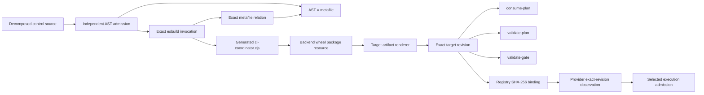

# Thin Target Consumer Control

Status: accepted design
Last updated: 2026-09-05
Owner requirements: `REQ-CI-RUNTIME-007`, `REQ-CI-RUNTIME-012`,
`REQ-CI-RUNTIME-026`, `REQ-CI-RUNTIME-027`

## 1. Decision

CI Coordinator distributes one generated, revision-bound CommonJS control
program to a target repository. The program exposes exactly three commands:

```text
consume-plan
validate-plan
validate-gate
```

The generated program is built from separately owned source modules and is
committed as an exact package resource. Target artifact rendering copies only
that program, the execution registry, the test manifest, and the dependency
graph. Target workflows invoke one stable path with one literal subcommand.

This changes representation, not product policy:

```text
ObservedBehaviorAfter = ObservedBehaviorBefore
TargetControlFiles: 6 -> 1
RenderedTargetArtifacts: 9 -> 4
MaximumAdapterFiles: 38 -> 33
MaximumColdGitReads: 44 -> 39
```

The plan requester remains an immutable external reusable workflow. Selection,
fallback, and aggregate-gate authority remain in the exact target revision.

## 2. Problem And Constraints

The current control plane ships six mutually dependent CommonJS files. They are
cohesive as source modules, but exposing that decomposition to every consumer
creates five costs without adding target-owned behavior:

1. six generated files must be reviewed, committed, fetched, hashed, and
   replaced together;
2. the target registry and provider snapshot must enumerate all six;
3. partial file updates create invalid intermediate representations;
4. consumer onboarding presents internal source topology as product API; and
5. GitHub cold reads grow with an implementation detail.

The replacement must preserve these hard constraints:

- fail closed on malformed, stale, unsigned, excessive, or mismatched input;
- preserve local FullCI after every post-resolution requester failure;
- retain target ownership of selected jobs, fallback, and the stable gate;
- bind execution to `job.workflow_sha` and exact adapter bytes;
- require no package install or coordinator checkout in target CI;
- keep Node.js permissions, process bounds, and output bounds unchanged;
- keep source modules independently reviewable; and
- make source-to-bundle drift mechanically impossible to merge.

## 3. Formal Decision Model

For candidate representation `x`, define:

```text
Admissible(x) :=
  BehaviorParity(x)
  and LocalFallbackReachableAfterRequesterStart(x)
  and TargetOwnsExecutionAuthority(x)
  and ExactRevisionBound(x)
  and Reproducible(x)
  and SourceReviewable(x)
  and SourceModuleLoadingAdmitted(x)
  and NoRuntimeBuildDependency(x)
  and CentralBuildBudgetSatisfied(x)

RecurringTargetCost(x) :=
  targetFileCount
  + providerReadCount
  + atomicUpdateSurface
  + consumerVisibleImplementationDetail

CentralBuildBudgetSatisfied(x) :=
  buildOwnerCount <= 1
  and exactBuildDependencyCount <= 1
  and serviceRuntimeBuildDependencyCount = 0
  and targetRuntimeBuildDependencyCount = 0
```

An option dominates another only when it is no worse on every hard constraint
and strictly improves at least one declared recurring target cost. This
contextual order intentionally optimizes an organization-wide coordinator whose
central implementation is reused across target repositories and runs. It is not
a claim that the bundle minimizes repository LOC or one-time implementation
effort.

| Alternative                                      | Admission result | Reason                                                                                                                                 |
|--------------------------------------------------|------------------|----------------------------------------------------------------------------------------------------------------------------------------|
| Keep six target files                            | Admissible       | Safe baseline, but retains avoidable consumer and provider cost                                                                        |
| Hand-maintain one source file                    | Rejected         | Removes source ownership boundaries and makes a large executable file the only review surface                                          |
| Move all control into a remote reusable workflow | Rejected         | Resolution or authorization can fail before target fallback code starts; target execution authority would depend on another repository |
| Generate one local bundle from decomposed source | Selected         | Preserves every hard constraint and strictly reduces target files, provider reads, and partial-update states                           |

Therefore:

```text
Admissible(generatedLocalBundle)
and RecurringTargetCost(generatedLocalBundle)
    < RecurringTargetCost(sixTargetFiles)
=> Prefer(generatedLocalBundle, sixTargetFiles)
```

This is a bounded dominance proof over the declared criteria. It does not claim
that one-file distribution is universally optimal for all software. The added
central build mechanism is accepted only because it remains inside the explicit
budget above; exceeding that budget falsifies this decision even if the target
file count remains lower.

## 4. Ownership

| Concern                                              | Semantic owner                                             | Boundary                                                   |
|------------------------------------------------------|------------------------------------------------------------|------------------------------------------------------------|
| Plan transport decoding and private write            | `target_artifacts/control_source/consume_plan.cjs`         | No signature or execution-policy ownership                 |
| Canonical JSON, bounded reads, and shared primitives | `target_artifacts/control_source/validation_core.cjs`      | No command dispatch                                        |
| Signed envelope and request identity                 | `target_artifacts/control_source/validation_envelope.cjs`  | No target job selection                                    |
| Registry, profiles, matrices, and dependency closure | `target_artifacts/control_source/validation_execution.cjs` | No aggregate result policy                                 |
| Plan validation command                              | `target_artifacts/control_source/validate_plan.cjs`        | Orchestrates owned validation modules only                 |
| Aggregate gate command                               | `target_artifacts/control_source/validate_gate.cjs`        | Owns only selected-versus-fallback result admission        |
| Exact command dispatch                               | `target_artifacts/control_source/main.cjs`                 | Closed command set; no business defaults                   |
| CommonJS module-loading admission                    | `scripts/target_control_source_admission.py`               | Closed source grammar and lexical dependency graph only    |
| Deterministic build and drift check                  | `scripts/target_control_bundle.py`                         | Build execution, metafile comparison, and publication only |
| Distributed bytes                                    | `target_artifacts/resources/ci-coordinator.cjs`            | Generated projection, never edited directly                |
| Artifact registry and rendering                      | `target_artifacts`                                         | Hashes and copies the one generated program                |
| Static workflow command projection                   | `repo_context`                                             | Binds literal path and subcommand                          |

The generated bundle may be large because it is a reproducible projection over
separately owned source modules. Size alone cannot make it a semantic owner or
a god-file. Source modules remain subject to ordinary production-code ownership
and decomposition policy.

## 5. Build Contract

The build input is the closed set of seven source modules plus the exact build
configuration and exact bundler version. Let `S` be the canonical sequence of
`(path, SHA256(bytes))` pairs, `B` the corresponding canonical `(path, bytes)`
sequence, `C` the ordered build arguments, `E` the exact entrypoint, `V` the
exact esbuild version, `Q` the source-schema identity, `A(B)` the independently
parsed source dependency graph, and `M(B)` the esbuild metafile graph:

```text
SourceIdentity = SHA256(CanonicalJSON(Q, E, C, V, S))
Bundle = Build(B, E, C, V)
Rebuild(B, E, C, V) = Bundle
AdmittedBuild(B) :=
  ClosedCommonJsModuleGrammar(B)
  and A(B) = M(B)
  and InternalGraph(A(B)) is acyclic
  and ExternalImports(A(B)) subset_of AllowedNodeBuiltins
```

The bundle begins with a generated marker containing `SourceIdentity` and `V`.
The checker rebuilds into an owned temporary directory and compares all bytes.
It rejects:

- a missing, extra, symlinked, unreadable, or non-regular source;
- an unavailable or wrong bundler version;
- non-zero build status, output overflow, timeout, or unexpected output;
- a missing or malformed generated header; or
- any byte difference between rebuilt and committed output.

The source parser accepts only direct, unshadowed
`require("literal-specifier")` calls. Relative specifiers must name one of the
seven exact source files; external specifiers must belong to the closed
admitted `node:` built-in set. Parse errors, ESM imports or exports, dynamic
`import()`, non-literal or indirect `require`, alternate CommonJS loaders, and
unadmitted uses of the CommonJS wrapper `arguments`, ambient `module`,
`process`, or global loader identities fail before esbuild runs. The admitted
lexical graph must equal the exact input relation reported by esbuild, including
external-import multiplicity. This independent equality prevents either parser
from silently omitting a dependency accepted by the other.

The build uses platform `node`, CommonJS format, Node.js 24 target, UTF-8, no
source map, no legal-comment side file, and no identifier minification. The
absence of identifier minification avoids exchanging negligible target size for
a harder review and debugging surface. The exact esbuild metafile must also
prove that all seven sources are reachable from `main.cjs` and that no
third-party runtime package is embedded.

The generated bundle is committed because target rendering and the installed
backend wheel must not require Node.js, pnpm, esbuild, network access, or the
source tree at runtime.

## 6. Runtime Contract

The public target command grammar is total:

```text
Command := consume-plan | validate-plan | validate-gate

argc != 1                    -> exit failure
Command outside closed set   -> exit failure
consume-plan                 -> existing transport outcome algebra
validate-plan                -> existing plan-validation outcome algebra
validate-gate                -> existing aggregate-gate outcome algebra
```

Target workflow commands are exactly:

```text
node .ci-coordinator/ci-coordinator.cjs consume-plan
node .ci-coordinator/ci-coordinator.cjs validate-plan
node .ci-coordinator/ci-coordinator.cjs validate-gate
```

The registry binds the bundle path and SHA-256. The provider snapshot reads and
verifies the same bytes from the exact commit before selected execution can be
issued. A missing or mismatched bundle preserves FullCI after the remote
requester has started.

Reusable-workflow resolution remains a separate pre-execution boundary:

```text
CallResolved and RequestFailure -> TargetLocalFullCI
not CallResolved                -> ProviderHardFailure
```

Bundling does not and cannot turn a GitHub graph-resolution failure into a
locally executable fallback.

## 7. Data Flow



Build-time source authority never crosses into target runtime. Runtime receives
only the generated bytes whose digest is bound by the target registry.

## 8. Compatibility And Migration

No target repository has a production support contract for the six-file
representation. The change therefore uses a pre-release replacement rather
than dual-format admission:

```text
NoDeployedConsumerContract
=> CompatibilityObligation(oldSixFileShape) = false
```

Fixtures are regenerated atomically from the new renderer. Existing local
experiments must regenerate their `.ci-coordinator` directory from a clean
target-artifact output. Runtime support for both shapes, automatic deletion of
unknown target files, and a legacy alias are rejected because each would add
transition policy without a supported consumer.

The prior feature designs remain immutable historical evidence. This document
is the current successor only for the control-file representation and its
resource bounds; it does not supersede their identity, fallback, or execution
semantics.

## 9. Evidence Strategy

The proof portfolio has independent layers:

1. a static AST admission proves the closed source module-loading grammar;
2. an independent source-to-metafile equality check, executed through the
   production bounded build environment, proves dependency closure;
3. a source-to-bundle checker proves exact reproducibility;
4. artifact model and renderer tests prove the one-file registry and output;
5. command-dispatch falsifiers reject missing, extra, and unknown commands;
6. existing target-control scenario tests run all three bundle commands;
7. the consumer contract laboratory exercises the same bundled program under
   the Node.js permission model;
8. package witnesses prove the wheel contains exactly the committed bundle;
9. workflow and registry tests prove exact literal commands and file bounds;
10. a synthetic four-blob adapter fixture preserves the independent proof that
    one failed read cancels and joins all three concurrent siblings even though
    the minimal native target now contains only one workflow and one bundle;
11. the canonical branch-head quality plan executes the bundle witness after
    its pinned Python and Node dependencies are installed;
12. mutation witnesses preserve critical validation branches; and
13. nested portable-proof deadlines give the longest child process its
    owner-declared limit, preserve a positive wrapper cleanup reserve, and
    retain a distinct aggregate orchestration reserve; the aggregate deadline
    remains authoritative and may terminate a later command before that
    command exhausts its independent maximum; admission derives the longest
    command envelope from the complete admitted portable command set rather
    than from a command assumed to remain longest; and
14. source-disposition inventories retain exact membership and canonical
    content digests for every changed workflow or deployment source set; and
15. exact-head GitHub CI provides the behavioral evidence for the candidate.

Passing static checks alone does not prove command parity. Passing scenario
tests alone does not prove source-to-bundle freshness. Both are required.

## 10. Falsifiers

The design is rejected if any of these counterexamples is admitted:

1. a source edit passes while the committed bundle is stale;
2. a bundle edit passes without an identical rebuild;
3. an unknown or missing command exits successfully;
4. any existing selected or fallback scenario changes outcome;
5. a target workflow still invokes a retired control path;
6. a registry accepts fewer or more than the one fixed control path;
7. selected execution survives a missing or digest-mismatched bundle;
8. package construction omits or changes the bundle;
9. a build depends on ambient global Node packages or network access;
10. the adapter maximum remains 38 files or 44 cold reads; or
11. the source decomposition creates a new cross-owner module;
12. dynamic, indirect, alternate, escaped-identifier, or ESM module loading
    reaches esbuild;
13. the source AST and esbuild metafile disagree about any dependency; or
14. a current Proofkit evidence reference names an absent or untracked path; or
15. the bundle witness is registered but omitted from branch-head quality; or
16. the Python test command envelope is not larger than its nested process
    deadline by the owner-defined wrapper reserve; or
17. the portable parent budget is smaller than the maximum command envelope
    plus the owner-defined aggregate orchestration reserve; or
18. adding or lengthening any portable command can preserve admission without
    recomputing that maximum over the exact portable command set; or
19. the reduced target artifact set makes the four-way adapter cancellation
    witness unreachable or permits a failed read to leave any sibling active.

## 11. Non-Claims And Revision Triggers

This design does not claim live GitHub installation, target deployment,
production omission, workflow-resolution fallback, lower CI execution time, or
behavior outside the admitted scenario corpus. It does not move target commands
or job definitions into the coordinator service. Source admission proves the
declared lexical module-loading grammar for reviewed, content-addressed source;
it is not a sandbox against deliberately hostile JavaScript expressed through
arbitrary language semantics.

Revisit the decision if GitHub adds a provider-guaranteed pre-resolution local
fallback, targets no longer execute Node.js, a supported deployed consumer
requires format migration, the bundle exceeds repository-owned byte limits, or
measured provider reads cease to matter. Any such revision requires a new
successor design rather than editing this closed design after merge.
