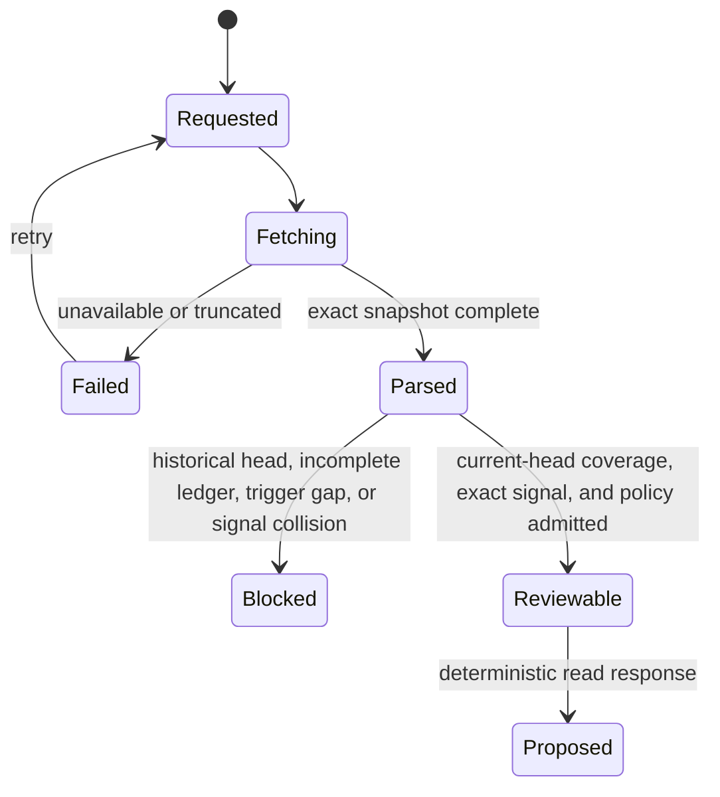

# UI-Assisted Workflow Discovery

Status: as-built synchronous discovery with a separately authorized
non-activating review handoff

Last verified: 2026-07-19

## Decision Summary

Add a read-first workbench flow that inventories one authenticated repository
at an exact commit, statically derives its GitHub Actions topology, exposes
unknowns, and generates a reviewable repository-policy proposal. It must never
activate policy, change provider settings, or enable omission automatically.

```text
Discovery produces Evidence
Evidence may produce Proposal
Proposal does not produce Authority
```

The primary repository selector is already implemented by
[Provider Inventory](../architecture/modules/provider-inventory.md). This
feature starts only after an operator selects one exact provider identity and
extends the read model with exact-commit scan and proposal evidence. It does
not redefine provider visibility, policy admission, epoch lifecycle, or
production admission.

## Current Operator Outcome

An authorized operator can:

1. select a provider-visible repository from the authorized organization
   catalog and choose an immutable revision;
2. inspect every discovered workflow, job, call edge, declared permission,
   secret name, runner/service declaration, concurrency rule, and explicit
   unknown;
3. see proven assertions and unknowns with exact-commit provenance;
4. generate an observe-only config proposal when one provider job identity is
   statically proven, or see why proposal bytes are blocked; and
5. refresh discovery at the current head or request an exact historical commit;
   and
6. when the current-head proposal is complete, submit one separately
   authorized affirmative non-activating review.

The first screen is the inventory and proof table, not a marketing dashboard.
Semantic diff, current-head revalidation, and non-activating affirmative review
registration are composed through the separately governed browser identity,
repository-role, origin, CSRF, and mutation transport. Activation remains
independent and has no browser control.

## Discovery Predicate

For repository `R`, revision `H`, file set `F`, parser `V`, and call graph `G`:

```text
LedgerClosed(F) := for each expected predicate q in F:
  exactly one of Assertion(q) or Unknown(q)

AdmittedInventory(R, H) :=
  AuthenticatedInstallation(R)
  and ExactCommit(H)
  and CompleteBoundedFileSet(F, H)
  and StaticParseSucceeded(F, V)
  and CallGraphClosedOrUnknown(G)
  and LedgerClosed(F)
  and EveryLedgerRecordHasProvenance

ProposalReviewable :=
  AdmittedInventory
  and CurrentDefaultBranchHead(H)
  and CompleteInventory
  and LocalCallGraphClosed
  and UniqueManualFallbackWorkflow
  and NonEmptySupportedCiEvents
  and UniqueStaticTerminalSignal
  and GlobalProviderSignalCollisionFree
  and StaticProviderJobName
  and ExistingPolicyAdmissionSucceeds

ActivationEligible is outside the current slice
```

An incomplete scan may still be displayed with a blocked proposal manifest. It
cannot be labelled complete and contains no policy source.

## Dataflow

```mermaid
flowchart LR
  USER["Authorized operator"] --> SCAN["Request scan at exact commit"]
  CATALOG["Authorized provider catalog"] --> USER
  SCAN --> GH["GitHub App read boundary"]
  GH --> SNAP["Immutable source snapshot"]
  SNAP --> PARSE["Bounded static parser"]
  PARSE --> GRAPH["Reusable-workflow call graph"]
  GRAPH --> FACTS["Provenance and unknown ledger"]
  FACTS --> UI["Inventory and review workbench"]
  UI --> PROPOSAL["Generated config proposal"]
  PROPOSAL --> OWNER["Separately authorized repository-manager review"]
  OWNER --> REGISTER["Atomic non-active epoch + review + audit"]
```



## Inventory Contract

Resolve the exact commit, traverse its Git trees non-recursively, and read
workflow blobs by SHA through the GitHub App installation boundary. Require
non-truncated trees and recompute every Git blob identity. Never analyze an
untrusted pull-request checkout with local credentials.

For each workflow and job, retain:

| Class      | Facts                                                                                               |
|------------|-----------------------------------------------------------------------------------------------------|
| Identity   | repository id, path, blob SHA, commit SHA, workflow name, job id, declared display name             |
| Invocation | events, proven default-branch event coverage, local and remote `uses`, immutable ref status         |
| Graph      | `needs`, reusable-workflow edges, nesting depth, cycles, unresolved targets                         |
| Authority  | declared workflow/job permissions, environments, declared secret names, effective-property unknowns |
| Execution  | runner labels/groups, container, services, matrices, timeouts, concurrency, cancellation            |
| Semantics  | conditions, action coordinates, script presence, artifact/cache hints, unresolved runtime behavior  |

Secret values and tokens are never fetched or stored. A secret name is metadata
with restricted visibility, not evidence that the secret exists or is safe.

Expressions are retained as syntax and resolved only when every input belongs to
a finite admitted context. Dynamic action behavior, scripts, custom actions,
runtime API calls, generated matrices, and environment protection remain
unknown unless an independent typed contract proves them.

## Evidence and Unknowns

Do not collapse evidence into a single percentage. The current slice has two
terminal record types:

```text
record in {proven assertion, unknown}
provenance = provider coordinates + blob SHA + parser version + derivation id
criticality in {safety, informational}
```

- `proven assertion`: direct provider syntax or deterministic derivation from
  admitted syntax;
- `unknown`: dynamic, inaccessible, truncated, effective, or unsupported.

The UI presents exact completeness and graph state, a safety-unknown count, and
paged assertion and unknown ledgers with category and provenance.
Safety-critical unknowns keep dynamic planning disabled. An unknown that affects
provider signal identity also blocks policy bytes.

## Proposal Contract

Generate a `ci-repository-policy/v1` source only when one workflow and one
provider signal satisfy the following closed predicate:

```text
SupportedCiEvent := pull_request | push | merge_group

CoveredEvent(workflow, event, defaultBranch) :=
  event has no path, tag, exclusion, expression, or unknown trigger filter
  and its optional branch filter is exactly [defaultBranch]
      within the conservative literal branch grammar
  and its effective default or explicit action types include every admitted action

StableSignal(workflow, job) :=
  scan was requested at the current default-branch head
  and workflow has workflow_dispatch at that head
  and workflow has at least one CoveredEvent
  and job has a proven static provider signal name
  and job is native and non-matrix
  and (
    workflow has exactly one job with no condition and no dependencies
    or job has a proven always() condition
       and transitively needs every other job
       and the needs graph is complete and acyclic
  )

GlobalProviderSignalCollisionFree(workflow, job) :=
  every job in every workflow has a proven display name
  and no such job shares the selected signal's conservative ASCII collision key
```

`workflow_dispatch` is required because the target-repository contract retains
a manual FullCI fallback. A multi-job terminal signal must run after failed or
cancelled dependencies; otherwise GitHub may skip it and the stable required
check may never be emitted. This topology does not prove that the job interprets
dependency outcomes correctly. File names, workflow names, job-id spelling, and
repository-specific allowlists are deliberately absent from the predicate.

An explicit historical revision remains useful inventory evidence but cannot
produce policy bytes: a workflow at that commit does not prove that GitHub can
manually dispatch it from the current default branch. Signal values retain exact
Unicode-scalar identity; the additional ASCII-folded key is used only to reject
provider-name collisions conservatively.

GitHub's default `pull_request` activity set omits `ready_for_review`, so that
event is selected only when the workflow explicitly includes the complete
coordinator action set. `merge_group` accepts only its documented activity-type
surface. Branch patterns with glob metacharacters remain unproven rather than
being interpreted by a second pattern engine.

The source contains:

- one `observe` rule for each proven supported event on the selected workflow;
- the one statically named native terminal provider signal;
- `dynamicCi = null`; and
- no omitted signals.

The separate manifest contains repository/revision identity, inventory digest,
parser and generator versions, all unknowns, proposal state, and blocking
reasons. It contains no scripts, secret values, owner review state, ambient
active epoch, or current-head state.

Generation is deterministic. Repeating it over identical inputs must produce
identical policy bytes and manifest identity. A blocked proposal has no policy
bytes.

Discovery itself never calls registration or activation. An explicit review UI
command may call the separately authenticated non-activating registration
route governed by
[Browser Identity And Proposal Review](../architecture/modules/browser-identity-and-proposal-review.md).
Activation remains a separate command under
[Config Epoch Lifecycle](../architecture/modules/config-epoch-lifecycle.md)
and is not browser-exposed.

## State Machine



`Proposed` and `Blocked` are terminal response states for this discovery
request. From a locally re-admitted current-head `Proposed` state, the browser
may begin the separate review state machine. Activation, provider enforcement,
and omission admission remain independent capabilities.

## Future Drift and Review

Refresh on an explicit operator request, relevant webhook, reusable-workflow
dependency update, active default-branch change, or bounded staleness deadline.
Compare by semantic fact and immutable source identity, not timestamps alone.

```text
FreshProposal := CurrentHead = ScannedHead
  and CurrentDependencyGraph = ScannedDependencyGraph
  and CurrentRulesetFacts = ReviewedRulesetFacts
```

The review-registration service re-runs current-default-head discovery and
requires the regenerated manifest to equal the operator-observed manifest. A
mismatch is stale and reaches no write. The retained review binds that exact
provider revision; it does not make a later provider head immutable. Refresh
webhooks, durable scan history, and activation-time freshness remain future
owners. The synchronous discovery slice still retains no scan.

## Required Backend Surface

The implemented provider catalog is a precondition, not part of the discovery
state machine. The current backend surface is one authenticated
repository-scoped read-computation endpoint returning immutable scan coordinates,
inventory, graph, unknowns, and proposal state. It has no scan ids, status
resources, pagination, snapshot tokens, or writes. The UI must not query GitHub
directly or receive GitHub App credentials.

The separate review capability owns exact operation replay, mutation
authorization, staleness revalidation, semantic diff, immutable audit, and
atomic registration. Its HTTP route is owned by the browser identity and review
transport module, not by workflow discovery.

## Threat Model

| Threat                                                            | Required control                                                                                                                                                                                                                                    |
|-------------------------------------------------------------------|-----------------------------------------------------------------------------------------------------------------------------------------------------------------------------------------------------------------------------------------------------|
| Malicious YAML, aliases, resource bombs, or parser divergence     | Bounded YAML profile, duplicate-key rejection, differential fixtures, no execution                                                                                                                                                                  |
| Untrusted PR changes workflow before scan                         | Fetch exact provider commit through GitHub App; bind every fact to blob SHA                                                                                                                                                                         |
| Mutable remote reusable-workflow ref                              | Record a critical unknown and do not fetch the target in this slice; a future resolver must require immutable commit identity                                                                                                                       |
| Call cycles, inaccessible private workflow, or truncated API page | Bounded graph traversal and fail-closed unknown                                                                                                                                                                                                     |
| Expression hides permissions, runners, secrets, or services       | Preserve expression and classify unresolved safety fact as unknown                                                                                                                                                                                  |
| Secret disclosure                                                 | Read names only when authorized; never fetch values; redact logs and exports                                                                                                                                                                        |
| Stored or reflected script injection in UI                        | Render all repository text as data under strict output encoding and CSP                                                                                                                                                                             |
| Cross-repository authorization confusion                          | Bind installation id, repository id, owner/name assertion, actor, and scope on every use case                                                                                                                                                       |
| TOCTOU between observation and registration                       | Regenerate the complete current-head manifest before the database transaction, retain its exact provider revision, and revalidate the ABA-resistant active baseline under the scope lock; later activation must revalidate provider freshness again |
| SSRF through remote `uses`                                        | Treat the coordinate as untrusted syntax and perform no remote fetch in this slice                                                                                                                                                                  |
| Heuristic becomes authority                                       | Emit only proven assertions or explicit unknowns; unknowns cannot select a provider signal or enable dynamic planning                                                                                                                               |

## Acceptance Criteria

1. Every current target workflow at a frozen commit appears exactly once or has
   a typed inaccessible/truncated reason.
2. Local reusable calls form a cycle-checked graph at the same commit; remote
   calls remain typed unknowns and are never fetched by this slice.
3. Permissions, named secrets, runners, services, environments, concurrency,
   matrices, conditions, and stable check identities are represented or marked
   unknown per job.
4. A mutated, inaccessible, ambiguous, cyclic, or resource-exhausting fixture never
   yields a complete inventory.
5. Identical input snapshots produce byte-identical proposal bytes when
   reviewable and identical blocked reasons otherwise.
6. Any safety-critical unknown keeps dynamic planning disabled; a
   signal-identity unknown prevents policy bytes and cannot be hidden by a score.
7. The synchronous response contains no owner approval or ambient review state.
8. The feature cannot activate an epoch, change a ruleset, install a workflow,
   publish a check, or enable omission.
9. The route enforces repository scope, response bounds, redaction, and exact
   immutable snapshot identity without durable scan state; the browser
   recomputes the proposal's canonical SHA-256 manifest identity before use.
10. Frozen synthetic application, extension-service and reporting-service fixtures must pass
    through the same predicate without repository-specific branches; tracked
    regression fixtures retain only the smallest general counterexamples.

## Delivery State

| Step | State |
| --- | --- |
| Canonical inventory, provenance, ledger, call-graph and proposal contracts | Source capability; requalify the public target. |
| Bounded parser and exact-commit GitHub acquisition | Source capability; exact-source witnesses required. |
| Inventory, graph, unknown and proposal UI without activation controls | Source capability; browser evidence remains target-bound. |
| Application, extension-service and reporting-service synthetic archetype replays | Required coverage; no former private replay receipt or executed synthetic run is claimed. |
| Durable scan history | Deferred; current discovery remains request-scoped. |
| Semantic diff and affirmative review handoff to epoch registration | Non-activating source capability. |
| Production browser identity and governed review command | Live provider/deployment qualification remains external. |

## Non-Claims

This implementation does not claim that static parsing proves runtime
behavior, that a generated proposal is safe to activate, or that repository
owners possess provider-admin authority. It does not authorize automatic
workflow commits, ruleset changes, secret creation, or enforcement. The current
browser review records only an exact non-active proposal and does not imply
activation, provider administration, dispatch, or omission authority.
